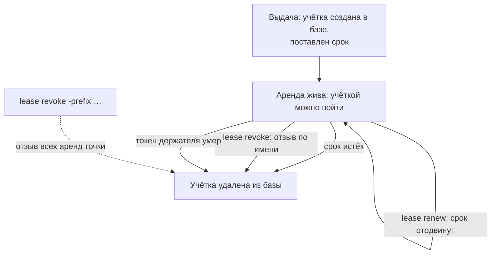

# Ротация секретов и короткоживущие учётные данные

Инцидент начался с находки в логе: сервис отчётности записывал в сообщения
каждую полученную учётку базы, и лог прочитали чужие. За сутки хранилище
выдало сервису две учётные записи, обе из одной точки, и обе надо погасить
немедленно. Процедура уместилась в одну команду и одну проверку:

```text
$ vault lease revoke -prefix database/creds/reporting
All revocation operations queued successfully!
$ psql … "SELECT count(*) FROM pg_roles WHERE rolname LIKE 'v-token%'"
 0
```

Режим, который это позволяет, называется арендой. Он превращает «секрет
утёк» из катастрофы в событие с известным сроком годности. Прогон выше снят
со стенда темы `vault`, и команды оттуда повторимы руками. Дальше разберём
жизненный цикл аренды и цену, которую приложение платит за короткий срок.

## Что такое аренда

Аренда — договор о сроке между хранилищем и приложением, получившим учётку.
Срок называется TTL, time to live — время жизни. Вы его уже видели: в теме
`vault` ответ на выдачу нёс поле `lease_duration` со значением вроде `10m`.
Пока срок не вышел, учётка жива. Приложение может отодвинуть смерть
продлением, а хранилище может убить учётку досрочно отзывом. Ни одно из этих
событий не требует правки конфигурации: это обычные вызовы рабочего режима.

Бытовой пример — аренда жилья, и соответствие в нём прямое:

| В договоре аренды жилья | В хранилище |
|---|---|
| Срок, на который сдано жильё | TTL, поставленный при выдаче |
| Продление по согласованию с хозяином | `lease renew`, пока держатель жив |
| Досрочное расторжение хозяином | `lease revoke`, по префиксу — разом |

Ломается аналогия в двух местах, и оба важны. Первое: жильца нельзя выселить
мгновенно, а отзыв удаляет учётку из базы за секунды. Поэтому процедура
отзыва готовится заранее, а не пишется в ночь инцидента. Второе — в обратную
сторону: выселенный жилец теряет доступ к жилью, а отозванная учётка не
стирает уже прочитанное. Значение, успевшее попасть в память приложения,
остаётся у него, и отозвать его нельзя.

Ещё одно слово из вступления — точка выдачи. Динамическую учётку приложение
получает чтением пути вроде `database/creds/reporting`. Движок database из
темы `vault` создаёт учётку в базе в момент чтения и возвращает её вместе со
сроком. Этот путь и называется точкой выдачи. Имена аренд начинаются с него,
поэтому флаг `-prefix` у отзыва читается буквально: «все аренды, чьё имя
начинается с этого пути». У приложения с двумя ролями точек выдачи две, и
это ещё пригодится ниже.

Две команды вступления читаются теперь полностью. Первая велела хранилищу
отозвать всё, выданное из точки `database/creds/reporting`. Вторая спросила
саму базу, что осталось: `pg_roles` — системное представление PostgreSQL со
списком ролей базы, её домовая книга, — и ответ ноль. Обе учётки удалены
разом, и сделано это там, где они жили, а не рассылкой по адресатам.

**Зачем это в работе AppSec-инженера.** TTL, продление и отзыв — ежедневный
рабочий режим там, где стоит хранилище. На вопрос инцидента «что гасим и как
быстро» аренда отвечает сама: гасим всё выданное из точки, одной командой.
Это и есть готовность к инциденту, и проверяется она заранее, а не по факту.

## Как это работает

**Откуда это взялось.** Тема `vault` показала выдачу со сроком, и вопрос
«а что по сроку» — эта тема. Ротация из темы `secret-rotation` выполнялась
руками после инцидента: опросить, кто держит ключ, поменять его, разослать
новый. Хранилище переносит эту процедуру в постоянный режим, потому что срок
стоит у выданного с момента выдачи. Реагирование сводится к одному вызову,
а не к обходу адресатов.

Жизнь аренды — три перехода и одна привязка. Выдача ставит срок. Продление
вызовом `lease renew` отодвигает смерть на заданный шаг, инкремент: живое
приложение держит учётку живой, а забытая учётка мёртвого приложения умирает
сама. Отзыв вызовом `lease revoke` убивает досрочно, а с флагом `-prefix`
гасит все аренды точки выдачи разом. Привязка командой не делается: аренда
живёт под токеном, которым выдана, и его истечение или отзыв забирает её
с собой, не дожидаясь срока. Проверено на стенде темы `vault`: после
массового отзыва в базе не осталось учёток с префиксом `v-token`.



**Описание схемы.** Схема читается сверху вниз и показывает жизнь одной
аренды. Из выдачи аренда попадает в состояние «жива». Выйти из него можно
четырьмя дорогами: по сроку, по отзыву имени, по отзыву префикса и со
смертью токена. Все четыре ведут в одну точку: учётка удалена из базы.
Продление состояния не меняет и только отодвигает срок, поэтому его стрелка
возвращается в то же состояние. Пунктирной стрелкой отмечен вызов, который
гасит много аренд разом.

Продление и срок читаются вместе, потому что отвечают на один вопрос: как
долго живёт выданное. Срок без продления — время жизни после выдачи.
Продление превращает его в «пока держатель жив и просит». Приложение с
длинной задачей продлевает аренду до конца работы. Приложение, которое
прочитало и забыло, расплачивается учёткой, умершей посреди задачи. Срок
поэтому ставится под длину задачи: отчётному заданию на час срок в десять
минут без продления не подойдёт.

Отзыв реален по устройству движка. Для движка database отозвать аренду —
значит удалить учётную запись в самой базе, поэтому эффект виден снаружи
хранилища: вход отозванной учёткой отклоняет сама база. Это не «забыть
запись» в журнале хранилища, а действие наружу. У движка, который не умеет
писать наружу, отзыву нечего забирать, и это граница модели, а не настройка.

## Что умеет и чего не умеет

**Что умеет аренда.** Умирать по сроку без чьего-либо участия. Продлеваться
держателем, пока он жив и просит. Гаситься досрочно: по имени одной аренды
и по префиксу всей точкой выдачи разом. Последнее и делает аренду
процедурой реагирования, а не только режимом хранения.

**Чего не умеет аренда.** Отозвать то, что выдано без неё. Статические
строки в kv-хранилище из темы `vault` аренды не имеют, и гасить их приходится
сменой значения, как в процедуре из темы `secret-rotation`. Не умеет аренда
и заставить приложение забыть прочитанное до срока: отзыв убивает учётку
в базе, а не копию пароля в памяти процесса.

**Чего не умеет продление.** Продлевать вечно. У роли есть потолок `max_ttl`
— максимальный суммарный срок жизни аренды: выше него продление не пойдёт,
как бы ни просил держатель. Рядом с ним задаётся и `default_ttl` — срок,
который получает свежая выдача до первого продления; `max_ttl` считает уже
всю жизнь аренды с продлениями. Задаются оба при настройке роли, а не при
чтении, и в ответе продления их не видно. Бытовое соответствие — предельный
срок найма в договоре: хозяин готов продлевать каждый месяц, но дальше года
не продлит в принципе.

## Как запустить

Три вызова на стенде темы `vault`:

```text
$ vault lease renew -increment=30m database/creds/reporting/8SXau…
lease_duration     30m
$ vault lease revoke database/creds/reporting/8SXau…
$ vault lease revoke -prefix database/creds/reporting
```

Первый вызов продлевает одну аренду на полчаса, второй гасит её по имени,
третий гасит все аренды точки выдачи. Имена аренд усечены, а форма вызовов —
из реального прогона. Третий вызов — и есть процедура реагирования целиком:
одна команда, исполнение видно в базе, ничего не разносится руками. Если
точек выдачи у приложения две, одной команды не хватит, потому что префикс
адресует ровно одну точку. Процедура пишется в расчёте на все точки
приложения, по вызову на каждую.

## Как читать вывод

Ответ продления — новый `lease_duration`: аренда отодвинулась на инкремент.
Ответ отзыва читается точнее, чем звучит: `All revocation operations queued
successfully!` означает «принято в работу», а не «исполнено». Формулировка
`Success! Revoked lease` из ответа на отзыв по имени значит то же самое.
Хранилище подтверждает постановку в очередь, и только. Поэтому критерий
исполнения всегда внешний, в самой системе-цели: вход в базу отозванной
учёткой отклонён, список ролей пуст.

Из этого следует рабочее правило ретеста. Ретест — повторная проверка защиты
после изменения, и здесь она смотрит не на ответ хранилища, а на поведение
цели: попытка входа отозванной учёткой обязана упасть. Ответ «успешно» без
этой проверки — отчёт о намерении, а не о факте. Тот же приём работал в
темах про исправление уязвимостей: защита считается стоящей, когда это видно
снаружи.

## Границы метода

**Граница первая: забирается то, что движок умеет вернуть.** Учётку базы
удалить можно, а прочитанное значение — нельзя: копия пароля в памяти
приложения переживёт отзыв до конца процесса. Поэтому аренда ограничивает
ущерб от утечки, а не обнуляет его.

**Граница вторая: префикс не выбирает.** Отзыв по префиксу гасит всё под
префиксом, включая живых читателей. При инциденте это и есть цель. Но
приложения, которые не умеют перечитывать учётку, упадут вместе со
скомпрометированными, и это стоит знать заранее.

**Граница третья: живой продлевающий и живой токен.** Продление требует,
чтобы кто-то продлевал: умершее приложение свои аренды не продлит, и они
умрут по сроку. А сама аренда требует живого токена. Токен приложения истёк
или отозван — и выданные под него аренды отзываются вместе с ним, а не по
своему сроку.

## Частая ошибка

До смерти учётки осталось пять минут, а она утекла. Есть ли о чём
беспокоиться? Расхожий ответ — нет: срок короткий, учётка умрёт сама через
пять минут, и процедура отзыва не нужна. Решите, верно ли это, прежде чем
читать дальше.

**Срок годности и отзыв — разные механизмы.** Срок гасит выданное по
расписанию, а инцидент расписания не ждёт. Утечка за пять минут до смерти
учётки всё равно даёт атакующему пять минут, за час — час. Короткий срок
сужает окно, но не закрывает его. Закрывает окно отзыв, и процедура отзыва
заводится отдельно и прогоняется до инцидента.

## Чеклист для ревью

1. Проверьте, что у каждой динамической роли заданы default_ttl и max_ttl.
2. Проверьте, что приложение продлевает аренду или перечитывает учётку,
   а не живёт на одном чтении.
3. Проверьте, что процедура отзыва по префиксу написана и прогнана до
   инцидента.
4. Проверьте, что эффект отзыва проверяется в целевой системе, а не по
   ответу хранилища.
5. Проверьте, что статические роли имеют расписание ротации, а не заданное
   один раз значение.

## Попробуй сам

На стенде темы `vault` выдайте две учётки, продлите первую, отзовите обе по
префиксу и проверьте в базе, что учёток не осталось.

Одна подсказка: эффект смотрят в `pg_roles` самой базы, а не в ответе
хранилища.

**Критерий выполнения** наблюдаемый: вывод `pg_roles` до отзыва (два имени)
и после (ноль) записан, и рядом лежит ответ продления с новым сроком.

## Проверь себя

1. Предскажите, что вернёт этот вызов и чего он не скажет о будущей смерти
   аренды, и проверьте на стенде темы `vault`.

   ```text
   $ vault lease renew -increment=30m database/creds/reporting/9KLxw…
   …
   ```

2. Прочитайте пару команд: почему эффект первой проверяется второй, а не
   ответом первой?

   ```text
   $ vault lease revoke database/creds/reporting/9KLxw…
   Success! Revoked lease …
   $ psql "host=… user=v-token-reportin-9KLxw… …" -c "SELECT 1"
   psql: error: connection failed: … password authentication failed
   ```

3. Почему короткий TTL не заменяет процедуру отзыва?
4. Почему отзыв токена приложения гасит выданные под него аренды, не
   дожидаясь их срока?
5. Возврат к теме `secret-rotation`: чем ротация-режим отличается от
   ротации-процедуры?
6. Возврат к теме `vault`: чем отзыв динамической учётки отличается от
   ротации статической по видимому эффекту?

<details markdown="1">
<summary>Ответ 1</summary>

1. Вернёт новый `lease_duration 30m`: аренда отодвинута на инкремент.
   Не скажет он про потолок: продление вечно невозможно, выше `max_ttl`
   роли аренда не живёт. Задан он при настройке роли, и в ответе
   продления его нет. Команда для прогона — та же строка `vault lease
   renew -increment=30m <аренда>` на стенде лабы темы `vault`.

</details>

<details markdown="1">
<summary>Ответ 2</summary>

2. Ответы отзыва в обеих формулировках — `Success! Revoked lease` и `All
   revocation operations queued successfully!` — значат одно: команда принята
   в работу, а не исполнена. Поэтому критерий всегда внешний, в самой
   системе-цели: вход отозванной учёткой обязан упасть, и вторая команда это
   показывает. Ответ «успешно» без такой проверки — отчёт о намерении,
   а не о факте.

</details>

<details markdown="1">
<summary>Ответ 3</summary>

3. Срок работает по расписанию, а инцидент не по нему: утечка за пять минут
   до смерти учётки всё равно даёт атакующему эти пять минут. Короткий TTL
   сужает окно, а закрывает его отзыв — процедура заводится отдельно и
   прогоняется до инцидента.

</details>

<details markdown="1">
<summary>Ответ 4</summary>

4. Аренда привязана к выдавшему токену: токен — это то, под кем аренда
   существует. Его истечение или отзыв отзывает её с собой, своего срока
   она не ждёт. Поэтому мёртвое приложение убивает и токен, и аренды — и это
   свойство, а не авария.

</details>

<details markdown="1">
<summary>Ответ 5</summary>

5. Процедура запускается руками после инцидента: опросить, поменять,
   разослать. Режим работает всегда, потому что срок стоит у выданного при
   выдаче — реагирование сводится к одному вызову отзыва по префиксу.

</details>

<details markdown="1">
<summary>Ответ 6</summary>

6. Отзыв динамической удаляет учётку из базы — её больше нет. Ротация
   статической меняет пароль существующей: учётка остаётся той же, значение
   другое, и читатель видит текущее. В отчёте поэтому пишется режим роли:
   «секрет выдаётся» не говорит, кому он выдаётся надолго.

</details>

## Источники

1. Lease, renew, and revoke, документация HashiCorp; реестр
   `vault-lease`. Разделы: жизненный цикл аренды, продление, отзыв по
   префиксу.
   <https://developer.hashicorp.com/vault/docs/concepts/lease>
2. Database secrets engine, документация HashiCorp; реестр
   `vault-database-secrets`. Разделы: TTL ролей, что делает отзыв с
   учёткой в базе.
   <https://developer.hashicorp.com/vault/docs/secrets/databases>

Каркас этапа: записи семейства man-* и якоря подразделов — наследуются
всеми темами этапа 4.

**Скоропортящийся слой.** Синтаксис команд стабилен давно; версия Vault
и поведение dev-сервера названы в маркерах.

**Маркеры уверенности.** **Проверено лично** 2026-09-01 на Arch Linux,
Vault 1.21.3 (dev-сервер на петле), postgres:16-alpine: продление аренды
с инкрементом 30 минут, массовый отзыв по префиксу («All revocation
operations queued successfully!»), после него в pg_roles не осталось ни
одной учётки v-token. Семантика аренды и потолок max_ttl — **по
документации** (обе страницы открыты лично 2026-09-01).
