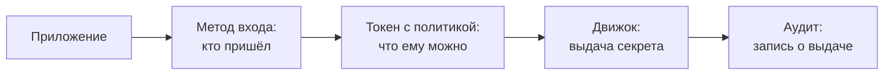

# Vault: статические и динамические секреты

Уровень **L1** · время 75 мин (теория 35 / лаба 30 / самопроверка 10,
оценка)

Что прочитать сначала: `ci-secrets`, `secret-rotation`.

Хранилище стоит, движок базы данных настроен, приложению нужна учётка.
Один и тот же запрос дважды подряд:

```text
$ vault read database/creds/reporting
username           v-token-reportin-4MNDVudbQm7vuUz2T00r-1788265998
lease_duration     10m
$ vault read database/creds/reporting
username           v-token-reportin-AP4sUmJbWMrdCVXsXXEx-1788265998
```

Один запрос — две разные учётные записи: каждая создана под это чтение и
проживёт десять минут. Пароль из вывода опущен; обе учётки на стенде
проверены входом в базу.

Рядом статическая роль: тот же запрос к
`database/static-creds/reporting-static` отдаёт одну и ту же учётку.
Пароль у неё Vault поменял сам при настройке, и старый больше не пускает
(проверено прогоном: вход со старым паролем по сети отклонён).

Если вы хранили пароль базы в конфиге или в переменной окружения, обе
строки выше — смена эпохи: секрет перестаёт быть строкой и становится
выдачей. Дальше разберём устройство хранилища, оба режима ролей и лабу,
где выдача настраивается руками.

Для ревьюера меняется и вопрос. Вместо «где лежит пароль» — «какой
политикой и на какой срок это выдаётся». Ответ лежит в конфигурации
хранилища, а не в коде приложения, и читается он быстрее, чем ищется
строка в репозитории.

Стенд этой темы — dev-сервер Vault и postgres в контейнере: всё
локально, без root, секреты учебные. Dev-режим не для прода: он не
требует размыкания и держит всё в памяти. За его пределами хранилище
запечатано при старте и открывается ключами — это устройство в теме не
разбирается, здесь предмет другой: выдача.

## 0. Коротко

Vault — хранилище с выдачей: секреты не лежат в конфигах, а запрашиваются
у движка по политике. Движок базы данных работает в двух режимах.
Статическая роль: Vault ротирует пароль существующей учётной записи по
расписанию. Динамическая: Vault создаёт учётную запись на время чтения и
удаляет её по сроку или по отзыву. Токен приложения решает, что ему
можно, политика — где это записано, аудит — кто что брал. Найденное по
теме `secrets-in-code` чинится переносом секрета сюда. Оба режима —
разные ответы на один запрос, и лаба ставит их рядом именно поэтому.

**Зачем это в работе AppSec-инженера.** Это пороговая концепция этапа:
после неё «секрет в переменной окружения» читается как находка, а не как
норма. Спор о ней закрывается ответом на один вопрос: кто и когда
поменяет значение, и что будет у того, кто его украл через час.

## 1. Цели

После этого раздела вы сможете:

1. Различить статическую и динамическую роль по ответу на один запрос.
2. Назвать состав хранилища: движки, методы входа, политики, токены,
   аудит.
3. Настроить выдачу секрета базы по политике и проверить её токеном.
4. Прочитать ответ Vault и назвать в нём срок годности.

## 2. Предвопросы

Ответьте до чтения, даже если не уверены. Цена догадки видна будет в
механике.

1. Учётная запись создана под одно чтение и живёт десять минут. Что
   теряет атакующий, укравший её, против украденного пароля из конфига?
2. Vault ротирует пароль существующей учётки. Кто узнаёт новый пароль
   и когда?
3. Токен приложения украден. Что он открывает, если политика выдана
   точно?

## 3. Механика

**Откуда это взялось.** Секрет в конфиге не умеет двух вещей: истечь и
сказать, кто его брал. Ротация как процедура реагирования — тема
`secret-rotation`, — писалась руками и потому не делалась. Хранилище
ответило сменой модели: секрет не хранится у потребителя, а выдаётся по
запросу со сроком годности. С этого момента утечка — событие с датой
окончания, а не катастрофа.

Это третье место жизни секрета в маршруте гайдбука. В коде и в истории
репозитория он разобран в теме `secrets-in-code`, доставка в задание
конвейера — в `ci-secrets`, процедура реагирования на утечку — в
`secret-rotation`. Здесь остаётся хранилище: выдача по политике,
ротация как постоянный режим и сторона приложения.

Контраст с двумя соседними решениями помогает увидеть предмет. Зашифрованный
конфиг решает «не прочитают в репозитории», но после расшифровки секрет
снова строка у каждого читающего, и ротации в нём нет. Файл с правами 0600
решает «не прочитают соседи по хосту» — тема `linux-file-permissions`, —
и тоже не знает ни срока, ни аудита. Хранилище меняет не шифрование, а
границу: секрет существует в памяти хранилища и выдаётся наружу с
условиями.

Устройство хранилища — пять частей. Движки (secrets engines) отвечают за
вид секрета: ключ-значение, база данных, PKI. Методы входа
(authentication methods) отвечают за предъявленную личность: токен,
учётка платформы, роль Kubernetes. Политика пишет, какие пути читать.
Токен несёт политику к запросу. Аудит пишет каждое обращение.

Движок ключ-значение стоит особняком: положенный туда секрет статичен по
своей природе — хранилище его охраняет правами и аудитом, но не ротирует.
Режим выдачи появляется у движков, которые умеют писать наружу: движок базы
данных меняет и создаёт учётные записи в самой базе. Поэтому разговор о
ротации идёт на database engine, а kv — это «конфиг с правами», лучше
переменной окружения, но не смена модели.

Методы входа решают, кем приложение предъявляется. Для человека и
конвейера — токен или личность платформы CI; для пода в кластере — роль
Kubernetes, где предъявляется токен service account из темы `k8s-rbac`.
Вход не выдаёт секретов: он выдаёт токен с политикой, и только она решает,
что откроется дальше. Поэтому ревизия доступа — это чтение политик, а не
список токенов.

Где при этом лежит сам секрет, спрашивают редко и зря. В dev-режиме — в
памяти процесса; в боевом режиме — в бэкенде хранилища, зашифрованном
ключом, который собирается из долей при размыкании. Это устройство —
предмет развёртывания, а не этой темы; здесь важно одно: секрет не лежит
у читающего, и потеря читающего не отдаёт его.

У самого токена тоже есть срок. Токен приложения выдаётся с TTL и
продлевается, пока приложение живо; токен, забытый продлить, умирает сам.
Сроки двух уровней не путайте: у учётки — аренда, у токена — срок
действия, и обслуживаются они разными вызовами. Разбор аренды и отзыва —
тема `vault-lease-rotation`; она стоит на этой механике.

Политика — короткий список путей с правами:

```text
path "database/creds/reporting" {
  capabilities = ["read"]
}
```

Читается прямо: по этому пути можно читать, всё остальное запрещено.
Токен, выпущенный с этой политикой, отвечает 403 на любой другой путь —
это проверяется в лабе.

Аудит при этом не отдаёт самих значений. Запись о чтении секрета хранит
их хеши, а не текст:

```text
type: response
path: database/creds/reporting
"password": "hmac-sha256:0fdff6487a93832e55fa…"
```

Срез настоящей записи из стенда темы. По журналу видно, кто и куда
ходил, а значение из него не прочитать — хешируется оно ключом
хранилища.

### Два режима выдачи на одном движке

Статическая и динамическая роли отвечают на один вопрос — «дай пароль к
базе» — по-разному, и выбор между ними решается устройством приложения.
Статическая: учётка одна, Vault меняет её пароль по расписанию, читатель
видит текущее значение. Годится приложению, которое читает конфиг при
старте и умеет перечитывать. Динамическая: учётка создаётся под чтение
и умирает со сроком аренды. Годится приложению, которое умеет держать
соединение живым и обновлять учётку.

Выбор между режимами — по жизненному циклу читателя. Приложение читает
конфиг при старте и не умеет перечитывать: статическая роль, перечитывание
по расписанию или по сигналу. Приложение управляет соединениями само:
динамическая, аренда продлевается или пересоздаётся. Смешивать их на одной
базе законно: сервис отчётов читает свою учётку динамически, а учётка
миграций — статическая с ротацией.

Что видит читатель статической роли в момент ротации — вопрос не
праздный. Чтение всегда отдаёт действующий пароль: ротация атомарна для
читающего, и окна «ни старый, ни новый» нет. Окно есть у приложения,
которое прочитало один раз: между ротацией и перечитыванием оно ходит
мертвым паролем. Поэтому к статической роли всегда прилагается ответ на
вопрос «как приложение узнаёт» — перечитывание, агент или перезапуск.

### Кто в кого ходит

Запрос секрета — цепочка из четырёх звеньев, и у каждого своя часть
хранилища:



**Описание схемы.** Приложение предъявляет личность методу входа и
получает токен. Токен несёт политику — список разрешённых путей. Движок
по пути выдаёт секрет со сроком. Аудит пишет запись о каждом обращении.
Отказ на любом звене виден по нему: нет токена, нет права, нет пути.

## 4. Что умеет и чего не умеет

Умеет: выдать секрет по политике со сроком и ротировать пароль
существующей учётки по расписанию. Создать учётку на время и убрать её.
Отозвать выданное по префиксу при инциденте. Записать каждое чтение в
аудит. Не умеет:
заставить приложение забыть прочитанное. Решить, какие права нужны
приложению, — это отвечает политика, которую пишете вы. И не заменяет
модель прав хоста, на котором стоит само хранилище.

Важно прочитать первый список правильно: все пять умений — про выдачу и
её отзыв, и ни одного — про то, что стало со значением у читателя.
Хранилище отвечает за секрет до чтения включительно; дальше отвечает
приложение. Отдельно: не делает
неторопливое приложение быстрым. Динамическая учётка на время чтения
требует кода, который умеет жить с ней, и переписывания.

По пунктам, потому что каждый отвечает на свою задачу. Выдача по политике
закрывает «кто может прочитать» — без токена с путём чтения нет. Срок
годности закрывает «утекло и живёт вечно» — у выданного есть дата смерти.
Отзыв по префиксу закрывает инцидент: одна команда гасит всё выданное из
точки. Аудит закрывает «кто брал» — с хешами вместо значений. Продление
аренды закрывает длинные задачи: учётка живёт дальше TTL, пока её
продлевают, и умирает, когда продлевать перестали.

Чего в списке нет и быть не может: защиты уже выданного значения.
Прочитанное приложение держит в памяти, и дальше работают темы
`secrets-in-code` и `ci-secrets`: куда значение не должно попасть.
Хранилище не лезет в приложение и не видит его журналов; его предмет
кончается на выдаче.

Отдельно о том, чего Vault не заменяет. Модель прав хоста и контейнера
под хранилищем — темы подразделов 4.1 и 4.2 — охраняют само хранилище,
и слабость там отдаёт всё выданное. Реестр секретов внутри (какие движки,
какие роли, какие политики) — это конфигурация, и ревьюируется она как
код: с историей и с проверкой.

## 5. Как запустить

Стенд лабы — postgres в контейнере и dev-сервер Vault на петле. Движок
включается и настраивается четырьмя записями (команды целиком — в
README лабы):

```text
$ vault secrets enable database
$ vault write database/config/reports \
    plugin_name=postgresql-database-plugin \
    connection_url='postgresql://{{username}}:{{password}}@…' \
    username=postgres password=postgres-root allowed_roles='*'
$ vault write database/static-roles/reporting-static \
    db_name=reports username=reporting_static rotation_period=5m
$ vault write database/roles/reporting db_name=reports \
    creation_statements=… default_ttl=10m max_ttl=1h
```

Первый вызов включает движок, второй учит его ходить в базу, третий и
четвёртый описывают два режима выдачи. Политика приложения и токен —
предмет лабы.

Каждая запись отвечает одной строкой:

```text
Success! Enabled the database secrets engine at: database/
Success! Data written to: database/config/reports
Success! Data written to: database/static-roles/reporting-static
Success! Data written to: database/roles/reporting
```

Четвёртый ответ — создание статической роли — заодно сменил пароль
учётки в базе. Видно это дважды: по ответу в блоке «Как читать вывод»
и по тому, что старый пароль перестал пускать.

Порядок повторим и диагностируем: каждая запись отвечает «Success»,
ошибка в имени движка или роли даёт отказ на чтении, а не молчание.
Единственная осторожность — реквизиты подключения: `connection_url`
несёт администратора базы, и права этой учётки — предмет отдельного
разговора в теме `vault-integration`.

Стенд для этого — два процесса на петле: postgres в контейнере и
dev-сервер. Оба поднимаются скриптом лабы и гасятся за собой; ничего
наружу не уходит. Разбор того, что получилось, — в следующем блоке по
полям ответа.

## 6. Как читать вывод

Ответ статической роли — существующая учётка и её расписание:

```text
$ vault read database/static-creds/reporting-static
last_vault_rotation    2026-09-01T15:33:18+03:00
password               nap9z6w3RFAeUYtN9J-h
rotation_period        5m
```

Дата — когда Vault поменял пароль в последний раз; старый пароль при этом
уже мёртв (проверено прогоном по сети). Ответ динамической — свежая
учётка и её срок: username вида v-token-… и lease_duration. Число рядом с
секретом — и есть отличие от конфига.

Читается оба раза одно и то же: имя, значение, срок. Поле lease_id —
адрес для отзыва: по нему выданное гасится досрочно. Поле
lease_duration — обещание: по его истечении хранилище удалит учётку само.
Пароль при этом не длиннее жизни аренды ни на минуту.

Статическая и динамическая строки отвечают по-разному и на вопрос «что
будет завтра». У статической завтра тот же пользователь с другим паролем;
у динамической завтра нет ничего — учётка умерла. Поэтому в отчёте о
выдаче пишется и режим роли: «секрет выдаётся» недостаточно, важно,
кому он выдаётся надолго и кому на минуту.

Продление аренды читается из тех же полей: пока держатель продлевает,
учётка живёт; перестал — умерла по сроку. Сам механизм аренды с отзывом
и продлением — тема `vault-lease-rotation`; здесь важно научиться видеть
срок в любом ответе хранилища и не читать его как украшение.

Токен читается тем же взглядом. Выдача токена с политикой:

```text
$ vault token create -policy=reporting-app -ttl=1h
token                hvs.CAESIEdBO-s7XVwB…
token_duration       1h
token_policies       ["default" "reporting-app"]
```

Три поля отвечают на три вопроса ревью: чем предъявляется, сколько живёт,
что разрешает. Политика в токене — ссылка на список путей, а не его копия:
смена политики меняет права выданных токенов задним числом, и это видно
при инциденте.

Отказ читается так же коротко. Токен без пути в политике:

```text
$ vault read database/creds/reporting
Error reading database/creds/reporting: …
Code: 403. Errors:
* permission denied
```

Текст отказа сокращён. Никакой детали сверх запрета: ни «пути нет», ни
«токена нет» — 403 не различает их, и это намеренно.

Чтение ответа как приём ревью сводится к трём вопросам к любому выводу
Vault. Кто: чей токен предъявлен. Что: какой путь прочитан. Насколько:
какой срок у выданного и продлеваемо ли оно. Ответ на все три лежит в
полях ответа, и спор «это безопасно» превращается в чтение трёх строк.

## 7. Границы метода

Dev-сервер на петле — учебный режим: продакшен-хранилище требует
размыкания, надёжного бэкенда и политики его охраны, и это отдельная
тема развёртывания. Динамическая роль требует от приложения читать
учётку заново, а не один раз при старте. Хранилище не видит, что
приложение делает с прочитанным: утечка после выдачи — за его пределами.

Две границы тоньше. Первая: реквизиты, которыми движок ходит в базу,
сильнее любой выданной учётки. Администратор базы в конфигурации движка
стоит охранять сильнее всего, и в лабе политика приложения отвечает на
это отказом. Вторая: ротация и срок годности работают для выданного
хранилищем. Секрет, положенный туда один раз и читаемый годами
(kv-движок), не получает ни того ни другого. Он такой же статичный, как
в конфиге, только с правами и аудитом.

Третья граница — сама доступность. Приложение, которое не может прочитать
учётку при старте, не стартует; хранилище становится точкой отказа для
всех своих читателей. Ответы на это — агент с кешем и продление аренд —
тема `vault-integration`; здесь важно увидеть саму зависимость до того,
как она укусит в проде.

## 8. Ловушка

Распространённое представление: раз секреты в Vault, утечки больше нет.

**Хранилище закрывает хранение, а не обращение с выданным.** Механизм из
блока «Механика»: выдача со сроком коротит жизнь утёкшего, но не мешает
приложению напечатать значение в журнал.

Контрпример: приложение прочитало динамическую учётку и записало её в
лог запуска. Через час учётка мертва, а журнал с ней уехал в сборщик
логов — секрет снова строкой, только теперь ещё и в двух местах.
Обратный край той же ловушки — «переведём всё на динамические роли».
Приложение, не умеющее перечитывать учётку, умрёт по первому сроку
аренды. Ответом будет статическая роль, а не откат в конфиг. Ловушка
в обе стороны читается одинаково: хранилище решает выдачу, а поведение
приложения остаётся темой ревью.

## 9. Чеклист ревью

1. Verify that секреты читаются из хранилища, а не лежат в конфигах и
   переменных окружения (тема `secrets-in-code`).
2. Verify that у приложения своя политика, и она разрешает ровно его
   точки выдачи.
3. Verify that динамические роли имеют TTL и max_ttl, а статические —
   расписание ротации.
4. Verify that токен приложения ограничен по времени и по политике.
5. Verify that аудит хранилища включён и читается при расследовании.
6. Verify that приложение перечитывает учётку, а не запоминает навсегда.
7. Verify that реквизиты, которыми движок ходит в базу, не читаются
   ничьей прикладной политикой.
8. Verify that заведён путь отзыва выданного по префиксу на случай
   инцидента.

## 10. Лаба

**Цель одной фразой:** добиться, чтобы `pilot/lab/vault/check.py` вышел
с кодом 0 на ваших двух файлах.

Формат «разверни-и-проверь»: стенд — postgres в контейнере и dev-сервер
Vault на петле, без root. Правятся два файла: `app-policy.hcl` и
`app-role.sql`. Требования и секции «Запуск», «Сброс», «Удаление» — в
`README.md` каталога.

Проверялка применяет оба файла к живому стенду и гоняет восемь проверок.
Выдача со сроком, чтение разрешено, запись отклонена, второе чтение —
другая учётка, отзыв убивает учётку в базе, конфигурация движка и sys/
закрыты. Каждая отвечает на вопрос из текста темы — лаба и есть текст,
прогнанный руками.

Парность из оглавления этапа видна в ней прямо: один запрос «дай пароль
к базе» на статической и на динамической роли даёт два разных ответа.
Оба стоят в проверялке. Рабочий цикл такой: поднять стенд, сбросить его,
прочитать бланк
глазами, сузить оба файла, прогнать проверялку. Падение читается по
имени проверки — оно называет, какое из двух мест осталось широким.
Поднимать и гасить стенд между правками не нужно: сброс приводит его к
исходному состоянию.

Подсказка даётся одна: прочитайте оба списка прав бланка глазами того,
кому они достанутся, и сузьте каждый до одного действия.

**Отдельная задача «почини».** Бланк даёт «не зачтено» ровно на двух
проверках: учётка умеет писать, политика видит конфигурацию движка. Обе
чинятся сужением, а не добавлением: в политике остаётся один путь, в
создании учётки — одно действие. Проверка после правки — тот же
`check.py`, и зелёный он обязан стать не за счёт отключённых проверок.

Решение — `solution/` в том же каталоге, открыто без условий. Сначала
попробуйте сами: починка умещается в четыре строки на два файла, и
читается она после вашей попытки иначе.

## 11. Проверь себя

1. Чем ответ статической роли отличается от ответа динамической?
2. Что происходит со старым паролем при ротации статической роли?
3. Какие пять частей хранилища называют, отвечая «кто, что, где
   записано, чем предъявлено, что записано в журнал»?
4. Что теряет атакующий с украденной динамической учёткой против
   украденного пароля?
5. Возврат к теме `secret-rotation`: чем ротация как режим хранилища
   отличается от ротации как процедуры реагирования?
6. Возврат к теме `ci-secrets`: где кончается доставка секрета в job и
   начинается выдача из хранилища?

<details markdown="1">
<summary>Ответы</summary>

1. Статическая отдаёт существующую учётку с датой последней ротации;
   динамическая — свежесозданную учётку со сроком годности аренды.
2. Он мёртв: Vault поменял пароль в базе, и вход со старым отклоняется.
3. Движки (что выдаётся), методы входа (кто предъявляет), политики (что
   можно), токены (чем предъявляется), аудит (что бралось).
4. Время и размах: учётка умрёт по сроку или по отзыву, а пароль из
   конфига живёт, пока его не поменяют руками везде.
5. Процедура реагирования запускается после инцидента руками; режим
   хранилища ротирует всегда, без инцидента.
6. Там секрет доезжает до задания и токен форжа меняется на доступ; здесь
   начинается выдача по политике со сроком годности.

</details>

## 12. Источники

1. What is Vault? Документация HashiCorp; реестр `vault-what-is`.
   Разделы: устройство хранилища, движки, политики, аудит.
   <https://developer.hashicorp.com/vault/docs/about-vault/what-is-vault>
2. Database secrets engine, документация HashiCorp; реестр
   `vault-database-secrets`. Разделы: статические и динамические роли,
   ротация, настройка подключения.
   <https://developer.hashicorp.com/vault/docs/secrets/databases>

Каркас этапа: записи семейства man-* и якоря подразделов — наследуются
всеми темами этапа 4.

**Скоропортящийся слой.** Версия Vault и синтаксис команд проверяются при
ревизии; устройство ролей и аренд стабильно. Dev-сервер — учебный режим,
продакшен-устройство меняется от выпуска к выпуску.

**Маркеры уверенности.** **Проверено лично** 2026-09-01 на Arch Linux,
Vault 1.21.3 (dev-сервер на 127.0.0.1), postgres:16-alpine, Docker
29.7.2: настройка движка четырьмя записями, ответ статической роли
(пароль сменился, старый отклонён по сети), два чтения динамической —
две учётки, отзыв аренды убивает учётку в базе. Лаба прогнана: бланк
даёт «не зачтено» ровно на двух проверках, эталон — «зачтено» на восьми.
Устройство продакшен-хранилища (размыкание, бэкенды) — **по
документации**, на стенде не поднималось.
