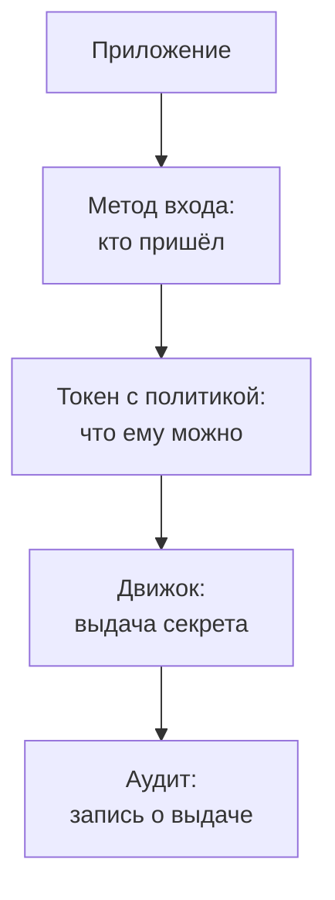

# Vault: статические и динамические секреты

Пароль базы данных в переменной окружения вы уже разбирали: в теме
`ci-secrets` он доезжал до задания конвейера, в теме `secrets-in-code`
его искали в коде. В обоих местах он оставался строкой: одинаковой
сегодня и через год, молчаливой о том, кто её читал. На стенде этой
темы поднято хранилище секретов, и у него дважды подряд спрашивают одно
и то же: дай учётку для сервиса отчётов. Смотрите, что оно отвечает.

```text
$ vault read database/creds/reporting
username           v-token-reportin-4MNDVudbQm7vuUz2T00r-1788265998
lease_duration     10m
$ vault read database/creds/reporting
username           v-token-reportin-AP4sUmJbWMrdCVXsXXEx-1788265998
```

Один запрос, а ответы разные: две учётные записи, и каждая создана под
это чтение. Поле lease_duration — срок аренды выдачи: учётка проживёт
десять минут, а потом хранилище удалит её из базы само. Из вывода
опущены пароль и служебные поля аренды, включая lease_id: они разобраны
ниже, в блоке «Как читать вывод». Обе учётки на стенде проверены входом
в базу.

Рядом стоит статическая роль, и она отвечает иначе. Тот же запрос к
`database/static-creds/reporting-static` отдаёт одну и ту же учётку,
сколько ни читай. Но строки из конфига и тут нет: пароль этой учётки
хранилище поменяло само при настройке, и старый больше не пускает.
Проверено прогоном: вход в базу со старым паролем по сети отклонён.

Что это за хранилище. Vault — сервис, который держит секреты у себя и
выдаёт их по запросу с условиями: кому можно, на какой срок, и каждая
выдача пишется в журнал. Секрет здесь перестаёт быть строкой, которую
положили и забыли: он становится выдачей со сроком.

Бытовое соответствие — стойка администратора в отеле. Карту от номера
делают под гостя на время проживания, после выезда она мертва, а запись
о выдаче остаётся в журнале стойки. Аналогия ломается в одном месте:
карта остаётся у гостя в кармане, и отель не может вытащить её оттуда.
Сила отеля в другом: замок отказывает мёртвой карте, где бы она ни
лежала. Так и хранилище: оно не гоняется за копиями строки, а удаляет
саму запись в базе, и любая копия умирает вместе с ней.

**Зачем это в работе AppSec-инженера.** Это пороговая концепция этапа:
после неё «секрет в переменной окружения» читается как находка, а не как
норма. Меняется и вопрос ревью. Вместо «где лежит пароль» вы спрашиваете
«какой политикой и на какой срок это выдаётся». Ответ лежит в
конфигурации хранилища, а не в коде приложения, и читается он быстрее,
чем ищется строка в репозитории.

## Подумай, прежде чем читать

1. Учётная запись создана под одно чтение и живёт десять минут. Что
   теряет атакующий, укравший её, по сравнению с украденным паролем из
   конфига?
2. Vault ротирует пароль существующей учётки. Кто узнаёт новый пароль
   и когда?
3. Токен приложения украден. Что он открывает, если политика выдана
   точно?

## Как это работает

Границы темы сразу. Стенд здесь учебный: dev-сервер Vault и postgres в
контейнере, всё локально, без root, секреты ненастоящие. Боевое хранилище
устроено сложнее: при старте оно запечатано и открывается ключами, и это
устройство относится к развёртыванию, а не к теме. Предмет здесь другой —
выдача: чем хранилище отвечает на запрос учётной записи и что остаётся у
того, кто прочитал ответ десять минут спустя.

**Откуда это взялось.** Секрет в конфиге не умеет двух вещей: истечь и
сказать, кто его брал. Ротация как процедура реагирования — тема
`secret-rotation` — запускалась после инцидента и руками, поэтому между
инцидентами её не делал никто. Хранилище ответило сменой модели: секрет
больше не хранится у потребителя, а выдаётся по запросу со сроком
годности. С этого момента утечка — событие с датой окончания, а не
катастрофа без срока.

Это третье место жизни секрета в маршруте гайдбука. В коде и истории
репозитория он разобран в теме `secrets-in-code`, доставка в задание
конвейера — в `ci-secrets`, процедура реагирования на утечку — в
`secret-rotation`. Здесь остаётся хранилище: выдача по политике, ротация
как постоянный режим и сторона приложения.

Два соседних решения помогают увидеть предмет точнее. Зашифрованный
конфиг решает задачу «не прочитают в репозитории». Но после расшифровки
секрет снова строка у каждого читающего, и ротации в таком конфиге нет.
Файл с правами 0600 решает задачу «не прочитают соседи по хосту» — это
тема `linux-file-permissions` — и тоже не знает ни срока, ни журнала.
Хранилище меняет не шифрование, а границу: секрет живёт внутри него и
выходит наружу с условиями.

Устройство хранилища — пять частей, и у каждой своё место в выдаче.
Движок секретов (secrets engine) отвечает за вид секрета: ключ-значение,
учётки базы данных, сертификаты. В аналогии со стойкой это её окна: одно
окно делает карты от номеров, другое выдаёт ключи от сейфовых ячеек.
Метод входа (authentication method) отвечает за то, как приложение
доказывает, кто оно: токеном, учёткой платформы, ролью Kubernetes.

Остальные три части — про разрешение и след. Политика — список путей с
правами, как список дверей, напечатанный на пропуске. Токен —
строка-пропуск, которую приложение предъявляет с каждым запросом, и
именно токен несёт политику к запросу. Аудит — журнал, куда пишется
каждое обращение к хранилищу. Ниже все пять частей появятся в работе:
политика и аудит — листингами, остальные — в цепочке запроса.

Движок ключ-значение (kv) стоит особняком. Положенный туда секрет
статичен по своей природе: хранилище охраняет его правами и аудитом, но
не ротирует. Режим выдачи появляется у движков, которые умеют писать
наружу. Движок базы данных меняет и создаёт учётные записи в самой базе,
поэтому разговор о ротации идёт на нём. А kv — это «конфиг с правами»:
лучше переменной окружения, но не смена модели. Отсюда и выбор движка
для лабы.

Метод входа решает, кем приложение предъявляется. Человек и конвейер
приходят с токеном или с личностью платформы CI. Под в кластере
предъявляет токен service account из темы `k8s-rbac`, и на него
назначается роль Kubernetes в хранилище. Важно, что вход не выдаёт
секретов: он выдаёт токен с политикой, и только политика решает, что
откроется дальше. Поэтому ревизия доступа — это чтение политик, а не
список токенов.

Где при этом лежит сам секрет? В dev-режиме он живёт в памяти процесса,
поэтому dev-сервер годится только для стенда. В боевом режиме секрет
лежит в бэкенде хранилища, зашифрованном ключом, который при старте
собирают из долей несколько человек. Это похоже на сейф, который
открывается двумя ключами одновременно, и называется размыканием.
Устройство размыкания — предмет развёртывания, а не этой темы. Здесь
важно одно: секрет не лежит у читающего, и потеря читающего его не
отдаёт.

У выданного есть срок, и сроки здесь двух уровней, их путают. Учётка из
динамической роли живёт арендой (lease): это срок годности выданного
плюс адрес для досрочного отзыва. Как библиотечная выдача: книгу отдают
до даты, а по номеру билета её можно истребовать раньше. Токен приложения
тоже выдаётся на срок и продлевается, пока приложение живо; забытый
продлить токен умирает сам. Аренда и срок токена обслуживаются разными
вызовами, а механику аренды с отзывом и продлением разбирает тема
`vault-lease-rotation`.

Политика — короткий список путей с правами:

```text
path "database/creds/reporting" {
  capabilities = ["read"]
}
```

Читается прямо: по этому пути можно читать, и всё. Что не перечислено,
то запрещено. Токен, выпущенный с этой политикой, отвечает 403 на любой
другой путь. Это проверяется в лабе: приложению выдаётся токен с одним
путём, а обращение к конфигурации движка и к sys/ отклоняется.

Аудит пишет каждое обращение, но не отдаёт самих значений. Запись о
чтении секрета хранит хеши, а не текст:

```text
type: response
path: database/creds/reporting
"password": "hmac-sha256:0fdff6487a93832e55fa…"
```

Это срез настоящей записи из стенда темы. Хеш здесь неслучайный: HMAC
(Hash-based Message Authentication Code) — хеш с секретным ключом
хранилища, а не голый дайджест. Чем он отличается от обычного хеша и
зачем в нём ключ, разбирает тема `hmac-vs-signature`. По нему два
значения можно сверить, не показывая ни одного, а восстановить значение
из хеша нельзя. По журналу видно, кто и куда ходил, а прочитать из него
значение нельзя.

### Два режима выдачи на одном движке

Статическая и динамическая роли отвечают на один вопрос «дай пароль к
базе» по-разному, и выбор между ними решается устройством приложения.
Статическая роль: учётка одна, Vault меняет её пароль по расписанию, а
читатель всегда видит текущее значение. Она годится приложению, которое
читает конфиг при старте и умеет перечитывать. Динамическая роль: учётка
создаётся под чтение и умирает со сроком аренды. Она годится приложению,
которое умеет держать соединение живым и обновлять учётку.

Выбор режима идёт за жизненным циклом читателя. Приложение читает конфиг
при старте и не умеет перечитывать? Статическая роль и перечитывание по
расписанию или по сигналу. Приложение управляет соединениями само?
Динамическая роль, и аренда продлевается или пересоздаётся. Смешивать
режимы на одной базе законно: сервис отчётов читает свою учётку
динамически, а учётка миграций живёт статической ролью с ротацией.

Что видит читатель статической роли в момент ротации? Чтение всегда
отдаёт действующий пароль, потому что ротация атомарна для читающего:
окна «ни старый, ни новый» нет. Окно есть у приложения, которое прочитало
один раз: между ротацией и перечитыванием оно ходит мёртвым паролем.
Поэтому к статической роли всегда прилагается ответ на вопрос «как
приложение узнаёт». Вариантов три: перечитывание, перезапуск или агент —
программа-помощник рядом с приложением, которая сама ходит в хранилище
за свежим значением.

### Кто в кого ходит

Запрос секрета — цепочка из четырёх звеньев, и у каждого звена своя часть
хранилища:


```mermaid
flowchart TB
    A[Приложение] --> B[Метод входа:<br/>кто пришёл]
    B --> C[Токен с политикой:<br/>что ему можно]
    C --> D[Движок:<br/>выдача секрета]
    D --> E[Аудит:<br/>запись о выдаче]
```

**Описание схемы.** Приложение предъявляет личность методу входа и
получает токен. Токен несёт политику — список разрешённых путей. Движок
по пути выдаёт секрет со сроком. Аудит пишет запись о каждом обращении.
Отказ на любом звене виден по журналу: нет токена, нет права, нет пути.

## Что умеет и чего не умеет

Умеет: выдать секрет по политике со сроком и ротировать пароль
существующей учётки по расписанию. Создать учётку на время и убрать её.
Отозвать выданное по префиксу при инциденте. Записать каждое чтение в
аудит. Не умеет: заставить приложение забыть прочитанное. Решить, какие
права нужны приложению: это отвечает политика, которую пишете вы. И не
заменяет модель прав хоста, на котором стоит само хранилище.

Первый список важно прочитать правильно: все пять умений — про выдачу и
её отзыв, и ни одного — про то, что стало со значением у читателя.
Хранилище отвечает за секрет до чтения включительно, а дальше отвечает
приложение. И отдельно: хранилище не делает неторопливое приложение
быстрым. Динамическая учётка требует кода, который умеет жить с ней, и
это переписывание.

По пунктам, потому что каждый отвечает на свою задачу. Выдача по политике
закрывает вопрос «кто может прочитать»: без токена с нужным путём чтения
нет. Срок годности закрывает «утекло и живёт вечно»: у выданного есть
дата смерти. Отзыв по префиксу закрывает инцидент: одна команда гасит всё
выданное из точки. Аудит закрывает «кто брал», и притом с хешами вместо
значений. Продление аренды закрывает длинные задачи: учётка живёт дальше
своего срока, пока её продлевают, и умирает, когда продлевать перестали.

Чего в списке нет и быть не может: защиты уже выданного значения.
Прочитанное приложение держит в памяти, и дальше работают темы
`secrets-in-code` и `ci-secrets`: куда значение не должно попасть.
Хранилище не лезет в приложение и не видит его журналов, его предмет
кончается на выдаче. Именно поэтому находка из темы `secrets-in-code`
чинится здесь переносом секрета в хранилище, а обращение с ним внутри
приложения остаётся на тех темах.

И о том, чего Vault не заменяет. Модель прав хоста и контейнера под
хранилищем — темы подразделов 4.1 и 4.2 — охраняет само хранилище, и
слабость там отдаёт всё выданное. Реестр секретов внутри — какие движки,
какие роли, какие политики — это конфигурация. Ревьюируется она как код:
с историей и с проверкой.

## Как запустить

Стенд лабы — postgres в контейнере и dev-сервер Vault на петле. Движок
включается и настраивается четырьмя записями (команды целиком — в README
лабы):

```text
$ vault secrets enable database
$ vault write database/config/reports \
    plugin_name=postgresql-database-plugin \
    connection_url='postgresql://{{username}}:{{password}}@…' \
    username=postgres password=postgres-root allowed_roles='*'
$ vault write database/static-roles/reporting-static \
    db_name=reports username=reporting_static rotation_period=5m
$ vault write database/roles/reporting db_name=reports \
    creation_statements=… default_ttl=10m max_ttl=1h
```

Первый вызов включает движок, второй учит его ходить в базу, третий и
четвёртый описывают два режима выдачи. Посмотрите на шаблонные скобки в
`connection_url`: адрес базы записан с заглушками, а реквизиты переданы
отдельными параметрами, поэтому пароль администратора не зашит в строку
подключения. Политика приложения и токен — предмет лабы.

Каждая запись отвечает одной строкой:

```text
Success! Enabled the database secrets engine at: database/
Success! Data written to: database/config/reports
Success! Data written to: database/static-roles/reporting-static
Success! Data written to: database/roles/reporting
```

Третий ответ, создание статической роли, заодно сменил пароль учётки в
базе. Видно это дважды: по ответу в блоке «Как читать вывод» и по тому,
что старый пароль перестал пускать. Порядок повторим и диагностируем:
каждая запись отвечает «Success», а ошибка в имени движка или роли даёт
отказ на чтении, а не молчание.

Единственная осторожность — реквизиты подключения: `connection_url`
несёт администратора базы, и права этой учётки — предмет отдельного
разговора
в теме `vault-integration`. Сам стенд — два процесса на петле: postgres
в контейнере и dev-сервер. Оба поднимаются скриптом лабы и гасятся за
собой, ничего наружу не уходит. Разбор того, что получилось, — в
следующем блоке по полям ответа.

## Как читать вывод

Ответ статической роли — существующая учётка и её расписание:

```text
$ vault read database/static-creds/reporting-static
last_vault_rotation    2026-09-01T15:33:18+03:00
password               nap9z6w3RFAeUYtN9J-h
rotation_period        5m
```

Вывод сокращён: в полном ответе есть ещё имя учётки и время до следующей
ротации. Дата в первой строке — когда Vault поменял пароль в последний
раз; старый пароль при этом уже мёртв, и это проверено прогоном по сети.
Ответ динамической роли вы видели во вступлении в сокращении: свежая
учётка с именем вида v-token-… и срок lease_duration рядом. В полном
ответе есть ещё lease_id, lease_renewable и пароль. Число рядом с
секретом — и есть отличие от конфига.

Читается оба раза одно и то же: имя, значение, срок. Поле lease_id —
адрес для отзыва: по нему выданное гасится досрочно. Поле
lease_duration — обещание: по его истечении хранилище удалит учётку
само. Пароль при этом не переживёт аренду ни на минуту. Без этих двух
полей ответ сводился бы к паролю.

Статическая и динамическая строки по-разному отвечают и на вопрос «что
будет завтра». У статической завтра тот же пользователь с другим паролем.
У динамической завтра нет ничего: учётка умерла. Поэтому в отчёте о
выдаче пишется и режим роли. Фразы «секрет выдаётся» мало: важно, кому
он выдаётся надолго, а кому на минуту.

Продление аренды читается из тех же полей: пока держатель продлевает,
учётка живёт; перестал — умерла по сроку. Сам механизм аренды с отзывом
и продлением — тема `vault-lease-rotation`. Здесь важно научиться видеть
срок в любом ответе хранилища и не читать его как украшение.

Токен читается тем же взглядом. Выдача токена с политикой:

```text
$ vault token create -policy=reporting-app -ttl=1h
token                hvs.CAESIEdBO-s7XVwB…
token_duration       1h
token_policies       ["default" "reporting-app"]
```

Вывод сокращён до трёх полей, а они отвечают на три вопроса ревью: чем
предъявляется, сколько живёт, что разрешает. Политика в токене — ссылка
на список путей, а не его копия: смена политики меняет права выданных
токенов задним числом, и это видно при инциденте.

Отказ читается так же коротко. Токен без пути в политике:

```text
$ vault read database/creds/reporting
Error reading database/creds/reporting: …
Code: 403. Errors:
* permission denied
```

Текст отказа сокращён. Никакой детали сверх запрета: ни «пути нет», ни
«токена нет». Ответ 403 не различает эти случаи, и это намеренно.

Чтение ответа как приём ревью сводится к трём вопросам к любому выводу
Vault. Кто: чей токен предъявлен. Что: какой путь прочитан. Насколько:
какой срок у выданного и продлеваемо ли оно. Ответ на все три лежит в
полях ответа, и спор «это безопасно» превращается в чтение трёх строк.
Сопоставьте со своим сервисом: какой срок годности у учётки, которой он
ходит в базу, и кто этот срок назначил?

## Границы метода

Dev-сервер на петле — учебный режим. Продакшен-хранилище требует
размыкания, надёжного бэкенда и политики его охраны, и это отдельная тема
развёртывания. Динамическая роль требует от приложения читать учётку
заново, а не один раз при старте. Хранилище не видит, что приложение
делает с прочитанным: утечка после выдачи — за его пределами.

Две границы тоньше. Первая: реквизиты, которыми движок ходит в базу,
сильнее любой выданной учётки. Администратор базы в конфигурации движка
стоит охранять сильнее всего, и в лабе политика приложения отвечает на
это отказом. Вторая: ротация и срок годности работают для выданного
хранилищем. Секрет, положенный в kv-движок один раз и читаемый годами,
не получает ни того ни другого. Он такой же статичный, как в конфиге,
только с правами и аудитом.

Третья граница — сама доступность. Приложение, которое не может прочитать
учётку при старте, не стартует: хранилище становится точкой отказа для
всех своих читателей. Ответы на это — агент с кешем и продление аренд —
разбирает тема `vault-integration`. Здесь важно увидеть саму зависимость
до того, как она укусит в проде.

## Частая ошибка

Секреты переехали в хранилище — ушла ли с ними и утечка? Слышно и такое:
раз секреты в Vault, утечки больше нет.

**Хранилище закрывает хранение, а не обращение с выданным.** Механизм из
блока «Как это работает»: выдача со сроком коротит жизнь утёкшего, но не
мешает приложению напечатать значение в журнал.

Контрпример: приложение прочитало динамическую учётку и записало её в лог
запуска. Через час учётка мертва, а журнал с ней уехал в сборщик логов:
секрет снова строкой, только теперь ещё и в двух местах. Обратный край
той же ловушки — «переведём всё на динамические роли». Приложение, не
умеющее перечитывать учётку, умрёт по первому сроку аренды. Ответом будет
статическая роль, а не откат в конфиг. Ловушка в обе стороны читается
одинаково: хранилище решает выдачу, а поведение приложения остаётся темой
ревью.

## Чеклист для ревью

1. Проверьте, что секреты читаются из хранилища, а не лежат в конфигах и
   переменных окружения (тема `secrets-in-code`).
2. Проверьте, что у приложения своя политика, и она разрешает ровно его
   точки выдачи.
3. Проверьте, что динамические роли имеют TTL и max_ttl, а статические —
   расписание ротации.
4. Проверьте, что токен приложения ограничен по времени и по политике.
5. Проверьте, что аудит хранилища включён и читается при расследовании.
6. Проверьте, что приложение перечитывает учётку, а не запоминает
   навсегда.
7. Проверьте, что реквизиты, которыми движок ходит в базу, не читаются
   ничьей прикладной политикой.
8. Проверьте, что заведён путь отзыва выданного по префиксу на случай
   инцидента.

## Попробуй сам

**Цель одной фразой:** добиться, чтобы `pilot/lab/vault/check.py` вышел с
кодом 0 на ваших двух файлах.

Формат «разверни-и-проверь». Стенд — postgres в контейнере и dev-сервер
Vault на петле, root не нужен. Правятся два файла: `app-policy.hcl` и
`app-role.sql`. Требования и секции «Запуск», «Сброс», «Удаление» — в
`README.md` каталога.

Проверялка применяет оба файла к живому стенду и гоняет восемь проверок.
Выдача со сроком, чтение разрешено, запись отклонена, второе чтение даёт
другую учётку, отзыв убивает учётку в базе, конфигурация движка и sys/
закрыты. Каждая проверка отвечает на вопрос из текста темы, потому что
лаба и есть этот текст, прогнанный руками.

В проверялке стоит динамическая роль: один запрос «дай пароль к базе»
дважды даёт две разные учётки, и отзыв гасит учётку в базе. Статической
роли в лабе нет, её прогон остался в тексте темы выше. Рабочий цикл
такой: поднять стенд, сбросить его, прочитать бланк глазами, сузить оба
файла, прогнать проверялку. Падение читается по имени проверки: оно
называет, какое из двух мест осталось широким. Поднимать и гасить стенд
между правками не нужно, потому что сброс приводит его к исходному
состоянию.

Подсказка одна: прочитайте оба списка прав бланка глазами того, кому они
достанутся, и сузьте каждый до одного действия.

**Отдельная задача «почини».** Бланк даёт «не зачтено» ровно на двух
проверках: учётка умеет писать, а политика видит конфигурацию движка.
Обе чинятся сужением, а не добавлением: в политике остаётся один путь, в
создании учётки — одно действие. Проверка после правки — тот же
`check.py`, и зелёным он обязан стать не за счёт отключённых проверок.

Решение лежит в `solution/` того же каталога и открыто без условий.
Сначала попробуйте сами: починка умещается в четыре строки на два файла,
и после вашей попытки она читается иначе.

## Проверь себя

1. Предскажите, какие поля вернёт этот запрос и что стало со старым
   паролем учётки, и проверьте на стенде лабы.

   ```text
   $ vault read database/static-creds/reporting-static
   …
   ```

2. Прочитайте политику: что откроет токен с ней и какие две строки в ней
   лишние?

   ```text
   path "database/creds/reporting" {
     capabilities = ["read", "update"]
   }
   path "sys/config" {
     capabilities = ["read"]
   }
   ```

3. Почему секрет, положенный в kv-движок, остаётся «конфигом с
   правами», а не сменой модели?
4. Учётная запись создана под одно чтение и живёт десять минут. Что
   теряет атакующий, укравший её, против украденного пароля из конфига?
5. Возврат к теме `secret-rotation`: чем ротация как режим хранилища
   отличается от ротации как процедуры реагирования?
6. Возврат к теме `ci-secrets`: где кончается доставка секрета в job и
   начинается выдача из хранилища?

<details markdown="1">
<summary>Ответ 1</summary>

1. Имя существующей учётки, текущий пароль, дата последней ротации
   (`last_vault_rotation`) и расписание (`rotation_period`). Старый пароль
   мёртв: Vault поменял его в базе при настройке роли, и вход со старым
   отклоняется. Команда для прогона — та же: `vault read
   database/static-creds/reporting-static` на поднятом стенде лабы; ответ
   сверяется с разбором в блоке «Как читать вывод».

</details>

<details markdown="1">
<summary>Ответ 2</summary>

2. Токен откроет чтение учёток reporting и чтение `sys/config`. Лишние
   две строки: `update` на пути выдачи — читателю нужен только read — и
   весь путь `sys/config`. Конфигурация движка несёт реквизиты, которыми
   движок ходит в базу, и прикладной политике там нечего делать. Лаба
   отвечает на вторую строку отказом проверки «конфигурация движка и sys/
   закрыты».

</details>

<details markdown="1">
<summary>Ответ 3</summary>

3. Kv хранит значение статично: хранилище охраняет его правами и аудитом,
   но не ротирует и не выдаёт со сроком. Положенный раз секрет живёт там
   годами, как в конфиге. Смена модели появляется у движков, которые пишут
   наружу: движок базы данных меняет и создаёт учётные записи в самой базе.
   Лучше переменной окружения — да; выдачей — нет.

</details>

<details markdown="1">
<summary>Ответ 4</summary>

4. Время и размах. Украденная учётка умрёт по сроку аренды или по отзыву
   по префиксу — одна команда гасит всё выданное из точки; аудит покажет,
   кто её брал. Пароль из конфига живёт, пока его не поменяют руками везде,
   и никто не знает, кто его читал за это время.

</details>

<details markdown="1">
<summary>Ответ 5</summary>

5. Процедура реагирования запускается после инцидента и руками; режим
   хранилища ротирует всегда, без инцидента и без распоряжения. Первая
   обесценивает уже утёкшее, второй не даёт утечке жить дольше срока —
   они дополняют друг друга, а не заменяют.

</details>

<details markdown="1">
<summary>Ответ 6</summary>

6. Доставка в job кончается там, где секрет стал доступен заданию —
   токеном форжа или переменной. Выдача начинается, когда секрет
   запрашивается у хранилища по политике со сроком годности. Первая
   решает «как доехало», вторая — «кто, что и насколько получил».

</details>

## Источники

1. What is Vault? Документация HashiCorp; реестр `vault-what-is`.
   Разделы: устройство хранилища, движки, политики, аудит.
   <https://developer.hashicorp.com/vault/docs/about-vault/what-is-vault>
2. Database secrets engine, документация HashiCorp; реестр
   `vault-database-secrets`. Разделы: статические и динамические роли,
   ротация, настройка подключения.
   <https://developer.hashicorp.com/vault/docs/secrets/databases>

Каркас этапа: записи семейства man-* и якоря подразделов — наследуются
всеми темами этапа 4.

**Скоропортящийся слой.** Версия Vault и синтаксис команд проверяются при
ревизии; устройство ролей и аренд стабильно. Dev-сервер — учебный режим,
продакшен-устройство меняется от выпуска к выпуску.

**Маркеры уверенности.** **Проверено лично** 2026-09-01 на Arch Linux,
Vault 1.21.3 (dev-сервер на 127.0.0.1), postgres:16-alpine, Docker
29.7.2: настройка движка четырьмя записями, ответ статической роли
(пароль сменился, старый отклонён по сети), два чтения динамической —
две учётки, отзыв аренды убивает учётку в базе. При переписывании
2026-10-03 всё перечисленное прогнано заново на стенде лабы: добавочно
проверены вход динамической учётки в базу, выдача токена с политикой и
отказ 403 на чужом пути. Лаба тоже прогнана заново: бланк даёт «не
зачтено» ровно на двух проверках, эталон — «зачтено» на восьми.
Устройство продакшен-хранилища (размыкание, бэкенды) — **по
документации**, на стенде не поднималось.
