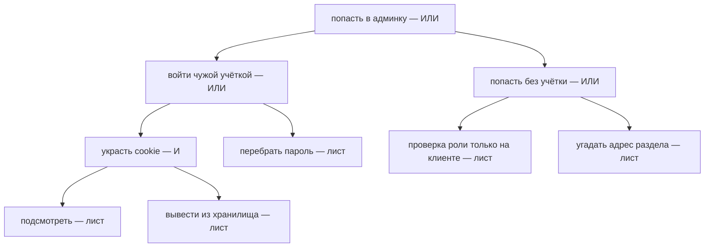

# Деревья атак и сценарии злоупотребления

Команда учебной витрины из темы `threat-modeling` собралась во второй раз.
Диаграмма потоков нарисована, реестр угроз заведён, категории из темы
`stride` пройдены по каждому элементу. Теперь на столе вопрос другого
рода: какими путями атакующий дойдёт до админки. Перебор проходил угрозы
по элементам, здесь же предмет — цель и дороги к ней. Отвечает на такой
вопрос дерево:

```text
попасть в админку
├── ИЛИ: войти чужой учёткой
│   ├── украсть cookie сессии
│   └── перебрать пароль
└── ИЛИ: попасть без учётки
    ├── проверка роли только на клиенте
    └── угадать адрес раздела
```

Каждая ветвь — способ достичь цели, а нижние строки — действия, которые
проверяются руками: открыть код и посмотреть, где проверяется роль. Такая
раскладка называется деревом атаки, и это первая из двух техник темы.
Вторая идёт не от цели, а от функции: как поиском витрины пользуются так,
как автор не закладывал. Обе техники записываются в тот же реестр угроз.

## От цели и от функции

Дерево атак — раскладка одной цели атакующего на способы её достичь. Зачем
она нужна, видно по перебору из `stride`: категории надёжно находят угрозы
у элементов, но молчат о том, как атакующий соберёт из них путь. Бытовой
пример — цель «попасть в чужую квартиру». Она раскладывается в «войти с
ключом» или «войти без ключа», а «с ключом» — в «взять у жильца» или
«найти запасной под ковриком». Квартира соответствует админке, ключ —
учётной записи, коврик — незакрытой проверке роли. Ломается аналогия на
числе дверей: в квартиру ведут одна-две, в сервис — столько, сколько в нём
функций.

Сценарий злоупотребления — запись о функции, использованной наоборот. У
каждой функции есть сценарий использования, который закладывал автор:
форма сброса пароля служит тому, кто забыл свой пароль. Сценарий
злоупотребления описывает того, кто пришёл с другим намерением: он
перебирает адреса в этой форме и по разнице ответов узнаёт, кто
зарегистрирован.

Бытовой пример — турникет метро, рассчитанный на одного пассажира: двое,
прошедшие по одному билету вместе, использовали его так, как проектировщик
не закладывал. Ломается аналогия на видимости: сломанный турникет заметен
снаружи, а злоупотребление функцией идёт через штатный интерфейс и
выглядит обычной работой. Механика перечисления учётных записей разобрана
в теме `user-enumeration`, а эта тема — про форму записи.

**Зачем это в работе AppSec-инженера.** Перебор по категориям слаб ровно
там, где угроза собирается из шагов или живёт в бизнес-правиле. Дерево
держит цепочку шагов, сценарий — смысл функции. На ревью это читается
одним вопросом: для какой цели нарисовано дерево и для какой функции
записан сценарий. Если ни того ни другого нет, угроза вроде «читают чужие
заказы» остаётся догадкой без пути.

## Как это работает

**Откуда это взялось.** Дерево пришло из разбора уже случившихся атак. В
1999 году Брюс Шнайер предложил раскладывать цель атакующего в подцели,
пока ветви не закончатся действиями, которые проверяются руками. Сценарий
злоупотребления пришёл из инженерии требований: там функцию описывают
сценарием использования, и неверное использование записывается той же
формой. Обе техники отвечают на вопрос «что может пойти не так», но с
другого края, чем перебор из `stride`. Дерево идёт от цели, сценарий — от
функции, а перебор — от элемента.

### Дерево: узлы И и ИЛИ

Корень дерева — цель атакующего одной фразой. Каждый внутренний узел —
подцель, его дети — пути к ней, и дети бывают двух сортов. Узел ИЛИ жив,
пока жив хотя бы один ребёнок: «войти чужой учёткой» сработает и через
кражу cookie, и через перебор пароля. Узел И требует всех детей сразу:
украсть cookie — это «подсмотреть» и «вывести из хранилища», и одного
подглядывания мало. Нижняя строка ветви — лист, действие, которое
проверяется руками по коду или конфигурации. В дереве введения все
развилки — ИЛИ, а узел И появляется, когда подцель раскладывают дальше:



**Описание схемы.** Это дерево введения с одной развёрнутой ветвью:
«украсть cookie» перестало быть листом и стало узлом И с двумя детьми.
Корень и обе его развилки — узлы ИЛИ: атакующему достаточно одного пути.
Все нижние узлы — листья, то есть действия, которые проверяются руками.

### Цена пути и свёртка

Статья Шнайера приписывает узлам значения: «возможно» или «невозможно»,
цена, вероятность. По ним дерево сворачивается в ответ «какие пути живы и
сколько они стоят». Цена пути через узел И — сумма цен детей, потому что
атакующий платит за каждый шаг. Цена пути через ИЛИ — минимум, потому что
атакующий выберет самый дешёвый. Свёртка считается без всякого
инструмента, и числовой пример с прогоном есть в самопроверке. Для защиты
свёртка — очередь починки: первой чинится самая дешёвая для атакующего
ветвь, потому что именно по ней он пойдёт.

### Сценарий злоупотребления: функция наоборот

Cheat sheet OWASP определяет сценарий злоупотребления коротко: это способ
использования функции, который автор не закладывал и который позволяет
атакующему влиять на исход. Записывается он в форме обычного требования.
Требование здесь — короткая история от лица пользователя: «как покупатель,
я ищу товар по названию, чтобы найти его в каталоге». Несколько таких
историй собираются в эпик, крупный кусок работы вроде «поиск по каталогу».

Сценарий злоупотребления берёт ту же форму и переворачивает лицо: «как
атакующий, я перебираю адреса в форме сброса и по разнице ответов узнаю,
кто зарегистрирован». Этот пример — из самого cheat sheet: поток сброса
пароля, который перечисляет учётные записи. К записи прилагаются оценка
риска и решение.

У страницы cheat sheet стоит пометка архивного документа: сам проект OWASP
признал технику редкой на практике, и тема не скрывает этого. Редкой она
остаётся по цене входа: сценарий требует человека, который знает, зачем
функция нужна. Такого человека на сессию моделирования ещё надо позвать.

## Что умеет и чего не умеет

Дерево умеет держать цепочку шагов целиком: путь от корня до листа — план
атаки из нескольких шагов, и цена пути считается свёрткой. Сценарий умеет
держать предметный смысл функции: «форма сброса пароля» превращается в
«список зарегистрированных» только в голове того, кто знает, зачем форма
нужна. Обе техники читаются без инструмента: дерево — отступами и словами
И и ИЛИ, сценарий — формой требования.

Дерево не гарантирует полноту ветвей: забытую ветвь в нём не отличить от
несуществующей, и это предмет раздела «Частая ошибка». Сценарий не
масштабируется на систему целиком: его пишут на одну функцию, и сотня
функций — это сотня сценариев. Обе техники не заменяют диаграмму из темы
`threat-modeling`. Диаграмма отвечает на первый вопрос процесса, «из чего
состоит система», а они — на второй, «что может пойти не так».

Отсюда — правило выбора техники. Вопрос про цель атакующего ведёт к
дереву, вопрос про функцию — к сценарию злоупотребления, вопрос про
элемент диаграммы — к категориям из `stride`. Смешивать их не стоит. У
дерева, построенного от элемента, нет цели атакующего. Его ветви
превращаются в тот же плоский список угроз, что даёт перебор, но без
систематичности категорий `stride`. Сценарий от цели потеряет функцию,
ради которой писался.

## Как запустить

Дерево строится в три шага. Первый — назвать цель атакующего одной точной
фразой, «прочитать невыпущенные товары»: от расплывчатой цели вроде
«взломать витрину» развилок не построить. Второй — раскладывать каждый узел
в подцели, пока ветви не закончатся листьями. Лист «проверка роли только
на клиенте» проверяется одним взглядом в код, а «обойти авторизацию» —
нет, её раскладывают дальше. Третий — приписать узлам значения: хотя бы
«возможно» или «невозможно» и цену в условных единицах.

Сценарий пишется тоже в три шага. Первый — взять одну функцию из списка,
не систему целиком. Второй — спросить «как ею пользуются не так», и
отвечает на этот вопрос человек, который знает, зачем функция нужна:
разработчик или аналитик. Третий — записать ответ по шаблону: эпик,
сценарий от лица атакующего, оценка риска и решение.

Cheat sheet предлагает писать сценарии мастерской: за одним столом
садятся тот, кто писал функцию, и тот, кто будет её ломать. Первый
называет предназначение, второй — неверное использование, и спор «так ли
это злоупотребление» решается оценкой риска: у риска есть шкала, у
авторитета её нет. Тот же состав полезен и для дерева: если защита
называет ветвь «невозможной», причина записывается рядом с узлом, иначе
оценка не проверяема.

Куда едет результат, решает процесс. И дерево, и список
сценариев пишутся в реестр угроз из `threat-modeling`, и у каждой записи
там обязан быть ответ из четырёх законных. Оба документа проверяемы
руками: дерево — свёрткой, сценарий — чтением решения.

## Как читать вывод

Дерево читается свёрткой снизу вверх. Узел И жив, пока живы все его дети;
узел ИЛИ — пока жив хотя бы один. Закрытая защитой ветвь режет поддерево
целиком, и читается это по типу узла. Если cookie больше нечем
подсмотреть, ветвь «украсть cookie» мертва вся: узлу И нужны оба ребёнка,
и лист «вывести из хранилища» проверять уже не нужно. А ветвь «попасть без
учётки» умирает, только когда закрыты оба её листа — и угаданный адрес, и
клиентская проверка роли.

Цель вроде «атакующий не может попасть в админку» выполнена относительно
дерева, когда закрыты все пути от листьев до корня. Такая цель называется
целью безопасности и записывается запретом, потому что запрет проверяем.
Почему выполнение «относительно» дерева — об этом раздел «Частая ошибка».

Сценарий читается как требование с решением. «Обработать» значит, что
функция меняется: форма сброса перестанет различать существующие и
несуществующие адреса. «Принять риск» значит, что названа причина, почему
менять её не будут. Сценарий без решения — тот же долг, что угроза без
ответа в `threat-modeling`: риск оценён, а делать с ним нечего. И оба
читаемых документа — дерево и список сценариев — остаются черновиком, пока
не сверены с реестром: угроза, которая в реестр не попала, для процесса не
существует.

## Границы метода

Первая граница — объём. Дерево растёт до нечитаемости: на витрине двадцать
листьев ещё листаются, а на живом сервисе дерево либо режется по подцелям,
либо умирает. Вторая — предмет. Сценарий требует знания предметной
области: «как функцией злоупотребить» отвечает тот, кто понимает, зачем
она есть. Третья — ранжирование. Обе техники не ранжируют сами: цена узла
— оценка, замерить её нечем, и два автора назначат одной ветви разные числа.
Четвёртая — старение. Обе техники устаревают вместе с системой, как и
реестр: новая функция приносит новые ветви и новые сценарии.

## Частая ошибка

Дерево нарисовано, развилки подписаны, листья проверены руками.
Соблазнительно сказать: атакующий покрыт. Ответьте себе «да» или «нет» —
и держите ответ, пока читаете дальше.

**Дерево покрывает ветви, которые вы записали, — и не более.** Механизм из
раздела «Как это работает»: лист — это то, до чего дошло разложение, а
забытой ветви в дереве нет и появиться ей неоткуда.

Контрпример из введения. В дереве админки нет ветви «сессия украдена через
журнал»: журнала не было на диаграмме из темы `threat-modeling`. Перебор
по категориям прошёл мимо журнала так же. Техника исправна, модель
неполна — виноват не узел, которого нет. Вывод рабочий: дерево
перечитывается при каждом изменении системы, и возвращается к нему тот,
кто увидел новый поток данных.

## Чеклист для ревью

1. Проверьте, что у каждой названной цели атакующего есть дерево,
   доведённое до проверяемых листьев.
2. Проверьте, что узлы И и ИЛИ размечены в дереве явно, а не
   подразумеваются.
3. Проверьте, что у каждого сценария злоупотребления есть решение:
   «обработать» или «принять риск» с причиной.
4. Проверьте, что деревья и сценарии пересматриваются при изменении
   системы, как и реестр угроз.
5. Проверьте, что выбор техники отвечает на вопрос: цель — дерево,
   функция — сценарий, элемент — категории из темы `stride`.

## Попробуй сам

Возьмите витрину из лабы темы `threat-modeling` и постройте дерево цели
«прочитать невыпущенные товары» до проверяемых листьев. Затем запишите
один сценарий злоупотребления по функции поиска в форме шаблона: эпик,
сценарий от лица атакующего, оценка риска, решение. Одна подсказка: узлы
ИЛИ у этой цели — «через интерфейс» и «мимо интерфейса», и второе короче.
Оба листа проверьте руками по коду витрины: дерево тем и хорошо, что
подсказывает, куда смотреть.

**Критерий выполнения** наблюдаемый: у дерева корень назван целью, листья
проверяемы руками, у сценария есть оценка риска и решение.

## Проверь себя

1. Цель безопасности витрины записана запретом: «атакующий не может
   попасть в админку». Команда прошла дерево из введения в порядке
   цены, от самой дешёвой ветви, и закрыла все листья. Выберите верную
   запись о цели:

   А. Запрет обеспечен полностью: нарисованное дерево покрывает
   атакующего целиком.

   Б. Запрет обеспечен относительно этого дерева: все его пути закрыты,
   а само оно пересматривается, как реестр.

   В. Запрет был обеспечен уже на первой ветви: остальные атакующему
   невыгодны.

2. Сценарий злоупотребления из чужого реестра:

   ```text
   эпик: сброс пароля
   сценарий: как атакующий, я перебираю адреса в форме сброса
             и по разнице ответов узнаю, кто зарегистрирован
   риск: средний
   решение:
   ```

   Чем эта запись незакончена?

3. Почему цена пути по узлу И считается суммой цен детей, а по узлу
   ИЛИ — минимумом?

4. Дерево из введения, но с ценами у листьев:

   ```text
   попасть в админку (ИЛИ)
   ├── войти чужой учёткой (ИЛИ)
   │   ├── перебрать пароль — 5
   │   └── украсть cookie (И): подсмотреть 1 и вывести 2
   └── попасть без учётки: угадать адрес раздела — 2
   ```

   Чему равна цена корня — предскажите до прогона свёртки?

5. Возврат к теме `threat-modeling`: куда попадают дерево и сценарий
   после написания и что там обязано быть у каждого?

6. Возврат к теме `user-enumeration`: сценарий из второго вопроса —
   перебор адресов в форме сброса. По каким каналам ответ приложения
   выдаёт существование логина и что закрывает два из них?

<details markdown="1">
<summary>Ответ 1: разбор вариантов</summary>

1. Верный ответ — Б.

   А. Неверно. Это ошибка из раздела «Частая ошибка» дословно:
   нарисованное принято за покрытое. Дерево покрывает записанные ветви —
   не более: ветви «сессия украдена через журнал» в нём нет, журнала не
   было на диаграмме.

   Б. Верно. Цель безопасности — запрет, поэтому закрыть надо все пути:
   у корня ИЛИ запрет не выполнен, пока жива хотя бы одна ветвь. Закрыты
   все — цель выполнена относительно дерева, а дальше оно
   пересматривается при изменении системы, как и реестр.

   В. Неверно. Цена задаёт только порядок починки: пока жива
   хотя бы одна ветвь до корня, запрет не выполнен. После закрытия
   «угадать адрес раздела» живы обе ветви «чужой учётки» и соседний
   лист про клиентскую проверку роли — атакующий идёт по ним.

</details>

<details markdown="1">
<summary>Ответ 2</summary>

2. Нет решения: у сценария, как и у строки реестра, обязан быть исход —
   «обработать» или «принять риск» с причиной. Сценарий с пустым
   решением — тот же долг, что угроза без ответа: риск оценён, а делать
   с ним нечего.

</details>

<details markdown="1">
<summary>Ответ 3</summary>

3. Узел И требует всех детей: атакующий платит за каждый шаг, и цена
   пути складывается. Узлу ИЛИ достаточно одного ребёнка: атакующий
   выберет самый дешёвый, и цена пути — минимум. Отсюда работа защиты:
   сначала чинится самая дешёвая для атакующего ветвь.

</details>

<details markdown="1">
<summary>Ответ 4</summary>

4. Два: ветвь «угадать адрес» задаёт цену цели, как ни дороги соседние.
   Прогон свёртки: `python3 -c "print(min(min(5, 1 + 2), 2))"` печатает
   `2` (перепроверено 2026-10-03, Python 3.14.7). Вывод для защиты:
   первым чинится лист с ценой 2, то есть адрес раздела не должен
   открываться без проверки прав.

</details>

<details markdown="1">
<summary>Ответ 5</summary>

5. В реестр угроз: обе техники — способ выявления, а реестр — место
   хранения. У попавшего в реестр — ответ из четырёх законных и место на
   диаграмме; угроза, которая в реестр не попала, для процесса не
   существует.

</details>

<details markdown="1">
<summary>Ответ 6</summary>

6. Три канала: текст ответа («такого пользователя нет» против «неверный
   пароль»), код и длина ответа, время обработки. Первые два закрывает
   единообразный ответ на все исходы; время единообразием текста не
   закрыть — дорогой хеш считается и для несуществующего логина.

</details>

## Источники

1. Attack Trees, Брюс Шнайер, Dr. Dobb's Journal, декабрь 1999; реестр
   `schneier-attack-trees`. Разделы: декомпозиция цели, узлы И и ИЛИ,
   значения узлов и свёртка.
   <https://www.schneier.com/academic/archives/1999/12/attack_trees.html>
2. OWASP Abuse Case Cheat Sheet; реестр `owasp-cs-abuse-case`. Разделы:
   определение сценария, шаблон, мастерская, отслеживание; архивная
   пометка документа.
   <https://cheatsheetseries.owasp.org/cheatsheets/Abuse_Case_Cheat_Sheet.html>

Каркас этапа: этап 5 опирается на открытые документы методов; стендов
нет.

**Скоропортящийся слой.** Статья Шнайера 1999 года стабильна; cheat sheet
помечен историческим самим проектом — при ревизии перечитывается статус
этой пометки, а содержание стабильно.

**Маркеры уверенности.** Узлы И/ИЛИ, значения узлов и свёртка — **по
документации** (статья открыта лично 2026-09-01 curl'ом с браузерным
User-Agent: штатный фетчер получает 403, это известно). Определение
сценария, шаблон и архивная пометка — **по документации** (страница
открыта лично 2026-09-01, пометка процитирована в тексте темы). Дерево
введения построено по витрине самим текстом темы. Свёртка из четвёртого
вопроса прогнана повторно 2026-10-03 на Python 3.14.7: вывод совпал
дословно.
