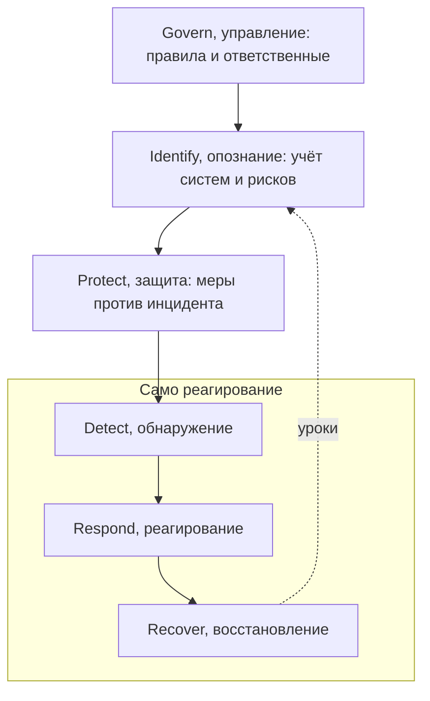
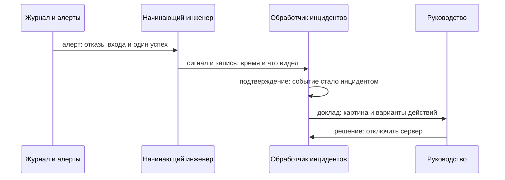

# Реагирование на инциденты безопасности

Ночь, и срабатывает алерт из прошлой темы `security-logging`: серия
отказов входа в админку, а последней строкой — один успешный вход.
Техническая часть сигнала на этом кончается, и начинается
организационная. Кто подтверждает, что это инцидент, кто решает об
отключении сервера, кому сообщают? Отвечает на эти вопросы документ
NIST SP 800-61 — руководство по реагированию на инциденты от
американского Национального института стандартов и технологий.
Открывать нужно третью редакцию, она вышла в апреле 2025 года.

Цикл из четырёх фаз, который до сих пор цитируют, остался во второй
редакции 2012 года, а третья его не продолжает, а перестраивает. По ней
реагирование — три функции из шести функций общей рамки безопасности,
то есть часть большого процесса, а не отдельный цикл. Держите при
чтении два вопроса из ночной истории: кто в ней решает об отключении
и что делает начинающий инженер.

## Что такое реагирование на инциденты

Дальше всё держится на двух словах, поэтому начнём со словаря. Событием
документ называет любое заметное происшествие в системе: вход
пользователя, ошибку приложения, новую строку в журнале. Инцидент —
событие, которое нарушает безопасность или грозит ей: определение
документ берёт из FISMA, американского закона о безопасности федеральных
информационных систем. Бытовой пример — сигнализация машины. Хлопнула
дверь, и сигнализация пискнула: событие. Разбили стекло: инцидент.
Ночная серия отказов с успехом на конце похожа на подбор пароля,
поэтому это инцидент, а не рядовое событие.

Реагированием на инциденты называют всё, что происходит после такого
сигнала, от подтверждения до возврата к обычной работе. Главный документ
об этом процессе пишет институт NIST. Роль похожа на роль авторов
ГОСТа, только для информационных технологий: документы института
открыты и бесплатны, и на них опираются далеко за пределами США.
Ломается сравнение на обязательности: это рекомендации, а не норматив,
и обязательными они становятся, когда на них ссылается закон или
контракт. Нужная публикация
называется SP 800-61: серия 800 посвящена компьютерной безопасности,
а номер 61 — реагированию на инциденты.

**Зачем это в работе AppSec-инженера.** Инцидент находит вас по журналу
или по алерту, как в ночной истории выше. Дальше ценны две вещи: знать
свою роль и знать, что реагирование — часть управления риском, а не
подвиг одной ночи.

## Шесть функций вместо четырёх фаз

Третья редакция описывает реагирование не как самостоятельный цикл,
а как профиль другого документа NIST, Cybersecurity Framework 2.0 —
рамки кибербезопасности. Рамка — общий список работ по безопасности,
разложенный по функциям, а профиль — выборка из него под одну задачу.
Задача здесь одна: инцидент. Поэтому реагирование говорит теми же
словами, которыми организация описывает управление рисками вообще,
и это сделано нарочно.

Функций в рамке шесть, и первые три готовят почву. Управление (Govern)
назначает правила и ответственных: например, кто вправе решать об
отключении сервиса. Опознание (Identify) ведёт учёт того, что есть:
какие системы и какие у каждой риски. Защита (Protect) — меры, которые
мешают инциденту случиться, от парольной политики до журнала из
`security-logging`. Оставшиеся три функции — само реагирование.
Обнаружение (Detect) замечает событие и подтверждает инцидент.
Реагирование (Respond) сдерживает ущерб и убирает причину.
Восстановление (Recover) возвращает систему к обычной работе.

**Описание схемы.** Схема читается сверху вниз: три функции подготовки
ведут к трём функциям реагирования, собранным в рамку. Внутри рамки
обнаружение ведёт к реагированию, реагирование — к восстановлению.
Пунктирная стрелка от восстановления к опознанию — непрерывное
извлечение уроков: улучшение живёт в функции опознания (категория
ID.IM). Выводы из инцидента возвращаются в подготовку сразу,
не дожидаясь отдельной фазы.

Из деления следует главный вывод темы. Реагирование — три функции
из шести, а не вся безопасность целиком. Подготовка к инциденту живёт
в функциях управления, опознания и защиты: она считается частью обычной
работы, а не частью реагирования. А извлечение уроков, во второй редакции
отдельная фаза после закрытия инцидента, стало непрерывным. Выводы
попадают в улучшение сразу, потому что разбор идёт неделями и ждать
его конца нельзя.

**Откуда это взялось.** Вторая редакция 2012 года описывала замкнутый
цикл из четырёх фаз и мир своего времени: редкие инциденты, день-два
на разбор, отдельная команда. Третья редакция прямо пишет, что этот
мир кончился: инциденты стали частыми, разбор идёт неделями, и уроки
нельзя откладывать до закрытия. Отсюда перестройка под рамку CSF 2.0
и общий словарь с управлением рисками.

### Как читается соответствие редакций

У документа есть таблица перевода старого цикла в новые функции, и её
стоит пройти мысленно до чтения. Куда ушли действия после инцидента
и почему отдельной фазы у них больше нет? Фаза подготовки разошлась
по управлению, опознанию и защите. Фаза обнаружения и анализа перешла
в функцию обнаружения. Сдерживание, искоренение и восстановление
разошлись по функциям реагирования и восстановления. А действия после
инцидента растворились в непрерывном улучшении: фазы у них нет, потому
что улучшение не ждёт закрытия. Кто цитирует четыре фазы как текущую
редакцию, тот цитирует 2012 год.

## Кто участвует в реагировании

Теперь о людях, потому что главная перемена против бытового
представления «инцидентом занимается отдел» — в ролях. Документ
перечисляет участников: руководство, обработчики инцидентов, технические
специалисты, юристы, пресс-служба, кадровая служба, физическая охрана
и владельцы активов. Список выглядит случайным, пока не разложишь
ночную историю по рукам.

Начнём с решения с ценой. Отключение рабочего сервера останавливает
бизнес-процесс, поэтому выбор документ относит к руководству:
обработчики докладывают картину и варианты, а выбирает руководство.
Владелец актива, человек, отвечающий за систему как за хозяйство,
знает, что на ней лежит и чем рискует остановка.

Юристы нужны там, где инцидент трогает чужие данные. Утечка
персональных данных — не внутреннее дело компании: закон обязывает
сообщить о ней затронутым людям и надзорному органу. Надзорный
орган — государственная служба, которая следит за оборотом
персональных данных; в России это Роскомнадзор. Формулировки и сроки
уведомлений — юридическая работа, как и сохранение улик для возможного
суда. Пресс-служба отвечает на публичные вопросы, кадровая
подключается, если под подозрением сотрудник, физическая охрана —
если дело дошло до помещений.

Обработчики инцидентов — люди, чья работа вести сам инцидент: принять
сигнал, подтвердить, координировать действия остальных. Копать
конкретную систему идут технические специалисты: снять образ диска,
найти следы взлома, убрать вредоносную программу. То есть обработчик
ведёт процесс, а технический специалист работает руками внутри
системы. Такая служба устраивается тремя способами: обработчики бывают
штатные, контрактные и вызываемые по случаю, когда своих нет. У крупной
организации команд может быть несколько, и держатся они вместе общими
процедурами, а не личными договорённостями. Отделом это больше не
назовёшь.

Отдельная строка — провайдеры. Если система живёт в облаке, часть
картины видит провайдер, и видит раньше вас: его журналы начинаются
за пределами вашей виртуальной машины. Делиться этой картиной он обязан
по контракту, а не по дружбе. Поэтому разделение ответственности
с провайдером прописывается заранее, в спокойное время.

**Описание схемы.** Схема читается сверху вниз, каждая стрелка — один
шаг ночной истории. Алерт доходит до начинающего инженера, и тот
передаёт обработчику сигнал вместе с записью: время, источник, что
именно видел. Обработчик подтверждает инцидент и докладывает
руководству, руководство возвращает решение об отключении. Место
инженера на этой схеме — первые две стрелки, и дальше он нужен как
свидетель, а не как руководитель.

Теперь у истории из вступления есть ответы. Отключение сервера решает
не дежурный и не обработчик, а руководство, по докладу обработчиков.
Начинающий инженер участвует в процессе, а не ведёт его: его место —
у сигнала и у записи о нём. Заметить алерт, зафиксировать время
и картину, передать дальше по цепочке — так выглядит его вклад, и от
его записи зависит весь дальнейший разбор.

## Что умеет и чего не умеет

Соберём документ целиком: третья редакция даёт три вещи. Первое —
словарь: событие, инцидент и функции, с определением инцидента из
закона FISMA. Второе — роли, разобранные выше, вместе с разделением
ответственности с провайдерами. Третье — рамка процедур: политика,
процессы и плейбуки. Словарь и роли разобраны выше, поэтому остановимся
на плейбуках.

Плейбук — пошаговый сценарий действий под конкретный тип инцидента,
например под украденную учётную запись или вымогательство. Бытовой
пример — памятка «при пожаре» на стенде: решения приняты заранее, и в
дыму остаётся только исполнять. Соответствие прямое: пожар — тип
инцидента, памятка — плейбук. Ломается пример на числе: памятка одна
на всех, а плейбуки пишут под типы инцидентов, и у организации их
несколько. Готовых плейбуков документ не приводит, а отсылает к их
сборнику у CISA, агентства кибербезопасности США.

Чего документ не даёт — по устройству, а не по недоработке: конкретных
процедур. Третья редакция сознательно тоньше второй, потому что детали
стареют быстрее самого документа. Процедуры вынесены в онлайн-ресурсы,
где каждая привязана к функциям и категориям рамки. Так их можно
обновлять, не переписывая стандарт.

## Источники

1. NIST SP 800-61 Rev. 3, страница публикации; реестр `nist-sp-800-61r3`.
   Разделы: аннотация и реквизиты издания.
   <https://csrc.nist.gov/pubs/sp/800/61/r3/final>
2. NIST SP 800-61 Rev. 3, текст документа (PDF); реестр
   `nist-sp-800-61r3-pdf`. Разделы: жизненный цикл реагирования по
   функциям CSF 2.0 (раздел 2.1 с таблицей соответствия Rev. 2), роли
   и ответственности (2.2), политики и плейбуки (2.3).
   <https://nvlpubs.nist.gov/nistpubs/SpecialPublications/NIST.SP.800-61r3.pdf>

Каркас этапа: этап 5 опирается на открытые документы методов; стендов
нет.

**Скоропортящийся слой.** Действующая редакция — Rev. 3 от апреля 2025;
следующая ревизия проверяет номер редакции и состав функций CSF.

**Маркеры уверенности.** Шесть функций, место реагирования в трёх из
них, таблица соответствия Rev. 2, состав ролей, отсылка к плейбукам
CISA и сознательный отказ от процедур — **по документации** (PDF Rev. 3
скачан и прочитан лично 2026-09-02, страница-карточка открыта тогда же).
Участие в настоящем реагировании у автора отсутствует: тема обзорная
и этого не скрывает.
