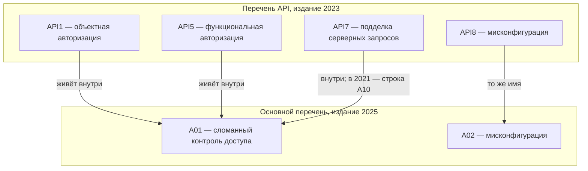

# OWASP API Security Top 10

Вызов `GET /api/orders/10087` с чужим номером в адресе возвращает чужой
заказ, хотя токен настоящий. Вызов `POST /api/admin/users` с обычным
токеном пользователя тоже проходит без единой ошибки. Первый случай
разобран в теме `bola`, второй — в теме `bfla`. У обоих дефектов есть
второй адрес: это первый и пятый риски отдельного перечня рисков для
программных интерфейсов. У интерфейсов собственный список из десяти
позиций, и он не повторяет основной перечень из темы `owasp-top10`.
Держите при чтении один вопрос: номер в списке API и такой же номер в
основном списке — это один риск или два разных?

## Что такое перечень рисков

OWASP — некоммерческий проект, который выпускает открытые документы о
безопасности приложений. С его инструментом вы уже работали: сканер из
темы `zap-scanning` — его разработка. Документы проекта бесплатны, и в
отчётах на них ссылаются как на общий язык. Один из таких документов —
перечень рисков: список того, чем класс систем болеет чаще и больнее
всего. Здесь класс систем — программные интерфейсы.

Риск — не то же самое, что дефект. Дефект — конкретная ошибка в
конкретном коде, например забытая проверка владельца из темы `bola`.
Риск — то, чем дефект грозит: утечка чужих заказов. Бытовой пример —
будильник. Риск «опоздать на поезд» создаёт конкретный дефект,
сломанный будильник; список «десять главных рисков опоздания» расскажет
про будильники вообще, но не про ваш. Перечень говорит о классах
рисков, а чинить приходится дефект, и это различие пригодится в конце
темы.

Список короткий нарочно: десять позиций можно держать в голове целиком.
Он работает как схема метро на стене: показывает, какие станции бывают,
но не учит, где купить билет. Ломается сравнение на точности: линии метро
существуют физически, а строка перечня — усреднение чужого опыта, и в
вашем коде её может не быть вовсе. Каталог на сотни страниц в голове не
удержишь — его открывают по нужде, и у перечня для этого есть страницы
рисков.

**Зачем это в работе AppSec-инженера.** В отчётах о проверках и в
вакансиях риски интерфейсов называют именами и номерами этого перечня.
Кто знает список, слышит за коротким «API5» конкретный класс дефекта —
вызов чужой функции без проверки роли, — а не пустой номер.

## Как это работает

**Откуда это взялось.** Основной перечень писался про веб-приложения:
страницы, формы, браузер. Интерфейсы ломаются теми же способами, но
акценты другие: больше эндпоинтов, больше одновременно работающих
версий, больше доверия к чужим данным. Поэтому внутри OWASP собрался отдельный проект со своим
перечнем. Первое издание вышло в 2019 году, а издание 2023 года его
пересобрало; оно действует на день этой ревизии.

Издание устроено как десять страниц, по одной на риск. У каждого риска
есть номер-адрес: «API1:2023» читается как «первый риск издания 2023
года». Год в номере — не украшение. Следующее издание пересоберёт список,
как уже случилось между 2019 и 2023 годами, и тот же номер назовёт другой
риск. На странице риска — описание, сценарии атаки и рекомендации по
защите: перечень — обложка, а содержание лежит по страницам.

## Десять рисков издания 2023

Вот весь список, у каждого риска — опознавательный признак. Читая,
отмечайте три вещи: какие строки уже разобраны в темах маршрута, где
слияние издания 2023 и что пересекается с основным перечнем.

```text
API1  BOLA — чужой объект по идентификатору (тема bola)
API2  Broken Authentication — подделка или кража входа
API3  свойства объекта без авторизации (слияние двух рисков 2019)
API4  Unrestricted Resource Consumption — дорогой запрос без лимита
API5  BFLA — чужая функция без проверки роли (тема bfla)
API6  Sensitive Business Flows — поток бизнеса без защиты от автомата
API7  SSRF — загрузка по адресу из данных
API8  Security Misconfiguration — настройки и умолчания
API9  Improper Inventory Management — забытые версии и эндпоинты
API10 Unsafe Consumption of APIs — доверие к ответу чужого интерфейса
```

Первая, третья и пятая строки держатся на одном корне: кому что можно.
API1 и API5 вам уже знакомы — это механики тем `bola` и `bfla`. Рядом
стоит вторая строка, и она из другой семьи: про сам вход, то есть про
украденный или подделанный токен и подобранный пароль. Вход разобран на
этапе 1 в темах от `credential-stuffing` до `jwt-attacks`. А третий
риск для издания новый: он сшит из двух позиций 2019 года.

Первая позиция 2019 года — излишнее раскрытие данных. Интерфейс отдаёт
объект с полями, которые экран не показывает, а ответ содержит. Вторая —
массовое присваивание: клиент присылает в объекте поле, которое по
замыслу меняет только администратор, и сервер его принимает. У обеих один
корень — свойства объекта без проверки, — поэтому издание 2023 слило их
в одну строку. Заметьте приём: составители резали по корневой причине,
а не по симптому.

API4 — про цену запроса. Один дорогой вызов, повторённый тысячу раз,
съедает ресурс сервера. Защищает здесь ограничение частоты — тот же
приём, что охраняет вход от подбора пароля в теме `brute-force-defense`.
API7 — подделка серверных запросов: сервер загружает ресурс по адресу
из данных клиента, и эту механику разбирает тема `ssrf-basics`. API8 —
настройки и умолчания: включённый отладочный режим, стандартный пароль.

Девятый риск — учёт того, что у вас есть. Инвентаризация — реестр всего,
чем владеет организация; бытовой пример — список ключей от офиса.
Сотрудник уволился, ключ не сдал: дверь существует, а в учёте её нет. У
интерфейса так выглядит старая версия `v1` рядом с новой `v2`: в старой
нет половины проверок, а атакующий находит её перебором адреса. Забытый
эндпоинт — та же неучтённая дверь. Ломается пример на масштабе: ключ
один и либо сдан, либо нет, а старая версия отвечает тысячам клиентов,
пока её не выключат.

## Два риска, которые читаются не так, как выглядят

Шестой риск — чувствительные бизнес-потоки. Бизнес-поток — цепочка
действий, которая приносит деньги или ценность: оформление заказа,
выдача купона. Как думаете: где здесь дефект, если каждый вызов законен
и работает ровно так, как написан? Дефекта в коде может не быть вовсе.
Вредит размах автомата: бот, скупающий все билеты на концерт за минуту,
не ломает ни одной проверки. Защищают не починкой функции, а компенсацией
— капчей и ограничением частоты. Соседний класс разобран в теме
`business-logic-flaws`: там ломается правило предметной области, а здесь
правило цело, но его давят массой.

Десятый риск переворачивает направление доверия. Весь этап 1 учил не
верить входу — данным клиента. Здесь опасен не вход, а ответ стороннего
сервиса, которому ваш сервер верит больше, чем пользователю. Бытовой
пример — повар, который верит поставщику на слово и не проверяет продукты
на разгрузке. Ломается пример на стабильности: поставщик у повара один
и проверен годами, а сторонний сервис могут взломать, поэтому его ответ
проверяют как пользовательский вход.

Оба риска показывают предел перечня: он называет класс риска и не
подсказывает, где искать его в вашем коде. API6 не находится сканером,
потому что сканеру нечего ломать. API10 живёт на стыке с чужим сервисом,
которого в вашем репозитории нет.

## Чем перечень API отличается от основного

Списки пересекаются, но не совпадают, и номер — самое обманчивое место.
Мисконфигурация есть в обоих перечнях. Подделка серверных запросов тоже
есть в обоих, но в основном перечне отдельной строкой она была только в
редакции 2021. В издании 2025 она влита внутрь сломанного контроля
доступа. А у объектной авторизации, занимающей здесь первое место,
отдельной строки в основном списке нет. Она живёт внутри сломанного
контроля доступа, как показывает маппинг редакций из темы `owasp-top10`.



**Описание схемы.** Схема читается сверху вниз: четыре риска перечня API
вверху и две категории основного перечня внизу. Стрелка показывает, где
живёт риск в основном списке, а подпись на стрелке — как именно. Объектная
и функциональная авторизация живут внутри A01 без своей строки. Подделка
серверных запросов имела отдельную строку A10 только в редакции 2021.
Мисконфигурация сохраняет имя в обоих перечнях.

Теперь ответ на вопрос из вступления: одинаковый номер — разный риск.
Седьмая строка основного перечня издания 2025 — это A07, Authentication
Failures — отказы входа.
По духу это территория соседа API2; у API7 другой предмет. Ответьте, не
сверяясь со списком: отчёт называет находку «API7» — какую страницу вы
откроете? Что сломается, если перепутать её с седьмой строкой основного
перечня? Открыть нужно страницу риска про подделку серверных запросов.
Перепутаете — будете чинить вход там, где его не ломали.

## Как пользоваться перечнем

Перечень — карта для знакомства, а не чек-лист приёмки. Фраза «мы закрыли
все десять» не значит «интерфейс безопасен»: список называет десять
классов, а дыр внутри каждого класса в вашем коде может быть сколько
угодно. Поэтому отчёт строят по находкам, а перечень даёт им имена,
понятные без длинных объяснений.

Дальше дороги расходятся. Механики первого и пятого рисков разобраны и
проверены в темах `bola` и `bfla` — туда же ведёт и починка. Остальные
восемь читаются по страницам издания, когда риск понадобится в работе:
у каждого своя страница со сценариями атаки и рекомендациями. Чинит,
как и в основном списке, не перечень, а дефект под ним.

## Источники

1. OWASP API Security Top 10, издание 2023, титульный лист; реестр
   `owasp-api-top10-2023`. Разделы: рамка издания.
   <https://owasp.org/API-Security/editions/2023/en/0x00-header/>
2. OWASP Top 10 API Security Risks — 2023, список рисков; реестр
   `owasp-api-top10-2023-risk-list`. Разделы: десять рисков с описанием
   каждого, включая происхождение API3 как слияния двух позиций 2019 года.
   <https://owasp.org/API-Security/editions/2023/en/0x11-t10/>

Каркас этапа: этап 5 опирается на открытые документы методов; стендов
нет.

**Скоропортящийся слой.** Издание 2023 — действующее на день ревизии;
следующее издание пересоберёт номера, как это уже случилось между 2019
и 2023 годами.

**Маркеры уверенности.** Состав списка, описания рисков и происхождение
API3 — **по документации** (список рисков издания 2023 открыт лично
2026-09-02; титульный адрес открыт и подтверждает, что списка на нём
нет — поэтому сноска 2 ведёт на страницу списка). Механика API1 и API5
здесь не проверялась: она разобрана и проверена в темах `bola` и `bfla`.
