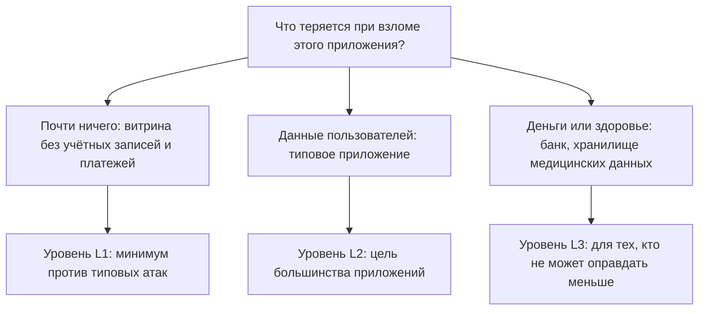
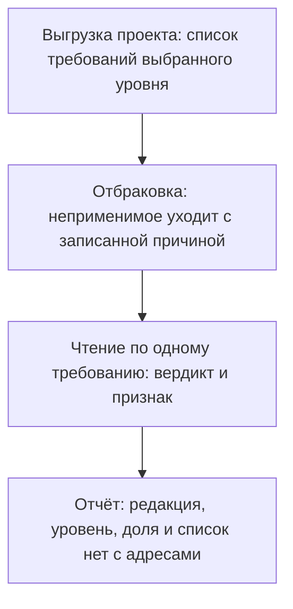

# OWASP ASVS: уровни и использование как чек-листа

Один и тот же пункт стандарта в двух его редакциях, про длину пароля:

```text
v4.0.3, требование 2.1.1: пароль пользователя — не короче 12 символов
v5.0.0, требование 6.2.1: не короче 8, настоятельно — от 15
```

Правило одно, а номер и число разные. Поэтому ссылка «требование 2.1.1»
без версии не указывает ни на что: в одной редакции под этим номером
длина пароля, в другой — другой пункт. Документ называется OWASP ASVS,
и эта тема о том, как им пользоваться, не ошибившись редакцией. Из чего
он собран, как в нём выбирается уровень проверки и как выглядит
проверка приложения по этому уровню. Тексты требований здесь взяты из
самого документа v5.0.0, а не по памяти.

Сама проверка выглядит проще, чем звучит. Вот три её строки из лабы
этой темы: снимок учебной витрины, шесть требований уровня L1. Уровней
в стандарте три, и L1 — минимальный; как они устроены, разбирает
раздел «Как это работает».

```text
6.2.1,нет,минимум шесть символов против требуемых восьми
1.2.4,нет,поиск собран склейкой строк
5.2.1,н/п,файлы от пользователей не принимаются
```

Форма строки — номер, вердикт, признак. По каждой строке видно, что
проверено и на чём основан ответ, и в этой форме стандарт перестаёт
быть документом и становится инструментом. Строка с «н/п» — тоже ответ:
требование к этому приложению не относится, и причина записана рядом с
вердиктом. Три строки здесь — срез, а не целое: в настоящей проверке их
около семидесяти, и читаются они так же, по одной.

## Что такое ASVS

ASVS (Application Security Verification Standard, «стандарт проверки
безопасности приложения») — каталог требований к устройству приложения.
Его выпускает проект OWASP, тот самый, откуда сканер ZAP из этапа 2.
В каталоге 345 требований в семнадцати главах, у каждого требования
номер и уровень. Проверка по такому списку называется прогоном:
требование читается, вердикт записывается вместе с признаком, на котором
видно выполнение.

Зачем нужен такой список, видно из бытового примера — техосмотра
машины. Государство не спрашивает инспектора «хорошо ли он проверил»,
а выдаёт перечень пунктов: тормоза, свет фар, ремни. Инспектор идёт по
перечню и отмечает каждый пункт, поэтому две проверки одной машины у
разных инспекторов сравнимы. Соответствие прямое: перечень — это
каталог требований, инспектор — проверяющий, отметка напротив пункта —
вердикт с признаком. Ломается пример на числе перечней: у техосмотра
список один для всех машин, а в каталоге три уровня, потому что цена
взлома витрины и банка разная.

Эта тема стоит в этапе 5, и он про процессы разработки. Жизненный цикл
приложения от замысла до вывода из эксплуатации по-английски называется
SDLC, и этап показывает, как в него встроена безопасность на каждом
шаге. У проекта OWASP в этом этапе встречаются три документа, и их
путают, потому что названия созвучны. Top 10 — перечень рисков для
разговора о безопасности; его разбирает тема `owasp-top10` дальше по
маршруту. SAMM — модель зрелости процесса: шкала «насколько взросло
выстроена работа», измеряющая процесс, а не приложение; это тема
`owasp-samm`.

ASVS — единственный из трёх список требований, по которому принимают
приложение. Принять по списку — как принять ремонт по акту: не «вроде
всё хорошо», а «розетки работают, краны не текут», и каждый пункт
проверяем. Для мобильных приложений есть родственный стандарт MASVS,
ему посвящена тема `mobile-masvs`.

Сами требования в этой теме не пересказываются: их 345, и читаются они
по месту. Тема закрывает устройство документа — уровни, номера, выбор,
прогон. Поэтому у стандарта своя тема в маршруте и своя лаба: читать
требование с номером и записывать вердикт с признаком — навык, а не
справка.

**Зачем это в работе AppSec-инженера.** На этот стандарт маппится почти
каждая тема гайдбука, и формулировка «ASVS требует» в отчёте обязана
читаться до места и редакции. Прогон по уровню — рабочая форма приёмки:
не «безопасно ли», а «какие требования выбранного уровня не выполнены
и на чём это видно».

## Подумай, прежде чем читать

1. Требование «пароль от восьми символов» перенумеровали между
   редакциями. Что означает ссылка «2.1.1» без версии?
2. Приложение прошло L1. Что это говорит о нём — и чего не говорит?
3. Вердикт «не применимо» дешевле «нет». Кто платит за разницу?

Третий вопрос — про цену прогона, а не про форму. «Н/п» без причины
экономит минуту при записи, а при ревизии, то есть повторной проверке
отчёта, стоит повторного чтения.

## Как это работает

**Откуда это взялось.** Проверка приложения без каталога отвечала на
вопрос «что проверили» по настроению проверяющего: один смотрел пароли,
другой заголовки, и два отчёта об одном приложении не сравнивались.
Каталог требований переводит вопрос на «какие пункты выбранного уровня
выполнены», и ответ становится сравнимым между проверками и между
проверяющими. Уровни появились из-за цены: полный каталог для витрины
и для банка стоит по-разному. Стандарт пишет это прямо, а не делает
вид, что все приложения одинаковы.

### Три уровня

Уровней три, и стандарт сам называет их доли. L1 — около двадцати
процентов каталога, критичные требования первого слоя. L2 вместе с L1 —
около семидесяти процентов, и это цель большинства приложений. L3 —
оставшиеся требования, глубокая защита.

Характер уровня важнее доли. Требования L1 — те, что ломаются без
предусловий: вход без пароля, инъекция склейкой строк, чужая сессия.
Поэтому L1 — минимум, а не «уровень для слабых»: пропущенный пункт
уровня L1 — это открытая дверь, а не недочёт комплектации. При этом
часть требований L1 не читается внешним тестом, то есть проверкой
снаружи, без кода и документации. По одной странице входа не видно,
как хранятся пароли. Стандарт это оговаривает сам. L2 добавляет защиту
от атак реже или сложнее, L3 — глубину вдоль уже закрытых направлений.

### Как устроено одно требование

Семнадцать глав идут по предмету, а не по важности: архитектура,
аутентификация, сессии, доступ, ввод и вывод, хранение, защита данных,
журналирование и так далее. Парольная длина лежит в главе об
аутентификации, а не в «самой главной». Кто ищет по важности, не
найдёт; кто ищет по предмету — найдёт. Поэтому и прогон идёт по списку,
а не по главам на выбор. Глава, которой «у нас нет», всё равно читается
на неприменимость, и эта запись остаётся в отчёте.

Требование внутри главы — строка с четырьмя полями: номер,
формулировка «проверьте, что…», уровень и ссылка на каталог слабостей
CWE (Common Weakness Enumeration, «общий перечень слабостей»). Это
нумерованный каталог видов дефектов вроде «SQL-инъекция», и его вводит
тема `cve-cvss` раньше по маршруту. Он отвечает на вопрос «что это за
дефект», а требование ASVS — «что должно быть сделано». Формулировка всегда проверяемая по форме: «verify that» с
наблюдаемым условием. Именно эта форма делает из каталога чек-лист,
а не свод пожеланий.

Разберём правило из введения целиком, как оно стоит в документе
v5.0.0: «пароли, выбранные пользователем, не короче восьми символов,
при этом настоятельно рекомендуется пятнадцать». Номер 6.2.1, уровень
L1. Чтение по частям: предмет — пароль, выбранный пользователем;
условие — не короче восьми; рекомендация внутри требования —
пятнадцать, и это пожелание, а не обязанность. Вердикт прогона пишется
по условию, а рекомендация в отчёт не попадает. Кто читает требование
«в среднем», тот пишет вердикт «в среднем», и прогон разваливается.
Откройте любое требование главы про сессии и найдите в нём условие и
рекомендацию: по какому из двух пишется вердикт?

### Почему номер без версии ничего не значит

Номер читается как «глава.раздел.пункт» с версией: v5.0-6.2.1 — шестая
глава, второй раздел, первый пункт, редакция 5.0. Редакция — это
выпуск стандарта, как версия программы: раз в несколько лет каталог
пересобирают и выпускают под новым номером. Без версии номер нестабилен
между редакциями, и пара из введения показывает ровно это. Правило про
длину пароля живёт под номером 2.1.1 в редакции v4.0.3 и под номером
6.2.1 в редакции v5.0.0.

Между редакциями v4.0.3 и v5.0.0 поменялась не только нумерация.
Каталог перестроился: главы переименованы и пересобраны, требования
удалены и слиты, доля уровня L1 сокращена сознательно — порог входа
опущен. Та же парольная строка поменяла и число: было двенадцать
символов, стало восемь с рекомендацией пятнадцати. Отчёт по старой
редакции не «устарел на запятую» — он отвечает на другой список
вопросов, и читается только с её именем.

### Как выбирают уровень

Уровень не назначает стандарт: он отдаёт выбор организации, потому что
цена ошибки известна только ей. Выбор делается по анализу рисков и
чувствительности данных. Анализ рисков здесь — два вопроса о своём
приложении: что мы потеряем при взломе и насколько это вероятно.
Стартап с малыми данными начинает с L1, банк не оправдывает меньше L3.



**Описание схемы.** Схема читается сверху вниз. Один вопрос — цена
взлома — раскладывает приложения на три ветки, и каждая ветка
заканчивается своим уровнем: чем дороже ошибка, тем глубже охват.

Практическое правило читается из этих примеров в обе стороны. Уровень
вверх — по требованию наружу: банк и хранилище медицинских данных.
Уровень вниз — по сути содержимого: витрина без учётных записей и
платежей не тащит на себе банковский охват. Оба движения записываются
с причиной: уровень — решение о риске, и у него есть автор.

Стандарт разрешает и форк — копию каталога, подогнанную под свою
область. Форк здесь работает как форк репозитория в git: вы копируете
документ и правите под себя, например выкидываете главу про GraphQL,
если его у вас нет. GraphQL — язык запросов к API: приложение без него
на такие запросы не отвечает, и глава к нему не относится.
Условие одно — прослеживаемость, то есть связь с оригиналом:
пройденное требование 4.1.1 в вашем форке обязано значить то же, что
4.1.1 в исходном документе. Без неё два отчёта по двум форкам не
сравниваются, а весь смысл каталога — в сравнимости.

### Куда ведёт одно требование

У требования есть ссылки наружу: на каталог CWE и на тему гайдбука,
где дефект разобран. Требование 1.2.4 про параметризованные запросы
читается за минуту, а чинится в теме `parameterized-queries`: стандарт
говорит «что», тема говорит «как». Поэтому прогон кончается не
отчётом, а списком адресов: по каждому «нет» — номер требования и
тема, где его чинить.

## Что умеет и чего не умеет

Умеет: дать проверке закрытый список и сравнимый ответ, назначить цену
уровню, работать чек-листом. Есть и второе употребление — основание
для требований при закупке. Когда разработку заказывают на стороне,
пункты каталога вписывают в договор, и пожелание «сделайте нам
безопасно» превращается в проверяемый список. Третье употребление —
рамка для форка — разобрано в предыдущем разделе. В этой теме
разбирается первое, потому что оно — рабочее место читателя.

Не умеет: решить, что приложение безопасно. Выполнение L1 закрывает
пятую часть каталога, и этому посвящён раздел «Частая ошибка». Не
оценивает то, чего в каталоге нет: бизнес-правила, конвейер сборки,
хост. И не заменяет чтение приложения: вердикт без признака — это
мнение.

Про второй предел подробнее, потому что он читается неправильно чаще
всего. Каталог отвечает на типовое — то, что ломается у всех. Правила
вашей предметной области в него не попадут никогда, и стандарт сам
отправляет за ними к модели угроз. Модель угроз — раскладка «что
именно нам грозит», построенная по нашему приложению до начала
проверок; её строит тема `threat-modeling`. Проверка, которая состоит
из одного прогона ASVS, отвечает на половину вопроса.

Третий предел — глубина ответа. Вердикт «да» по требованию означает
«по фактам приложения выполнено», а не «проверено атакой». Каталог не
тестирует, он перечисляет. Поэтому прогон и пентест не заменяют друг
друга: пентест — это проверка, в которой специалист атакует приложение
по-настоящему, с разрешения владельца. Прогон дешевле и шире, пентест
отвечает на «а правда ли» по отдельным местам. Смешение их в одно
слово «проверка» — источник большинства споров о том, что значит
зелёный отчёт.

## Как запустить

Прогон уровня L1 по приложению собирается из четырёх шагов:

1. Возьмите список требований уровня L1: форматы CSV и JSON лежат у
   проекта отдельно от PDF.
2. Отбросьте неприменимое — с записью, почему неприменимо.
3. По каждому требованию запишите вердикт: да, нет, н/п — и признак,
   на чём вердикт видно.
4. Соберите отчёт: доля выполненного и список «нет» с номерами.



**Описание схемы.** Схема читается сверху вниз, по одному проходу на
прогон. Рамка задаётся первым узлом — списком выбранного уровня из
выгрузки проекта. Дальше каждое требование получает вердикт и признак,
а неприменимое — запись с причиной. Финальный узел — отчёт, в котором
список невыполненного уже с адресами починки.

Прогон — это чтение документа по приложению, а не тест: ответ строится
по фактам о приложении, и лаба темы ставит ровно это упражнение.

Четыре шага — ещё и деление труда. Первый и четвёртый делаются один
раз на прогон, второй и третий — по одному разу на требование. Поэтому
прогон не «закрывается за час в целом», а идёт строка за строкой. Его
можно делить между читателями по главам, а не по настроению.

Порядок шагов не случаен. Сначала рамка — уровень и редакция, потом
отбраковка, потом чтение: кто начинает с чтения, читает весь каталог,
а не выбранный уровень. И отчёт пишется по ходу: вердикт, отложенный
«на потом», в итоговый документ не попадает.

Два замечания о шагах. Первый шаг решает больше, чем кажется: список
берётся из выгрузки проекта, а не переписывается из PDF, иначе прогон
начинается с ошибок переноса. Второй шаг — самый спорный: «неприменимо»
без причины читается как пропуск, и в отчёте оно стоит отдельным
списком, а не в общем.

### Чего прогон не требует

Стенда. Прогон уровня L1 идёт по фактам о приложении: как устроен
вход, как собран запрос, что выставляет прокси. Тестирование
требований — вопрос следующий и отдельный. Прогон отвечает «выполнено
ли требование по устройству», и этого достаточно для первого отчёта.

Это отличие стоит назвать прямо, потому что его путают. Прогон
дешёвый и идёт по списку, тестирование дорогое и идёт в глубину.
Отчёт прогона не доказывает, что требование выдержит атаку: он
фиксирует, что мера предусмотрена. Обратное тоже верно: успешная
атака на одно место не говорит ничего о списке из семидесяти
требований.

### Как выглядит список

Выгрузка CSV читается таблицей: номер, глава, формулировка, уровень.
Строка фильтруется по уровню одной командой, и список L1 умещается в
один экран прокрутки. Работа идёт сверху вниз без пропусков.
Пропущенная строка — это вердикт «не смотрел», и в отчёте ей место то
же, что у «н/п» с причиной, — отдельно и поимённо.

По форме выгрузки видно, как стандарт задуман: не документом для
чтения от корки до корки, а списком для работы. PDF отвечает на
«почему», CSV — на «что дальше». Кто читает PDF постранично, тот
делает обе работы одновременно и устаёт раньше, чем дойдёт.

## Как читать вывод

Произведённое прогоном — отчёт о соответствии: по каждому требованию
вердикт и признак. Читается он по строкам «нет» и «н/п»: первое —
работа, второе — проверка обоснования. Строки «да» читаются оптом.
«Н/п» без признака — скрытое «нет», и ревьюер спрашивает именно его.

Доля в отчёте читается против выбранного уровня, а не против каталога.
«Выполнено восемьдесят процентов» без уровня не значит ничего: по L1
это провал, по полному каталогу — сильный результат. Поэтому отчёт
начинается с редакции и уровня, и отчёт без них на ревизию не
принимается. При ревизии — повторной проверке спустя время или после
изменений — отчёт без редакции и уровня не повторить.

Второе чтение — сравнение редакций. Тот же прогон по v4.0.3 и по
v5.0.0 — два разных списка: требования переехали по номерам и
поменялись по содержанию, как длина пароля из введения. Сравнивать
отчёты разных редакций напрямую нельзя: маппинг между ними — работа
отдельная и ручная. Приёмка после смены редакции — это новый прогон,
а не перенос прошлогоднего.

Третье чтение — сам отчёт как документ. Хороший отчёт отвечает на три
вопроса без чтения приложения: какая редакция и уровень, сколько «нет»
и где они, что предлагается с ними делать. Отчёт, который отвечает на
первый вопрос словом «ASVS», не читается: без редакции и уровня у него
нет предмета. Вернуть его на доработку дешевле, чем спорить о
содержании.

Прочитайте по этой мерке три строки из введения. По ним видно редакцию
— требования названы номерами v5.0, и уровень — L1 по списку лабы.
Работа тоже видна: два «нет» с признаками превращаются в задачи с
номерами, а «н/п» — в запись с причиной. Больше от прогона не
требуется; меньше — уже не прогон.

### Сколько стоит прогон

Прогон уровня L1 по приложению размера витрины занимает час чтения.
По живому сервису — день: требований около семидесяти, и у части
вердикт требует кода или конфигурации, а не страницы. Это дешевле
любого другого способа ответить «где мы стоим» и дороже нуля. Поэтому
прогон ставится в календарь, а не делается «когда будет время».

## Границы метода

Граница первая — предметная область. Каталог не покрывает правила
вроде «цена товара не меняется между выбором и оплатой»: они отсутствуют
в нём по определению. Каталог пишется для всей индустрии, а не для
одного приложения. Такие правила рождаются из модели угроз конкретного
приложения, и тема `threat-modeling` идёт по маршруту раньше именно
поэтому.

Вторая граница — слепота внешнего теста: часть уровня L1 не читается
без доступа к коду, и стандарт пишет это сам. Третья — живая редакция.
Стандарт перевыпускается, и прогон по старой редакции отвечает на
старый вопрос. Это не довод «ждать новую»: ответ «мы по v5.0.0,
уровень L1» всегда лучше ответа «мы по ASVS», потому что первый
проверяем, а второй нет.

Четвёртая — язык и общность формулировок. Каталог пишется на
английском и для всех сразу, поэтому формулировки общие. Чтение
требования применительно к вашему приложению — часть прогона, а не его
начало. «Пароль не короче восьми» превращается в вопрос «где у нас
вообще проверяется длина» только в голове проверяющего.

Пятая — глубина вердикта «да». Требование выполнено по устройству, а
не по стойкости: тип содержимого выставлен — это «да». Выдержит ли
мера обход — другой вопрос, и отвечает на него тестирование, а не
прогон. Поэтому отчёт прогона честно называется отчётом о
соответствии, и слово «соответствие» в нём работает. Кто читает его
как «безопасно», переписывает смысл документа и отвечает за это перед
тем, кто его подпишет.

## Частая ошибка

Приложение прошло уровень L1 — можно ли подписывать «безопасно»?
Подписать хочется: приложение прошло L1, значит, оно безопасно.

**L1 — это пятая часть каталога, а не оценка.** Механизм из раздела
«Как это работает»: уровень отвечает на вопрос «какие требования
выполнены», и ответ читается вместе с долей охвата.

Контрпример: витрина из лабы проходит транспортный заголовок и тип
содержимого и проваливает парольную длину и параметризацию запросов.
«Частично выполнен L1» — честный вердикт; «прошла L1» — нет. Вторая
форма той же ошибки — «мы на L3». Уровень не награда, а охват:
приложение с полным L3 и дырой в бизнес-правиле остаётся уязвимым
ровно в ней.

## Чеклист для ревью

1. Проверьте, что у прогона названы редакция и уровень — с версией,
   а не «по ASVS».
2. Проверьте, что каждый вердикт несёт признак, а «н/п» — причину
   неприменимости.
3. Проверьте, что уровень выбран по риску приложения, а не по
   доступности времени.
4. Проверьте, что список «нет» превращён в задачи с номерами
   требований.
5. Проверьте, что форк стандарта прослеживаем: пропущенные главы
   названы.
6. Проверьте, что прогон повторяем: по нему отвечает второй читатель
   тем же ответом.
7. Проверьте, что у отчёта есть дата и он пересматривается после
   смены редакции стандарта.
8. Проверьте, что по каждому «нет» назван адрес починки — тема или
   задача.

## Попробуй сам

Лаба `lab-owasp-asvs`, каталог `pilot/lab/owasp-asvs`. Формат — задача
чтения: сети и стенда нет, из зависимостей — Python и PyYAML.

**Цель одной фразой:** добиться, чтобы `pilot/lab/owasp-asvs/check.py`
вышел с кодом 0.

По снимку учебной витрины из файла `app.md` каждому из шести
требований уровня L1 проставляется вердикт и признак. Текст требований
берётся из документа по адресу в блоке «Источники». Секции «Запуск»,
«Сброс» и «Удаление» — в `README.md` каталога.

Бланк повторяет блок «Как запустить» в миниатюре: шесть строк вместо
семидесяти, но форма та же. Вердикты в снимке неоднообразны нарочно:
есть и «да», и «нет», и «н/п». Прогон, который отвечает одинаково на
всё, — не прогон, а привычка.

Подсказка одна: читайте требование и снимок по очереди — сначала что
требует стандарт, потом что известно о витрине.

**Отдельная задача «почини».** Вердикт без признака проверялка не
принимает — это и есть дисциплина прогона. Найденное «нет» по запросам
чинится в теме `parameterized-queries`.

Решение — `solution.csv` в том же каталоге, открыто без условий. Оно
показывает форму, а не букву: у читателя свои признаки.

## Проверь себя

1. Две строки из чужого прогона уровня L1:

   ```text
   3.4.1,да,заголовок есть
   5.2.1,н/п,
   ```

   Оба вердикта по форме допустимы. Что скажет ревьюер каждой строке?

2. Требование «пароль от восьми символов» перенумеровали между
   редакциями. Почему ссылка «2.1.1» без версии ничего не значит?

3. В бланке лабы `pilot/lab/owasp-asvs` строка заполнена верным
   вердиктом, но без признака:

   ```text
   3.4.1,да,
   ```

   Что ответит `check.py` по этой строке?

4. Назовите три уровня стандарта и чем они отличаются по охвату.

5. Возврат к теме `parameterized-queries`: строка прогона «1.2.4, нет,
   поиск собран склейкой строк». Как этот дефект выглядит в коде и чем
   он закрывается?

6. Возврат к теме `threat-modeling`: прогон отвечает «какие требования
   выполнены». Какой вопрос о приложении остаётся без ответа и чем он
   закрывается?

<details markdown="1">
<summary>Ответ 1</summary>

1. Первая строка: признак «заголовок есть» не говорит, на чём видно, —
   какой заголовок, где смотрели; вердикт без наблюдаемого признака —
   мнение. Вторая: «н/п» без причины неотличимо от спрятанного «нет», и
   ревьюер читает его как долг — причина пишется рядом с вердиктом.

</details>

<details markdown="1">
<summary>Ответ 2</summary>

2. Под одним номером в разных редакциях живут разные требования: длина
   пароля — 2.1.1 в v4.0.3 и 6.2.1 в v5.0.0, с разным числом. Без версии
   ссылка указывает в оба места разом, то есть никуда; поэтому номер
   печатается с версией: v5.0-6.2.1.

</details>

<details markdown="1">
<summary>Ответ 3</summary>

3. Одна жалоба по строке: «3.4.1: признак пуст» — сам вердикт «да»
   эталону соответствует, а строка всё равно не засчитана: вердикт без
   признака не принимается. Прогон: `cd pilot/lab/owasp-asvs && python3
   check.py` после такой правки бланка.

</details>

<details markdown="1">
<summary>Ответ 4</summary>

4. L1 — около пятой части каталога, критичное и первый слой. L2 — с ним
   вместе около 70 процентов, цель большинства приложений. L3 —
   оставшееся: глубокая защита для тех, кто не может оправдать меньше.

</details>

<details markdown="1">
<summary>Ответ 5</summary>

5. Запрос собран конкатенацией с вводом пользователя — ввод меняет текст
   запроса, и база исполняет чужое. Закрывается параметризованным
   запросом: данные передаются отдельно от текста. Это и есть работа по
   строке «нет»: номер требования плюс тема, где чинить.

</details>

<details markdown="1">
<summary>Ответ 6</summary>

6. «Что нам грозит»: каталог отвечает на типовое, а правила вашей
   предметной области в него не попадут никогда. Закрывается моделью
   угроз из темы `threat-modeling` — и она идёт раньше прогона.

</details>

## Источники

1. OWASP ASVS, страница проекта; реестр `owasp-asvs-5`. Разделы: назначение
   стандарта, форматы выгрузок.
   <https://owasp.org/www-project-application-security-verification-standard/>
2. OWASP ASVS v5.0.0, документ целиком (PDF по тегу v5.0.0); реестр
   `owasp-asvs-5-document`. Разделы: уровни верификации, «Which level to
   achieve», структура, форк.
   <https://github.com/OWASP/ASVS/raw/v5.0.0/5.0/OWASP_Application_Security_Verification_Standard_5.0.0_en.pdf>

Каркас этапа: этап 5 опирается на открытые документы методов; стендов
нет.

**Скоропортящийся слой.** Тексты и номера требований — свойство редакции:
v5.0.0 зафиксирована тегом, и номера в теме читаются от неё. Доли уровней
в следующей редакции проверяются заново.

**Маркеры уверенности.** Уровни, доли, правило выбора, формат номера,
форк и его прослеживаемость, форматы выгрузок — **по документации**
(документ v5.0.0 открыт лично 2026-09-01 и читался по тексту; страница
проекта — тот же день). Пара из введения сверена по обоим текстам: 2.1.1
в v4.0.3 и 6.2.1 в v5.0.0. Лаба прогнана лично 2026-09-01 и повторно
2026-10-03: пустой бланк даёт расхождения по всем шести строкам, эталон
— «зачтено», строка с пустым признаком — одна жалоба «3.4.1: признак
пуст».
