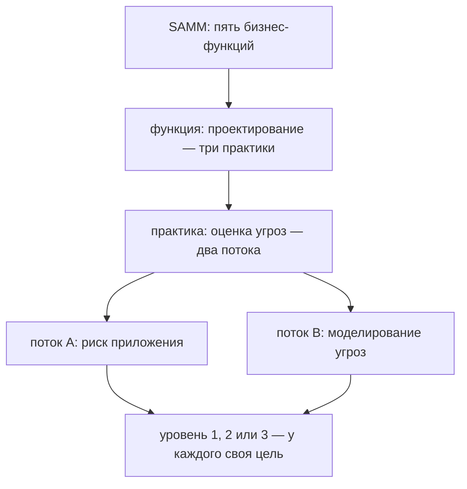

# OWASP SAMM: функции, практики, уровни зрелости

Представьте встречу, на которой руководитель спрашивает команду: «Насколько
безопасно мы разрабатываем?» Программист отвечает, что в конвейере стоят два
сканера. Тестировщик вспоминает, что требования к защите никто не проверяет.
Оба ответа правдивы, а решения из них не следует: непонятно, куда вкладывать
деньги. Ответа «на троечку из пяти» здесь не бывает, потому что безопасная
разработка состоит из многих разных занятий, и у каждого своё состояние.
Измерить такое помогает модель зрелости: она раскладывает процесс на занятия,
ставит каждому ступень, а отвечает срезом таблицы:

```text
Governance       — обучение и метрики:       уровень 1
Design           — оценка угроз:             уровень 0
Verification     — тестирование требований:  уровень 2
```

Форма здесь важнее чисел: уровень стоит у практики, а не у команды в целом.
Ноль — отдельная отметка «занятия нет вовсе»: он стоит до первой из трёх
ступеней. Строка с нулём читается как адрес: у неё есть первый шаг, и именно
этим профиль, то есть таблица по строкам, отличается от отметки. Вопрос к
таблице: у какой строки следующий шаг ясен сразу, и что понадобится, чтобы
назвать шаг у двух остальных?

## Что такое модель зрелости

Сначала о том, что модель измеряет. Программа живёт циклом: требования,
проектирование, код, проверка, эксплуатация. Такой путь называется жизненным
циклом разработки, по-английски SDLC. С конца этого пути вы уже знакомы:
этап 3 рассказывает про конвейер, который собирает и проверяет каждое
изменение. Цикл похож на стройку: сначала проект, потом фундамент и стены,
потом дом сдают жильцам. Безопасная разработка означает, что на каждой
стадии есть своя защитная работа, а не одна проверка в самом конце.

Теперь к вопросу со встречи: насколько хорошо эта защитная работа поставлена?
Ответить нечем, пока непонятно, по чему мерить. Модель зрелости и есть такая
мерка. Это документ, который раскладывает процесс на отдельные занятия. Для
каждого занятия описано несколько ступеней: от «не делаем вообще» до «делаем
регулярно и проверяем результат». Зрелость здесь не про возраст: занятие либо
случается случайно, либо повторяется по понятным правилам.

Бытовой пример — кухня кафе. На первой ступени повар моет руки, когда
вспомнит. На второй на стене висит инструкция, когда и как мыть. На третьей
инструкцию проверяют и переписывают, когда меняется меню. Ступень
соответствует уровню зрелости, инструкция — записанному описанию занятия, а
её проверка — измерению результата. Ломается аналогия на предмете: на кухне
меряют гигиену, а в разработке — занятия безопасности, и ступеней у модели
из этой темы ровно три.

Одна из таких моделей называется SAMM — Software Assurance Maturity Model,
модель зрелости защищённости разработки. Её ведёт одноимённый проект внутри
OWASP, и тема написана по версии 2.0. Проект сам называет три свойства
модели: измеримая, применимая, не зависящая от технологии и процесса.
Измеримая значит, что ступень читается по описанию, а не по ощущению.
Применимая значит, что из ответа виден следующий шаг. А независимость
означает: в модели нет ни слова про языки и методологии, и она подходит и
банку, и игровой студии.

**Зачем это в работе AppSec-инженера.** Разговор «надо больше безопасности»
без общего словаря кончается бюджетом ни на что: каждый понимает фразу
по-своему. Самооценка по практикам даёт ответ, по которому строится следующий
шаг. А дальше по маршруту тема `secure-sdlc` соберёт из уровней приоритет
гейтов в конвейере.

## Как это работает

**Откуда это взялось.** Вопрос «безопасны ли мы» не имеет ответа без
основания, по которому мерить. Модель зрелости отвечает таким основанием:
процесс разложен на занятия, у каждого занятия есть ступени, и ответ читается
построчно. Исходную модель написал Правир Чандра в 2009 году. Версию 2.0
пересобрало сообщество, и живёт она отдельной страницей модели: на главной
странице проекта ни функций, ни практик не перечислено, там приглашение к
самооценке.

Первый этаж модели составляют пять бизнес-функций. Функция — крупная область
ответственности, и вместе они покрывают весь цикл разработки. Управление
(Governance): стратегия, метрики и обучение людей. Проектирование (Design):
то, как систему задумали, её угрозы и требования к защите. Реализация
(Implementation): то, как пишется и собирается код. Проверка (Verification):
то, как готовое испытывают. Эксплуатация (Operations): то, как система живёт
в работе, включая ответ на инциденты.

Внутри каждой функции три практики, всего пятнадцать. Практика — конкретное
занятие, которое можно наблюдать и оценивать отдельно. Например, в
проектировании есть практика «оценка угроз». Занятие редко одномерно, поэтому
на следующем этаже стоят потоки, и их два: A и B. У оценки угроз поток A —
это оценка риска приложения, а поток B строит модель угроз: диаграмму потоков
данных и реестр угроз из темы `threat-modeling`. Оценивать потоки вместе
нельзя: команда может считать риск и при этом не строить модель угроз.

На последнем этаже — уровни зрелости. У каждой практики их три, и у каждого
на странице практики сформулирована цель: короткое описание, как выглядит
занятие на этой ступени. Уровень читается только по цели, потому что название
содержания не несёт. Отсюда форма ответа модели — профиль, таблица строк
«функция, практика, уровень», как во вступлении.



**Описание схемы.** Схема читается сверху вниз и показывает вложенность
модели на одной ветви. Пять функций равноправны, и раскрыта одна из них —
проектирование. У практики оценки угроз два потока, и уровень записывается
по каждому потоку отдельно, а не по практике целиком.

Ответ модели — профиль, а не число. Среднее по практикам стирает ровно то,
ради чего делалась раскладка. Слабое проектирование при сильном тестировании
превращается в «уровень полтора», и оба разных следующих шага теряются. Шаг
живёт у конкретной строки, а у среднего числа шага нет.

## Что умеет и чего не умеет

Модель умеет три вещи. Во-первых, дать самооценке основание: «где мы»
собирается по пятнадцати практикам, а не по настроению на встрече. Во-вторых,
показать следующий шаг по каждой строке: цель следующего уровня написана на
странице практики. В-третьих, сравнить команды одним словарём: две команды,
оценившие себя по одной модели, говорят об одних и тех же занятиях.

Трёх вещей модель тоже не умеет. Она не измеряет безопасность продукта,
потому что описывает процесс: высокий уровень практики не обещает, что в
приложении нет дыр. Она не даёт честного сравнения с чужими ответами:
самооценку пишут свои, и сравнение упирается в их честность. И она не
выбирает практики под ваш риск: этот выбор делает моделирование угроз из
темы `threat-modeling`.

Не спутайте модель с соседней темой `owasp-asvs`, которую вы уже прошли.
ASVS (Application Security Verification Standard) — перечень требований
к самому приложению, и проверка по нему смотрит на продукт. SAMM смотрит на
процесс команды, и это разные вопросы.

## Как запустить

Самооценка делается в три хода. Сначала прочитайте пятнадцать практик по
страницам модели и отметьте, какие из этих занятий в вашем процессе вообще
есть. Затем по каждой практике запишите уровень — по цели уровня со страницы,
а не по ощущению. Ощущение сравнивает с тем, «как у всех», а цель — с
описанием ступени. В конце соберите профиль по функциям и назовите по одному
следующему шагу на каждую слабую строку.

На входе здесь знание своего процесса, на выходе профиль и список шагов.
Цена честного прогона — полдня, и не в одиночку, а с теми, кто процесс
делает. Самооценка одного человека читается как угаданная. Уровень
проверяется по цели, а цель — по тому, как работа выглядит на самом деле;
как она выглядит, знает тот, кто её выполняет.

## Как читать вывод

Результат самооценки — профиль: функция, практика, уровень. Читается он по
строкам с нулём и по разбросу. Строка с уровнем 0 здесь самая адресная: у неё
понятный первый шаг, и именно за этим профиль собирался. Разброс внутри одной
функции говорит о другом: практика живёт на одном человеке. Уровень, который
переживает уход человека, записан и разделён командой, а разделённая практика
тянет вверх соседние строки. Одинокий высокий уровень при нулях рядом
разделённым быть не может, значит, у него один носитель. Уровень без носителя
не переживает ухода этого человека, поэтому такая строка — сама по себе риск.

Второе чтение — по потокам. Уровень практики, у которой один поток закрыт, а
второй пуст, состоит из двух разных готовностей, и записываются они
раздельно: «половины уровня» в модели нет. Третье чтение — подозрительное.
Профиль, в котором все строки одинаковы, говорит, что практики оценивали по
названию, а не по цели. У живого процесса есть сильные и слабые места, и
ровной линии почти не бывает.

## Границы метода

Первая граница: самооценка отвечает на вопрос «что мы делаем», а не «хватает
ли этого», потому что модель не знает вашего риска. Честный профиль не
обещает, что процесса достаточно для вашего продукта: вопрос достаточности
решает анализ рисков. Вторая граница: сравнимость. Числа разных команд равны
ровно настолько, насколько честны отвечающие. Внешняя проверка, где ответы
сверяет независимый человек, — отдельная работа с отдельной ценой.

Третья граница: модель не говорит, как делать практику. Уровень называет
только цель, рецепта в нём нет. Рецепты живут в темах этапов 2 и 3, где
разобраны инструменты и конвейер. Модель показывает место этих занятий в
общей картине и то, какого занятия в картине не хватает.

## Частая ошибка

До чтения ответа проверьте себя: уровень 1 из трёх у практики — это плохо,
хорошо или вообще не оценка?

Единица звучит как плохая отметка за контрольную. Отсюда вывод, который
делают часто: уровень зрелости — это оценка команде, и чем выше, тем лучше.

**Уровень — это адрес следующего шага, а не отметка.** Механизм из раздела
«Как это работает»: практика читается по цели уровня, и ответ «мы на двойке»
без чтения цели не значит ничего. У двойки, прочитанной по цели, есть
содержание и следующий шаг. У двойки-отметки нет ни того ни другого.

Контрпример. Команда прочитала уровни как баллы и «подняла» слабые строки
переименованием занятий под формулировки целей. Профиль вырос, а процесс —
нет. Через год самооценка повторилась с тем же результатом и нулевой ценой:
честного разговора не случилось ни в первый, ни во второй раз.

## Чеклист для ревью

Профиль, принесённый на ревью, проверяется шестью пунктами:

1. Проверьте, что уровень каждой практики записан по цели уровня с примером,
   а не по ощущению.
2. Проверьте, что потоки A и B оценены раздельно, а не усреднены.
3. Проверьте, что у слабых строк назван следующий шаг, а не «усилить».
4. Проверьте, что профиль пересматривается по дате, а не по запросу сверху.
5. Проверьте, что самооценка писалась с теми, кто процесс делает.
6. Проверьте, что профиль не сведён к одному числу.

## Попробуй сам

Возьмите пять функций модели и оцените по ним процесс, который вы знаете:
свой проект или учебный конвейер этапа 3. По одному уровню на функцию, и у
каждого уровня нужен пример, который его обосновывает.

Одна подсказка: читайте цель уровня на странице практики, а не название
уровня, потому что название содержания не несёт.

**Критерий выполнения** наблюдаемый: пять строк с уровнем и примером у
каждой, а у слабейшей строки есть следующий шаг, сформулированный действием.

## Проверь себя

1. Строка чужого профиля:

   ```text
   Design — оценка угроз
     поток A (риск приложения):     уровень 2
     поток B (моделирование угроз): уровень 0
     итог по практике:              уровень 1
   ```

   Что в этой записи не так?

2. Почему профиль, в котором все строки одинаковы, читается как
   подозрительный?

3. Кто-то всё же усреднил потоки одной командой:

   ```bash
   python3 -c "print((2 + 0) / 2)"
   ```

   Что получится и почему модель такой строки не пишет?

4. Возврат к теме `quality-gates`: профиль дал практике проверки уровень
   ноль, следующий шаг назван «гейт на новые находки». Что такой гейт
   делает со сборкой и как записывается его решение?

5. Возврат к теме `threat-modeling`: поток B практики оценки угроз —
   моделирование угроз. Что он производит и на какой стадии?

<details markdown="1">
<summary>Ответ 1</summary>

1. Итога «уровень 1» не бывает: потоки оцениваются раздельно, и половины
   уровня не существует. Усреднение прячет пустой поток B, а следующий
   шаг практики лежит именно в нём: риск приложения оценивают, модель
   угроз не строят.

</details>

<details markdown="1">
<summary>Ответ 2</summary>

2. У живого процесса есть сильные и слабые места. Ровная линия означает,
   что практики читали по названию, а не по цели уровня на странице
   модели: при чтении по цели одинаковых строк почти не выходит.

</details>

<details markdown="1">
<summary>Ответ 3</summary>

3. Напечатает `1.0` — команда честно считает среднее (прогон повторён
   2026-10-03, Python 3.14.7). Модель такой строки не пишет: уровень
   читается как адрес следующего шага, а у среднего шага нет. Шаг живёт
   у пустого потока.

</details>

<details markdown="1">
<summary>Ответ 4</summary>

4. Гейт останавливает сборку при превышении порога, и решение
   записывается кодом возврата шага: 0 — порог не превышен, 1 — сборка
   остановлена, 2 — проверка не отработала. Конвейер не читает отчёты,
   он складывает коды, поэтому «гейт», который всегда зелёный, — это фон.

</details>

<details markdown="1">
<summary>Ответ 5</summary>

5. Диаграмму потоков данных с границами доверия и реестр угроз с
   ответами. Строится на стадии дизайна, до кода: там дефект дизайна
   чинится строкой в документе, а не исправлением в проде.

</details>

## Источники

1. The Model, OWASP SAMM; реестр `owasp-samm`. Разделы: пять функций и
   пятнадцать практик списком; ссылка на PDF всей модели.
   <https://owaspsamm.org/model/>
2. What is OWASP SAMM?, страница проекта; реестр `owasp-samm-about`.
   Разделы: миссия и три свойства модели.
   <https://owaspsamm.org/about/>

Каркас этапа: этап 5 опирается на открытые документы методов; стендов
нет.

**Скоропортящийся слой.** Модель перевыпускается (тема написана по
v2.0); названия функций и практик при ревизии сверяются со страницей
модели, а уровни — со страницами практик.

**Маркеры уверенности.** Пять функций, пятнадцать практик, устройство
уровней и потоков, три свойства модели — **по документации** (обе
страницы открыты лично 2026-09-01; устройство потоков сверено по
странице практики оценки угроз). Самооценка на живом процессе автором не
проводилась — предмет подтверждён документами, не практикой. Прогон из
третьего вопроса самопроверки повторён 2026-10-03 на Python 3.14.7:
вывод совпал.
