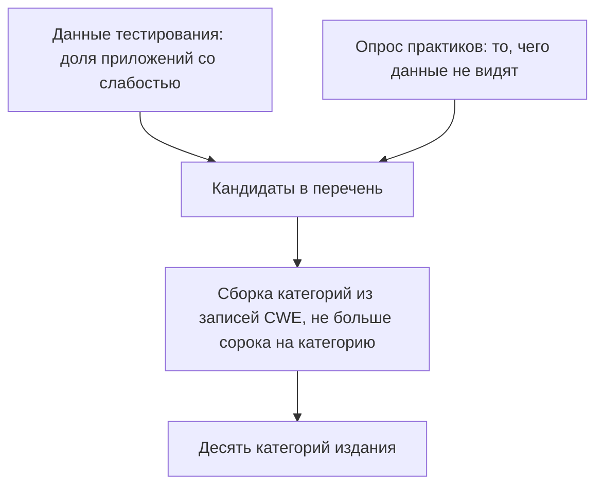
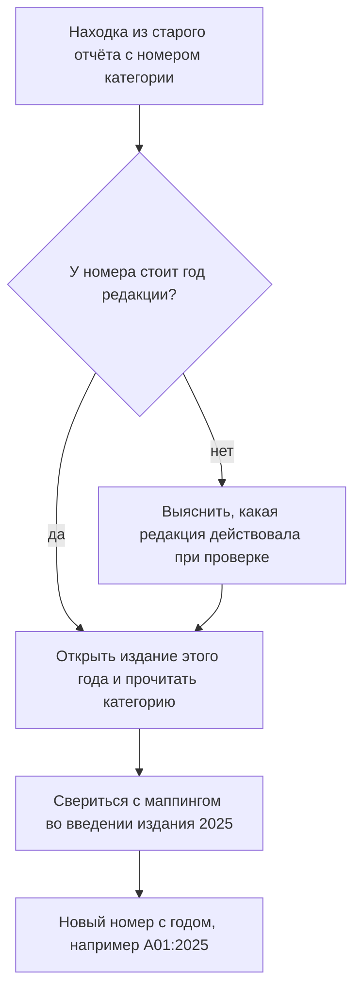

# OWASP Top 10: маппинг редакций 2021 и 2025

Отчёт о проверке четырёхлетней давности заканчивается строкой «критично:
A10:2021». Чтобы понять, что тогда чинили и что из этого живо до сих пор,
вы открываете действующее издание перечня и ищете знакомый номер:

```text
A01:2025 Broken Access Control
A02:2025 Security Misconfiguration
A03:2025 Software Supply Chain Failures
...
A10:2025 Mishandling of Exceptional Conditions
```

Категории про подделку серверных запросов, которую издание 2021 года звало
A10, в этом списке нет, и это не опечатка. Между редакциями перечень
перестроили: подделку серверных запросов влили в A01:2025, а номер A10:2025
заняла новая категория про то, как программа ведёт себя при сбоях. Тот, кто
читает номер без года, в половине случаев попадает не туда. При этом
соответствие старых номеров новым выдумывать не надо: его напечатал сам
проект во введении к изданию 2025. Цена у такой путаницы конкретная:
находке ставят чужой адрес, и чинить начинают не тот риск.

## Что такое OWASP Top 10

OWASP — открытый проект о безопасности приложений; его сканер ZAP разбирала
тема `zap-scanning` этапа 2. Проект выпускает документы, которыми индустрия
пользуется как общими: перечни рисков, каталоги требований, шпаргалки. Один
из них — перечень Top 10, список из десяти категорий рисков веб-приложений.
Раз в несколько лет перечень перевыпускают, и каждое перевыпускание
называется редакцией или изданием. Издание 2025 года — восьмое по счёту.

Категория в перечне — класс дефектов с общей природой, а не одна конкретная
дыра. Например, категория Injection собирает все случаи, где присланные
снаружи данные становятся командой для базы или системы. Поэтому номер
категории — это адрес класса: сказать «A05:2025» значит указать на инъекцию
вообще, не называя конкретного места в коде.

Зачем нужен такой список, видно по аналогии с медицинским классификатором
болезней. Врачи разных больниц записывают один диагноз одним кодом, поэтому
их отчёты сравнимы между собой. Соответствие такое.

| Классификатор болезней | Перечень Top 10 |
|---|---|
| код диагноза | номер категории |
| врачи разных больниц пишут один диагноз одним кодом | ревьюер и разработчик называют один риск одним номером |
| новое издание классификатора | новая редакция перечня |

Аналогия ломается на лечении. Классификатор не говорит, как лечить, и
перечень не говорит, как чинить. Рекомендации живут на странице каждой
категории, а приёмку ведут по каталогу требований — тема `owasp-asvs`.

Цена у общего списка одна, и она — предмет этой темы. Список переиздаётся,
и редакции расходятся: номер, напечатанный без года, указывает на разные
риски в разных изданиях. Поэтому номер пишется с годом всегда: A05:2021 —
это Security Misconfiguration, а A05:2025 — Injection. У отдельного класса
приложений есть свой перечень: про API рассказывает тема `owasp-api-top10`,
она идёт дальше по маршруту.

**Зачем это в работе AppSec-инженера.** На собеседовании и в отчёте
категорию называют номером, и под одним номером в разных редакциях живут
разные риски. Перечитать чужой отчёт 2022 года или ответить «у нас закрыт
Top 10» можно, только зная, какая редакция имеется в виду и куда переехала
каждая строка.

## Как это работает

**Откуда это взялось.** Разговору о рисках нужен общий список имён:
«инъекция», «сломанный доступ», «мисконфигурация». Без списка каждый отчёт
говорит на своём языке, и сравнить две проверки разных лет нельзя. Перечень
Top 10 такой список и даёт.

Как составители выбирают, что войдёт в десятку? У списка два источника, и
введение к изданию 2025 описывает оба. Первый — данные тестирования: сколько
приложений из проверенных содержали хотя бы одну слабость категории. Восемь
категорий из десяти пришли оттуда. Второй — опрос практиков: туда попадает
то, что данные не видят, потому что тестировать это в массе ещё не
научились. Похоже на экзамен: статистика ответов показывает, на каких
задачах падают все, а опрос преподавателей добавляет то, что экзамен
проверить не умеет. Сходство ломается в одном месте: опрос преподавателей
ничего не меняет в самом экзамене, а опрос практиков добавляет категории
в перечень наравне с данными.

Каждая категория собирается из записей каталога слабостей CWE, с которым вы
уже встречались. Запись в нём называет класс слабости, например «внедрение
SQL» вообще, а не одну конкретную дыру. На категорию стоит потолок в сорок
записей, чтобы она не расползалась. В разборе издания 2025 участвовали 589
записей, внутрь десяти вошли 248.



**Описание схемы.** Схема читается сверху вниз. Два источника, данные и
опрос, дают кандидатов в перечень. Кандидаты собираются в категории по
записям каталога CWE, и на категорию стоит потолок в сорок записей. Результат
сборки — десять категорий издания.

Правило сборки названо во введении прямо: корневая причина важнее симптома.
Симптом — то, что видно снаружи, а причина — то, что чинят. Бытовой пример —
лужа на кухне: вытереть её можно каждый день, но это не чинит течь в трубе.
Поэтому в списке есть Cryptographic Failures, а не «утечка данных»: утечка —
симптом, слабая криптография — причина. Поэтому же подделка серверных
запросов перестала быть отдельной строкой: составители решили, что её
корень — сломанный контроль доступа, и место ей внутри A01:2025. Сама
механика такого доступа разобрана в теме `access-control-models`, а подделка
запросов — в `ssrf-basics`; здесь они не повторяются.

## Что изменилось в издании 2025

Соответствие старых номеров новым называется маппингом, и строить его
самостоятельно не нужно: таблица напечатана самим проектом во введении к
изданию 2025. Вот она:

```text
A01:2021 → A01:2025  Broken Access Control; сюда влит A10:2021
A02:2021 → A04:2025  Cryptographic Failures
A03:2021 → A05:2025  Injection
A04:2021 → A06:2025  Insecure Design
A05:2021 → A02:2025  Security Misconfiguration
A06:2021 → A03:2025  Vulnerable and Outdated Components расширены до
                     Software Supply Chain Failures
A07:2021 → A07:2025  Identification and Authentication Failures
                     переименованы в Authentication Failures
A08:2021 → A08:2025  Software and Data → Software or Data Integrity
A09:2021 → A09:2025  Logging and Monitoring → Logging and Alerting:
                     акцент перенесён на оповещение
A10:2021 → A01:2025  SSRF отдельной строкой больше нет
новое    → A10:2025  Mishandling of Exceptional Conditions (24 CWE)
```

Внутри таблицы три движения, и читать их надо раздельно. Перестановка — та
же категория на другом месте: Security Misconfiguration поднялась с пятого
номера на второй, Injection опустилась с третьего на пятый. Переименование —
тот же предмет под точным именем: A09:2025 говорит про оповещение, а не про
наблюдение, потому что журнал без реакции на него атаку не останавливает.
Как строить журналирование и оповещение, рассказывает тема `security-logging`
дальше по маршруту. Изменение состава — слияние или расширение: A03:2025
шире, чем A06:2021, а от A10:2021 осталась часть другой категории.

Три движения запоминаются через реорганизацию офиса. Соответствие такое.

| В офисе | В перечне |
|---|---|
| команда переехала на другой этаж | перестановка: та же категория на другом номере |
| команда сменила вывеску, люди те же | переименование: тот же предмет под точным именем |
| команду поглотила другая | слияние: строку влили в другую категорию |
| к команде присоединили соседний отдел | расширение: строка стала шире |
| команда набрана с нуля | новая категория |

Аналогия ломается на составе. У переехавшей команды люди прежние, а у «той
же» категории набор записей CWE в новой редакции другой. Поэтому и
неподвижная строка не буквально та же.

Две новые категории стоит назвать по именам. A03:2025 Software Supply Chain
Failures расширила старую строку про уязвимые компоненты на всю цепочку
поставки. Что такое цепочка поставки и как она ломается, разобрано в теме
`supply-chain-threats` этапа 2. A10:2025 Mishandling of Exceptional
Conditions собрала 24 записи CWE про неверную обработку сбоев.

Исключительная ситуация — событие, которого программа не ждала: отвалилась
база, истёк таймаут, кончилось место на диске. Неверная обработка — когда
программа при сбое пропускает действие без проверки, показывает пользователю
внутренности ошибки или продолжает работу с битыми данными. Бытовой пример —
терминал оплаты, который при потере связи с банком «продаёт» без списания:
магазин узнает об этом в конце дня.

Перечень говорит про классы дефектов, а не про конкретные дыры. Поэтому и
эта тема — про язык, на котором договариваются о таких классах, а механика
каждого класса живёт в своей теме маршрута.

## Как это выглядит в коде

Категория в коде не видна: виден конкретный дефект, и категория — его адрес
в общем списке. Читая такой код, ревьюер задаёт два вопроса: откуда пришёл
адрес объекта и спрошен ли владелец. Найдите оба ответа сами во фрагменте
обработчика из темы-предпосылки, прежде чем читать разбор:

```python
# УЯЗВИМО — демонстрация, не для продакшена
@app.route("/invoices/<int:invoice_id>")
def invoice(invoice_id):
    return read_invoice(invoice_id)  # чей счёт — не спрошено
```

Адрес объекта пришёл из строки запроса, то есть от клиента, а владелец не
спрошен вовсе: номер счёта подставляется в чтение напрямую. В обеих редакциях
это A01, Broken Access Control. Разбор механики — в `access-control-models`,
здесь важно другое: фраза «A01:2025» в отчёте указывает ровно на такой код,
и найти его можно, только зная, что искать. Категория без умения увидеть
дефект в строке — список слов.

Обратный переход тоже рабочий. Ревьюер, нашедший такой обработчик, называет
находку «A01:2025» — и этим ставит её в общий реестр, где её поймут без
чтения кода. С годом у номера коллега откроет нужное издание, а без года
останется угадывать.

## Как защититься

Сам перечень не чинится: чинится дефект под строкой перечня. Поэтому защита
здесь — это дисциплина ссылок и переносов, а не один большой ремонт.

Первое правило — печатать номер категории с годом редакции, в отчёте, в
задаче трекера и в устном разборе. Второе — читать страницу категории в
издании этого года: там рекомендации по защите и список записей CWE, из
которых категория собрана. Третье — чинить дефект по его теме, а не по
заголовку перечня. Сломанный доступ чинится проверкой прав на объект, тема
`access-control-models` и дальше подраздел 1.1. Инъекция чинится
параметризацией запроса, тема `parameterized-queries`.

Старые отчёты не перепроверяют заново, их переносят по маппингу введения
издания 2025. Возьмём строку «средне: A02» без года: прежде чем искать
рекомендации, придётся выяснить, какая редакция действовала при проверке,
потому что одного номера мало. Порядок переноса такой:



**Описание схемы.** Схема читается сверху вниз. У находки сначала проверяют,
стоит ли у номера год редакции; если года нет, редакцию выясняют по дате
проверки. Затем категорию читают в издании этого года и переносят в издание
2025 по маппингу из его введения. На выходе — новый номер, напечатанный с
годом.

Границы применимости стоит держать в голове отдельно. Перечень не заменяет
каталог требований: приёмка «по Top 10» проверяет десять заголовков из 248
слабостей, вошедших в десятку, и молчит про остальные из 589 разобранных. Он
не заменяет и модель угроз из темы `threat-modeling`: категории общие для
индустрии, а ваши бизнес-правила в них не попадут никогда. Для приоритета и
общего языка этого хватает, а для приёмки нет: приёмка идёт по каталогу
требований, тема `owasp-asvs`.

## Частая ошибка

Сначала вопрос, до разбора: команда закрыла все десять пунктов перечня —
безопасно ли теперь приложение?

Частый перекос: Top 10 воспринимают как норматив — закрой десять пунктов, и
приложение безопасно. **Перечень — это язык для разговора о рисках, а не
чек-лист приёмки.** Механизм из раздела про устройство перечня: в десятку
вошли 248 слабостей из 589 разобранных, и выбирали их по распространённости
в чужих данных. Ваш дефект в этой выборке может не участвовать вовсе, и тогда
он останется незакрытым при полностью «зелёном» списке.

Контрпример из практики. Команда годами мерилась по изданию 2021 и
отчиталась: все десять закрыты. В издании 2025 половина ссылок указывает не
туда: «закрытый A05:2021» — это Security Misconfiguration, а Injection под
тем же номером 2025 года никто не проверял. Отчёт не соврал — он устарел
вместе с редакцией, и чинить это придётся переносом по маппингу, а не новой
проверкой с нуля.

## Чеклист для ревью

1. Проверьте, что каждая ссылка на категорию напечатана с годом редакции.
2. Проверьте, что отчёт по изданию 2021 перечитан через маппинг введения
   2025, а не по совпадению номеров.
3. Проверьте, что находка отнесена к категории по корневой причине,
   а не по симптому.
4. Проверьте, что находки про подделку серверных запросов ищутся внутри
   A01:2025, а не в отдельной строке.
5. Проверьте, что новые категории A03:2025 и A10:2025 учтены: их нет
   в старых чек-листах.
6. Проверьте, что приёмка идёт по каталогу требований (тема `owasp-asvs`),
   а Top 10 используется для приоритета и общего языка.

## Попробуй сам

Возьмите три находки из отчёта 2022 года: «A05:2021 — отладочный интерфейс
открыт», «A06:2021 — библиотека с известной уязвимостью», «A10:2021 —
загрузка картинки по адресу из параметра». Перенесите их в издание 2025: у
каждой должны получиться новый номер с годом и новое имя категории.

Одна подсказка: третья находка не получит номера A10 — смотрите, куда влита
подделка серверных запросов.

**Критерий выполнения** наблюдаемый: три строки вида «A05:2021 →
A02:2025 Security Misconfiguration», и у находки про загрузку по адресу
стоит A01:2025, а не A10.

## Проверь себя

1. Отчёт четырёхлетней давности: «A10:2021 — загрузка картинки по адресу
   из параметра». Выберите верный перенос находки в издание 2025:

   A. Записать «A10:2025»: разряд сохранился.

   B. Записать «A01:2025»: SSRF влит в Broken Access Control.

   C. Вычеркнуть: своей строки у SSRF больше нет.

2. Две строки из разных редакций:

   ```text
   A05:2021 — Security Misconfiguration
   A05:2025 — Injection
   ```

   Поисковик отчётов ищет «A05» без года. Что получится и почему это
   цена ссылки без года?

3. Находка из ревью:

   ```python
   # УЯЗВИМО — демонстрация, не для продакшена
   def doc(request):
       query = "SELECT body FROM docs WHERE id = " + request.args["id"]
       return db.execute(query)
   ```

   По правилу «корневая причина важнее симптома» — какая категория
   издания 2025 у этой находки?

4. Почему команда, закрывшая все десять пунктов перечня, не может
   подписать «приложение безопасно»?

5. Возврат к теме `access-control-models`: объект взят по номеру из
   адреса без проверки владельца. Каким номером это называется в обеих
   редакциях?

<details markdown="1">
<summary>Ответ 1: разбор вариантов</summary>

1. Верен B.

   A. Неверно. Под номером A10:2025 живёт другая категория — Mishandling
   of Exceptional Conditions; перенос по совпадению номера ставит находке
   чужой адрес. Это заблуждение из введения: номер без года читается
   неверно в половине случаев.

   B. Верно. SSRF влит в A01:2025 Broken Access Control; маппинг дан
   самим проектом во введении к изданию 2025, а корневая причина для
   составителей важнее симптома.

   C. Неверно. Слияние меняет адрес риска, а не существование дефекта:
   вычеркнутая находка перестаёт проверяться. Это ловушка из раздела
   «Частая ошибка»: отчёт устарел вместе с редакцией, а риск остался.

</details>

<details markdown="1">
<summary>Ответ 2</summary>

2. Найдутся обе строки: под одним номером в разных редакциях разные
   категории, и ссылка без года указывает в оба места разом. Прогон:
   сохраните строки в файл и выполните `grep -c '^A05:' файл` — печатает
   `2`.

</details>

<details markdown="1">
<summary>Ответ 3</summary>

3. A05:2025 Injection: ввод склеен в текст запроса, и базе уходит чужая
   команда. «Утечка данных» — симптом; чинится причина, параметризацией
   запроса, поэтому категория ставится по ней. Починка — в теме
   `parameterized-queries`.

</details>

<details markdown="1">
<summary>Ответ 4</summary>

4. В десятку вошли 248 слабостей из 589 разобранных, выбранных по
   распространённости в чужих данных. Ваш дефект в этой выборке может не
   участвовать вовсе — и останется при «зелёном» списке. Перечень задаёт
   общий язык и приоритет; приёмка идёт по каталогу требований — тема
   `owasp-asvs`.

</details>

<details markdown="1">
<summary>Ответ 5</summary>

5. A01:2021 и A01:2025 Broken Access Control — первая строка обеих
   редакций. Механика разобрана в теме-предпосылке: вопрос о владельце
   объекта не задан, и адрес объекта пришёл от клиента.

</details>

## Источники

1. OWASP Top 10:2021; реестр `owasp-top10-2021`. Разделы: список
   категорий издания 2021 целиком.
   <https://owasp.org/Top10/2021/>
2. OWASP Top 10:2025 — Introduction; реестр `owasp-top10-2025-introduction`.
   Разделы: список издания 2025, «What's changed» — маппинг по каждой
   категории, методология (данные и опрос, корневая причина, потолок
   сорок CWE на категорию).
   <https://owasp.org/Top10/2025/0x00_2025-Introduction/>

Каркас этапа: этап 5 опирается на открытые документы методов; стендов
нет.

**Скоропортящийся слой.** Перечень перевыпускается раз в несколько лет;
следующая редакция снова сдвинет номера. Числа разбора (589 CWE, 248
внутри десяти) — свойство издания 2025.

**Маркеры уверенности.** Состав обеих редакций, маппинг и числа
методологии — **по документации** (список 2021 и введение 2025 открыты
лично 2026-09-02; маппинг сверен построчно по разделу «What's changed»,
а не построен самостоятельно). Строка «A06:2021 расширена до A03:2025»
сверена с формулировкой введения. Прогон grep из ответа 2 повторён
2026-10-03, вывод совпал: `2`. Живого отчёта 2022 года у автора нет —
артефакт введения собран из типовой формулировки таких отчётов.
