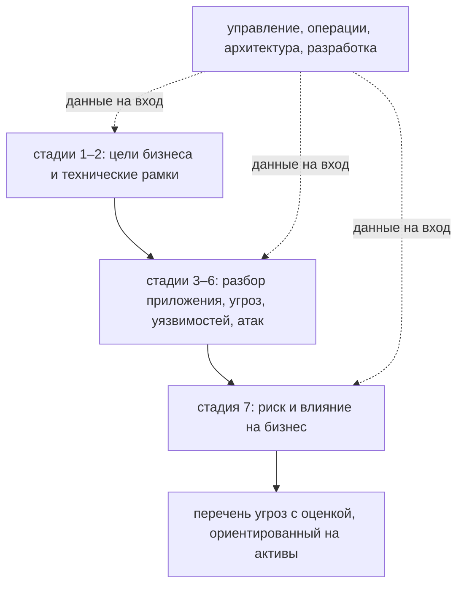

# PASTA: риск-ориентированное моделирование угроз

Команда провела сессию по четырём вопросам из темы `threat-modeling`:
обвела границы доверия, перебрала угрозы, договорилась о мерах. Через
месяц приходит тендер заказчика, и в требованиях стоит строка
«моделирование угроз по PASTA». Команда открывает описание метода и видит
семь стадий, у каждой вход и выход. Значит ли это, что одной сессии теперь
недостаточно и так надо всегда? Ответ не тот, которого ждут: размер метода
— не признак его строгости. Читать PASTA стоит по цене, а не по числу
стадий.

## Что такое PASTA

PASTA расшифровывается как Process for Attack Simulation and Threat
Analysis, «процесс имитации атак и анализа угроз». Это метод моделирования
угроз, предложенный в 2012 году, а главная его черта — риск. Риск —
вероятность того, что плохое случится, помноженная на цену последствий.
Бытовой пример — страховка квартиры. Пожар в доме случается редко, но его
цена — вся квартира, поэтому взнос платят. Протечка крана случается чаще,
а стоит вызова сантехника, поэтому её не страхуют. Страховая считает ровно
риск: частоту события, умноженную на его цену.

Активом называют то, что бизнесу дорого: данные клиентов, деньги на
счетах, работающий сервис. В примере со страховкой актив — сама квартира.
Сессия из темы `threat-modeling` заканчивается списком угроз и мер. Какая из них
страшнее для бизнеса, сессия не говорит: ни цены активов, ни вероятностей
у неё нет. PASTA вырос из этого разрыва. Оценка риска встроена в сам
процесс: она начинается бизнес-целями на первой стадии и заканчивается
разбором риска и влияния на седьмой. Поэтому метод и называют
риск-ориентированным.

Рассказывает о методе каталог SEI. SEI, Software Engineering Institute, —
исследовательский институт при университете Карнеги—Меллона, который
десятилетиями собирает инженерные методы и смотрит, как они работают. Его
разбор двенадцати методов моделирования угроз — не реклама одного
продукта, а карта: какой метод что даёт и во что обходится. PASTA он
описывает как рамку, сводящую бизнес-цели и технические требования.

**Зачем это в работе AppSec-инженера.** PASTA встречается в чужих
документах и тендерах как эталон «взрослого» процесса, как в истории из
вступления. Знать вес метода — значит не принять семь стадий за
обязательное требование и не списать метод как бюрократию. Оба прочтения
дороги: первое гонит команду в недели встреч, второе срывает тендер или
аудит.

## Как устроены семь стадий

Стадия — шаг процесса со своим входом и выходом: вход — данные, которые
кто-то обязан принести, выход — то, что остаётся на руках. На вход каждой
из семи стадий приходят данные от четырёх ролей: управления, операций,
архитектуры и разработки. За столом сидит не одна команда, и каждый
приносит то, что знает только он. Управление говорит цели и цену, операции
знают, как система живёт, архитектура — из чего она собрана, разработка —
как она написана.

Сами стадии перечисляет открытый доклад SEI о двенадцати методах, и он
лежит в источниках этой темы. Такие доклады называют белыми книгами:
техническими отчётами, которые организация выкладывает бесплатно для всех.
Названия и порядок взяты из главы про PASTA этого доклада:

1. Определение целей: зачем система бизнесу и что недопустимо.
2. Определение технических рамок: что входит в систему, а что остаётся
   снаружи.
3. Разбор приложения: из каких частей оно собрано и как текут данные —
   та же работа, что даёт диаграмму потоков данных в теме
   `threat-modeling`.
4. Анализ угроз: что идёт против системы.
5. Анализ уязвимостей и слабостей: где система уже слаба.
6. Моделирование и имитация атак: как атака пройдёт на самом деле.
7. Анализ риска и влияния: во что это обойдётся бизнесу и что
   предпринять.

**Описание схемы.** Схема читается сверху вниз. Две первые стадии задают
цели бизнеса и технические рамки, четыре средние разбирают приложение,
угрозы, уязвимости и атаки, седьмая считает риск и влияние на бизнес.
Пунктирные стрелки подводят к каждому блоку данные от четырёх ролей:
процесс кормится ими на каждой стадии, а не один раз в начале. Выход один
— перечень угроз с оценкой, ориентированный на активы.

Каталог описывает устройство метода короткой формулой: взгляд атакующего
внутри, активы снаружи. Расшифруем её. Средние стадии смотрят на систему
глазами атакующего: чего он хочет, где слабое место, как он пройдёт. Этот
взгляд встроен в середину процесса, а не оставлен на усмотрение ведущего.
А меры в конце выбираются от активов: что дороже бизнесу, то защищается
первым.

**Откуда это взялось.** Перебор по категориям из темы `stride` и четыре
вопроса из `threat-modeling` отвечают на вопрос об угрозах продукта, но не
связывают их с риском бизнеса. Методы с риском внутри отвечали на этот
разрыв по-разному. PASTA — тот, что встроил оценку риска в сам процесс и
потребовал ради неё входа от управления. Цена этого ответа — размер: семь
стадий с четырьмя ролями вместо одной сессии.

У темы есть предел, и он заявлен прямо. Первоисточник PASTA — платная
книга авторов метода, и она не читалась. Всё сказанное здесь написано по
сравнительному разбору SEI, то есть из вторых рук. Такой выбор осознан:
разбор лаборатории честнее маркетинговых пересказов, но первоисточником он
не становится.

## Что умеет и чего не умеет

Умеет метод три вещи. Первое — привязать угрозы к бизнес-риску и активам:
на выходе не голый список угроз, а перечень с оценкой, и ориентир оценки —
активы. Второе — вовлечь тех, кто принимает решения: управление сидит в
процессе с первой стадии, поэтому у выводов есть заказчик, способный
подписать меры и бюджет. Третье — оставить след от цели до меры: почему
выбрана именно эта мера, читается по цепочке стадий, и это работает при
аудите или споре.

Как выглядит такой след, разберём на сквозном примере. На первой стадии
зафиксирована цель: утечка персональных данных недопустима. Средние стадии
показали слабое место и то, как через него пройдёт атака. Седьмая оценила
риск в деньгах, и под эту оценку выбрана мера. Через год аудитор
спрашивает, почему куплена именно она, и ответ читается по цепочке
стадий, а не ищется в переписке.

Не умеет метод тоже по устройству, а не по недоработке. Быстро и дёшево он
не работает: семь стадий с участием четырёх ролей дороже сессии из темы
`threat-modeling` на порядок, то есть примерно в десять раз. И он не
работает без данных о бизнесе: риск считается внутри процесса, а без цены
активов его не посчитать. Если никто не может сказать, во что обойдётся
утечка базы клиентов, семи стадиям нечем кормить.

Отсюда правило выбора, и оно читается из устройства метода. Приложению с
понятной схемой и командой на месте хватает сессии по четырём вопросам.
Системе, где цена ошибки считается в деньгах, а решения принимает не
разработка, формальный процесс окупается. Пример второй стороны — магазин
с оплатой картами: утечка номеров грозит штрафами платёжных систем, и
решение о приёмке риска принимает дирекция. Пример первой — домашний
проект без платежей и личных данных: там семи стадиям нечего считать.

Метод выбирается под вопрос и под бюджет, а не по зрелости написания:
«выглядит солидно» — не аргумент. Приложите правило к своей системе: по
какую сторону она лежит и почему? Соседние методы в том же каталоге SEI
закрывают другие края. LINDDUN работает с приватностью, то есть с
угрозами личным данным людей. OCTAVE смотрит на риски организации целиком,
а не одного продукта. PASTA стоит между ними как метод про продукт и его
риск. Сравнивать их стоит по предмету, а не по количеству стадий: само
число стадий о качестве не говорит.

Вернёмся к тендеру из вступления. Строка «по PASTA» в требованиях значит
не «метод всем подходит», а «заказчик купил процесс с ценой процесса».
Теперь у команды есть обе стороны правила, и ответ пишется осмысленно.
Либо процесс закладывается в смету со стадиями и ролями, либо заказчику
показывают, чем тот же вопрос закрыт дешевле. Оба ответа сильнее, чем «мы
так не работаем», и сильнее молчаливого согласия на семь стадий.

## Источники

1. Threat Modeling: 12 Available Methods, блог SEI; реестр
   `sei-threat-modeling-methods`. Разделы: PASTA и место метода среди
   двенадцати.
   <https://www.sei.cmu.edu/blog/threat-modeling-12-available-methods/>
2. Threat Modeling: A Summary of Available Methods, white paper SEI; реестр
   `sei-threat-modeling-methods-paper`. Разделы: глава про PASTA со стадиями.
   <https://www.sei.cmu.edu/documents/569/2018_019_001_524597.pdf>

Каркас этапа: этап 5 опирается на открытые документы методов; стендов
нет.

**Маркеры уверенности.** Состав метода, названия и порядок семи стадий,
год и чтение «риск-ориентированный» — **по документации** (обе страницы
SEI открыты лично 2026-09-01, PDF белой книги открыт и прочитан по главе о
PASTA). Первоисточник метода — платная книга, не читалась; это осознанный
предел темы, зафиксированный находкой Н-08 оглавления этапа 5, и тема
говорит о нём прямо.
