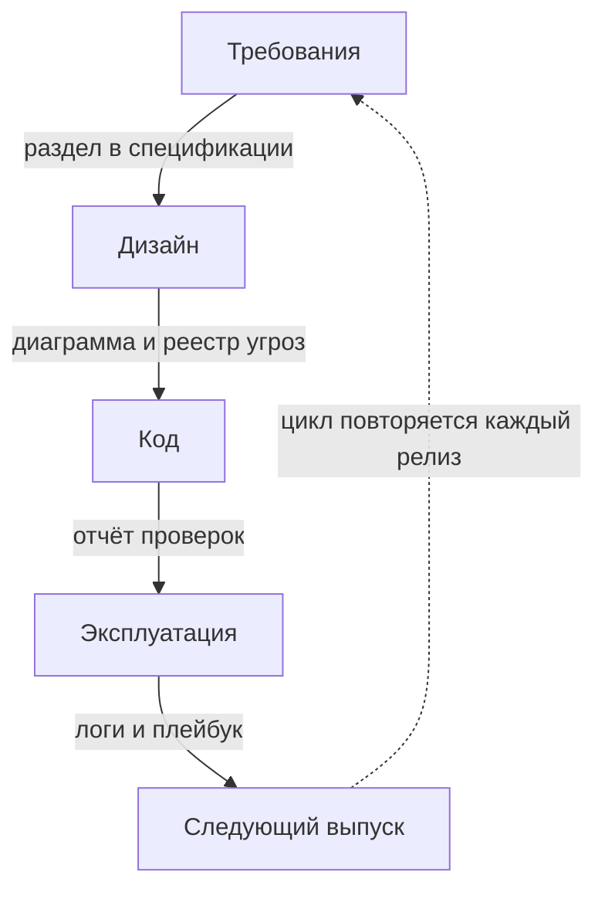

# Secure SDLC: требования, дизайн-ревью, гейты по стадиям

Представьте аудит или собеседование, где звучит один вопрос: «Что у вас
из безопасности в разработке?» Одна команда отвечает списком купленных
инструментов, и после второго уточнения разговор встаёт. Другая показывает
таблицу: вот стадии работы, вот проверка на каждой, вот документ, который
её подтверждает. Разница между этими двумя ответами и есть тема этой
страницы. Проверку безопасности можно встроить в каждый шаг разработки,
а можно добавить одной проверкой в конце. Второй путь дороже и ловит
меньше, и ниже
разобрано, почему это так.

## Что такое Secure SDLC

У всякого продукта есть жизненный цикл разработки — путь от идеи до снятия
с эксплуатации, по-английски SDLC, software development lifecycle. Этот
путь делится на стадии, то есть этапы, у каждого из которых свой результат.
Сначала пишутся требования: что система обязана делать и чего делать не
должна. Потом дизайн, то есть схема устройства, дальше код и сборка,
выпуск и эксплуатация. Стадии от кода и дальше вам уже знакомы по теме
`shift-left`; новое здесь то, что цикл начинается раньше кода и не
кончается выпуском.

Бытовой пример — стройка дома. Проект соответствует требованиям и дизайну,
кладка стен — коду, сдача — выпуску, а жильё с ремонтом — эксплуатации.
Аналогия помогает видеть порядок стадий: перенести стену после сдачи
дороже, чем двинуть линию на чертеже. Ломается она на повторении. Дом
после сдачи почти не меняется, а продукт перевыпускается каждый релиз,
поэтому цикл идёт по кругу.

Теперь два слова, на которых держится вся тема. Артефакт — вещественный
след работы: документ, реестр или отчёт, который можно показать
собеседнику за минуту. Пример — акт приёмки квартиры: слова «мы всё
осмотрели» ничего не стоят, а подписанный акт со списком замечаний стоит.
Если след показать нельзя, работы для проверяющего не было.

Гейт — контрольная точка стадии, и состоит она из трёх частей: вопрос,
артефакт, который на него отвечает, и владелец — человек, отвечающий за
проверку. Само слово вам знакомо из темы `quality-gates`: там гейтом была
проверка конвейера с договором о коде возврата. Здесь то же слово работает
шире и закрывает любую стадию, даже ту, где конвейера ещё нет.

Secure SDLC — жизненный цикл, в который практики безопасности встроены на
каждой стадии, а не прикручены в конце. Такой процесс читается как таблица
«стадия — вопрос — артефакт», и вот её четыре строки:

```text
стадия       вопрос гейта                       артефакт
требования   записаны ли требования защиты      раздел в спецификации
дизайн       построена ли модель угроз          диаграмма и реестр угроз
код          все ли гейты конвейера зелёные     отчёт проверок
эксплуатация есть ли журнал и план реагирования логи и плейбук
```

Строк в таблице четыре, а стадий в цикле пять: «код и сборка» и «выпуск»
слиты здесь в одну строку «код». В задаче в конце темы они разведены
порознь. Два слова из таблицы стоит раскрыть сразу. Спецификация —
документ, где записаны требования к системе. Плейбук — заранее написанный
план действий на случай инцидента: кого поднимать, что отключать, в каком
порядке.
Строка без артефакта — не гейт, а пожелание, потому что спросить «мы это
делаем?» не у чего. Проверьте сами: мысленно приложите таблицу к своему
проекту и отметьте, какая строка закроется артефактом, а какая останется
пожеланием.

Та же таблица на схеме, если смотреть на порядок стадий и на то, что
каждая производит:



**Описание схемы.** Схема читается сверху вниз: прямоугольники — четыре
строки таблицы выше, подпись на стрелке — артефакт, который закрывает гейт
стадии и пускает работу дальше. Пунктирная стрелка внизу возвращает цикл
в начало: каждый релиз снова проходит через требования.

Сами практики в этой теме не переписываются, потому что разобраны раньше
по маршруту. Модель угроз строится по теме `threat-modeling`, гейты
конвейера — по темам `quality-gates` и `shift-left`, а зрелость всего
процесса измеряется моделью из темы `owasp-samm`. Здесь эти части
собираются в таблицу целиком.

**Зачем это в работе AppSec-инженера.** Вопрос из начала страницы звучит
на каждом аудите и собеседовании, и отвечают на него таблицей по стадиям,
а не списком инструментов. В ежедневной работе та же таблица решает две
практические задачи: показывает, куда встаёт новая практика, и что именно
ломается, когда её убирают.

## Как это работает

**Откуда это взялось.** Безопасность, добавленная после выпуска, стоит
дороже всего, потому что дефект дизайна чинится перестройкой, а не патчем.
Microsoft в начале двухтысячных ответила на это обязательным циклом SDL —
Security Development Lifecycle, «жизненный цикл безопасной разработки».
Спустя двадцать лет страница его практик держит тот же каркас. Из
компании идея перешла в отрасль под именем Secure SDLC: стадии у всех
общие, а набор практик у каждой организации свой.

Эталонный порядок задаёт страница практик Microsoft SDL. Она называет
десять практик, и каждая привязана к своей стадии:

1. Стандарты и метрики — договор о том, что считается приемлемым, и способ
   это измерить.
2. Проверенные средства и языки — правило брать библиотеки и инструменты
   с известной историей, а не первые попавшиеся.
3. Дизайн-ревью с моделированием угроз — разбор схемы устройства до
   написания кода; сам метод разобран в теме `threat-modeling`.
4. Стандарты криптографии — список разрешённых алгоритмов, чтобы никто
   не изобретал свои.
5. Защита цепочки поставок — контроль того, что попадает в сборку извне:
   зависимости, пакеты, образы.
6. Защита среды разработки — охрана места, где пишут и собирают код:
   репозитории, сборщики, доступы.
7. Тестирование безопасности — проверки готового кода. Статический анализ
   и пентест отдельными практиками не названы, они сидят внутри этой.
8. Защита платформы эксплуатации — настройка окружения, в котором живёт
   выпущенный продукт.
9. Мониторинг и реагирование — журналы и план действий на случай
   инцидента; устройство этого плана разбирает тема `incident-response`.
10. Обучение — навыки у людей, которые ведут стадии и их гейты.

Сама страница Microsoft называет четыре стадии цикла: дизайн, код, сборка
и развёртывание, эксплуатация. Эта тема и задача ниже раскладывают цикл на
пять строк: требования, дизайн, код и сборка, выпуск, эксплуатация.

Ключевое свойство процесса — гейт: стадия не считается пройденной, пока
нет артефакта. У моделирования угроз артефактом служит реестр из темы
`threat-modeling`, у сборки — зелёный прогон гейтов из темы
`quality-gates`, у требований — раздел спецификации. Гейт без артефакта
превращается в устную договорённость, а такая договорённость не переживает
смену людей.

Вторая опора — сдвиг влево из темы `shift-left`: чем раньше стадия, тем
дешевле находка. Порядок тем этого этапа построен на том же правиле:
сначала методы для дизайна, потом гейты, в конце эксплуатация и
реагирование.

## Что умеет и чего не умеет

Процесс умеет три вещи. Он даёт каждой практике место и время, то есть
стадию, на которой она выполняется. Он делает пропуск видимым: стадия без
гейта читается в таблице сразу, как пустая клетка. И он распределяет
ответственность, потому что у каждого гейта есть владелец.

Чего процесс не умеет — писать сами практики: он говорит, когда строить
модель угроз, но не говорит как, этому учит тема `threat-modeling`. Он не
измеряет себя: вопрос «насколько хорош наш процесс» адресован модели
зрелости из темы `owasp-samm`, а не списку стадий. И он не проверяет
содержание артефактов: формальный реестр угроз гейт закроет, хотя пользы
в нём нет.

Отдельная граница — цена. Каждая стадия с гейтом стоит времени команды,
поэтому процесс, введённый целиком с первого дня, обычно не доживает до
второго. Запускать его стоит от слабого места, а не по шаблону, и об этом
следующий раздел.

## Как запустить

Введение процесса идёт в четыре шага, и порядок здесь не случаен:

1. Пройдите самооценку по модели из темы `owasp-samm` и найдите практики
   с нулевым уровнем. Они и есть кандидаты в первые гейты, потому что там
   проверка закроет настоящую дыру, а не украсит место, которое и так
   работает.
2. Для одной стадии запишите гейт целиком: вопрос, артефакт, владелец.
   Начинать стоит с самой дешёвой находки — обычно это дизайн-ревью или
   гейт конвейера, потому что обе проверки не требуют новых инструментов.
3. Прогоните гейт на одном релизе и запишите, что он поймал и что
   пропустил. Без такой записи непонятно, работает проверка или только
   занимает время.
4. Расширяйте по одной стадии, пока таблица не закроет цикл. Новую строку
   вводите только после того, как прежняя заработала, иначе получите пять
   гейтов, которые все красные и всех раздражают.

Вход здесь — знание собственного процесса, выход — таблица «стадия —
гейт — артефакт — владелец». Типовая ошибка первого внедрения — начать с
инструмента вместо стадии, то есть с решения «поставим сканер». Сканер без
места в цикле печатает отчёты, которые никто не читает, а отчёт, который
никто не читает, гейтом не становится.

## Как читать вывод

Результат работы процесса — артефакты гейтов, и читаются они по полноте
таблицы. У работающего процесса на каждую стадию есть ответ, и ответ
вещественный: реестр угроз, а не «обсудили», отчёт конвейера, а не
«проверяли». Строка «у нас этого нет» — нормальный ответ, если он
осознанный и записанный. Плохой ответ — «у нас всё есть», которое не
подтверждается ни одним артефактом.

Второе чтение — по времени жизни артефакта. Модель угроз, не обновлявшаяся
два релиза, перестала быть гейтом и стала документом. Гейт конвейера,
который неделю красный, — не гейт, а фон. Процесс читается не по наличию
строк в таблице, а по свежести того, что эти строки производят.

## Границы метода

Процесс не решает, какие меры брать: требования к приложению даёт каталог
из темы `owasp-asvs`, угрозы — модель из темы `threat-modeling`. Он не
подменяет компетенцию, потому что гейт пишет тот, кто понимает предмет
проверки. И он плохо переносит формализм: таблица, заполняемая «для
аудита», производит артефакты без содержания, а это хуже честного пустого
места.

Есть и граница по масштабу. Пять стадий с владельцами — форма для команды,
где есть кому владеть. Команда из трёх человек законно сокращает таблицу
до двух-трёх строк, пока эти строки настоящие.

## Частая ошибка

Прежде чем читать дальше, ответьте себе: где проверка приносит больше —
на приёмке перед выпуском или на дизайне, когда кода ещё нет? Привычная
картина подсказывает «на приёмке»: безопасность выглядит отделом, который
проверяет продукт перед выпуском.

**Проверка в конце ловит только то, что можно починить в конце.** Механизм
уже разобран выше: дефект дизайна, найденный на приёмке, означает переделку
архитектуры, поэтому моделирование угроз стоит на стадии дизайна, а не в
конце. Отдел в конце конвейера — не источник безопасности, а самое дорогое
её место.

Контрпример. Команда внедрила сканер уязвимостей и объявила процесс
построенным. Сканер стоит на одной стадии из пяти и закрывает часть одной
практики; требования, дизайн и эксплуатация остались без гейтов. Первая же
находка дизайна прошла мимо, потому что процесс был, а стадий в нём не
было.

## Чеклист для ревью

1. Проверьте, что у каждой стадии цикла есть гейт с вопросом, артефактом
   и владельцем.
2. Проверьте, что модель угроз строится на дизайне, а не перед выпуском.
3. Проверьте, что гейты конвейера останавливают сборку, а не пишут отчёт
   в сторону.
4. Проверьте, что артефакты свежие: реестр угроз и план реагирования
   пересматривались в текущем цикле.
5. Проверьте, что процесс измеряется самооценкой зрелости, а не наличием
   инструментов.
6. Проверьте, что новые практики вводятся по одной и после того, как
   прежние заработали.

## Попробуй сам

Возьмите проект, который вы знаете (свой или учебную витрину из лаб
этапа 1), и разложите его по пяти стадиям. Стадии: требования, дизайн,
код и сборка, выпуск, эксплуатация. Для каждой стадии запишите: вопрос
гейта, артефакт, владельца — или честное «нет».

Одна подсказка: если артефакт не показать собеседнику за минуту, его
нет.

**Критерий выполнения** наблюдаемый: пять строк таблицы, в каждой —
либо называемый артефакт с местом, где он лежит, либо «нет» с первым
шагом.

## Проверь себя

1. Таблица «стадия — гейт — артефакт» из чужого процесса:

   ```text
   стадия      вопрос гейта                    артефакт
   требования  записаны ли требования защиты   раздел в спецификации
   дизайн      обсуждены ли риски              —
   код         все ли гейты конвейера зелёные  отчёт проверок
   ```

   Какая строка здесь пожелание и в чём оба её дефекта?

2. Почему проверка на приёмке перед выпуском — самое дорогое место
   безопасности?

3. Заготовка гейта из лабы темы `quality-gates` (договор ещё не
   написан) получает отчёт с новым ERROR:

   ```bash
   python3 gate.py reports/head.json
   ```

   Что ответит такой гейт и каким кодом выйдет?

4. Возврат к теме `threat-modeling`: какой артефакт закрывает гейт
   стадии дизайна?

5. Возврат к теме `shift-left`: гейт «модель угроз построена» перенесли
   с дизайна на приёмку. По каким двум величинам тот перенос проигрышен?

<details markdown="1">
<summary>Ответ 1</summary>

1. Строка дизайна. Первый дефект — прочерк вместо артефакта: спросить
   «мы это делаем?» не у чего, и гейт превращается в устную
   договорённость. Второй — сам вопрос: «обсуждены ли» не проверяемо;
   проверяемая форма — «построена ли модель угроз», и артефакт у неё —
   диаграмма и реестр.

</details>

<details markdown="1">
<summary>Ответ 2</summary>

2. Дефект дизайна, найденный на приёмке, чинится перестройкой
   архитектуры, а на схеме — строкой в документе. Проверка в конце ловит
   только то, что можно починить в конце, поэтому моделирование угроз
   стоит на стадии дизайна.

</details>

<details markdown="1">
<summary>Ответ 3</summary>

3. «находок 3, порог 0, режим block», затем «зелёный», код возврата 0:
   заготовка отдаёт ноль всегда, и сборка с новым ERROR идёт дальше.
   Прогон: `cd pilot/lab/quality-gates && python3 gate.py
   reports/head.json; echo $?`. Гейт без договора о коде возврата не
   останавливает ничего — строка «код» из первого вопроса таким гейтом
   не закрыта.

</details>

<details markdown="1">
<summary>Ответ 4</summary>

4. Диаграмма потоков данных с границами доверия и реестр угроз с ответом
   на каждую. Оба свежие: реестр, не обновлявшийся два релиза, перестал
   быть гейтом и стал документом.

</details>

<details markdown="1">
<summary>Ответ 5</summary>

5. Первая величина — цена находки: она растёт вправо, потому что на
   дизайне дефект правится строкой в документе, а на приёмке — переделкой
   системы. Вторая — бюджет времени стадии: он падает влево, и в бюджет
   должны уложиться и проверка, и починка. Сессия моделирования в стадию
   дизайна укладывается, а перестройка архитектуры в часы выпуска — уже
   нет. Перенос вправо проигрывает обеим.

</details>

## Источники

1. Microsoft Security Development Lifecycle Practices; реестр
   `ms-sdl-practices`. Разделы: десять практик SDL, стадии жизненного
   цикла (Design, Code, Build and Deploy, Run), принципы Zero Trust.
   <https://www.microsoft.com/en-us/securityengineering/sdl/practices>
2. OWASP SAMM — Software Assurance Maturity Model; реестр `owasp-samm`.
   Разделы: пять функций и практики — рамка, по которой процесс
   измеряется.
   <https://owaspsamm.org/model/>

Каркас этапа: этап 5 опирается на открытые документы методов; стендов
нет.

**Скоропортящийся слой.** Список из десяти практик Microsoft пересматривается
вместе со страницей; стадии цикла и принцип «гейт с артефактом»
стабильны.

**Маркеры уверенности.** Состав и порядок десяти практик, четыре
стадии цикла, место тестирования внутри седьмой практики — **по
документации** (страница Microsoft SDL открыта лично 2026-09-02, список
практик сверен по тексту страницы). Порядок введения «от слабого места» — авторская
практика поверх самооценки SAMM, а не предписание источника; блок
«Как запустить» написан как рекомендация, не как цитата. Внедрение
процесса в живой команде автором на этой странице не воспроизводилось.
