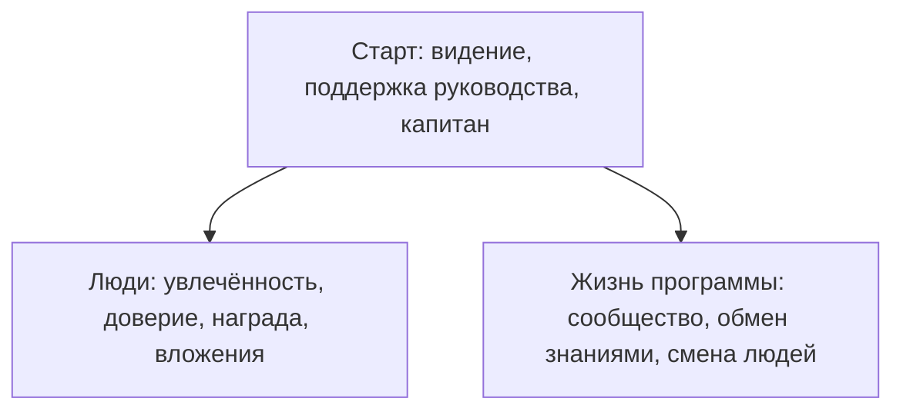
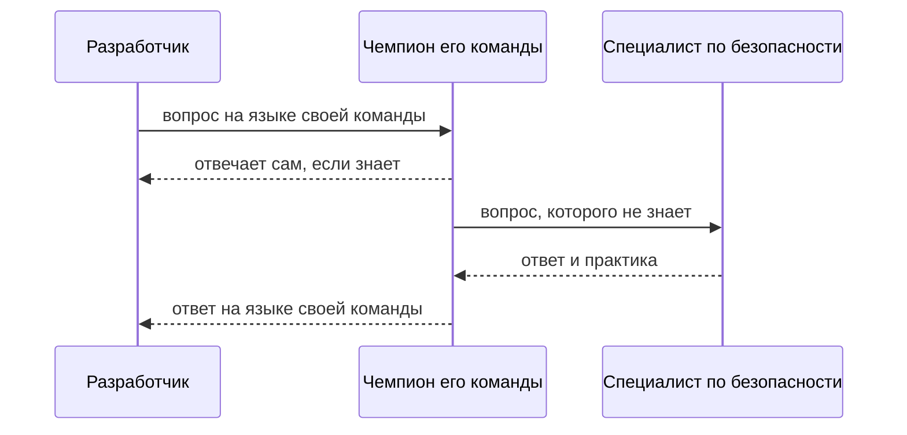

# Security champions, обучение разработчиков

Процесс из темы `secure-sdlc` записан, гейты в конвейере стоят — а команды
всё равно спрашивают «а можно мы без этого?». На пять команд разработки
один специалист по безопасности, и его вопросы приходят слишком поздно:
обычно за неделю до релиза, когда менять что-либо уже дорого. Закрыть эту
щель наймом не выходит, потому что специалистов по безопасности всегда
меньше, чем команд. Проект OWASP Security Champions предлагает ответ не в
штатном расписании, а в устройстве работы — программу «чемпионов
безопасности», и манифест программы сводится к десяти принципам:

```text
1. увлечённость безопасностью        6.  сообщество
2. внятное видение программы         7.  обмен знаниями
3. поддержка руководства             8.  награда за ответственность
4. выделенный капитан                9.  вложения в чемпионов
5. доверие чемпионам                 10. план на смену людей
```

Чемпион — это разработчик внутри команды, который носит в неё практики
безопасности и выносит из неё вопросы. Десять строк читаются не как меню,
из которого выбирают понравившееся: уберите из списка капитана или
поддержку руководства — и остальные принципы не держатся. И сразу честная
рамка: проект живёт в статусе Incubator, то есть это собранный опыт
сообщества, а не стандарт. Вопрос на вход — какой принцип из десяти
программа переживёт легче всего и есть ли такой принцип вообще?

## Кто такой чемпион

У отдела безопасности меньше людей, чем у разработки, поэтому вопросы к
нему встают в очередь и ждут. Ответ, который собрало руководство OWASP,
организационный: обучить по одному разработчику в каждой команде и дать
ему роль связного. Такого человека и называют чемпионом. Он остаётся
разработчиком и пишет код вместе со всеми. Сверх этого он носит в команду
практики безопасности и выносит наружу вопросы, на которые сам ответить
не может.

Бытовой пример — ответственный за пожарную безопасность в офисе. Он не
пожарный и профессионально тушить не умеет. Зато он знает, где висит
огнетушитель и куда ведёт план эвакуации, и объясняет это коллегам.
Соответствие прямое: пожарная часть — это отдел безопасности,
ответственный — чемпион, а огнетушитель с планом эвакуации — практики из
темы `secure-sdlc`. Ломается аналогия на частоте: инструктаж у
ответственного бывает раз в год, а чемпион работает с командой каждую
неделю.

Один чемпион — ещё не программа. Программа начинается там, где у роли
есть устав, ритм встреч, метрики и человек, который всё это ведёт. Устав —
короткий документ, где записано, что чемпион делает, чего не делает и
сколько времени уходит на роль. Человек, который ведёт программу, в
манифесте называется капитаном. Это не начальник чемпионов, а владелец
программы: её работа — его работа, а не хобби в свободное время. Разница
видна при первой же смене приоритетов: программа без капитана в этот
момент молча умирает.

**Зачем это в работе AppSec-инженера.** Начинающий инженер встречает
программу со стороны участника: роль чемпиона своей команды — та самая
роль, которую ему и предложат. Знание устройства программы отвечает на
вопросы «что от меня ждут» и «почему программа без капитана и бюджета не
живёт».

## Как это работает

**Откуда это взялось.** Практика безопасности не доходит до команды сама:
вопросы к единственному специалисту встают в очередь, а до его ответа
фича уходит в релиз. Ответ придумали организационный — обучить по одному
разработчику в команде и дать ему роль связного. Руководство OWASP собрало
такой опыт из интервью с руководителями AppSec-программ и разложило его
на принципы и артефакты. Поэтому документ читается как конспект чужой
практики, а не как придуманная теория.

Десять принципов живут в документе, который проект называет манифестом.
Слово здесь означает короткую публичную декларацию: не инструкцию по
исполнению и не стандарт, а список убеждений, на которых программа стоит.
У каждого принципа в руководстве есть своя страница с разбором.

Сами принципы делятся на три слоя, и слои не равноправны. Первый слой —
про старт программы: внятное видение, поддержка руководства, выделенный
капитан. Второй — про людей: увлечённость, доверие чемпионам, награда за
ответственность, вложения в чемпионов. Третий — про жизнь программы:
сообщество, обмен знаниями, план на смену людей. Десятый принцип самый
честный в списке: чемпион рано или поздно уйдёт из команды, и программа
без замены умрёт вместе с ним. Первый слой — условие запуска двух
остальных: без видения, поддержки и капитана людям не на чем стартовать,
а жить программе не из чего.



**Описание схемы.** Схема читается сверху вниз. Верхний узел — три
принципа старта, и стрелки из него ведут к обоим нижним слоям. Без
видения, поддержки руководства и капитана не запускаются ни люди, ни
жизнь программы. Между нижними слоями стрелки нет: они работают
одновременно, а не друг за другом.

Отсюда ответ на вопрос из начала темы: принципа, который программа
переживёт без потерь, в списке нет. Убрать можно любой, но у каждого
удаления своя цена: без капитана программа теряет ведение, без плана на
смену людей — будущее, без поддержки руководства — бюджет.

Содержание руководства лежит не на корневой странице: там один
вступительный абзац. Принципы собраны в разделе манифеста, а заготовки —
в разделе артефактов: уставы программ, метрики и показатели, учебные
материалы, разборы случаев. Часть слотов артефактов помечена «ждём
донора», и это видимый признак статуса проекта. У проектов OWASP есть
ступени зрелости, и Incubator означает раннюю стадию: документы собраны
сообществом из интервью и донорских материалов и не прошли путь
стандарта. Ощущение знакомо любому, кто ставил библиотеку с версией 0.x:
внутри рабочий опыт, но гарантий нет, и применять его надо с проверкой
под свои условия.

## Что умеет и чего не умеет

Умеет программа три вещи. Первая — дать практикам носителя в каждой
команде: процесс из темы `secure-sdlc` перестаёт зависеть от единственного
специалиста. Вторая — сократить путь вопроса от разработчика до
безопасности: чемпион сидит в той же команде и говорит на её языке.
Третья — выращивать знание внутри, а не покупать его снаружи: чемпионы
со временем сами становятся носителями практики.



**Описание схемы.** Схема читается сверху вниз по стрелкам. Разработчик
спрашивает чемпиона своей команды, и чемпион отвечает сам, если знает
ответ. Вопрос, которого он не знает, уходит специалисту по безопасности
и возвращается команде ответом. Очередь к единственному специалисту на
этой схеме не исчезает, но короче: через неё проходят только вопросы,
которых чемпион не знает.

Не умеет программа тоже три вещи. Она не заменяет сам процесс: программа
стоит поверх процесса из темы `secure-sdlc`, а не вместо него. Она не
заменяет специалистов: чемпион — связной, а не второй аудитор, и тяжёлый
разбор уходит из команды в отдел безопасности. И она не живёт без трёх
условий из манифеста: видения, поддержки руководства и капитана.

Два примера непрограмм. «Рассылаем статьи в общий чат» — не программа,
потому что в ней нет ролей: статью в чате читает тот, кто читал бы её и
так. «Чемпионы назначены, а капитана нет» не переживает первую смену
приоритетов, потому что вести программу некому. Манифест перечисляет
условия жизни, и читаются они как требования, а не как пожелания.

## Как запустить

Порядок собран по манифесту, и у каждого шага есть причина стоять на
своём месте.

1. Запишите видение программы: что чемпион делает и чего не делает. Без
   этого шага роль превращается в «занимайся безопасностью», а это не
   роль, а настроение.
2. Заручитесь поддержкой руководства — временем и признанием роли, а не
   одобрением на словах. Время чемпиона платится из бюджета команды, и
   без решения руководства взять его неоткуда.
3. Назначьте капитана: программа ведётся, а не происходит.
4. Найдите чемпионов по увлечённости, а не назначением сверху.
   Назначенный без охоты человек получает штраф, а не роль, и разбор
   этого случая ждёт ниже, в «Частой ошибке».
5. Соберите сообщество и ритм обмена: встречи, канал, разбор случаев.
6. Вложитесь в обучение чемпионов и запланируйте смену людей заранее,
   потому что чемпион уйдёт раньше, чем программа кончится.

Вход — работающий процесс из темы `secure-sdlc` и команды, которым его не
хватает. Выход — устав программы, список чемпионов и ритм встреч.
Артефакты руководства, уставы и метрики, берутся как заготовки и
настраиваются: руководство построено как плейбук для выбора, а не как
предписание.

## Как читать вывод

Произведённое программой читается по метрикам, и раздел артефактов даёт
их заготовки: показатели программы, учёт активности, журнал обучения.
Живая программа видна по трём признакам. Первый: у чемпиона есть время на
роль — оплаченное, а не найденное по вечерам. Второй: вопросы команды идут
через чемпиона, а не мимо него. Третий: программа пережила хотя бы одну
смену состава, потому что смена людей — единственное событие, которое
случится гарантированно.

Обратные признаки тоже перечислимы. Чемпионы назначены, но времени на
роль у них нет: роль мертва, остался список имён. Метрики считают число
встреч, а не число решённых вопросов: программа производит отчётность.
Чемпион один на все команды: это не программа, а тот же одинокий
специалист под другим именем.

## Границы метода

Программа не масштабирует то, чего нет: без процесса из темы
`secure-sdlc` чемпионам нечего носить в команды, и программа остаётся
списком имён в документе.

Она не решает и проблему приоритетов. Конфликт «фича или безопасность»
решает руководство, и третий принцип стоит в списке не для красоты: без
поддержки руководства каждый такой конфликт чемпион проигрывает
дедлайну.

И она не бесплатна: время чемпиона и капитана — бюджет, а не энтузиазм.
Полдня в неделю на роль — это полдня, отнятые у кода.

Отдельно стоит статус источника. Проект живёт в статусе Incubator:
документы собраны сообществом из интервью и донорских материалов и не
прошли путь стандарта. Пользоваться ими стоит как чужим опытом с адресом,
а не как нормой: принципы проверяются вашими условиями, а не ссылкой на
OWASP.

## Частая ошибка

Подумайте сами до ответа: закрывает ли приказ о назначении чемпионов
вопрос безопасности в командах — и чем это кончается без бюджета на роль?

Соблазн приказа понятен: чемпионы выглядят способом получить безопасность
бесплатно, силами самих разработчиков.

**Программа перераспределяет знание, а не отменяет его цену.** Механизм
виден из устройства роли: чемпион остаётся разработчиком с добавленной
ролью, и время на неё платится из того же бюджета команды. Программа без
признанного времени превращает роль в штраф самому увлечённому человеку
в команде.

Контрпример к соблазну: компания назначила чемпионов приказом, без
капитана и без времени на роль. Через полгода от программы остался список
имён в документе. Вопросы по-прежнему идут мимо, потому что отвечать на
них некому: у чемпионов своя загрузка и нет ни полномочий, ни часов.

## Чеклист для ревью

1. Проверьте, что у программы записано видение: что чемпион делает и чего
   не делает.
2. Проверьте, что роль чемпиона оплачена временем и признана
   руководством.
3. Проверьте, что у программы есть выделенный капитан.
4. Проверьте, что чемпионы выбраны по увлечённости, а не назначены
   приказом.
5. Проверьте, что у программы есть план на уход чемпиона из команды.
6. Проверьте, что метрики считают решённые вопросы, а не число встреч.
7. Проверьте, что материалы руководства Incubator-статуса применены с
   проверкой под свои условия, а не как норма.

## Попробуй сам

Соберите устав программы для знакомой вам команды, а если своей команды
нет — для учебного проекта. Устав умещается в пять строк: цель, роль
чемпиона, время на роль, капитан, ритм встреч. Если команда состоит из
двух человек, запишите, почему программа ей не нужна, и это тоже ответ.
Двум людям дешевле спросить друг друга напрямую, чем заводить роль.

Одна подсказка: начните с принципа четыре, потому что без капитана
остальные девять не держатся.

**Критерий выполнения** наблюдаемый: пять строк устава, и в каждой
решение, а не пожелание. «Чемпион тратит на роль полдня в неделю» —
решение, а «чемпион уделяет внимание безопасности» — пожелание.

## Проверь себя

1. Устав чужой программы:

   ```text
   цель: чемпионы назначены приказом во все команды
   роль: отвечать на вопросы по безопасности
   время: по мере возможности
   капитан: —
   ритм: встречи два раза в месяц
   метрика: число проведённых встреч
   ```

   Какие три признака мёртвой программы видны в этом уставе?

2. Почему «рассылаем статьи в общий чат» — не программа?

3. Программа отчиталась метриками за квартал:

   ```text
   встречи сообщества: 24
   решённые вопросы команд: 3
   ```

   Что получится при подсчёте доли решённого и как читается такая
   таблица?

4. Возврат к теме `secure-sdlc`: почему программа чемпионов ставится
   поверх процесса, а не вместо него?

5. Возврат к теме `developer-communication`: чемпион передаёт находку
   разработчику. По какому признаку из той темы заявка считается годной?

<details markdown="1">
<summary>Ответ 1</summary>

1. Любые три из четырёх: чемпионы назначены приказом вместо выбора по
   увлечённости. «По мере возможности» — роль не оплачена временем.
   Капитана нет — программа происходит, а не ведётся. Метрика считает
   встречи, а не решённые вопросы.

</details>

<details markdown="1">
<summary>Ответ 2</summary>

2. В рассылке нет ролей: чемпион носит практику в свою команду и выносит
   вопросы наружу, а статья в чате не делает ни того, ни другого.
   Программа отвечает на нехватку рук у безопасности; рассылка эту
   нехватку обходит стороной.

</details>

<details markdown="1">
<summary>Ответ 3</summary>

3. `0.125` — прогон: `python3 -c "print(3 / 24)"` (повторён 2026-10-03,
   Python 3.14.7, вывод совпал). Таблица читается как «программа
   производит отчётность»: активность есть, результата почти нет. Поэтому
   метрики считают решённые вопросы, а не число встреч.

</details>

<details markdown="1">
<summary>Ответ 4</summary>

4. Чемпионы переносят практики в команды; без процесса переносить нечего,
   и программа остаётся списком имён. Она не заменяет и специалистов:
   чемпион — связной, а не второй аудитор.

</details>

<details markdown="1">
<summary>Ответ 5</summary>

5. Заявка воспроизводится по собственному тексту — без устной добавки
   автора и его браузера. Чемпиону это нужнее всех: починку делает не
   он, и находка, не прошедшая через текст, равна ненайденной.

</details>

## Источники

1. OWASP Security Champions Guide, корень руководства; реестр
   `owasp-security-champions-guide`. Разделы: рамка проекта; раздел
   Artifacts — заготовки уставов, метрик и учебных материалов, включая
   пустые слоты «ждём донора».
   <https://securitychampions.owasp.org/>
2. OWASP Security Champions Manifesto; реестр
   `owasp-security-champions-manifesto`. Разделы: десять принципов
   программы со страницами разбора у каждого.
   <https://securitychampions.owasp.org/manifesto/>

Каркас этапа: этап 5 опирается на открытые документы методов; стендов
нет.

**Скоропортящийся слой.** Руководство живое и пополняется донорами:
состав артефактов и заполненность слотов меняются; десять принципов
манифеста стабильнее, но тоже перечитываются при ревизии.

**Маркеры уверенности.** Десять принципов, устройство разделов
(манифест, принципы, артефакты), пустые слоты артефактов и статус
проекта Incubator — **по документации** (корневая страница руководства,
манифест, раздел артефактов и страница проекта открыты лично 2026-09-02;
статус Incubator подтверждён карточкой проекта на сайте OWASP). Вычисление
доли решённого из третьего вопроса прогнано повторно 2026-10-03 на Python
3.14.7: вывод совпал (`0.125`). Участие в живой программе чемпионов у
автора отсутствует — содержание подтверждено документами, не практикой.
