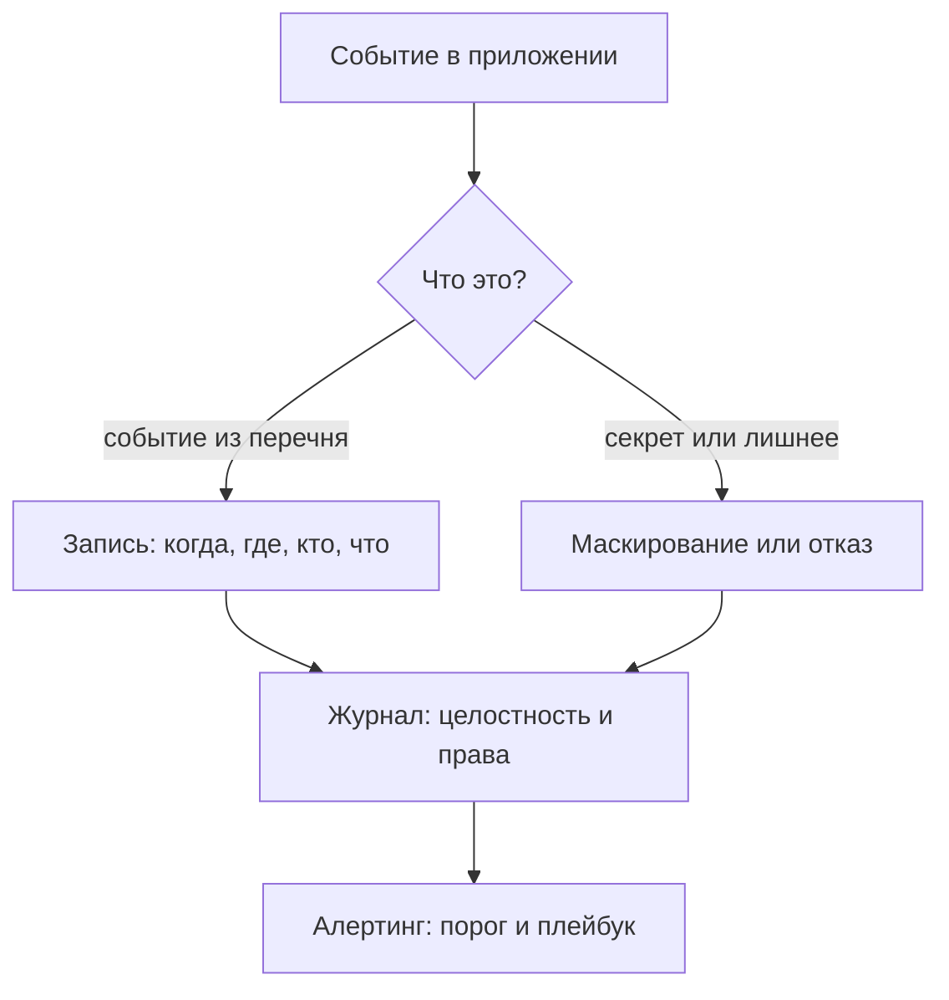

# Логирование и алертинг: что логировать, что нельзя

Уровень **L1** · время 60 мин (теория 30 / лаба 20 / самопроверка 10,
оценка)

Что прочитать сначала: `crlf-injection`.

Админка учебной витрины пишет журнал входов. Две его строки — найдите
лишнее в каждой самостоятельно:

```text
2026-09-02T10:14:01 event=login user=anna result=ok password=qwerty2026
2026-09-02T10:14:01 event=session user=anna result=ok token=3fa9c1d2
```

Строки выглядят рабочими: есть время, событие, пользователь, исход. А
в конце каждой — то, чему в журнале не место: пароль пользователя и её
токен сессии. Тот, кто получил файл журнала, заходит под любым
пользователем без единой атаки на само приложение. Дочитав тему,
вернитесь к этим строкам: что останется в них вместо пароля и токена
после починки — и почему замены разные?

Такие строки пишутся одним вызовом журнала, и вы такие вызовы видели:
хотелось «побольше данных на случай разбора». Тема — о том, что журнал
событий безопасности имеет два края: не записал — не увидел инцидент,
записал лишнее — отдал секрет. Дальше разберём, что обязано попадать в
запись, что не попадает никогда, и починим обе строки выше в лабе.

## 0. Коротко

Категория A09 издания 2025
называется Security Logging and Alerting Failures. В издании 2021
(A09:2021) она была про мониторинг; переименование подчёркивает
оповещение: журнал без реакции почти бесполезен. Дефектов здесь два
зеркальных. Первый — недостаточное журналирование (CWE-778): события
теряются. Второй — запись чувствительных данных в журнал (CWE-532):
журнал сам становится утечкой. Чинится перечнем событий, обязательными атрибутами
записи и списком того, что не пишется никогда. Сам журнал защищается от
подделки и от инъекции переводов строки (CWE-117) — механика инъекции
разобрана в теме `crlf-injection`. То же в терминах, которыми это
обсуждают.

**Зачем это в работе AppSec-инженера.** Журнал — единственный источник
ответа на вопрос «что было» при разборе инцидента, и тот же журнал —
частая находка ревизий: секрет в открытом виде. Ревьюер смотрит обе
стороны: записано ли событие и не записано ли лишнего.

## 1. Цели

После этого раздела вы сможете:

1. Составить перечень событий журнала с обязательными атрибутами записи.
2. Найти в коде запись секрета в лог и отличить её от законной записи.
3. Починить журналирование маскированием, отпечатком и чисткой ввода.
4. Проверить починку эксплойтом и не сломать функциональные тесты.

## 2. Предвопросы

Ответьте до чтения, даже если не уверены.

1. Вход с неверным паролем: записывать такое событие или нет?
2. У записи о входе есть пользователь и исход. Чего в ней не хватает,
   чтобы по ней можно было расследовать?
3. Кто читает журнал приложения, кроме его разработчика?

Третий вопрос — ключевой для всей темы: список читателей журнала длиннее,
чем кажется, и дефект из введения живёт ровно в этом зазоре.

## 3. Механика

**Откуда это взялось.** Программа без журнала отвечает на сбой молчанием:
разбирать нечего. Первое решение — писать всё подряд — ломается о две
вещи. В записях тонет сигнал. А в журнале оседают секреты, и читают их
все, у кого есть доступ к файлам, сборщикам и резервным копиям.
Ответом стал перечень: какие события пишутся всегда, из чего состоит
запись и что исключено по определению. Этот перечень и даёт cheat sheet
OWASP, а категория A09:2025 добавляет к нему алертинг.

### Что пишется всегда

Cheat sheet перечисляет события, которые журналируются безусловно.
Сюда входят: отказы валидации ввода, успешные и неуспешные входы, отказы
авторизации, сбои управления сессией, ошибки приложения. Дальше по
списку: старт и остановка системы, действия администрирования, доступ к
чувствительным данным, импорт и экспорт. Список закрывает вопрос «записывать ли отказ входа» из
предвопросов: записывать — именно отказы рисуют подбор пароля и
credential stuffing задолго до успеха атаки.

Успешные события в том же списке не ради полноты. Успешный вход после
серии отказов — это картина взлома, и без записи об успехе серия отказов
читается как шум. То же с действиями администрирования: норма там —
редкость, поэтому каждая такая запись читается глазами, а не
пролистывается. Журнал, в котором есть только отказы, отвечает на
половину вопросов расследования: «кто вошёл» в нём не найти.

Перечень — не «пишите всё»: cheat sheet предупреждает о противоположной
поломке, тумане из записей, в котором тонет сигнал. Состав перечня
задаётся на стадии требований и рисков приложения, а не по умолчанию
фреймворка. У витрины и у банка списки разной длины, и это законно;
незаконен список, которого нет. Перечень пересматривается вместе с
приложением: новая функция приносит новые события. Забытое событие —
это потерянное расследование.

### Из чего состоит запись

У записи четыре обязательных вопроса: когда, где, кто, что. Время
события в международном формате; место — приложение, служба, адрес;
субъект — пользователь или системная учётная запись; предмет — тип
события и его исход. Строка из введения отвечает на все четыре — и всё
равно дефектна: полнота не отменяет того, что в ней лишнее. Полезные
добавки из того же списка: идентификатор взаимодействия, связывающий
события одного запроса, и причина исхода.

Два атрибута стоят отдельного слова. Идентификатор взаимодействия
связывает события одного запроса. Один вызов порождает отказы валидации,
обращение к базе и ответ; без общего номера их сшивает угадывание по
времени. Причина исхода отличает «неверный пароль» от
«учётная запись заблокирована»: для читателя журнала это разные события
с разной реакцией.

### Чего в журнале нет никогда

Обратный список у cheat sheet тоже прямой. В журнал не пишутся: пароли,
идентификаторы сессий и токены доступа, ключи шифрования, данные
платёжных карт, строки подключения к базе, персональные данные без
основания. Не «маскируются при возможности» — не записываются.
Заменители законны: вместо токена —
его отпечаток, по которому запись находится, а открыть сессию нельзя.

Есть и серая зона между «пишется» и «не пишется никогда»: пути файлов,
внутренние адреса, имена и телефоны. Они полезны при разборе и при этом
рассказывают лишнее об устройстве системы. Cheat sheet предлагает для
них особый режим: обрезка, подмена, обезличивание перед записью. Правило
выбора читается так: если без поля разбор невозможен, поле маскируется;
если возможен — не пишется. Спорное поле маскируется, а не пишется
открытым.

### Сам журнал — тоже граница доверия

Данные, уходящие в запись, приходят из запроса и не доверены. Перевод
строки в имени пользователя печатает вторую запись, которой не было, —
это CWE-117, и механика разобрана в теме `crlf-injection`. Дальше журнал
защищается как хранилище: целостность (обнаружение подделки) и права на
файл.

### Куда пишется журнал

Запись — половина вопроса; вторая половина — где она лежит. Журнал,
который живёт только на диске того же сервера, уязвим вместе с ним:
атакующий, получивший хост, правит и журнал. Поэтому записи уходят в
централизованный сбор по защищённому каналу, а хранение защищается
правами и контролем целостности. Формат выбирается читаемым машиной:
структурная запись с именованными полями парсится сборщиком, свободный
текст — только глазами. И время на узлах синхронизируется: расследование,
у которого часы серверов расходятся, не сходится.



**Описание схемы.** Событие приложения проходит фильтр перечня: положенное
пишется с обязательными атрибутами, секрет маскируется или не пишется.
Запись попадает в защищённый журнал, а над журналом стоит алертинг:
пороги и реакция. Без последнего звена журнал — архив, который читают
после инцидента, а не сигнал во время него.

### Зачем категория сменила имя

Издание 2025 пишет это прямо: хороший журнал без оповещения почти не
помогает заметить инцидент. Поэтому A09:2025 — про logging и alerting:
у критичных событий есть порог и получатель сигнала. Алертинг опирается
на журнал, а реагирование — на алертинг; следующая тема этапа,
`incident-response`, начинается ровно с этого сигнала.

У категории есть и рабочие детали сверх порога. Слишком частые ложные
сигналы обесценивают алертинг не хуже его отсутствия: настоящий сигнал
тонет среди них. Honeytoken — запись-приманка, которой никто не пользуется
в штатной работе: любое обращение к ней — сигнал почти без ложных
срабатываний. А сигнал без плейбука теряется: у получателя алерта обязан
быть порядок действий, иначе журнал сработал, а процесс — нет.

## 4. Эксплуатация

Стенд — лаба темы: вход в админку витрины с журналом в памяти.
Прогон эксплойта против уязвимого файла:

```text
$ python3 hack.py
Цель: code.py
  опыт 1 — пароль, найденный в журнале: 'qwerty2026'
  опыт 2 — отчёт по токену из журнала: 'отчёт для boris: …'
  опыт 3 — поддельных записей в журнале после отказа: 1
ЭКСПЛОЙТ СРАБОТАЛ: журнал отдаёт секреты или принимает подделку.
```

Код возврата 1. Три опыта играют две роли. Первый: пользователь вошёл,
его пароль остался в записи; читатель журнала заходит под ним повторно.
Второй: токен из записи о выдаче открывает чужой отчёт без пароля вовсе.
Третий — контроль за самим журналом: имя пользователя с переводом строки
печатает поддельную запись об успешном входе. Признак срабатывания во
всех трёх — журнал, прочитанный как атакующий, а не как автор.

Разберём первый опыт по шагам. Атакующий не атакует приложение: вход
совершает сам пользователь, а атакующий читает журнал — по резервной
копии, по доступу к сборщику, по диагностической выгрузке. Пароль в
записи отвечает прямым текстом, и повторный вход с ним неотличим от
входа владельца. Заметьте: дефект сработал даже без ошибки пользователя;
опечатка в пароле оставила бы в журнале почти верный пароль.

Второй опыт короче первого: пароль не нужен вовсе. Токен сессии — это
готовый вход, и запись о его выдаче равносильна передаче сессии читателю
журнала. Отсюда правило списка запретов: в журнал не пишется ничего, чем
можно войти, — ни напрямую, ни на один шаг.

Третий опыт бьёт по доверию к журналу, а не по секретам. Если запись
можно подделать данными из запроса, журнал перестаёт быть доказательством:
строка «успешный вход» в нём ничего не доказывает. Разбор механики
подделки — в теме `crlf-injection`; здесь важно, что защита журнала —
часть темы журналирования, а не соседней.

## 5. Как выглядит в коде

Ревьюер ищет вызов журнала с переменной, в которой живёт секрет.
Находка из лабы — до чтения выносок назовите сами, что здесь лишнее:

```python
# УЯЗВИМО — демонстрация, не для продакшена
_log(f"{stamp} event=login user={user} "
     f"result={'ok' if ok else 'fail'} password={password}")   # (1)
_log(f"{stamp} event=session user={user} result=ok "
     f"token={token}")                                          # (2)
```

1. Пароль пишется при любом исходе — и при неудаче тоже: опечатка в
   пароле отличается от него одним символом.
2. Токен сессии в открытом виде: записи достаточно, чтобы войти без
   пароля.

Тот же класс на втором стеке, Node — проверьте, видите ли вы его без
выноски:

```javascript
// УЯЗВИМО — демонстрация, не для продакшена
console.log(`login ok user=${user} token=${token}`);           // (1)
```

1. Инвариант дефекта — секрет в аргументе журнала; декорация — язык,
   уровень журнала и имя поля. `console.info` вместо `console.log`
   ничего не меняет.

**Что не спасает.** Понижение уровня записи до отладочного: журнал
отладки попадает в те же сборщики. Маскирование только пароля: токен
остаётся. «Журнал не покидает машину»: резервные копии и диагностические
выгрузки возражают.

**Ещё два вида той же находки.** Первый — запись запроса целиком:
заголовки с `Authorization` и тело с полем пароля уходят в журнал одним
вызовом, и секрет прячется внутри большого объекта. Второй — стектрейс
со строкой подключения: исключение базы данных печатается в журнал
вместе с параметрами подключения, и ключ оказывается в записи об ошибке.
Оба вида проходят ревизию чаще листинга из лабы: ни имени `password` в
строке вызова, ни намерения записать секрет там нет.

**Ложные срабатывания.** Запись логина пользователя законна — это
атрибут «кто». Отпечаток токена законен: по нему запись находится, а
сессию он не открывает. Запись причины отказа («неверный пароль»)
законна; запись самого неверного пароля — нет.

Отдельная пометка для ревизии: находка ищется не только по имени поля.
Словарь секретных имён (`password`, `token`, `secret`, `api_key`) даёт
первый прогон; дальше читается контекст — что за переменная попала в
аргумент и откуда она пришла. Запись `f"order {order}"` с объектом
заказа может отдать в журнал всё содержимое заказа, включая адрес
доставки, без единого запретного слова.

## 6. Как чинится

Починка лабы — три движения, и все три видны в паре листингов:

```python
# Исправлено
_log(f"{stamp} event=login user={_clean(user)} "
     f"result={'ok' if ok else 'fail'} password=***")           # (1)
_log(f"{stamp} event=session user={_clean(user)} result=ok "
     f"token_fp={_fingerprint(token)}")                         # (2)
```

1. Пароль заменён маской: сам факт поля задокументирован, значение
   отсутствует.
2. Токен заменён отпечатком: записи одной сессии связываются, а
   открыть её отпечатком нельзя. Функция `_clean` убирает из данных
   символы CR и LF — поддельная строка из опыта 3 перестаёт печататься.

Порядок читается из списка запретов: сначала исключить секреты, потом
проверить атрибуты, потом защитить сам журнал. Алертинг стоит над этим:
у отказов входа есть порог, у превышения — получатель.

Два приёма делают починку устойчивой. Первый — единая функция записи:
весь журнал проходит через один модуль, и список запретов проверяется в
одном месте, а не в каждом вызове. Второй — структурный формат: запись
с именованными полями не даёт склеить секрет в свободный текст
незаметно. Уровни журнала при этом не защита, а организация: уровень
записи решает, где она увидена, а не что в ней лежит.

**Границы применимости.** Полное исключение спорно там, где секрет —
предмет разбора. Отладка обмена токенами идёт по отпечаткам и
идентификаторам, а не по значениям; цена — лишнее время разбора.
Персональные данные — отдельный законный вопрос: логин
пользователя в журнале уже персональные данные, и сроки хранения журнала
регулируются не только техникой. Третий край — среда разработки: там
подробность допустима, но журнал разработки не должен уезжать в общие
сборщики.

Четвёртая граница — сам журнал как ресурс. Запись стоит места и времени,
и cheat sheet требует проверять журнал на истощение: поток записей не
должен заполнить диск или обогнать сборщик. Атака на доступность через
журнал реальна: запросы, порождающие записи, бесплатны для атакующего
и платны для вас. Поэтому у журнала есть квоты и ротация, а событие
«журнал остановился» само журналируется — иначе тишина неотличима от
штиля.

## 7. Как проверить фикс

**Ретест.** Тот же эксплойт против исправленного файла:

```text
$ LAB_TARGET=solution.py python3 hack.py
Цель: solution.py
  опыт 1 — пароль, найденный в журнале: '***'
  опыт 2 — токена в журнале нет
  опыт 3 — поддельных записей в журнале после отказа: 0
ЭКСПЛОЙТ НЕ СРАБОТАЛ: ни пароля, ни токена, ни поддельной строки нет.
```

Код возврата 0. Опыт 1 печатает маску — и повторный вход по ней не
проходит: это и есть наблюдаемый признак починки.

**Регресс.** Одиннадцать проверок tests.py: вход и отказ, отчёт по
токену, отказ чужого токена, запись об отказе с четырьмя атрибутами.
Они зелёные на обоих файлах — починка не съела функциональность
журнала. В репозитории проекта регрессом служит тест, который пишет
событие и читает журнал: секрета в записи нет, атрибуты на месте.

**Негативные кейсы — что должно продолжать работать.** Вход с верным
паролем, отчёт по токену, запись отказа с логином и исходом. Самое
частое осложнение после такой починки — скрипты разбора, которые
ждали старое имя поля: отпечаток токена живёт под другим ключом,
и потребителей журнала предупреждают заранее.

Проверке помогает чтение журнала целиком, а не точечно. Откройте запись
о входе после починки и прочитайте её как чужую: нельзя ли по ней войти,
поднять права, понять устройство системы. Этот же вопрос задаётся при
ревизии чужого кода — и это быстрее, чем искать вызовы журнала по одному.

## 8. Как ловится автоматикой

Дефект виден по присутствию секрета в аргументе журнала, и статика
ловит его именем. Правило для Semgrep:

```yaml
rules:
  - id: log-sensitive-value
    languages: [python]
    severity: WARNING
    message: Возможная запись секрета в журнал — проверьте аргументы
    patterns:
      - pattern-regex: (?i)(password|token|secret|passwd)=\{
```

Правило ловит интерполяцию поля с именем секрета: `password={...}` и
`token={...}` из блока «Как выглядит в коде». Маску `password=***` и
отпечаток `token_fp={...}` оно не ловит — исправленный файл проходит.

**Что оно пропустит.** Секрет под другим именем (`key`, `auth`,
`session_id`), запись через переменную-посредника, секрет в данных
без имени поля. **Какой шум даст:** законная строка `password={masked}`
и конфигурация с шаблоном. Поэтому правило — сигнал для ревью, а не
гейт: пропусков у него больше, чем находок, и об этом честно пишут
в комментарии к правилу.

Снаружи приложения статика не видит и обратного дефекта: недостаточное
журналирование не читается по коду — его видно по отсутствию записей.
Проверяется оно прогоном: вызвать отказ входа и найти его в журнале.
Именно этот прогон и делает лаба, поэтому ручная проверка здесь не
запасной вариант, а основной.

## 9. Ловушка

Свой ответ — до чужого: журнал лежит на своём сервере, доступа снаружи
нет — значит ли это, что писать в него можно что угодно?

Распространённое представление: журнал внутренний, до него нет доступа
снаружи, поэтому писать в него можно что угодно.

**У журнала больше читателей, чем у кода.** Механизм из блока
«Механика»: журнал уходит в сборщики, резервные копии и диагностические
выгрузки; читают его администраторы, поддержка и подрядчики. Каждый
читатель — доверенный канал, о котором автор строки не думал.

Контрпример из категории A09:2025: оператор детского страхового плана
не обнаружил взлом семь лет — журналирования и мониторинга не было.
Обратная сторона той же ловушки — журнал с паролями: утечка резервной
копии отдаёт не записи о входах, а сами входы. Третий сценарий категории
про штраф после утечки платёжных записей. Журнал, в котором лежало
лишнее, превращает инцидент в отчётный случай с ценой в деньгах.

## 10. Чеклист ревью

1. Verify that входы и отказы входов журналируются, включая причину
   отказа (CWE-778).
2. Verify that у записи есть время, место, субъект и исход события.
3. Verify that в журнал не пишутся пароли, токены, ключи и данные карт;
   заменители — маска или отпечаток (CWE-532).
4. Verify that данные из запроса очищаются от CR и LF перед записью
   (CWE-117).
5. Verify that у критичных событий есть порог и получатель алерта
   (A09:2025).
6. Verify that журнал защищён как хранилище: права, целостность,
   защищённая передача.
7. Verify that персональные данные в журнале имеют основание и срок
   хранения.

## 11. Лаба

**Цель одной фразой:** добиться, чтобы
`pilot/lab/security-logging/hack.py` вышел с кодом 0, а `tests.py`
продолжил выходить с кодом 0.

Лаба повторяет руками блок «Эксплуатация»: вход в админку витрины пишет
журнал, эксплойт читает его глазами атакующего — пароль, токен,
поддельная строка.

Формат — Secure Code Game: чинится `code.py`, эксплойт и функциональные
тесты лежат рядом. Нужен Python 3.9 или новее, сеть не нужна, права
root не нужны. Секции «Запуск», «Сброс» и «Удаление» — в `README.md`
каталога.

Подсказка даётся одна: посмотрите на журнал глазами того, кто получил
только его. Чем можно войти, того в записи быть не должно; токену
нужен заменитель, который находит запись и не открывает сессию.

Рабочий цикл: прочитайте `code.py`, прогоните `hack.py` и посмотрите на
три опыта. Найдите вызовы записи в журнал и решите для каждого поля,
чему там место. После правки прогоните обе проверки: эксплойт обязан
перестать срабатывать, тесты — продолжить проходить. Если зелёное
получилось удалением записи целиком, это не починка, а потеря журнала:
второй край темы.

**Отдельная задача «почини».** Журнал обязан остаться журналом: отказ
входа пишется с атрибутами «когда, кто, что, исход», отчёт по настоящему
токену открывается. Наблюдаемый критерий: `tests.py` печатает «Упало
проверок: 0», а `hack.py` — «ЭКСПЛОЙТ НЕ СРАБОТАЛ».

Решение — `solution.py` в том же каталоге, открыто без условий.

## 12. Проверь себя

1. Перечислите пять видов событий, которые журналируются всегда.
2. Из каких четырёх вопросов состоит обязательный атрибутный набор
   записи?
3. Почему маскирование только пароля не закрывает дефект?
4. Чем отпечаток токена в записи лучше и хуже самого токена?
5. Что изменилось в имени категории между A09:2021 и A09:2025 и что
   это значит по существу?
6. Возврат к теме `crlf-injection`: почему имя пользователя нельзя
   писать в журнал как есть?

<details markdown="1">
<summary>Ответы</summary>

1. Отказы валидации, входы и их отказы, отказы авторизации, ошибки
   приложения, действия администрирования (и дальше по списку cheat
   sheet).
2. Когда (время), где (приложение и место), кто (субъект), что (тип
   события и исход).
3. Токен сессии остаётся в записи, а токен открывает сессию без пароля.
4. Отпечаток связывает записи одной сессии и не открывает её; хуже тем,
   что по нему нельзя расследовать компрометацию самого токена.
5. Monitoring заменён на Alerting: журнал без оповещения не помогает
   заметить инцидент вовремя.
6. Перевод строки в данных печатает вторую запись — журнал принимает
   подделку; данные чистятся перед записью.

</details>

## 13. Источники

1. OWASP Top 10:2025, A09 Security Logging and Alerting Failures;
   реестр `owasp-top10-a09-2025`. Разделы: описание категории, маппинг
   CWE, сценарии с последствиями, меры — включая алертинг, honeytokens
   и плейбуки.
   <https://owasp.org/Top10/2025/A09_2025-Security_Logging_and_Alerting_Failures/>
2. OWASP Logging Cheat Sheet; реестр `owasp-cs-logging`. Разделы:
   Which events to log, Event attributes (когда, где, кто, что), Data to
   exclude, Event collection (очистка CR/LF), защита журнала.
   <https://cheatsheetseries.owasp.org/cheatsheets/Logging_Cheat_Sheet.html>

Каркас этапа: этап 5 опирается на открытые документы методов; стендов
нет.

**Скоропортящийся слой.** Списки событий и запретов у cheat sheet
живые и дополняются; состав категории A09 пересматривается с редакцией
перечня. Перечень «когда, где, кто, что» и запрет секретов в журнале
стабильны.

**Маркеры уверенности.** Перечень событий, атрибуты записи, список
исключений и меры защиты журнала — **по документации** (оба источника
открыты лично 2026-09-02). Смена имени категории и её обоснование —
по тексту A09:2025. Лаба прогнана лично 2026-09-02: `hack.py` даёт
код 1 на `code.py` и 0 на `solution.py`, `tests.py` зелёный в обоих
случаях. Правило Semgrep 1.174.0 прогнано на файлах лабы в тот же день:
две находки на `code.py`, ноль на `solution.py` — маска и отпечаток
не ловятся.
