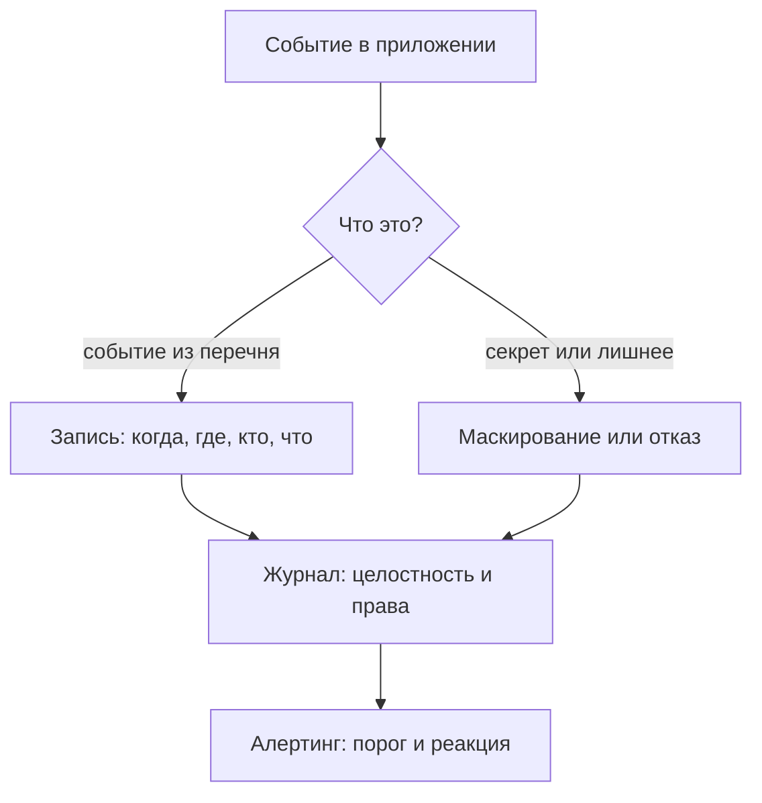

# Логирование и алертинг: что логировать, что нельзя

Админка учебной витрины пишет журнал входов. Попробуйте сами найти лишнее
в двух его строках, до чтения разбора:

```text
2026-09-02T10:14:01 event=login user=anna result=ok password=qwerty2026
2026-09-02T10:14:01 event=session user=anna result=ok token=3fa9c1d2
```

Строки выглядят рабочими: есть время, событие, пользователь и исход. А в
конце каждой — то, чему в журнале не место: пароль пользователя и токен её
сессии. Тот, кто получил файл журнала, заходит под любым пользователем без
единой атаки на само приложение. Такие строки появляются из одного желания
— «побольше данных на случай разбора». У журнала событий безопасности два
зеркальных дефекта: не записал — не увидел инцидент, записал лишнее —
отдал секрет. Дочитав тему, вернитесь к этим строкам и ответьте, что
останется в них вместо пароля и токена, и почему замены разные.

## Подумай, прежде чем читать

1. Вход с неверным паролем: записывать такое событие или нет?
2. У записи о входе есть пользователь и исход. Чего в ней не хватает,
   чтобы по ней можно было расследовать?
3. Кто читает журнал приложения, кроме его разработчика?

Ключевой для всей темы третий вопрос: список читателей журнала длиннее,
чем кажется, и дефект из вступления живёт ровно в этом зазоре.

## Как это работает

**Откуда это взялось.** Программа без журнала отвечает на сбой молчанием:
разбирать нечего. Первое решение, писать всё подряд, ломается о две вещи:
в записях тонет сигнал, а в журнале оседают секреты. Читают такой журнал
все, у кого есть доступ к файлам, сборщикам журналов и резервным копиям.
Ответом стал перечень: какие события пишутся всегда, из чего состоит
запись и что исключено по определению. Этот перечень и даёт Logging Cheat
Sheet проекта OWASP, памятку, где решения о журнале уже приняты и
объяснены.

У дефектов этой темы есть номера из каталога CWE, общего словаря типовых
слабостей, по которому ревьюеры и инструменты называют одни и те же ошибки
одинаково. Недостаточное журналирование — CWE-778: событие случилось, а
записи нет. Запись чувствительных данных в журнал — CWE-532: журнал сам
стал утечкой. Перечень OWASP Top 10, десять самых критичных рисков
веб-приложений (маппинг редакций разбирает тема `owasp-top10`), отвёл этой
паре категорию A09. Издание 2021 года говорило про мониторинг, а издание
2025 года говорит про logging и alerting: журнал без реакции почти
бесполезен.

### Что пишется всегда

Cheat sheet перечисляет события, которые журналируются безусловно: отказы
валидации ввода, успешные и неуспешные входы, отказы авторизации, сбои
управления сессией, ошибки приложения. Дальше по списку: старт и остановка
системы, действия администрирования, доступ к чувствительным данным,
импорт и экспорт. Список закрывает и вопрос «записывать ли отказ входа»
из предвопросов: записывать. Именно серии отказов рисуют подбор пароля и
credential stuffing, то есть подстановку паролей из чужих утечек
(механика — в теме `credential-stuffing`), задолго до успеха атаки.

Успешные события в том же списке не ради полноты. Успешный вход после
серии отказов — это картина взлома, и без записи об успехе серия отказов
читается как шум. То же с действиями администрирования: в норме они редки,
поэтому каждая такая запись читается глазами, а не пролистывается. Журнал, в котором есть только отказы, отвечает на половину
вопросов расследования: «кто вошёл» в нём не найти.

Перечень не означает «пишите всё»: cheat sheet предупреждает о
противоположной поломке, тумане из записей, в котором тонет сигнал. Состав
перечня задаётся на ранних стадиях жизненного цикла приложения, а не по
умолчанию фреймворка. Требования и проектирование идут раньше кода, и
решения о журнале принимаются там же (как устроены стадии, рассказывает
тема `secure-sdlc`).

Это как с электропроводкой в квартире: её размечают до штукатурки стен,
потому что после ремонта новая розетка стоит в десять раз дороже. У
витрины и у банка списки разной длины, и это законно; незаконен список,
которого нет. Перечень пересматривается вместе с приложением: новая
функция приносит новые события, а забытое событие означает потерянное
расследование.

### Из чего состоит запись

У записи четыре обязательных вопроса: когда, где, кто, что. Время события
пишется в международном формате ISO 8601, как в строке из вступления:
`2026-09-02T10:14:01` читается одинаково на любом сервере любой страны.
Место — приложение, служба, адрес; субъект — пользователь или системная
учётная запись; предмет — тип события и его исход. Строка из вступления
отвечает на все четыре — и всё равно дефектна: полнота не отменяет того,
что в ней лишнее. Из того же списка полезны ещё два атрибута,
идентификатор взаимодействия и причина исхода.

Два атрибута стоят отдельного слова. Идентификатор взаимодействия
связывает события одного запроса. Один вызов порождает отказы валидации,
обращение к базе и ответ; без общего номера их сшивает угадывание по
времени. Причина исхода отличает «неверный пароль» от «учётная запись
заблокирована»: для читателя журнала это разные события с разной реакцией.

### Чего в журнале нет никогда

Обратный список у cheat sheet тоже прямой. В журнал не пишутся: пароли,
идентификаторы сессий и токены доступа, ключи шифрования, данные платёжных
карт, строки подключения к базе, персональные данные без основания. Не
«маскируются при возможности» — не записываются. Заменители законны:
вместо токена пишут его отпечаток, по которому запись находится, а открыть
сессию нельзя.

Отпечаток здесь — необратимая свёртка значения: алгоритм вроде SHA-256
считает по строке число, а строку из числа обратно не восстановить.
Соответствие бытовое — отпечаток пальца: по нему человека находят, но сам
палец из отпечатка не собрать. Так и с токеном: записи одной сессии
сшиваются по отпечатку, а войти по нему нельзя. Пример из рабочего кода
лабы: функция `_fingerprint` возвращает первые восемь знаков хеша.

Есть и серая зона между «пишется» и «не пишется никогда»: пути файлов,
внутренние адреса, имена и телефоны. Они полезны при разборе и при этом
рассказывают лишнее об устройстве системы. Cheat sheet предлагает для них
особый режим: обрезка, подмена, обезличивание перед записью. Правило
выбора читается так: если без поля разбор невозможен, поле маскируется;
если возможен — не пишется. Спорное поле маскируется, а не пишется
открытым.

### Сам журнал — тоже граница доверия

Данные, уходящие в запись, приходят из запроса и не доверены. Перевод
строки в имени пользователя печатает вторую запись, которой не было; это
CWE-117, и механика разобрана в теме `crlf-injection`. Дальше журнал
защищается как хранилище. Права на файл решают, кто его читает.
Целостность, то есть защита от незаметной правки, работает как
пронумерованные и прошнурованные страницы бумажного журнала учёта:
вырванный лист виден сразу.

### Куда пишется журнал

Запись — половина вопроса, а вторая половина в том, где она лежит.
Журнал, который живёт только на диске того же сервера, уязвим вместе с
ним: атакующий, получивший хост, правит и журнал. Поэтому записи уходят в
централизованный сбор — отдельную службу, которая принимает журналы со
всех машин по защищённому каналу. Бытовое соответствие — бухгалтерия,
куда все филиалы сдают квитанции: ограбление одного филиала не трогает
общий архив.

Формат записи выбирается читаемым машиной. Структурная запись с
именованными полями, как анкета с графами, парсится сборщиком, а
свободный текст читается только глазами. И время на узлах синхронизируется
по общему источнику: расследование, у которого часы серверов расходятся,
не сходится. Это как показания камер, снявших одно событие в разном
времени: порядок кадров не восстановить.


```mermaid
flowchart TB
    A[Событие в приложении] --> B{Что это?}
    B -- событие из перечня --> C[Запись: когда, где, кто, что]
    B -- секрет или лишнее --> D[Маскирование или отказ]
    C --> E[Журнал: целостность и права]
    D --> E
    E --> F[Алертинг: порог и реакция]
```

**Описание схемы.** Событие приложения проходит фильтр перечня: положенное
пишется с обязательными атрибутами, секрет маскируется или не пишется.
Запись попадает в защищённый журнал, а над журналом стоит алертинг:
пороги и реакция. Без последнего звена журнал — архив, который читают
после инцидента, а не сигнал во время него.

### Зачем категория сменила имя

Издание 2025 пишет это прямо: хороший журнал без оповещения почти не
помогает заметить инцидент. Поэтому A09:2025 — про logging и alerting.
Алертинг — связка «порог плюс получатель»: как только счётчик событий
перешагивает порог, живой человек получает сигнал. Бытовой образ —
банковское SMS о нетипичной операции по карте: операция записана всегда, а
сообщение приходит только тогда, когда она выбивается из нормы. Алертинг
опирается на журнал, а реагирование — на алертинг; следующая тема этапа,
`incident-response`, начинается ровно с этого сигнала.

У категории есть и рабочие детали сверх порога. Слишком частые ложные
сигналы обесценивают алертинг не хуже его отсутствия: настоящий сигнал
тонет среди них. Honeytoken — запись-приманка, которой никто не пользуется
в штатной работе: любое обращение к ней даёт сигнал почти без ложных
срабатываний. Это как папка «зарплаты» на файл-сервере, которой нет в
регламенте: сотрудникам она не нужна, поэтому открывший её — либо
потерявшийся, либо чужой. А сигнал без плейбука теряется. Плейбук —
пошаговая инструкция реагирования, как памятка о пожарной безопасности на
стене: у получателя алерта обязан быть порядок действий, иначе журнал
сработал, а процесс — нет.

**Зачем это в работе AppSec-инженера.** Журнал — единственный источник
ответа на вопрос «что было» при разборе инцидента, и тот же журнал —
частая находка ревизий: секрет в открытом виде. Ревьюер смотрит обе
стороны: записано ли событие и не записано ли лишнего.

## Как это атакуют

Стендом служит лаба темы: вход в админку витрины с журналом в памяти.
Прогон эксплойта против уязвимого файла:

```text
$ python3 hack.py
Цель: code.py
  опыт 1 — пароль, найденный в журнале: 'qwerty2026'
  опыт 2 — отчёт по токену из журнала: 'отчёт для boris: продажи за неделю'
  опыт 3 — поддельных записей в журнале после отказа: 1
ЭКСПЛОЙТ СРАБОТАЛ: журнал отдаёт секреты или принимает подделку.
```

Код возврата 1. Три опыта играют две роли. Первый: пользователь вошёл, его
пароль остался в записи; читатель журнала заходит под ним повторно.
Второй: токен из записи о выдаче открывает чужой отчёт без пароля вовсе.
Третий опыт проверяет доверие к самому журналу: имя пользователя с
переводом строки печатает поддельную запись об успешном входе. Признак
срабатывания во всех трёх — журнал, прочитанный как атакующий, а не как
автор.

Разберём первый опыт по шагам. Атакующий не атакует приложение: вход
совершает сам пользователь, а атакующий читает журнал — по резервной
копии, по доступу к сборщику, по диагностической выгрузке. Пароль в записи
отвечает прямым текстом, и повторный вход с ним неотличим от входа
владельца. Заметьте: дефект сработал даже без ошибки пользователя;
опечатка в пароле оставила бы в журнале почти верный пароль.

Второй опыт короче первого: пароль не нужен вовсе. Токен сессии — это
готовый вход, и запись о его выдаче равносильна передаче сессии читателю
журнала. Отсюда правило списка запретов: в журнал не пишется ничего, чем
можно войти, — ни напрямую, ни на один шаг.

Третий опыт бьёт по доверию к журналу, а не по секретам. Если запись можно
подделать данными из запроса, журнал перестаёт быть доказательством:
строка «успешный вход» в нём ничего не доказывает. Разбор механики
подделки — в теме `crlf-injection`; здесь важно, что защита журнала
принадлежит теме журналирования, а не соседней.

## Как это выглядит в коде

Ревьюер идёт тремя планами: найти вызов записи в журнал, проверить каждый
его аргумент на секрет, проверить очистку данных из запроса. Вот находка
из лабы. До чтения выносок назовите сами, что здесь лишнее:

```python
# УЯЗВИМО — демонстрация, не для продакшена
_log(f"{stamp} event=login user={user} "
     f"result={'ok' if ok else 'fail'} password={password}")   # (1)
_log(f"{stamp} event=session user={user} result=ok "
     f"token={token}")                                          # (2)
```

1. Пароль пишется при любом исходе, и при неудаче тоже: опечатка в
   пароле отличается от него одним символом.
2. Токен сессии в открытом виде: записи достаточно, чтобы войти без
   пароля.

Тот же класс на втором стеке, Node. Проверьте, видите ли вы его без
выноски:

```javascript
// УЯЗВИМО — демонстрация, не для продакшена
console.log(`login ok user=${user} token=${token}`);           // (1)
```

1. Инвариант дефекта — секрет в аргументе журнала; декорация — язык,
   уровень журнала и имя поля. `console.info` вместо `console.log`
   ничего не меняет.

**Что не спасает.** Понижение уровня записи до отладочного: журнал отладки
попадает в те же сборщики. Маскирование только пароля: токен остаётся.
«Журнал не покидает машину»: резервные копии и диагностические выгрузки
возражают.

**Ещё два вида той же находки.** Первый — запись запроса целиком:
заголовки с `Authorization` и тело с полем пароля уходят в журнал одним
вызовом, и секрет прячется внутри большого объекта. Второй — стектрейс со
строкой подключения: исключение базы данных печатается в журнал вместе с
параметрами подключения, и ключ оказывается в записи об ошибке. Оба вида
проходят ревизию чаще листинга из лабы: ни имени `password` в строке
вызова, ни намерения записать секрет там нет.

**Ложные срабатывания.** Запись логина пользователя законна — это атрибут
«кто». Отпечаток токена законен: по нему запись находится, а сессию он не
открывает. Запись причины отказа («неверный пароль») законна; запись
самого неверного пароля — нет.

Отдельная пометка для ревизии: находка ищется не только по имени поля.
Словарь секретных имён (`password`, `token`, `secret`, `api_key`) даёт
первый прогон; дальше читается контекст — что за переменная попала в
аргумент и откуда она пришла. Запись `f"order {order}"` с объектом заказа
может отдать в журнал всё содержимое заказа, включая адрес доставки, без
единого запретного слова.

## Как защититься

Починка лабы состоит из трёх движений, и все три видны в паре листингов:

```python
# Исправлено
_log(f"{stamp} event=login user={_clean(user)} "
     f"result={'ok' if ok else 'fail'} password=***")           # (1)
_log(f"{stamp} event=session user={_clean(user)} result=ok "
     f"token_fp={_fingerprint(token)}")                         # (2)
```

1. Пароль заменён маской: сам факт поля задокументирован, значение
   отсутствует.
2. Токен заменён отпечатком: записи одной сессии связываются, а открыть
   её отпечатком нельзя. Функция `_clean` убирает из данных символы CR и
   LF, и поддельная строка из опыта 3 перестаёт печататься.

Замены разные, потому что разная судьба значений. Пароль нужен приложению
один раз, в момент проверки, и после неё бесполезен даже самой системе:
в записи остаётся только факт поля, маска. Токен после выдачи связывает
события сессии, и разбору нужна эта связка: токену нужен заменитель,
который сшивает записи и не открывает сессию, отпечаток. Вернитесь к
строкам из вступления: первая чинится маской, вторая — отпечатком, и это
ответ на вопрос «почему замены разные».

Порядок читается из списка запретов: сначала исключить секреты, потом
проверить атрибуты, потом защитить сам журнал. Алертинг стоит над этим: у
отказов входа есть порог, у превышения — получатель.

Два приёма делают починку устойчивой. Первый — единая функция записи: весь
журнал проходит через один модуль, и список запретов проверяется в одном
месте, а не в каждом вызове. Второй — структурный формат: запись с
именованными полями не даёт склеить секрет в свободный текст незаметно.
Уровни журнала при этом не защита, а организация: уровень записи решает,
где она увидена, а не что в ней лежит.

**Границы применимости.** Полное исключение спорно там, где секрет —
предмет разбора. Отладка обмена токенами идёт по отпечаткам и
идентификаторам, а не по значениям; цена — лишнее время разбора.
Персональные данные — отдельный законный вопрос: логин пользователя в
журнале уже персональные данные, и сроки хранения журнала регулируются не
только техникой. Третий край — среда разработки: там подробность
допустима, но журнал разработки не должен уезжать в общие сборщики.

Четвёртая граница — сам журнал как ресурс. Запись стоит места и времени, и
cheat sheet требует проверять журнал на истощение: поток записей не должен
заполнить диск или обогнать сборщик. Атака на доступность через журнал
реальна: запросы, порождающие записи, бесплатны для атакующего и платны
для вас. Поэтому у журнала есть квоты и ротация, то есть расписание, по
которому старые файлы архивируются и удаляются. А событие «журнал
остановился» само журналируется, иначе тишина неотличима от штиля.

## Как убедиться, что защита работает

**Ретест.** Тот же эксплойт против исправленного файла:

```text
$ LAB_TARGET=solution.py python3 hack.py
Цель: solution.py
  опыт 1 — пароль, найденный в журнале: '***'
  опыт 2 — токена в журнале нет
  опыт 3 — поддельных записей в журнале после отказа: 0
ЭКСПЛОЙТ НЕ СРАБОТАЛ: ни пароля, ни токена, ни поддельной строки …
```

Конец последней строки вывода сокращён многоточием; в терминале она
заканчивается словами «в журнале нет». Код возврата 0. Опыт 1 печатает
маску, и повторный вход по ней не проходит: это и есть наблюдаемый
признак починки.

**Регресс.** Одиннадцать проверок tests.py: вход и отказ, отчёт по токену,
отказ чужого токена, запись об отказе с четырьмя атрибутами. Они зелёные
на обоих файлах, то есть починка не съела функциональность журнала. В
репозитории проекта регрессом служит тест, который пишет событие и читает
журнал: секрета в записи нет, атрибуты на месте.

**Негативные кейсы — что должно продолжать работать.** Вход с верным
паролем, отчёт по токену, запись отказа с логином и исходом. Самое частое
осложнение после такой починки — скрипты разбора, которые ждали старое имя
поля: отпечаток токена живёт под другим ключом, и потребителей журнала
предупреждают заранее.

Проверке помогает чтение журнала целиком, а не точечно. Откройте запись о
входе после починки и прочитайте её как чужую: нельзя ли по ней войти,
поднять права, понять устройство системы. Этот же вопрос задаётся при
ревизии чужого кода, и это быстрее, чем искать вызовы журнала по одному.

На ревью пройдите по списку.

1. Проверьте, что входы и отказы входов журналируются, включая причину
   отказа (CWE-778).
2. Проверьте, что у записи есть время, место, субъект и исход события.
3. Проверьте, что в журнал не пишутся пароли, токены, ключи и данные карт;
   заменители — маска или отпечаток (CWE-532).
4. Проверьте, что данные из запроса очищаются от CR и LF перед записью
   (CWE-117).
5. Проверьте, что у критичных событий есть порог и получатель алерта
   (A09:2025).
6. Проверьте, что журнал защищён как хранилище: права, целостность,
   защищённая передача.
7. Проверьте, что персональные данные в журнале имеют основание и срок
   хранения.

## Как это находят инструменты

Дефект виден по присутствию секрета в аргументе журнала, и статика ловит
его именем. Правило для Semgrep:

```yaml
rules:
  - id: log-sensitive-value
    languages: [python]
    severity: WARNING
    message: Возможная запись секрета в журнал — проверьте аргументы
    patterns:
      - pattern-regex: (?i)(password|token|secret|passwd)=\{
```

Правило ловит интерполяцию поля с именем секрета: `password={...}` и
`token={...}` из блока «Как это выглядит в коде». Маску `password=***` и
отпечаток `token_fp={...}` оно не ловит, и исправленный файл проходит.

**Что оно пропустит.** Секрет под другим именем (`key`, `auth`,
`session_id`), запись через переменную-посредника, секрет в данных без
имени поля. **Какой шум даст:** законная строка `password={masked}` и
конфигурация с шаблоном. Поэтому правило — сигнал для ревью, а не гейт:
пропусков у него больше, чем находок, и об этом честно пишут в
комментарии к правилу.

Снаружи приложения статика не видит и обратного дефекта: недостаточное
журналирование не читается по коду; его видно по отсутствию записей.
Проверяется оно прогоном: вызвать отказ входа и найти его в журнале.
Именно этот прогон и делает лаба, поэтому ручная проверка здесь не
запасной вариант, а основной.

## Частая ошибка

Свой ответ — до чужого: журнал лежит на своём сервере, доступа снаружи
нет — значит ли это, что писать в него можно что угодно?

Чужой ответ строится на границе периметра: журнал внутренний, до него нет
доступа снаружи, поэтому писать в него можно что угодно.

**У журнала больше читателей, чем у кода.** Механизм из блока «Как это
работает»: журнал уходит в сборщики, резервные копии и диагностические
выгрузки; читают его администраторы, поддержка и подрядчики. Каждый
читатель — доверенный канал, о котором автор строки не думал.

Контрпример из категории A09:2025: оператор детского страхового плана не
обнаружил взлом семь лет — журналирования и мониторинга не было. Обратная
сторона той же ловушки — журнал с паролями: утечка резервной копии отдаёт
не записи о входах, а сами входы. Третий сценарий категории про штраф
после утечки платёжных записей. Журнал, в котором лежало лишнее,
превращает инцидент в отчётный случай с ценой в деньгах.

## Попробуй сам

**Цель одной фразой:** добиться, чтобы
`pilot/lab/security-logging/hack.py` вышел с кодом 0, а `tests.py`
продолжил выходить с кодом 0.

Лаба повторяет руками блок «Как это атакуют»: вход в админку витрины пишет
журнал, эксплойт читает его глазами атакующего — пароль, токен, поддельная
строка.

Формат — Secure Code Game: чинится `code.py`, эксплойт и функциональные
тесты лежат рядом. Нужен Python 3.9 или новее, сеть не нужна, права root
не нужны. Секции «Запуск», «Сброс» и «Удаление» — в `README.md` каталога.

Подсказка даётся одна: посмотрите на журнал глазами того, кто получил
только его. Чем можно войти, того в записи быть не должно; токену нужен
заменитель, который находит запись и не открывает сессию.

Рабочий цикл: прочитайте `code.py`, прогоните `hack.py` и посмотрите на
три опыта. Найдите вызовы записи в журнал и решите для каждого поля, чему
там место. После правки прогоните обе проверки: эксплойт обязан перестать
срабатывать, тесты — продолжить проходить. Если зелёное получилось
удалением записи целиком, это не починка, а потеря журнала: второй край
темы.

**Отдельная задача «почини».** Журнал обязан остаться журналом: отказ
входа пишется с атрибутами «когда, кто, что, исход», отчёт по настоящему
токену открывается. Наблюдаемый критерий: `tests.py` печатает «Упало
проверок: 0», а `hack.py` — «ЭКСПЛОЙТ НЕ СРАБОТАЛ».

Решение — `solution.py` в том же каталоге, открыто без условий.

## Проверь себя

1. Вызов журнала из чужого кода:

   ```python
   # УЯЗВИМО — демонстрация, не для продакшена
   def handle(request):
       _log(f"event=request user={request.user} "
            f"headers={request.headers}")
   ```

   Что уйдёт в журнал лишнего — назовите конкретное поле?

2. Запись печатает и пароль, и токен:

   ```text
   2026-10-01T08:02:11 event=login user=boris result=fail password=Tg7#kLp2
   ```

   Выберите починку:

   А. Перевести такие записи на уровень отладки: в боевом журнале их не
   будет.

   Б. Замаскировать пароль («password=***»), токен оставить: по нему
   ведут разбор.

   В. Пароль заменить маской, токен — отпечатком, ввод чистить от CR
   и LF.

3. Почему отказ входа журналируется всегда, хотя событие штатное?

4. Эксплойт лабы прогнали против исправленного файла. Что ответит
   `hack.py` и с каким кодом выйдет?

5. Возврат к теме `crlf-injection`: почему имя пользователя нельзя писать
   в журнал как есть?

6. Возврат к теме `owasp-top10`: категория этой темы в отчёте названа
   «A09» без года. Что в ней сменилось между изданиями и почему номер без
   года неверен?

<details markdown="1">
<summary>Ответ 1</summary>

1. Заголовки целиком, а с ними `Authorization` — токен уходит в журнал
   внутри большого объекта. Имени `password` в вызове нет, поэтому
   словарный прогон такую строку не поймает: находка читается по контексту
   — что за переменная попала в аргумент и откуда пришла.

</details>

<details markdown="1">
<summary>Ответ 2: разбор вариантов</summary>

2. Верна В.

   А. Неверно. Уровень решает, где запись увидена, а не что в ней лежит:
   журнал отладки попадает в те же сборщики и резервные копии.

   Б. Неверно. Токен открывает сессию без пароля: запись о его выдаче
   равна передаче сессии читателю журнала. Маскирование одного пароля —
   из списка «что не спасает».

   В. Верно. Маска фиксирует сам факт поля, отпечаток связывает записи
   одной сессии, не открывая её, а чистка CR и LF закрывает подделку
   записи (CWE-117).

</details>

<details markdown="1">
<summary>Ответ 3</summary>

3. Именно отказы рисуют подбор пароля и credential stuffing задолго до
   успеха атаки. А успешный вход после серии отказов — картина взлома; без
   записей об отказах она читается как шум.

</details>

<details markdown="1">
<summary>Ответ 4</summary>

4. Опыт 1 печатает маску, опыт 2 — «токена в журнале нет», опыт 3 —
   «поддельных записей: 0»; в конце «ЭКСПЛОЙТ НЕ СРАБОТАЛ», код возврата
   0. Прогон: `cd pilot/lab/security-logging && LAB_TARGET=solution.py
   python3 hack.py; echo $?`.

</details>

<details markdown="1">
<summary>Ответ 5</summary>

5. Перевод строки в данных печатает вторую запись, которой не было:
   журнал принимает подделку и перестаёт быть доказательством. Поэтому
   данные из запроса чистятся от CR и LF перед записью.

</details>

<details markdown="1">
<summary>Ответ 6</summary>

6. Monitoring сменён на Alerting: журнал без оповещения почти не помогает
   заметить инцидент. Номер без года неверен, потому что редакции
   расходятся: под одним номером в 2021 и 2025 живут разные категории, и
   ссылка печатается с годом.

</details>

## Источники

1. OWASP Top 10:2025, A09 Security Logging and Alerting Failures;
   реестр `owasp-top10-a09-2025`. Разделы: описание категории, маппинг
   CWE, сценарии с последствиями, меры — включая алертинг, honeytokens
   и плейбуки.
   <https://owasp.org/Top10/2025/A09_2025-Security_Logging_and_Alerting_Failures/>
2. OWASP Logging Cheat Sheet; реестр `owasp-cs-logging`. Разделы: Which
   events to log, Event attributes (когда, где, кто, что), Data to
   exclude, Event collection (очистка CR/LF), защита журнала.
   <https://cheatsheetseries.owasp.org/cheatsheets/Logging_Cheat_Sheet.html>

Каркас этапа: этап 5 опирается на открытые документы методов; стендов нет.

**Скоропортящийся слой.** Списки событий и запретов у cheat sheet живые и
дополняются; состав категории A09 пересматривается с редакцией перечня.
Перечень «когда, где, кто, что» и запрет секретов в журнале стабильны.

**Маркеры уверенности.** Перечень событий, атрибуты записи, список
исключений и меры защиты журнала — **по документации** (оба источника
открыты лично 2026-09-02). Смена имени категории и её обоснование — по
тексту A09:2025. Лаба прогнана лично 2026-10-03: `hack.py` даёт код 1 на
`code.py` и 0 на `solution.py`, `tests.py` зелёный в обоих случаях.
Правило Semgrep 1.174.0 прогнано на файлах лабы в тот же день: две находки
на `code.py`, ноль на `solution.py` — маска и отпечаток не ловятся.
