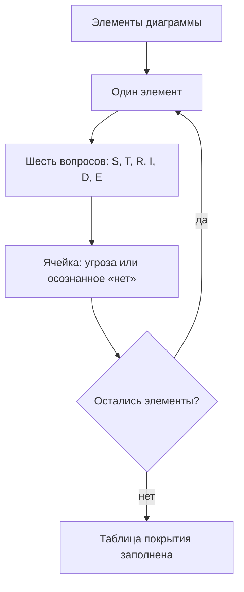

# STRIDE — перебор угроз по категориям

Диаграмма учебной витрины из темы `threat-modeling` уже нарисована, и
сессия дошла до вопроса «что может пойти не так». Дальше обычно
начинается свободный разговор — про подбор пароля, про кражу cookie, —
и через двадцать минут идеи заканчиваются вместе с уверенностью, что
угрозы тоже закончились. Вот как на ту же форму входа отвечает перебор
по шести категориям:

```text
форма входа: S — украсть учётные данные; T — подменить запрос;
R — стереть следы в журнале; I — прочитать чужой профиль;
D — заблокировать вход перебором; E — войти администратором
```

Шесть строк на один элемент — это и есть весь приём, и называется он
STRIDE. Каждая буква — категория, то есть целый род угроз против одного
свойства системы. Строка остаётся пустой только там, где по этому роду
осознанно решили «здесь нет». Читайте шесть строк как шесть вопросов:
не «что здесь плохого», а «что здесь плохого этого рода». Проделайте
тот же перебор мысленно для потока с cookie сессии: какая строка
наполнится первой, а какая останется осознанным «нет»?

## Шесть категорий и шесть свойств

Слово STRIDE — мнемоника: приём запоминания, при котором набор терминов
складывается в одно слово из первых букв, как цвета радуги складываются
в «каждый охотник желает знать». Здесь буквы раскрываются в английские
названия категорий: Spoofing, Tampering, Repudiation, Information
Disclosure, Denial of Service, Elevation of Privilege. Мнемоника
работает как список покупок на ладони: шесть букв держатся в голове
сами, а за каждой стоит вопрос к элементу диаграммы.

Шесть категорий с нарушаемыми свойствами — по двум документам:
соответствие категорий и свойств взято из cheat sheet OWASP, описания
категорий — из документации Microsoft:

| Категория | Нарушает | Пример |
|---|---|---|
| Подделка личности (S) | аутентификация | Украденный токен выдаёт чужого |
| Подделка данных (T) | целостность | Запись в базе изменена |
| Отказ от содеянного (R) | учёт действий | Журнал подчищен |
| Раскрытие информации (I) | конфиденциальность | Чужой профиль прочитан |
| Отказ в обслуживании (D) | доступность | Вход заблокирован перебором |
| Повышение прав (E) | авторизация | Роль изменена подделкой |

Таблица сжата до строки на категорию. Каждую стоит разобрать отдельно:
что это за род угроз, какое свойство он ломает и как это выглядит вне
компьютера.

**Подделка личности (S, spoofing).** Атакующий выдаёт себя за другого:
украденный токен сессии открывает чужой кабинет без всякого пароля.
Категория ломает аутентификацию — способность системы ответить на
вопрос, кто перед ней. Бытовой пример — звонок «из банка» с подменённым
номером: телефон верит номеру из сети, а не голосу в трубке. Номер
здесь соответствует токену, а голос — настоящему владельцу.

**Подделка данных (T, tampering).** Данные меняет тот, кому их менять
не положено: запись в базе изменена после того, как её туда положили.
Ломаемое свойство называется целостность: данные остаются ровно теми,
какими их сохранили. Целостность ломается без чтения — сумму в
платёжном поручении можно исправить, не показывая документ никому.
Поэтому «никто не видел» не значит «никто не менял».

**Отказ от содеянного (R, repudiation).** Участник отрицает своё
действие, а доказать обратное нечем: журнал подчищен или его не было
вовсе. Свойство — учёт действий; в англоязычных источниках оно
называется non-repudiation, неотрекаемость. По записям системы
восстанавливается, кто что сделал. Бытовой пример — покупка без
кассового чека: продавец отрицает сделку, и спорить нечем. Чек
соответствует записи в журнале, а его отсутствие — подчищенному
журналу.

**Раскрытие информации (I, information disclosure).** Данные прочитал
тот, кому они не предназначались: чужой профиль открылся по прямой
ссылке. Свойство — конфиденциальность: данные видны только тем, кому
положено. Из быта — письмо в прозрачном конверте: его читают, не
вскрывая, и отправитель об этом не узнает.

**Отказ в обслуживании (D, denial of service).** Система жива, но
работать с ней нельзя: вход заблокирован перебором, и владелец учётной
записи не попадает в собственный кабинет. Свойство — доступность:
система отвечает тем, кому должна. Пример есть в каждом телефоне: после
десяти неверных пин-кодов экран блокируется. Механизм защищает от
перебора, но тот, кто ошибся десять раз намеренно, отнял телефон у
владельца, ничего не взломав.

**Повышение прав (E, elevation of privilege).** Обычный пользователь
получает то, что положено администратору: роль в его записи изменена
подделкой. Свойство — авторизация: аутентификация отвечает на вопрос
«кто перед нами», а авторизация — «что ему можно». Из быта — карта
гостя в отеле, которая открывает все номера, а не только свой.

Категория и угроза — не одно и то же. Категория — класс, род; угроза —
предложение про конкретный элемент этой диаграммы. «Подделка личности»
— категория; «украденная cookie открывает кабинет» — угроза этой
категории на этой витрине. В реестр из темы `threat-modeling` пишется
второе: класс сам по себе не чинится, а предложение про элемент
чинится.

**Зачем это в работе AppSec-инженера.** Перебор без систематики
заканчивается, когда кончилась фантазия, и отличить этот момент от
«угроз больше нет» невозможно. Таблица «категория × элемент» делает
конец видимым: пустая ячейка — это записанное решение, а не
забывчивость. Такую таблицу на ревью проверяет посторонний: ему не
нужно верить чужой фантазии, он считает заполненность.

## Как это работает

**Откуда это взялось.** Метод сессии из темы `threat-modeling` требует
перебирать угрозы по диаграмме и не говорит, как не пропустить. Ответ
придумала Microsoft для своего инструмента моделирования угроз,
Microsoft Threat Modeling Tool: программа ведёт диаграмму и предлагает
угрозы по шести категориям. Сессия там считается пройденной, когда по
элементу отвечены все шесть букв. Документация инструмента — первый
источник темы.

Второй источник — каталог SEI: Software Engineering Institute,
институт при университете Карнеги-Меллон, ведущий обзоры методов
моделирования. Каталог добавляет два факта: метод зрелый и больше не
развивается, а уточнённые варианты метода сужают перебор. Первый,
per-element, — до типа элемента; второй, per-interaction, — до
взаимодействия между парой элементов. К чему сужение приводит,
разобрано в разделе «Как запустить».

Категория превращается в вопрос по нарушаемому свойству, а не по
примеру из таблицы. У процесса, принимающего ввод, спрашивают «можно ли
выдать себя за другого» — и строка S наполняется даже там, куда пример
про украденный токен не подошёл. Пример закрывает глаза на всё, чего в
нём нет. Свойство применимо всегда, потому что оно про устройство
элемента, а не про чужую картинку.

Осталось ещё одно различие — категория и метод. STRIDE — не метод
моделирования, а приём внутри метода: категории не заменяют диаграмму,
а работают по ней. Без диаграммы перебирать нечего — шесть вопросов
задаются элементу, и по неполной схеме они пройдут по неполному списку
так же исправно.

## Что умеет и чего не умеет

**Что умеет.** Сделать конец перебора видимым: сессия кончается, когда
кончились элементы, а не идеи. Дать угрозам общий словарь на шесть
букв: строка «форма входа, S» читается без расшифровки любым, кто
прошёл эту тему. Показать пропуск как пустую ячейку: таблица хранит и
то, чего не нашли, — но только если «нет» записано явно.

**Чего не умеет.** Ранжировать: приоритет — это вероятность и ущерб из
темы `threat-modeling`, а не буква, и угроза из строки R бывает дороже
угрозы из строки E. Находить угрозы вне своих шести классов: сценарий
«поменять цену перед заказом» лежит в бизнес-правиле, и за ним — в тему
`attack-trees-abuse-cases`. Не отвечает метод и за диаграмму: по
неполной схеме перебор пройдёт полностью, а найдено будет только то,
что на схему попало.

## Как запустить

Порядок на сессии из темы `threat-modeling`:

1. Возьмите один элемент диаграммы.
2. Задайте по нему шесть вопросов — по одному на категорию.
3. Запишите в каждую ячейку угрозу или осознанное «нет».
4. Переходите к следующему элементу; конец наступает, когда кончились
   элементы, а не идеи.



**Описание схемы.** Цикл перебора читается сверху вниз. Из списка
элементов диаграммы берётся один, по нему задаются шесть вопросов по
буквам STRIDE, и каждая ячейка заполняется угрозой или осознанным
«нет». Ромб-развилка возвращает к следующему элементу, пока элементы не
кончатся; после этого таблица покрытия считается заполненной.

Вариант per-element сужает вопросы по типу элемента: у хранилища свои
категории первыми, у потока — свои. Вариант per-interaction сужает
иначе — по взаимодействию: вопросы задаются не узлу, а обмену между
двумя узлами. Начинать с узких вариантов не нужно: полные шесть
вопросов читаются за минуту. А пропуск категории, которая «этому типу
не свойственна», — то самое слепое пятно, ради отлова которого таблица
и ведётся.

## Как читать вывод

Произведённое методом — таблица «категория × элемент», и читается она
тремя проходами.

Первый проход — по строкам и пустотам. Строка без единой записи значит
одно из двух: элемент не подвержен, и это записано явно, или его не
разбирали. Пустая ячейка без пометки «нет» от пропуска неотличима,
поэтому «нет» пишется явно — это решение, а не молчание.

Второй проход — по буквам. Категории, которых нет во всей таблице,
говорят о слепом пятне сессии. Реестр без единого R почти наверняка
означает, что про журналы не спросили, а не что журналы в порядке. В
свободном разговоре про журналы не вспоминают, поэтому пустой столбец
R — первый кандидат на перепроверку.

Третий проход — по ответам. У строки реестра из темы `threat-modeling`
обязательны и категория, и ответ: угроза без ответа недописана, риск
назван, а делать с ним нечего. Покрытие считается после того, как
закрыты все поля строки реестра, включая ответ. В бланке лабы поле
ответа отсутствует нарочно — там четыре колонки: тип элемента, граница
доверия, категория и формулировка, — и ответ назначается следующим
шагом сессии.

## Границы метода

Первая граница: категории — подсказки, а не механика. «Подделка данных»
говорит, что вопрос про подделку задать надо, но не говорит, как
подделывается запрос в вашем протоколе. Ответ на «как» лежит в темах
про сами классы дефектов, а не в шести буквах.

Вторая: STRIDE не ранжирует и не мерит. Строка таблицы — кандидат, а
не риск: буква говорит, какое свойство сломано, и молчит о цене
поломки. Риск появляется после оценки вероятности и ущерба, и делается
это отдельным шагом сессии.

Третья: метод больше не развивается, каталог SEI фиксирует это прямо.
Следствие практическое: списки угроз, встроенные в инструменты по шести
буквам, стареют вместе с методом. Свежесть такого списка проверяется
отдельно, а не принимается на веру вместе с инструментом.

Четвёртая: предметная область. Шесть букв не спрашивают «а можно ли так
по смыслу». Правило «цену назначает магазин» живёт в бизнес-логике, а
не в свойствах данных и действий; разбор этой границы с контрпримером —
в разделе «Частая ошибка».

## Частая ошибка

Все шесть строк заполнены у каждого элемента — сессию можно закрывать,
и всё найдено. Ответьте себе «да» или «нет» — и держите ответ, пока
читаете.

**Полнота таблицы — это полнота относительно шести классов и этой
диаграммы, не более.** Механизм из раздела «Как это работает»:
категория покрывает своё свойство, а не предметную область.

Контрпример: перебор по всем шести буквам про витрину не спросит, можно
ли поменять цену товара перед заказом. Каждая буква проверяет свойство
— кто перед нами, целы ли данные, видны ли они, — а здесь нарушено
правило «цену назначает магазин», то есть смысл операции. Такой сценарий
называется злоупотреблением, и ответ ему — в теме
`attack-trees-abuse-cases`. Вывод рабочий: заполненная таблица
закрывает перебор по категориям, а сессия моделирования продолжается
другими техниками.

## Чеклист для ревью

1. Проверьте, что перебор шёл по категориям по каждому элементу
   диаграммы, а не свободно.
2. Проверьте, что у каждой ячейки стоит угроза или осознанное «нет».
3. Проверьте, что категории, пустые по всей таблице, перепроверены
   отдельно.
4. Проверьте, что угроза названа предложением об элементе, а не именем
   категории.
5. Проверьте, что приоритет назначается не буквой, а вероятностью и
   ущербом — тема `threat-modeling`.

## Попробуй сам

Возьмите диаграмму учебной витрины из лабы темы `threat-modeling`:
шесть элементов там уже названы. Переберите один элемент по всем шести
категориям: в каждую ячейку — угрозу своими словами или осознанное
«нет». Одна подсказка: читайте категорию по нарушаемому свойству, а не
по примерам из таблицы. Пример закрывает глаза на всё, чего в нём нет.

**Критерий выполнения** наблюдаемый: шесть ячеек заполнены, и хотя бы
одна содержит «нет» с причиной.

## Проверь себя

1. Таблица покрытия после сессии по двум элементам:

   ```text
   элемент        S  T  R  I  D  E
   форма входа    +  +  .  +  +  +
   cookie сессии  +  +  .  .  .  .
   ```

   Что скажет чтение этой таблицы по буквам?

2. Почему категорию читают по нарушаемому свойству, а не по примеру из
   таблицы категорий?

3. В лабе темы `threat-modeling` бланк заполнен по примерам, а не по
   свойствам — у формы входа стоит «подделка данных»:

   ```text
   форма входа,процесс,да,T,перебор учётных данных
   ```

   Что ответит `check.py` этой строке и с каким кодом завершится прогон?

4. Возврат к теме `threat-modeling`: в каком месте процесса стоит
   перебор по категориям и что обязано быть готово до него?

5. Возврат к теме `crlf-injection`: перевод строки в имени пользователя
   печатает в журнал поддельную запись об успешном входе. Под какой
   буквой пройдёт эта угроза при переборе хранилища «журнал» и почему?

<details markdown="1">
<summary>Ответ 1</summary>

1. Категория R пуста по всей таблице — про журналы, похоже, не
   спрашивали: реестр без единого R говорит о слепом пятне сессии, а не
   о здоровье журналов. А пустые ячейки без пометки «нет» неотличимы от
   пропусков: непонятно, решили ли по ним «здесь нет» или не дошли.

</details>

<details markdown="1">
<summary>Ответ 2</summary>

2. Пример закрывает глаза на всё, чего в нём нет: у формы входа по
   примеру «запись в базе изменена» можно пропустить подделку личности.
   Свойство применимо всегда: у процесса, принимающего ввод, спрашивают
   «можно ли выдать себя за другого» — и строка S наполняется.

</details>

<details markdown="1">
<summary>Ответ 3</summary>

3. По строке одно расхождение: «форма входа: stride «T», эталон «S» —
   подделать личность дешевле всего через вход»; прогон кончается «не
   зачтено», код 1. Проверялка читает категорию по свойству: форма входа
   — про «выдать себя за другого». Прогон: `cd pilot/lab/threat-modeling
   && python3 check.py; echo $?` после такой правки бланка.

</details>

<details markdown="1">
<summary>Ответ 4</summary>

4. После декомпозиции и диаграммы: перебор идёт по её элементам, и без
   диаграммы категории перебирают пустоту. До него — описание системы
   от того, кто её знает; после — приоритеты и ответы на угрозы.

</details>

<details markdown="1">
<summary>Ответ 5</summary>

5. Под R — отказ от содеянного: запись журнала перестаёт соответствовать
   действию, и журнал больше не учёт, а чужой текст. Сам перевод строки
   в данных — механика из `crlf-injection`; здесь важно, что свойство
   «учёт действий» ломается без всякой чистки журнала атакующим.

</details>

## Источники

1. Threats — Microsoft Threat Modeling Tool, документация Microsoft;
   реестр `ms-stride`. Разделы: шесть категорий с описанием каждой.
   <https://learn.microsoft.com/en-us/azure/security/develop/threat-modeling-tool-threats>
2. OWASP Threat Modeling Cheat Sheet; реестр `owasp-cs-threat-modeling`.
   Разделы: категории против нарушаемых свойств, примеры, место STRIDE в
   процессе.
   <https://cheatsheetseries.owasp.org/cheatsheets/Threat_Modeling_Cheat_Sheet.html>
3. Threat Modeling: 12 Available Methods, каталог SEI; реестр
   `sei-threat-modeling-methods`. Разделы: зрелость STRIDE, конец его
   развития у Microsoft, варианты per-element и per-interaction.
   <https://www.sei.cmu.edu/blog/threat-modeling-12-available-methods/>

Каркас этапа: этап 5 опирается на открытые документы методов; стендов
нет.

**Скоропортящийся слой.** Формулировки категорий стабильны десятилетия;
список угроз в инструментах стареет вместе с ними. Каталог SEI
фиксирует, что метод больше не развивается, — при ревизии темы это
перечитывается.

**Маркеры уверенности.** Шесть категорий, их свойства и примеры — **по
документации** (обе страницы открыты лично 2026-09-01: таблица свойств
из cheat sheet, описания категорий со страницы Microsoft). Замечание
про прекращение развития — по каталогу SEI (тот же день). Прогон
перебора по витрине — из лабы темы `threat-modeling`, прогнанной
2026-09-01. Прогон из вопроса 3 повторён 2026-10-03 на копии лабы: одно
расхождение по строке формы входа, «не зачтено», код 1 — совпало
дословно.
