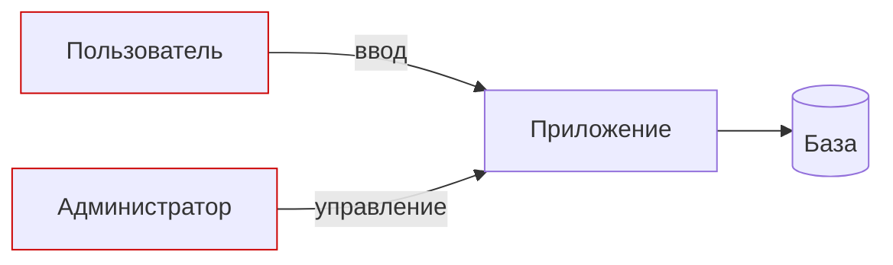

# Моделирование угроз: DFD и границы доверия

Уровень **L1** · время 75 мин (теория 35 / лаба 30 / самопроверка 10,
оценка)

Сессия моделирования по учебной витрине (та же, что в лабе этапа 1
про SQL-инъекции). Вход — описание приложения, выход — реестр. Вот его
две строки:

```text
поле поиска  | поток | граница: да | T | ввод меняет запрос к базе
форма входа  | процесс | граница: да | S | кража учётных данных
```

Две строки несут весь метод. У элемента диаграммы есть тип, он стоит или
не стоит на границе доверия, у него есть угроза с категорией и с
ответом. Если вы обсуждали с командой «а что если сюда придёт мусор» —
вы моделировали угрозы без названия. Дальше — метод целиком и сессия
руками в лабе.

Обе строки — из эталона лабы этой темы, тексты угроз сокращены.
Первая читается как подделка данных (ввод становится запросом),
вторая — как подделка личности. Категория — буква из шести, и что значит
каждая, разбирает тема `stride`; здесь важно, что у строки реестра она
стоит всегда, а не когда вспомнили. По ней же потом считается покрытие: шесть категорий по шести
элементам — это тридцать шесть вопросов, а не «на что хватило фантазии».

Реестр — это ответ на
вопрос «что может пойти не так», записанный так, что к нему можно
вернуться. Прочитайте две строки ещё раз в обратную сторону. У каждой
угрозы есть место на схеме и есть решение. Без
первого угроза повисает в воздухе, без второго — в списке пожеланий.

Тема стоит первой в этапе неслучайно: метод с четырёх вопросов держит на
себе темы про перебор по категориям, деревья атак и дизайн-ревью позже в
маршруте. Кто прошёл сессию руками, тому остальное — техника вокруг
уже знакомого круга.

## 0. Коротко

Моделирование угроз —
структурированный ответ на четыре вопроса: над чем работаем, что может
пойти не так, что с этим делаем, достаточно ли хорошо вышло. Прикладная
форма: приложение раскладывается в диаграмму потоков данных с границами
доверия, по каждому элементу выявляются угрозы, у каждой угрозы есть
ответ из четырёх законных. Метод не находит то, чего нет на диаграмме,
и единого отраслевого стандарта процесса нет — оба предела называет сам
cheat sheet. Результат сессии — диаграмма и реестр угроз с ответами,
а не отчёт о том, что сессия была. То же в терминах, которыми это
обсуждают.

**Зачем это в работе AppSec-инженера.** Это единственная точка процесса,
где дефект дизайна стоит дешево: поменять схему до кода — это строка в
документе, а не исправление в проде. Найденное здесь чинится в темах
про сами дефекты: угроза инъекции из примера выше — в `sqli-basics`,
угроза доступа к чужому разделу — в `idor`.

## 1. Цели

После этого раздела вы сможете:

1. Провести сессию моделирования: от архитектуры к реестру угроз.
2. Нарисовать DFD с границами доверия и назвать каждый элемент.
3. Назначить каждой угрозе ответ из четырёх законных.
4. Проверить реестр на полноту относительно диаграммы.

## 2. Предвопросы

Ответьте до чтения, даже если не уверены. Цена догадки видна будет в
механике.

1. У приложения нет ни одного уязвимого компонента по сканеру. Что
   моделирование угроз найдёт сверх этого?
2. Диаграмма не менялась два года, система за это время выросла. Чего
   стоит реестр угроз, построенный на ней?
3. Кому на сессии нужнее всего место: разработчику, безопаснику или
   владельцу продукта?

Второй вопрос — главный из трёх. Если ответ на него «столько же, сколько
стоила система два года назад», реестр уже расходится с реальностью, и
остальное читается иначе.

## 3. Механика

**Откуда это взялось.** Тестирование находит дефекты в написанном;
вопрос «а не того ли мы вообще строим» оно не задаёт. Цена дефекта
дизайна растёт по ходу проекта, поэтому анализ перенесли в начало —
на схему, которую дешево менять. Метод собран не по стандарту: cheat
sheet прямо пишет, что единого отраслевого стандарта процесса нет, и
предлагает четыре шага, общие для всех подходов. Отсутствие стандарта —
не недостаток документа, а честная рамка: способов несколько, и выбор
между ними — предмет соседних тем этого подраздела.

### Четыре вопроса и четыре шага

Манифест моделирования угроз задаёт процесс четырьмя вопросами: над чем
работаем, что может пойти не так, что с этим делаем, достаточно ли
хорошо вышло. Cheat sheet раскладывает их в шаги: декомпозиция
приложения, выявление и ранжирование угроз, меры, проверка и валидация.
Первый шаг — не про угрозы вовсе: он про систему.

Декомпозиция — самостоятельная работа, а не подготовка к ней. Пока
система не разложена на узлы и потоки, ответ на «что может пойти не так»
угадывается. Cheat sheet называет то, что обязано попасть на диаграмму:
границы доверия, потоки данных, хранилища, процессы, внешние сущности.
Каждый пропущенный класс элементов — это класс угроз, которых не будет
в реестре.

Выявление — перебор по элементам диаграммы, а не свободный разговор.
Свободный разговор заканчивается, когда кончились идеи; перебор — когда
кончились элементы. Поэтому у метода и есть техники перебора, и они
вынесены в отдельные темы: `stride` и `attack-trees-abuse-cases`.
Формулировка угрозы при этом остаётся предложением: кто, чего достаёт,
как и чем это кончается.

### Диаграмма и её элементы

Диаграмма потоков данных собирается из четырёх обозначений: внешняя
сущность, процесс, хранилище данных, поток данных. Пятый элемент —
граница доверия — не узел, а линия: там, где данные переходят между
узлами с разным уровнем доверия. Практически вся выявляющая сила метода
сидит в этой линии: угрозы живут на переходах.

Граница читается одним вопросом: кто контролирует то, что по ту сторону?
Пользовательский ввод пересекает границу всегда; вызов между двумя своими
процессами — нет. Прокси, завершающий защищённый канал, стоит на границе
сам.



**Описание схемы.** Внешние сущности слева — пользователь и
администратор, обе за границей доверия. Приложение и база — внутри.
Каждая стрелка, пересекающая границу, — место, где будут перебираться
угрозы.

### Декомпозиция на примере

Разложим учебную витрину из лабы. Узлы: пользователь, обратный прокси,
приложение, база SQLite, администратор. Потоки: ввод в поиск, логин и
пароль, cookie сессии обратно, чтение таблицы товаров, вход в админку.
Границы: между пользователем и прокси, между прокси и приложением, между
администратором и приложением. Хранилище — база — внутри своей границы,
но резервных копий нет: потеря базы — потеря витрины, и это тоже угроза
(доступность).

Уже на этом раскладе видны три находки, которые сканер не покажет.
Невыпущенные товары читаются при неправильной проверке прав. Пароли
лежат в базе, которая никак не защищена сверх прав файла. У админки
граница общая с витриной. Все три — предмет тем этапа 1, и связь
названа: механика инъекции — в `sqli-basics`, доступ к чужому — в
`idor`. Какое хранилище вашего приложения стоит внутри своей границы
и всё равно несёт угрозу, как база витрины здесь?

### От угрозы к ответу

Выявленная угроза без ответа — не результат. Ответов законных четыре
(cheat sheet называет их по Адаму Шостаку): ослабить (мера снижает
вероятность), устранить (функцию убрали), перенести (ответственность
уходит другому), принять (с обоснованием). Пятый вариант — «подумаем
потом» — в списке отсутствует: это отказ от ответа, и реестр его не
держит.

### Ранжирование

Угроз без приоритета не бывает мало. Ранжируют по произведению
вероятности и ущерба; cheat sheet честно оговаривает, что обе величины
оцениваются, а не измеряются, и что часть практиков добавляет туда цену
исправления. Для реестра важна не формула, а порядок: угрозы одного
ранга должны быть сопоставимы, иначе реестр читается по настроению.

### Цена процесса и его ценности

Манифест добавляет к четырём вопросам ценности, и они читаются как
ответ на типовой провал. Культура поиска дефектов дизайна важнее
формального соответствия; люди и сотрудничество важнее процессов и
инструментов; модель дорабатывается непрерывно, а не сдаётся разово.
Сессия, которая кончается документом «на полку», противоречит трём из
них сразу.

### Чем рисовать и откуда брать угрозы

Инструмент диаграммы не решает метод: годится и доска, и draw.io, и
Threat Dragon от OWASP, и модель как код (pytm). Решает форма хранения:
диаграмма, которую нельзя поправить, устареет раньше реестра. Для
выявления угроз cheat sheet называет источники: перебор по категориям,
собственный словарь атак, накопленный по проектам, и внешние каталоги.
Угроза «из головы одного участника» — самый слабый из них, и лаба ниже
показывает почему: шесть элементов с разметкой держат сессию в рамках.

## 4. Что умеет и чего не умеет

Умеет: найти дефект дизайна до кода, дать угрозам общий словарь и
приоритет, оставить документ, с которым решение проверяется позже.
Не умеет: найти то, чего нет на диаграмме (неполная модель неполна),
заменить тестирование и ревизию кода, гарантировать полноту перебора.
Полноту даёт техника перебора, и это темы `stride` и
`attack-trees-abuse-cases`.

По первому пункту отдельно. Найденный на схеме дефект — не доказательство
«у нас безопасно», а гипотеза «вот где сломается». Она дешевле теста именно
ценой точности: часть реестра окажется ложной, и это нормально. Цена
ложной угрозы на схеме невысока; цена пропущенной в проде — та самая,
ради которой сессия и ставится.

По второму: метод отвечает «что может пойти не так», а не «что пойдёт».
Реестр — карта для ревизий и тестов, а не их замена; граница с проверкой
реализации проводится в теме `owasp-asvs`: там требования, здесь — угрозы.

Из обоих пунктов следует рабочее правило цены: метод дешевле теста, пока
диаграмма верна. Верность диаграммы — единственное, что нельзя уступить:
угрозу можно переоценить и исправить, узел, которого нет, не находится
ничем. Поэтому первый час сессии тратится на схему, а не на перебор.

Третья граница — круг: модель пишется о системе, а система включает
людей и процессы. Фишинг администратора витрины не виден ни на одной
диаграмме потоков, и реестр о нём молчит. Метод не скрывает этого: он его
не покрывает, и реестр обязан называть свой край. Фишинг остаётся за
этим краем.

## 5. Как запустить

Сессия по учебному приложению, порядок из cheat sheet:

1. Соберите описание системы от того, кто её знает: узлы, потоки,
   хранилища, внешние лица.
2. Нарисуйте DFD и проведите границы доверия. Ошибка здесь обесценивает
   всё дальше — проверяйте диаграмму с владельцем системы.
3. По каждому элементу переберите угрозы (техника — тема `stride`).
4. Расставьте приоритет по вероятности и ущербу; назначьте каждой
   угрозе ответ из четырёх.
5. Проверьте реестр с заинтересованными сторонами и оставьте его там,
   где его читают.

Пятый шаг отличается от предыдущих: он не про угрозы. Реестр, который
проверили с владельцем системы и положили в доступное место, живёт;
реестр, который «готов, лежит у меня», умирает вместе с сессией. Поэтому
время на него закладывается в сессию, а не остаётся после неё.

Вход сессии — архитектура приложения, выход — диаграмма и реестр. Время
на учебную витрину — час; на живой сервис — день с повторениями.
Повторения не признак неудачи: вопрос «достаточно ли хорошо вышло» по
устройству требует второго прохода, и манифест прямо ценит доработку
выше разовой сдачи.

Ошибка обратного рода — бесконечная сессия. Манифест отвечает ей рамкой:
итерации ограничены по охвату, модель дорабатывается по частям. Реестр
на треть системы лучше идеального реестра, который не начат: первая
сессия узкая и законченная, вторая шире.

Состав сессии решает больше, чем техника. Один безопасник переберёт
категории и напишет реестр сам — и ошибётся там, где не знал предмета.
Cheat sheet прямо советует звать на сессию не только безопасность:
владелец системы знает, что важно; разработчик знает, как устроено;
безопасник знает, как ломается. Анти-паттерн из манифеста — «сделает
тот, у кого особый склад ума»: моделирование не требует его, оно требует
тех, кто знает систему.

Из этого следует практическая форма: сессия — это не доклад, а разбор
по очереди. Ведущий читает элемент диаграммы вслух, участники называют
угрозы, писарь заносит в реестр без оценки «на лету». Оценка позже и
отдельно: смешение выявления с оценкой режет сессию пополам — каждая
угроза начинает обсуждаться, а не записываться.

Три типовые ошибки первой сессии, все из списка выше. Первая: диаграмму
рисуют по коду, а не по устройству — и теряют узлы, которых в коде не
видно (резервные копии, внешние службы). Вторая: границы доверия не
проводят вовсе — тогда реестр неотличим от списка тревог. Третья: угрозы
пишут без ответа «на потом» — и «потом» не наступает.

## 6. Как читать вывод

Результат — реестр угроз, а не диаграмма. Строка реестра читается по
четырём полям: элемент, граница, категория, ответ. У строки без ответа
реестр не закрыт. У строки «принято» обязано быть обоснование — иначе
это «подумали потом». Диаграмма при этом не выбрасывается: по ней
проверяется полнота, и без неё реестр нечитаем — угроза без места на
схеме не обсуждается.

Второй документ — сама диаграмма: по ней проверяется полнота. Каждый
элемент диаграммы встречается в реестре хотя бы раз. Элемент, которого
в реестре нет, — либо осознанное «угроз нет», либо пропуск. Парность из
оглавления этапа видна именно здесь: одна система с проведённой границей
доверия и одна без неё дают два разных реестра. Во втором реестре угроз
на переходе нет.

Проверка итога идёт вопросами, и они у cheat sheet перечислены. Верна ли
диаграмма тому, кто систему знает? Все ли угрозы с ответом, и у мер —
проверяемая форма? Лежит ли реестр там, где его читают? Ответ «да, но
документ никто не открывал с тех пор» — это «нет»: реестр, который не
читают, не работает.

Отдельно читается сама форма меры. «Усилить аутентификацию» мерой не
считается: она не строится и не проверяется. Мера читается как
требование с критерием: «вход в админку требует второго фактора» —
строится, «проверяется отказом без него» — проверяется. Именно поэтому
cheat sheet отправляет за мерами к каталогам требований: тема
`owasp-asvs` даёт им готовую формулировку с номером.

Прочитайте вводные две строки реестра по этой мерке. У первой меры видна
форма: «ввод меняет запрос» чинится требованием с номером и проверкой.
У второй — тоже. Реестр, у строк которого нет такого продолжения,
остаётся списком тревог: угрозы названы, а делать с ними нечего.

## 7. Границы метода

Метод не находит того, чего нет на диаграмме: забытый узел — забытые
угрозы, и это главный канал ошибки. Модель устаревает вместе с системой:
реестр годичной давности без пересмотра — отчёт о прошлом. Метод не даёт
чисел: вероятность и ущерб в нём — оценка, а не замер. И он не заменяет
проверку реализации: угроза, закрытая на схеме, проверяется в коде темами
этапов 1–3.

Две оговорки тоньше. Первая: метод не выбирает технику перебора за вас —
STRIDE, деревья атак, сценарии злоупотребления подходят под разные
системы, и выбор между ними — темы `stride` и `attack-trees-abuse-cases`.
Вторая: реестр пишется тем, кто в зале, и слепые пятна зала становятся
слепыми пятнами реестра. Поэтому состав сессии — часть метода, а не
логистика.

## 8. Ловушка

Сессия проведена, документ принят — модель есть? Заблуждение: модель
угроз — документ, который пишут
один раз под аудит и убирают.

**Модель живёт вместе с системой или не живёт вовсе.** Механизм из блока
«Механика»: реестр привязан к диаграмме, а система меняется — реестр без
пересмотра расходится с ней молча. Признак мёртвой модели читается без
инструментов: дата последнего пересмотра старше последнего релиза.

Контрпример: витрина из лабы выросла: появилась выгрузка отчётов в файл.
Реестр двухлетней давности её не содержит, и угроза на новом потоке
осталась незамеченной — при том, что «модель угроз есть». Обратная форма
той же ловушки — сессия ради галочки: диаграмма нарисована по шаблону,
не читая систему, и реестр совпадает с прошлым проектом слово в слово.

## 9. Чеклист ревью

1. Verify that у системы есть актуальная диаграмма с границами доверия.
2. Verify that каждый элемент диаграммы встречается в реестре угроз.
3. Verify that у каждой угрозы назначен один из четырёх ответов, а у
   «принято» — обоснование.
4. Verify that реестр пересматривается при изменении системы, а не лежит
   с прошлого года.
5. Verify that меры из реестра превращены в требования или задачи —
   иначе это не меры, а пожелания.
6. Verify that в сессии были не только безопасники: владелец системы и
   разработчики.
7. Verify that техника перебора выбрана и названа (категории, деревья,
   сценарии), а не «смотрели по списку».
8. Verify that у реестра есть владелец, отвечающий за его жизнь после
   сессии.

## 10. Лаба

**Цель одной фразой:** добиться, чтобы
`pilot/lab/threat-modeling/check.py` вышел с кодом 0.

Формат — задача чтения: по описанию учебной витрины (`app.md`) бланк
`answers.csv` заполняется реестром угроз — тип элемента, граница
доверия, категория, формулировка. Сети и стенда нет. Секции «Запуск»,
«Сброс» и «Удаление» — в `README.md` каталога.

Бланк повторяет блок «Как читать вывод»: шесть элементов витрины,
и у каждого четыре поля реестра. Проверялка сверяет тип, границу и
категорию с разметкой; формулировка угрозы остаётся вашей и проверяется
только на непустоту — реестр пишут словами, а не кодом. Парность темы
видна и здесь: тот же бланк без проведённых границ даст другой реестр,
и проверялка это ловит.

Подсказка даётся одна: сначала диаграмма и границы, потом категории —
элемент на границе читается иначе, чем внутри. Таблица товаров стоит
внутри своей границы и всё равно несёт угрозу. Реестр без таких строк
неполон в другую сторону.

Рабочий цикл: прочитать описание витрины, нарисовать диаграмму (бумага
годится), провести границы, заполнить бланк по шести элементам, прогнать
проверялку. Расхождение печатается построчно с эталоном и обоснованием
из разметки — читайте его как ответ на вопрос «почему иначе».

**Отдельная задача «почини».** Бланк пуст: «не зачтено» на нём — норма
стартовой точки. Критерий починки наблюдаемый: шесть элементов
размечены, у каждого своя формулировка угрозы.

Решение — `solution.csv` в том же каталоге, открыто без условий. Читайте
его после своей попытки: эталон показывает не единственно верные строки,
а полные — и разница видна именно в сравнении.

## 11. Проверь себя

1. Назовите четыре вопроса манифеста и четыре шага cheat sheet — как
   они соотносятся?
2. Чем граница доверия отличается от узла диаграммы и почему угрозы
   живут на ней?
3. Какие четыре ответа законны для выявленной угрозы и какого в списке
   нет?
4. Реестр полон, но на диаграмме нет прокси. Что это означает?
5. Чем выявление по категориям отличается от свободного перебора — и где
   это разбирается?

<details markdown="1">
<summary>Ответы</summary>

1. Шаги — это вопросы в работе: декомпозиция отвечает «над чем
   работаем», выявление — «что может пойти не так», меры — «что делаем»,
   проверка — «достаточно ли хорошо вышло».
2. Граница — линия между узлами с разным уровнем доверия, а не элемент.
   Угрозы живут на переходах, потому что там контроль меняет хозяина.
3. Ослабить, устранить, перенести, принять. Нет в списке «отложить» —
   это отказ от ответа.
4. Пропуск в модели: реестр полон относительно неполной диаграммы.
   Полнота проверяется от диаграммы, а не от реестра.
5. Категории задают систематику перебора — тема `stride`; альтернативы —
   тема `attack-trees-abuse-cases`.

</details>

> **Примечание.** Вопросов на возврат к прошлым темам здесь нет: тема
> открывает этап, предпосылок у неё нет.

## 12. Источники

1. OWASP Threat Modeling Cheat Sheet; реестр `owasp-cs-threat-modeling`.
   Разделы: четыре шага процесса, DFD и границы доверия, ответы на
   угрозы, оговорка об отсутствии единого стандарта.
   <https://cheatsheetseries.owasp.org/cheatsheets/Threat_Modeling_Cheat_Sheet.html>
2. Threat Modeling Manifesto; реестр `threat-modeling-manifesto`.
   Разделы: четыре вопроса, ценности и принципы.
   <https://www.threatmodelingmanifesto.org/>

Каркас этапа: этап 5 опирается на открытые документы методов; стендов
нет.

**Скоропортящийся слой.** Оба документа живые; четыре вопроса и четыре
ответа стабильны. Инструменты диаграмм перечислены у cheat sheet и
меняются чаще всего.

**Маркеры уверенности.** Четыре вопроса, четыре шага, элементы DFD,
ответы на угрозы и пределы метода — **по документации** (обе страницы
открыты лично 2026-09-01, у манифеста сверены и принципы). Лаба прогнана
лично 2026-09-01: пустой бланк даёт расхождения по всем шести строкам,
эталон — «зачтено». Сессия на живом проекте автором не проводилась —
содержание подтверждено документами и лабой, не практикой.
