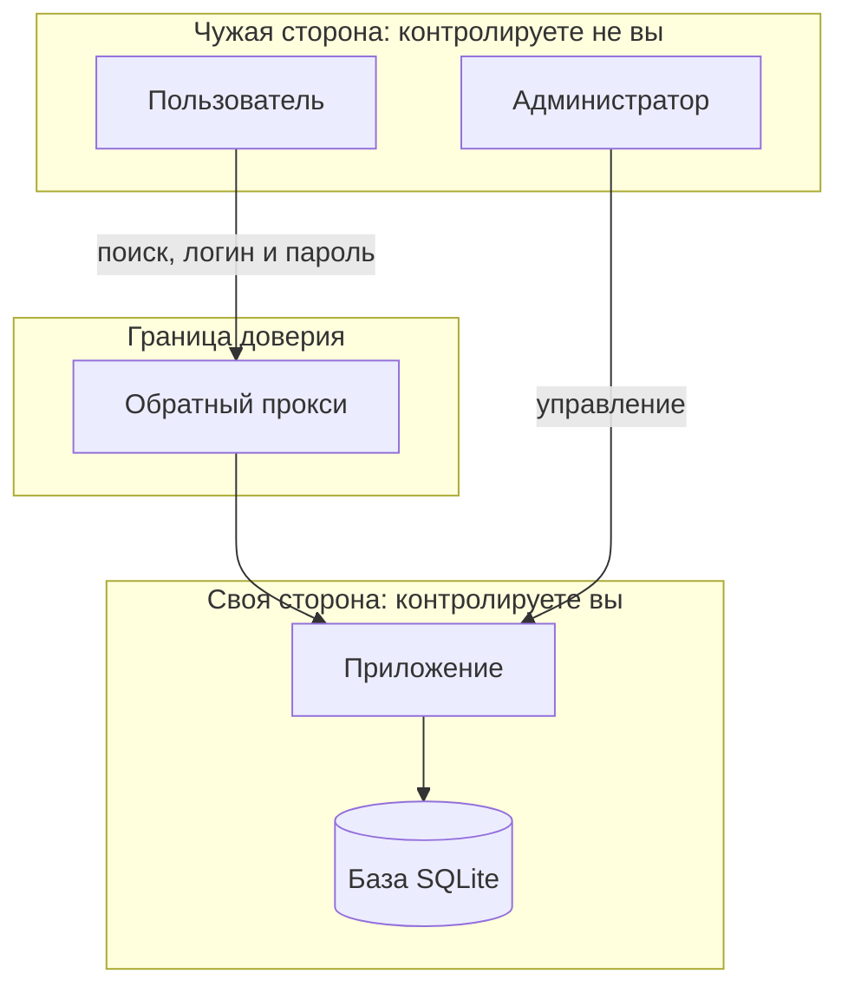

# Моделирование угроз: DFD и границы доверия

Четыре этапа гайдбука вы искали дефекты в уже написанном: в коде, в
конфигурации, в сборке. У такого поиска есть общий предел: дефект
находится, только если его кто-то успел написать. Эта тема начинает
работу раньше — кода ещё нет, есть замысел системы, а дефекты в нём уже
сидят. Ниже две строки из результата такой работы. Объект — учебная
витрина, то же приложение-магазин, что в лабе темы `sqli-basics` этапа 1.

```text
поле поиска  | поток | граница: да | T | ввод меняет запрос к базе
форма входа  | процесс | граница: да | S | кража учётных данных
```

Это реестр угроз: таблица, где у каждой находки есть место на схеме
системы и есть решение. Строки взяты из эталона лабы этой темы и
сокращены дважды: урезаны тексты угроз и опущена последняя колонка с
ответом на каждую. Вторая колонка — тип элемента на схеме системы; все
типы разберёт раздел «Диаграмма и её элементы». Третья — стоит ли
элемент на границе доверия: ей посвящён отдельный абзац там же. Первая
строка читается как подделка данных: ввод пользователя становится частью
запроса к базе. Вторая — как подделка личности: украденные учётные
данные открывают кабинет.

Прочитайте обе строки ещё раз в обратную сторону. У каждой угрозы есть
место на схеме и есть решение: без первого угроза повисает в воздухе,
без второго — в списке пожеланий.

Буква в четвёртой колонке — категория угрозы. В методике STRIDE угрозы
делят на шесть классов по первым буквам английских названий. Так, S —
spoofing, подделка личности, а T — tampering, подделка данных; остальные
четыре разбирает тема `stride`. Здесь важно, что категория у строки
стоит всегда, а не когда вспомнили. По ней потом считается покрытие. У
витрины из лабы элементов шесть, и шесть категорий по шести элементам —
это тридцать шесть вопросов, а не «на что хватило фантазии».

Если вы обсуждали с командой «а что если сюда придёт мусор», вы
моделировали угрозы без названия. Отличие метода от такого разговора
одно: его результат проверяем. Реестр сверяется с диаграммой, а
диаграмма — с самой системой.

## Что такое моделирование угроз

Моделирование угроз — способ найти дефект дизайна до того, как написан
код. Метод отвечает на четыре вопроса: над чем работаем, что может
пойти не так, что с этим делаем, достаточно ли хорошо вышло. Ответ
записывается так, чтобы к нему можно было вернуться. Приложение
раскладывается в схему, по каждому элементу схемы выявляются угрозы, и
у каждой угрозы появляется ответ из четырёх законных. Вот и всё
устройство метода; остальное — техника вокруг этого круга.

Бытовой пример — план квартиры перед ремонтом. Перенести розетку на
чертеже — движение карандаша. Перенести её в готовой стене —
штробление, пыль и деньги. В этом соответствии план — схема системы,
розетка — проектное решение, ремонт — написанный код. Ломается аналогия
на видимости. Розетку в готовой стене хотя бы видно глазами, а дефект
дизайна из готовой системы глазами не читается. Поэтому без отдельного
метода его находят последним — в эксплуатации, когда дороже всего.

За методом стоит жизненный цикл разработки: у любой системы есть фазы
замысла, проектирования, кода, проверки и эксплуатации. По-английски
цикл называют SDLC, и этап 5 гайдбука, который вы открыли, о том, как
безопасность встроена в каждую фазу. Моделирование угроз живёт в самой
ранней из них — в проектировании, где изменение дешевле всего. Как
устроен цикл целиком, разбирает тема `secure-sdlc` дальше по маршруту.

**Зачем это в работе AppSec-инженера.** Это единственная точка процесса,
где дефект дизайна стоит дешево: поменять схему до кода — строка в
документе, а не исправление в работающем продукте. Найденное здесь
чинится в темах про сами дефекты: угроза инъекции из первой строки
реестра — в `sqli-basics`, угроза доступа к чужому разделу — в `idor`.
Тема стоит первой в этапе неслучайно. Метод с четырёх вопросов держит
на себе и перебор по категориям (`stride`), и деревья атак
(`attack-trees-abuse-cases`), и риск-ориентированный разбор из семи
стадий (`pasta`). Кто прошёл сессию руками, тому остальное — техника
вокруг уже знакомого круга.

## Подумай, прежде чем читать

1. У приложения нет ни одного уязвимого компонента по сканеру. Что
   моделирование угроз найдёт сверх этого?
2. Диаграмма не менялась два года, система за это время выросла. Чего
   стоит реестр угроз, построенный на ней?
3. Кому на сессии нужнее всего место: разработчику, безопаснику или
   владельцу продукта?

Второй вопрос — главный из трёх. Если ответ на него «столько же, сколько
стоила система два года назад», реестр уже расходится с реальностью, и
остальное читается иначе.

## Как это работает

**Откуда это взялось.** Тестирование находит дефекты в написанном, но
вопроса «а не того ли мы вообще строим» оно не задаёт. Цена дефекта
дизайна растёт по ходу проекта, поэтому анализ перенесли в начало — на
схему, которую дёшево менять.

Метод описан в двух открытых документах. Cheat sheet от OWASP — рабочая
памятка: серия таких листов собирает приёмы по одному на документ.
Threat Modeling Manifesto — короткий текст сообщества о ценностях и
принципах метода. Единого отраслевого стандарта процесса нет, и cheat
sheet говорит это прямо. Вместо стандарта он предлагает четыре шага,
общие для всех подходов. Отсутствие стандарта — не недостаток документа,
а честная рамка: способов несколько, и выбор между ними — предмет
соседних тем этого этапа.

### Четыре вопроса и четыре шага

Манифест задаёт процесс четырьмя вопросами: над чем работаем, что может
пойти не так, что с этим делаем, достаточно ли хорошо вышло. Cheat sheet
раскладывает их в шаги: декомпозиция приложения, выявление и
ранжирование угроз, меры против угроз, проверка результата. Первый шаг —
не про угрозы вовсе. Он про систему.

Декомпозиция — разбор системы на части: узлы, которые считают и помнят,
и потоки, по которым едут данные. Это самостоятельная работа, а не
подготовка к ней. Пока система не разложена, ответ на «что может пойти
не так» угадывается. Cheat sheet называет то, что обязано попасть на
диаграмму: границы доверия, потоки данных, хранилища, процессы, внешние
сущности. Каждый пропущенный класс элементов — это класс угроз, которых
не будет в реестре.

Выявление — перебор по элементам диаграммы, а не свободный разговор.
Свободный разговор заканчивается, когда кончились идеи; перебор — когда
кончились элементы. Поэтому у метода есть техники перебора, и они
вынесены в отдельные темы. Перебор шести категорий по каждому элементу —
это `stride`, а ход от цели атакующего и от неверного использования
функции — `attack-trees-abuse-cases`. Формулировка угрозы при этом
остаётся предложением: кто, чего достаёт, как и чем это кончается.

### Диаграмма и её элементы

Схема системы здесь — диаграмма потоков данных, или DFD. Она показывает,
куда в системе едут данные, и не содержит кода вовсе. Обозначений
четыре. Внешняя сущность — тот, кто снаружи: пользователь, чужая служба.
Процесс — то, что считает: ваше приложение. Хранилище данных — то, что
помнит: база, файл. Поток данных — стрелка, по которой данные едут от
одного узла к другому.

Пятый элемент — граница доверия, и это не узел, а линия. Она проходит
там, где данные переходят между узлами с разным уровнем доверия.
Бытовой образ — досмотр в аэропорту. По одну сторону линии вещи чужие и
непроверенные, по другую — свои. Всё, что пересекает линию, идёт через
сканер, потому что пересечение само по себе — повод для проверки. В
системе роль сканера играют проверки ввода на элементе, который стоит на
границе. Практически вся выявляющая сила метода сидит в этой линии:
угрозы живут на переходах.

Граница читается одним вопросом: кто контролирует то, что по ту сторону?
Пользовательский ввод пересекает границу всегда. Вызов между двумя
своими процессами — нет, потому что по обе стороны один хозяин. Прокси,
завершающий защищённый канал TLS (Transport Layer Security; устройство
разбирает `tls-and-proxy`), стоит на границе сам. По одну его сторону
трафик чужой, по другую — уже ваш.


```mermaid
flowchart TB
    subgraph OUT["Чужая сторона: контролируете не вы"]
        U["Пользователь"]
        A["Администратор"]
    end
    subgraph MID["Граница доверия"]
        X["Обратный прокси"]
    end
    subgraph IN["Своя сторона: контролируете вы"]
        P["Приложение"]
        D[("База SQLite")]
    end
    U -->|"поиск, логин и пароль"| X
    X --> P
    A -->|"управление"| P
    P --> D
```

**Описание схемы.** Учебная витрина, разложенная на элементы DFD.
Пользователь и администратор — внешние сущности, они за границей:
пришедшее от них системе не принадлежит. Обратный прокси — посредник,
который принимает запросы от имени приложения и завершает TLS, поэтому
он стоит на самой границе и первым встречает чужой ввод. Приложение и
база — внутри. Каждая стрелка, пересекающая линию границы, — место, где
на сессии будут перебираться угрозы.

### Декомпозиция на примере

Разложим учебную витрину из лабы по этим обозначениям. Узлы:
пользователь, обратный прокси, приложение, база SQLite, администратор.
Потоки: ввод в поиск, логин и пароль, cookie сессии обратно, чтение
таблицы товаров, вход в админку, где видны и невыпущенные товары. Границы: между пользователем и прокси,
между прокси и приложением, между администратором и приложением.
Хранилище, то есть база, стоит внутри своей границы. Резервных копий у
неё нет, поэтому потеря базы — потеря витрины, а это тоже угроза, только
категории доступности.

Уже на этом раскладе видны три находки, которые сканер не покажет.
Невыпущенные товары читаются при неправильной проверке прав. Пароли
лежат в базе, которая никак не защищена сверх прав файла. У админки
граница общая с витриной. Все три — предмет тем этапа 1, и связь
прямая: механика инъекции разобрана в `sqli-basics`, доступ к чужому — в
`idor`. Какое хранилище вашего приложения стоит внутри своей границы и
всё равно несёт угрозу, как база витрины здесь?

### От угрозы к ответу

Выявленная угроза без ответа — не результат. Ответов законных четыре, и
cheat sheet называет их по Адаму Шостаку, одному из авторов метода.
Ослабить: мера снижает вероятность, например второй фактор на входе в
админку. Устранить: функцию убрали, и угрозы на ней больше нет.
Перенести: ответственность уходит другому, скажем защита от подбора
паролей переезжает внешнему фильтрующему сервису перед приложением. Принять: риск остаётся, но с
записанным обоснованием. Пятого варианта «подумаем потом» в списке нет:
это отказ от ответа, и реестр его не держит.

### Ранжирование

Угроз без приоритета не бывает мало. Ранжируют по произведению
вероятности и ущерба: что вероятнее и больнее, то раньше. Cheat sheet
честно оговаривает, что обе величины оцениваются, а не измеряются, и что
часть практиков добавляет сюда цену исправления. Для реестра важна не
формула, а порядок. Угрозы одного ранга должны быть сопоставимы, иначе
реестр читается по настроению.

### Цена процесса и его ценности

Манифест добавляет к четырём вопросам ценности, и они читаются как ответ
на типовой провал. Культура поиска дефектов дизайна важнее формального
соответствия. Люди и сотрудничество важнее процессов и инструментов.
Модель дорабатывается непрерывно, а не сдаётся разово. Сессия, которая
кончается документом «на полку», противоречит трём из них сразу.

### Чем рисовать и откуда брать угрозы

Инструмент диаграммы не решает метод. Годится и доска, и draw.io —
бесплатный редактор диаграмм, и Threat Dragon от OWASP — программа для
рисования диаграмм угроз, и модель как код на pytm. Решает форма хранения: диаграмма, которую
нельзя поправить, устареет раньше реестра. Для выявления угроз cheat
sheet называет источники: перебор по категориям, собственный словарь
атак, накопленный по проектам, и внешние каталоги. Угроза «из головы
одного участника» — самый слабый источник из них. Лаба дальше показывает
почему: шесть элементов с разметкой держат сессию в рамках.

## Что умеет и чего не умеет

Умеет три вещи. Найти дефект дизайна до кода. Дать угрозам общий словарь
и приоритет. Оставить документ, с которым решение проверяется позже. Не
умеет тоже три. Не находит то, чего нет на диаграмме: неполная модель
неполна. Не заменяет тестирование и ревизию кода. Не гарантирует
полноту перебора: полноту даёт техника, и это темы `stride` и
`attack-trees-abuse-cases`.

По первому «не умеет» отдельно. Найденный на схеме дефект — не
доказательство «у нас безопасно», а гипотеза «вот где сломается». Она
дешевле теста именно ценой точности: часть реестра окажется ложной, и
это нормально. Цена ложной угрозы на схеме невысока. Цена пропущенной в
работающей системе — та самая, ради которой сессия и ставится.

По второму: метод отвечает «что может пойти не так», а не «что пойдёт».
Реестр — карта для ревизий и тестов, а не их замена. Граница с проверкой
реализации проводится в теме `owasp-asvs`: там требования, здесь —
угрозы.

Из обоих пунктов следует рабочее правило цены: метод дешевле теста, пока
диаграмма верна. Верность диаграммы — единственное, что нельзя уступить.
Угрозу можно переоценить и исправить, а узел, которого нет на схеме, не
находится ничем. Поэтому первый час сессии тратится на схему, а не на
перебор.

Третья граница — круг: модель пишется о системе, а система включает людей
и процессы. Фишинг администратора витрины — обманное письмо или
страница, выманивающая пароль, — не виден ни на одной диаграмме потоков,
и реестр о нём молчит. Метод не скрывает этого: он его не покрывает, и
реестр обязан называть свой край. Фишинг остаётся за этим краем.

## Как запустить

Рабочая форма метода — сессия: встреча на час или день, где команда
проходит шаги вместе. У сессии есть ведущий, который держит порядок, и
писарь, который записывает. Порядок из cheat sheet для учебного
приложения такой:

1. Соберите описание системы от того, кто её знает: узлы, потоки,
   хранилища, внешние лица.
2. Нарисуйте DFD и проведите границы доверия. Ошибка здесь обесценивает
   всё дальше, поэтому диаграмму проверяйте с владельцем системы.
3. По каждому элементу переберите угрозы; техника перебора — тема
   `stride`.
4. Расставьте приоритет по вероятности и ущербу и назначьте каждой
   угрозе ответ из четырёх.
5. Проверьте реестр с заинтересованными сторонами — владельцем системы
   и разработчиками — и оставьте его там, где его читают.

Пятый шаг отличается от предыдущих: он не про угрозы. Реестр, который
проверили с владельцем системы и положили в доступное место, живёт.
Реестр, который «готов, лежит у меня», умирает вместе с сессией. Поэтому
время на него закладывается в сессию, а не остаётся после неё.

Вход сессии — архитектура приложения, выход — диаграмма и реестр. Время
на учебную витрину — час, на живой сервис — день с повторениями.
Повторения не признак неудачи: вопрос «достаточно ли хорошо вышло» по
устройству требует второго прохода, и манифест прямо ценит доработку
выше разовой сдачи.

Ошибка обратного рода — бесконечная сессия. Манифест отвечает ей рамкой:
итерации ограничены по охвату, модель дорабатывается по частям. Реестр
на треть системы лучше идеального реестра, который не начат. Первая
сессия узкая и законченная, вторая шире.

Состав сессии решает больше, чем техника. Один безопасник переберёт
категории и напишет реестр сам — и ошибётся там, где не знал предмета.
Cheat sheet прямо советует звать на сессию не только безопасность.
Владелец системы знает, что важно. Разработчик знает, как устроено.
Безопасник знает, как ломается. Анти-паттерн из манифеста — «сделает
тот, у кого особый склад ума». Моделирование не требует особого склада,
оно требует тех, кто знает систему.

Из этого следует практическая форма: сессия — не доклад, а разбор по
очереди. Ведущий читает элемент диаграммы вслух, участники называют
угрозы, писарь заносит в реестр без оценки «на лету». Оценка идёт позже
и отдельно. Смешение выявления с оценкой режет сессию пополам: каждая
угроза начинает обсуждаться, а не записываться.

Три типовые ошибки первой сессии, все из списка выше. Первая: диаграмму
рисуют по коду, а не по устройству — и теряют узлы, которых в коде не
видно, например резервные копии и внешние службы. Вторая: границы
доверия не проводят вовсе, и тогда реестр неотличим от списка тревог.
Третья: угрозы пишут без ответа «на потом», и «потом» не наступает.

## Как читать вывод

Результат сессии — диаграмма и реестр угроз с ответами, а не отчёт о
том, что сессия была. Строка реестра читается по четырём полям: элемент,
граница, категория, ответ. У строки без ответа реестр не закрыт. У
строки «принято» обязано быть обоснование, иначе это то самое «подумаем
потом». Диаграмма при этом не выбрасывается: без неё реестр нечитаем,
потому что угроза без места на схеме не обсуждается.

Второй документ — сама диаграмма: по ней проверяется полнота. Каждый
элемент диаграммы встречается в реестре хотя бы раз. Элемент, которого в
реестре нет, — либо осознанное «угроз нет», либо пропуск. Одна и та же
система с проведённой границей доверия и без неё даёт два разных
реестра: во втором угроз на переходе нет.

Проверка итога идёт вопросами, и cheat sheet их перечисляет. Верна ли
диаграмма тому, кто систему знает? Все ли угрозы с ответом, и у мер —
проверяемая форма? Лежит ли реестр там, где его читают? Ответ «да, но
документ никто не открывал с тех пор» — это «нет»: реестр, который не
читают, не работает.

Отдельно читается сама форма меры. «Усилить аутентификацию» мерой не
считается: её нельзя построить и нельзя проверить. Мера читается как
требование с критерием. «Вход в админку требует второго фактора» —
строится. «Проверяется отказом без него» — проверяется. Именно поэтому
cheat sheet отправляет за мерами к каталогам требований: тема
`owasp-asvs` даёт им готовую формулировку с номером.

Прочитайте вводные две строки реестра по этой мерке. Угроза из первой
строки — «ввод меняет запрос» — закрывается требованием с номером и
проверкой, и такая формулировка есть в каталоге из темы `owasp-asvs`.
Угроза из второй — тоже. Реестр, у строк которого нет такого
продолжения, остаётся списком тревог: угрозы названы, а делать с ними
нечего.

## Границы метода

Метод не находит того, чего нет на диаграмме: забытый узел — забытые
угрозы, и это главный канал ошибки. Модель устаревает вместе с системой:
реестр годичной давности без пересмотра — отчёт о прошлом. Метод не даёт
чисел: вероятность и ущерб в нём — оценка, а не замер. И он не заменяет
проверку реализации: угроза, закрытая на схеме, проверяется в коде
темами этапов 1–3.

Две оговорки тоньше. Первая: метод не выбирает технику перебора за вас.
Перебор по категориям, деревья атак и сценарии злоупотребления подходят
под разные системы, и выбор между ними — темы `stride` и
`attack-trees-abuse-cases`. Вторая: реестр пишется тем, кто в зале, и
слепые пятна зала становятся слепыми пятнами реестра. Поэтому состав
сессии — часть метода, а не логистика.

## Частая ошибка

Сессия проведена, документ принят — модель есть? Заблуждение: модель
угроз — документ, который пишут один раз под аудит и убирают.

**Модель живёт вместе с системой или не живёт вовсе.** Механизм из
раздела «Как это работает»: реестр привязан к диаграмме, а система
меняется, поэтому реестр без пересмотра расходится с ней молча. Признак
мёртвой модели читается без инструментов: дата последнего пересмотра
старше последнего релиза.

Контрпример. Витрина из лабы выросла: появилась выгрузка отчётов в файл.
Реестр двухлетней давности её не содержит, и угроза на новом потоке
осталась незамеченной — при том, что «модель угроз есть». Обратная форма
той же ошибки — сессия ради галочки: диаграмма нарисована по шаблону, не
читая систему, и реестр совпадает с прошлым проектом слово в слово.

## Чеклист для ревью

1. Проверьте, что у системы есть актуальная диаграмма с границами доверия.
2. Проверьте, что каждый элемент диаграммы встречается в реестре угроз.
3. Проверьте, что у каждой угрозы назначен один из четырёх ответов, а у
   «принято» — обоснование.
4. Проверьте, что реестр пересматривается при изменении системы, а не лежит
   с прошлого года.
5. Проверьте, что меры из реестра превращены в требования или задачи —
   иначе это не меры, а пожелания.
6. Проверьте, что в сессии были не только безопасники: владелец системы и
   разработчики.
7. Проверьте, что техника перебора выбрана и названа (категории, деревья,
   сценарии), а не «смотрели по списку».
8. Проверьте, что у реестра есть владелец, отвечающий за его жизнь после
   сессии.

## Попробуй сам

**Цель одной фразой:** добиться, чтобы
`pilot/lab/threat-modeling/check.py` вышел с кодом 0.

Формат — задача чтения. По описанию учебной витрины из файла `app.md`
бланк `answers.csv` заполняется реестром угроз: тип элемента, граница
доверия, категория, формулировка. Сети и стенда нет. Секции «Запуск»,
«Сброс» и «Удаление» — в `README.md` того же каталога.

Бланк повторяет разбор вывода из этой темы: шесть элементов витрины, и у
каждого четыре поля реестра. Проверялка сверяет тип, границу и категорию
с разметкой. Формулировка угрозы остаётся вашей и проверяется только на
непустоту, потому что реестр пишут словами, а не кодом. Тот же бланк без
проведённых границ даст другой реестр, и проверялка это ловит.

Подсказка даётся одна: сначала диаграмма и границы, потом категории.
Элемент на границе читается иначе, чем внутри. Таблица товаров стоит
внутри своей границы и всё равно несёт угрозу. Реестр без таких строк
неполон в другую сторону.

Рабочий цикл: прочитать описание витрины, нарисовать диаграмму (бумага
годится), провести границы, заполнить бланк по шести элементам, прогнать
проверялку. Расхождение печатается построчно с эталоном и обоснованием
из разметки. Читайте его как ответ на вопрос «почему иначе».

**Отдельная задача «почини».** Бланк пуст: «не зачтено» на нём — норма
стартовой точки. Критерий починки наблюдаемый: шесть элементов
размечены, у каждого своя формулировка угрозы.

Решение — `solution.csv` в том же каталоге, открыто без условий. Читайте
его после своей попытки: эталон показывает не единственно верные строки,
а полные, и разница видна именно в сравнении.

## Проверь себя

1. Реестр из чужой сессии моделирования:

   ```text
   поле поиска  | поток    | граница: да | T | ввод меняет запрос
   форма входа  | процесс  | граница: да | S | кража учётных данных
   админка      | процесс  | граница: да | E | вход без второго фактора
   ```

   Чего у этого реестра нет, чтобы он считался закрытым?

2. Команда пропускает моделирование: «витрина внутренняя, целей для
   атаки у неё нет». Выберите верный ответ:

   A. Команда права: без внешнего периметра цели нет.

   B. Команда не права: цель выбирает атакующий, а не владелец.

   C. Команда права частично: хватит разового документа под аудит.

3. Диаграмма не менялась два года, система выросла. Почему реестр,
   полный относительно этой диаграммы, всё равно не работает?

4. Бланк лабы `pilot/lab/threat-modeling/answers.csv` оставили пустым:

   ```text
   элемент,тип,граница,stride,угроза
   поле поиска,,,,
   форма входа,,,,
   ```

   Что ответит `check.py` на таком бланке и с каким кодом выйдет?

5. Возврат к теме `sqli-basics`: первая строка реестра из введения —
   «ввод меняет запрос к базе». Как эта угроза выглядит в коде и какой
   приём её закрывает?

<details markdown="1">
<summary>Ответ 1</summary>

1. Ответов на угрозы. У каждой строки есть элемент, граница и категория,
   но нет одного из четырёх законных ответов — ослабить, устранить,
   перенести, принять. Угроза без ответа повисает: реестр превращается
   в список тревог, к которому не возвращаются с проверкой «сделано».

</details>

<details markdown="1">
<summary>Ответ 2: разбор вариантов</summary>

2. Верен B.

   A. Неверно. Это зафиксированное заблуждение «наше приложение
      внутреннее и никому не нужно». У внутренней системы есть данные,
      доступы и журналы, а дорогу к ней атакующий находит через чужие
      учётные записи.

   B. Верно. Цель выбирает атакующий, и сессия нужна, чтобы найти цели
      раньше него. У витрины из темы это и кража учётных данных, и потеря
      базы без резервных копий; обе строки внешний сканер не показал.

   C. Неверно. Это ошибка «модель как документ под аудит» из раздела
      «Частая ошибка»: система меняется, а реестр без пересмотра
      расходится с ней молча.

</details>

<details markdown="1">
<summary>Ответ 3</summary>

3. Полнота реестра — покрытие диаграммы: каждый её элемент встречается
   в реестре. Узел, которого на диаграмме нет, не находится ничем, а за
   два года система обросла узлами и потоками — реестр полон относительно
   системы, которой уже нет. Поэтому первый час сессии тратится на схему
   и её сверку с владельцем, а не на перебор.

</details>

<details markdown="1">
<summary>Ответ 4</summary>

4. По каждому из шести элементов — расхождение с эталоном (тип, граница
   и категория пусты, угроза не сформулирована), в конце «не зачтено»,
   код возврата 1. Прогон: `cd pilot/lab/threat-modeling && python3
   check.py; echo $?` — пустой бланк даёт расхождения по всем строкам,
   и это норма стартовой точки.

</details>

<details markdown="1">
<summary>Ответ 5</summary>

5. В коде это запрос, собранный склейкой строки с вводом: ввод меняет
   текст запроса, и база исполняет чужое. Закрывает параметризованный
   запрос: данные едут отдельно от текста и кодом не становятся. Поэтому
   у строки реестра стоит категория T — подделка данных.

</details>

## Источники

1. OWASP Threat Modeling Cheat Sheet; реестр `owasp-cs-threat-modeling`.
   Разделы: четыре шага процесса, DFD и границы доверия, ответы на
   угрозы, оговорка об отсутствии единого стандарта.
   <https://cheatsheetseries.owasp.org/cheatsheets/Threat_Modeling_Cheat_Sheet.html>
2. Threat Modeling Manifesto; реестр `threat-modeling-manifesto`.
   Разделы: четыре вопроса, ценности и принципы.
   <https://www.threatmodelingmanifesto.org/>

Каркас этапа: этап 5 опирается на открытые документы методов; стендов
нет.

**Скоропортящийся слой.** Оба документа живые; четыре вопроса и четыре
ответа стабильны. Инструменты диаграмм перечислены у cheat sheet и
меняются чаще всего.

**Маркеры уверенности.** Четыре вопроса, четыре шага, элементы DFD,
ответы на угрозы и пределы метода — **по документации** (обе страницы
открыты лично 2026-09-01, у манифеста сверены и принципы). Лаба прогнана
лично 2026-10-03: пустой бланк даёт расхождения по всем шести строкам,
эталон — «зачтено». Сессия на живом проекте автором не проводилась —
содержание подтверждено документами и лабой, не практикой.
