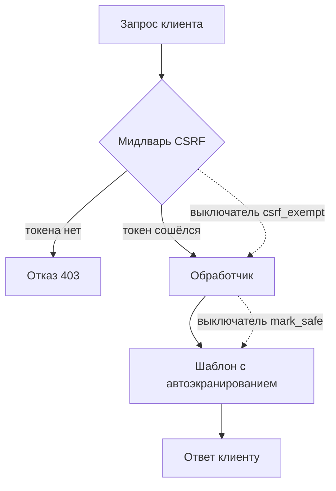

# Django и Flask: настройки, CSRF, шаблоны

Возьмём одно значение и подставим его в шаблон четырьмя способами. В первые
три строки подставлено `<script>alert(1)</script>`, в четвёртую — значение
`a onmouseover=alert(1)`. Прогон на Django 6.1; у Flask с движком шаблонов
Jinja картина та же:

```text
{{ x }}               ->  &lt;script&gt;alert(1)&lt;/script&gt;
{{ x|safe }}          ->  <script>alert(1)</script>
mark_safe(x)          ->  <script>alert(1)</script>
<a title={{ x }}>     ->  <a title=a onmouseover=alert(1)>
```

Первая строка — защита по умолчанию: значение стало текстом, и браузер
нарисует угловые скобки, а не исполнит скрипт. Вторая и третья — та же
защита, выключенная автором шаблона двумя способами. Четвёртая тоньше:
экранирование никто не выключал, но атрибут без кавычек позволил значению
породить второй атрибут, и фреймворк тут ни при чём: границу нарушила
разметка.

Расклад темы виден уже на этих четырёх строках. Фреймворк отвечает за
экранирование по умолчанию, а автор — за то, чтобы не выключить его и не
оставить разметке то, чего экранирование не понимает. Механика подделки
запроса разобрана в теме `csrf-mechanics`, внедрение в шаблон — в `ssti`,
и здесь они не повторяются. Вопрос темы другой: что из защиты веба на
Python делает сам фреймворк, а что остаётся автору кода.

## Что фреймворк берёт на себя

Веб-фреймворк — готовый каркас приложения: он принимает HTTP-запрос,
находит обработчик по адресу, собирает ответ и отправляет его клиенту.
Бытовое соответствие — каркас дома: стены и перекрытия уже стоят, а
планировку и отделку делает жилец. Ломается аналогия на защите: каркас
дома о безопасности жильцов не думает, а фреймворк заранее решает её часть
за автора. Django и Flask — два самых ходовых каркаса на Python, и защита
у них устроена по-разному. Django несёт её с собой: экранирование в
шаблонах, проверка CSRF и сверка заголовка Host по списку ALLOWED_HOSTS
включены сразу. Flask держит маленькое ядро: экранирование движка Jinja
включено, а проверки CSRF в ядре нет вовсе.

Защита «сразу для всех» живёт в мидлваре. Мидлварь (middleware,
«промежуточный слой») — код, через который проходит каждый запрос до
обработчика и каждый ответ на обратном пути. Бытовое соответствие —
турникет с охраной на входе в офис: проверка пропуска действует для всех
дверей сразу, и её не нужно повторять у каждой. Ломается аналогия на
обходе: мимо турникета не пройти, а автор обработчика может поставить на
нём отметку «не проверять» — так работает `csrf_exempt`. Если защита
стоит в мидлваре, автору обработчика не нужно помнить о ней самому.

Недостающий слой Flask доустанавливается расширением — отдельным пакетом,
который добавляет каркасу возможность: например, Flask-WTF приносит работу
с формами и вместе с ней проверку CSRF. Ядро благодаря этому остаётся
маленьким, а цена ложится на автора: он обязан знать, чего в ядре нет, и
доустановить слой сам.

Путь запроса и места, где стоят выключатели, показаны на схеме.



**Описание схемы.** Запрос идёт сверху вниз: сначала мидлварь CSRF решает,
пускать ли его к обработчику, затем шаблон собирает ответ с экранированием
значений. Пунктиром показаны два выключателя: `csrf_exempt` пускает запрос
мимо проверки токена, а `mark_safe` помечает данные так, что шаблон
пропускает их без экранирования. Схема рисует Django; во Flask узла
мидлвари CSRF нет вовсе, а вместе с ним и ветки «Отказ 403», и это
предмет следующего раздела.

## Как это работает

**Откуда это взялось.** Оба фреймворка отвечают на один вопрос: кто несёт
ответственность за защиту — каркас или автор приложения. До фреймворков
каждый автор решал это сам, и в каждом проекте заново. Django выбрал
«каркас по умолчанию»: защита включена, а её отключение остаётся видимым в
коде. Flask выбрал «минимальное ядро»: документация говорит прямо, что
местом для проверки токена была бы валидация форм, которой в ядре нет. Ни
один из выборов не ошибка; у каждого свой паттерн риска. У Django риск в
точечном отключении, у Flask — в недоустановленном слое.

### Экранирование в шаблоне

Обработчик не собирает страницу склейкой строк, а рендерит шаблон —
заготовку HTML с местами под данные. Место подстановки в шаблонах Django и
Jinja выглядит одинаково: `{{ name }}`. Экранирование — замена опасных
символов безобидными сущностями: `<` становится `&lt;`, и браузер рисует
угловую скобку как текст, а не открывает тег. В обоих движках
экранирование включено по умолчанию, и это первая строка таблицы из
введения.

Выключателей три, и все они говорят движку одно и то же слово —
«безопасно». Фильтр `|safe` стоит в шаблоне, функция mark_safe — в коде
Django, класс `Markup` из пакета markupsafe — во Flask. Помеченное
значение движок пропускает в страницу как есть, и это вторая и третья
строки таблицы. Бытовое соответствие — отметка «досмотрено» на сумке в
аэропорту: с ней сумку не открывают повторно. Ломается аналогия на том,
кто ставит отметку: в аэропорту — досмотрщик, а в шаблоне — сам автор, и
движок верит ему на слово.

Границы механизма документация называет сама, и их две. Первая — атрибут
без кавычек, четвёртая строка из введения: экранирование честно обработало
значение, но разметка оставила границу атрибута на усмотрение значения.
Вторая — адрес со схемой `javascript:` в href: как текст значение
безопасно, но при клике браузер исполнит его как код. Для второго случая
документация Flask прямо отправляет к политике содержимого — CSP из темы
`csp`. Контексты вывода, которых движок не различает, разобраны в теме
`xss-contexts`.

### Проверка CSRF

Мидлварь Django проверяет секрет в каждом изменяющем запросе; сама
механика подделки — в теме `csrf-mechanics`. Прогон на Django 6.1
показывает это числом: POST без токена получает 403, а тот же POST на
обработчике с `@csrf_exempt` — 200. Декоратор здесь — обёртка над
функцией: знак `@` над определением обработчика меняет его поведение, не
трогая кода внутри, и `csrf_exempt` говорит мидлваре «этот не проверять».

Требование защищать изменяющие запросы записано как ASVS v5.0-3.5.1, класс
покрывает проверка WSTG-v42-SESS-05, а в каталоге OWASP 2025 года это
`A01:2025`. Во Flask такого слоя нет вовсе: обработчик, меняющий состояние
по POST, уязвим без внешнего расширения.

### DEBUG и отладочная страница

Флаг DEBUG меняет поведение при ошибке, и прогон это показывает. Django
6.1 с DEBUG=True: ответ 500 содержит текст исключения вместе с его
содержимым — в демонстрации в него попала строка с «паролем». Значения
настроек Django при этом маскирует: SECRET_KEY в тело не попал. У
Werkzeug, HTTP-библиотеки под Flask, отладочная страница несёт трейсбек
(цепочку вызовов к месту ошибки) и текст исключения. С включённым evalex
на каждом кадре стека добавляется интерактивная консоль — поле ввода прямо
на странице ошибки, и код из него исполняется на сервере. Проверено на
Werkzeug из комплекта Flask 3.1.

Чем DEBUG на стенде отличается от DEBUG в проде — зрителем страницы
ошибки. На стенде её видит сам автор, и детали ему знакомы. В проде её
видит любой посетитель, и текст исключения со строкой подключения
становится находкой для чужого. Класс дефекта — утечка через сообщения об
ошибках — разобран в теме `error-message-leaks`. Поэтому ревьюер читает
конфигурацию прода, а не стенда.

## Как это выглядит в коде

У ревьюера на такой код три плана: найти, где выключено экранирование;
найти, где выключена проверка CSRF; проверить флаги конфигурации прода.
Первый листинг — Django. Прежде чем читать выноски, назовите по каждой
помеченной строке, какой план она закрывает и какую защиту снимает.

```python
# УЯЗВИМО — демонстрация, не для продакшена
from django.utils.safestring import mark_safe
from django.views.decorators.csrf import csrf_exempt

DEBUG = True                     # (1)
ALLOWED_HOSTS = ["*"]            # (2)

@csrf_exempt                     # (3)
def change_email(request): ...

row = mark_safe(comment.text)    # (4)
```

1. `DEBUG = True` в конфигурации прода: при исключении клиент получает
   страницу с деталями ошибки, как в разделе про отладчик.
2. Звёздочка в `ALLOWED_HOSTS` отключает сверку заголовка Host со списком:
   сервер примет запрос с любым именем. Чем это грозит — тема
   `host-header-attacks`.
3. `@csrf_exempt` над изменяющим обработчиком: мидлварь пропустит POST без
   токена, и защита снята ровно там, где меняются данные.
4. `mark_safe(comment.text)` помечает чужой текст как безопасный, и
   экранирование для него выключено. В шаблоне то же делают фильтр `|safe`
   и блок ``.

Во Flask набор другой, и плана два: флаг отладчика и граница «шаблон —
данные». Не подглядывая в выноски, найдите здесь оба дефекта и объясните,
чем они различаются.

```python
# УЯЗВИМО — демонстрация, не для продакшена
from flask import render_template_string, request
from markupsafe import Markup

app.run(debug=True)                                   # (1)

@app.route("/hello")
def hello():
    name = request.args.get("name", "")
    return render_template_string("Привет, " + name)  # (2)
```

1. `app.run(debug=True)` поднимает сервер с отладчиком Werkzeug: страница
   ошибки несёт трейсбек, а с включённой консолью — исполнение кода в
   кадре стека.
2. Склейка делает ввод частью шаблона, и прогон отвечает «Привет, 49» на
   ввод `{{7*7}}`. Это внедрение в шаблон, а не в страницу; разбор
   механики — в теме `ssti`.

Отдельная форма в обоих мирах — `mark_safe()` и `Markup()` на данных
пользователя; поиск по именам функций находит такие места за минуту.
Ложное срабатывание тоже есть: `mark_safe` на константе, собранной из
своего доверенного HTML, законен. Разница не в вызове, а в происхождении
значения, и ревью смотрит именно на него.

**Зачем это в работе AppSec-инженера.** Ревью веб-сервиса на Python
начинается с вопроса «какой фреймворк и что в нём выключено». Ответ
читается поиском по четырём словам — `csrf_exempt`, `mark_safe`,
`autoescape`, `DEBUG`, — а дальше начинается собственно ревью: законно ли
отключение в этом месте.

## Как защититься

Правило одно: защита остаётся включённой, а там, где её пришлось снять,
вход очищается или ограничивается отдельно. Исправленный вариант обоих
листингов:

```python
# Исправлено
ALLOWED_HOSTS = ["app.example.com"]
DEBUG = False

@app.route("/hello")
def hello():
    name = request.args.get("name", "")
    return render_template_string("Привет, {{ name }}", name=name)
```

Разница в границе «шаблон — данные». Шаблон целиком написал автор, а ввод
приходит отдельной переменной и остаётся данными: тот же ввод `{{7*7}}`
выводится текстом, потому что вычислять его некому. Проверка Host снова
сверяет имя со списком, и страница ошибки в проде больше не несёт
деталей.

CSRF во Flask доустанавливается расширением: Flask-WTF проверяет токен в
формах. Второй путь — приём double-submit из темы `csrf-tokens`: механика
та же, различается упаковка. В Django снятый `@csrf_exempt` заменяется
возвратом мидлвари. Отдельный случай — API с токеном в заголовке вместо
cookie: браузер чужой заголовок не прикладывает, поэтому проверка там не
нужна вовсе. Это граница применимости, а не отключение.

Что починка дала, видно теми же прогонами из раздела о механике. POST без
токена снова получает 403, значение с разметкой выходит из шаблона
текстом, а запрос на заведомо битый адрес возвращает страницу без деталей.
Все три проверки делаются запросами, а не чтением конфига: конфигурация
может расходиться с тем, что реально работает, а ответ сервера — нет.

**Когда канон не подходит.** Атрибут без кавычек и схема `javascript:` в
href не лечатся экранированием по построению: первая лечится кавычками в
разметке, вторая — политикой содержимого. Документация обоих фреймворков
называет эти два места явно, и ревью шаблонов проверяет их отдельно от
флагов autoescape.

## Частая ошибка

Встречается мнение, что фреймворк с автоэкранированием закрывает
межсайтовый скриптинг целиком. Мнение опирается на молчаливый шаг: будто
любой вывод — это текст внутри разметки. Верно ли это для четвёртой строки
из введения?

**Экранирование закрывает один контекст из нескольких.** Движок
обрабатывает текст внутри разметки, но не знает ни о границах атрибута без
кавычек, ни о смысле схемы адреса.

Контрпример — четвёртая строка таблицы из введения: `<a title={{ x }}>` с
включённым экранированием породил атрибут-обработчик, потому что разметка
оставила границу атрибута на усмотрение значения. Значение было
экранировано честно; вопрос был не к нему.

Тот же молчаливый шаг ломается и на адресе. Значение `javascript:alert(1)`
— текст без единого опасного символа, и экранировать в нём нечего. Но в
href браузер читает схему и исполняет адрес как код, поэтому здесь
работает политика содержимого, а не экранирование.

## Чеклист для ревью

1. Проверьте, что DEBUG выключен в конфигурации прода, а страница ошибки
   не несёт деталей наружу (проверяется запросом на заведомо битый адрес).
2. Проверьте, что ALLOWED_HOSTS перечисляет хосты, а не звёздочку.
3. Проверьте, что изменяющие обработчики не помечены `@csrf_exempt` без
   записанной причины (CWE-352, ASVS v5.0-3.5.1).
4. Проверьте, что у Flask-приложения с cookie-аутентификацией есть слой
   CSRF-защиты из расширения или своей проверки токена
   (WSTG-v42-SESS-05).
5. Проверьте, что mark_safe, Markup, `|safe` и autoescape off не
   применяются к данным, которые мог прислать пользователь (CWE-79).
6. Проверьте, что render_template_string не получает шаблон со склейкой
   из ввода.
7. Проверьте, что в шаблонах атрибуты с подстановками взяты в кавычки, а
   адреса в href не принимают произвольные схемы (`A05:2025`).

## Попробуй сам

Возьмите свой учебный проект на Django или Flask. Найдите в нём
выключатели из раздела о коде поиском по именам: `csrf_exempt`,
`mark_safe`, `Markup`, `autoescape`, `DEBUG`. Для одного включённого и
одного выключенного экранирования прогоните значение с разметкой через
шаблон и запишите оба вывода.

Одна подсказка: у Flask тестовый клиент вызывается через
`app.test_client()` и не требует запуска сервера.

**Критерий выполнения** наблюдаемый: таблица «место — выключатель —
законно ли» и два вывода одного значения — экранированный и нет.

## Проверь себя

1. Тот же шаблон из введения, но атрибут взят в кавычки:

```text
шаблон: <a title="{{ x }}">
x = a onmouseover=alert(1)
```

   Предскажите, что уйдёт в ответ клиенту.

2. Находка ревью: `render_template_string("Привет, " + name)`, где `name`
   пришёл из запроса. Выберите починку.

   A. Пропустить `name` через markupsafe.escape и оставить склейку
      шаблона.

   B. Передать значение переменной шаблона:
      `render_template_string("Привет, {{ name }}", name=name)`.

   C. Отклонять значения `name`, где встречаются фигурные скобки.

3. Почему `mark_safe` на константе из своего доверенного HTML законен, а
   тот же вызов на `comment.text` — находка?

4. В соседнем обработчике ответ собран без шаблонизатора:

```python
@app.get("/hello")
def hello():
    name = request.args.get("name", "")
    return "<h1>Привет, " + name + "</h1>"
```

   Это внедрение в шаблон или межсайтовый скриптинг — и что покажет ввод
   `{{7*7}}`?

5. Возврат к теме `csrf-mechanics`: почему API с токеном в заголовке не
   нуждается в CSRF-проверке?

<details markdown="1">
<summary>Ответ 1</summary>

1. `<a title="a onmouseover=alert(1)">` — значение осталось внутри
   кавычек, и второй атрибут не родился: границу держит разметка, а не
   экранирование. Прогон на Jinja:

   ```python
   from jinja2 import Environment
   env = Environment(autoescape=True)
   print(env.from_string('<a title="{{ x }}">').render(
       x="a onmouseover=alert(1)"))
   ```

</details>

<details markdown="1">
<summary>Ответ 2: разбор вариантов</summary>

2. Верный вариант — B.

   A. Неверно: очистка гасит разметку HTML, но не синтаксис шаблона.
      `{{7*7}}` после escape остаётся `{{7*7}}` и вычисляется при рендере
      (проверено прогоном markupsafe). Данные стали текстом шаблона, и
      очистка значения об этом не знает.

   B. Верно: шаблон написан автором целиком, ввод приходит отдельной
      переменной и остаётся данными — ввод `{{7*7}}` выводится текстом.

   C. Неверно: фильтр по скобкам перечисляет вчерашний синтаксис — у
      движка есть и ``, и другие конструкции. Границу проводит
      разделение «шаблон — данные», а не список запрещённых символов.

</details>

<details markdown="1">
<summary>Ответ 3</summary>

3. Разница в происхождении значения, а не в вызове. Константа собрана
   автором и не зависит от ввода; `comment.text` пришёл от пользователя, и
   пометка «безопасно» на нём отключает экранирование чужой разметки. В
   ревью смотрят, откуда значение, а не на сам факт mark_safe.

</details>

<details markdown="1">
<summary>Ответ 4</summary>

4. Это межсайтовый скриптинг: шаблонизатор здесь не участвует, и склейка
   отдаёт разметку страницы напрямую. Ввод `{{7*7}}` уйдёт текстом —
   вычислять его некому. Сравните со строкой из раздела о коде: там ввод
   стал частью шаблона через render_template_string, и прогон ответил
   «Привет, 49».

</details>

<details markdown="1">
<summary>Ответ 5</summary>

5. Потому что браузер не прикладывает заголовок сам. Атака опирается на
   автоматическую отправку cookie, а токен в заголовке требует значения,
   которого у чужой страницы нет.

</details>

## Источники

1. Security in Django, документация Django (stable); реестр
   `django-security`. Разделы: XSS protection (атрибут без кавычек,
   mark_safe, is_safe), CSRF protection и csrf_exempt, Host header
   validation, SSL/HTTPS.
   <https://docs.djangoproject.com/en/stable/topics/security/>
2. Security Considerations, документация Flask 3.1.x; реестр
   `flask-security-considerations`. Разделы: XSS (автоэкранирование
   Jinja, Markup, атрибуты без кавычек, схема javascript: и CSP),
   Cross-Site Request Forgery (почему защиты нет в ядре).
   <https://flask.palletsprojects.com/en/stable/web-security/>

Каркас этапа: у этапа 7 общих унаследованных источников нет; каждая тема
опирается на документацию своего языка и на материалы этапа 1 по классам
дефектов.

**Маркеры уверенности.** **Проверено лично** 2026-09-02: Django 6.1 —
шаблон `{{ x }}` экранирует, `|safe` и mark_safe пропускают разметку,
атрибут без кавычек порождает onmouseover; POST без токена получает 403,
view с `csrf_exempt` — 200; DEBUG=True отдаёт текст исключения и маскирует
SECRET_KEY. Flask 3.1.3 — та же пара для Jinja и Markup через тестовый
клиент; render_template_string со склейкой вычисляет `{{7*7}}` в 49;
отладчик Werkzeug с evalex отдаёт страницу с трейсбеком и консолью.
**Перепроверено** 2026-10-03 на Jinja2 3.1.6 и markupsafe 3.0.3 (это
движок шаблонов и библиотека экранирования из комплекта Flask): `{{ x }}`
экранирует, `|safe` и `Markup` пропускают разметку; атрибут без кавычек
порождает второй атрибут, в кавычках — не порождает; склейка ввода в
шаблон вычисляет `{{7*7}}` в 49, передача переменной выводит ввод текстом;
`markupsafe.escape` оставляет `{{7*7}}` нетронутым. Поведение Flask-WTF
здесь не воспроизводилось: упомянут как слой, а не как проверенный рецепт.
Обе страницы документации открыты лично 2026-09-02.
