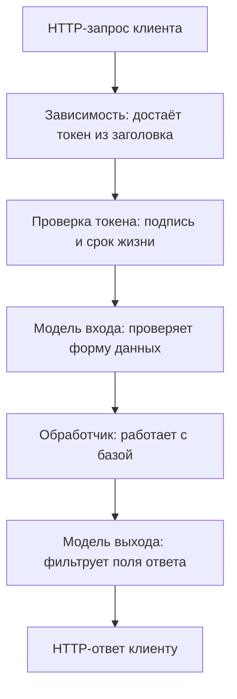

# FastAPI и pydantic: уязвимые паттерны

Вы читаете на ревью сервис заказов, написанный на FastAPI — фреймворке,
на котором собирают HTTP API на Python. Два его маршрута возвращают один и
тот же объект пользователя из базы, и разница между ними — один аргумент в
объявлении. Прогон тестовым клиентом — а это вызов приложения прямо в памяти,
без запуска сервера — показывает, чем отличаются ответы:

```text
GET /leak -> {'username': 'alice', 'hashed_password': '$argon2id$...'}
GET /ok   -> {'username': 'alice'}
```

Из первого маршрута уехал хеш пароля. Никакой атаки на протокол не
потребовалось, хватило обычного запроса: маршрут вернул объект целиком, а
объект знал про поле. Второй маршрут вернул тот же объект через
response_model — объявление «ответ проходит через эту модель», и поле
отфильтровалось. А если маршрут вызывает не браузер, а свой соседний сервис,
утечка перестаёт быть утечкой? Держите этот вопрос до раздела о защите —
там будет ответ.

## Из чего собран маршрут FastAPI

FastAPI — фреймворк для HTTP API на Python, и маршрут в нём выглядит как
обычная функция с аннотациями типов. Аннотация — запись вида `item_id: int`
рядом с именем: она объявляет, значение какого типа здесь ожидается. Сам
интерпретатор Python аннотации не проверяет, их читают внешние инструменты.
FastAPI — такой инструмент: по аннотациям он строит контракт маршрута. Из
контракта получаются проверка входных данных, сборка ответа и документация
OpenAPI, по которой вы собирали перечень точек входа в теме
`rest-and-graphql`.

Проверкой данных занимается библиотека pydantic. Её центральное понятие —
модель: класс-наследник BaseModel, где каждое поле объявлено с типом. Модель
работает как анкета с пронумерованными графами: у графы «возраст» формат
«число», у графы «имя» формат «строка». В этой аналогии pydantic —
проверяющий анкету: он сверяет каждую графу с форматом и отклоняет анкету
целиком, если графа не сошлась. Аналогия ломается в одном месте: проверяющий
смотрит на форму графы, а не на право человека её заполнять. Эта граница
станет предметом раздела о частой ошибке.

Ещё одно слово, которое понадобится ниже, — сериализация. Это превращение
объекта в памяти программы в текст ответа, обычно в JSON. Объект пользователя
в базе знает и имя, и хеш пароля, а какие поля дойдут до текста ответа,
решает сериализация. У контракта маршрута три места, которые читает ревьюер.
Вход валидируется моделью pydantic, выход фильтруется моделью ответа, а
доступ подключается зависимостью. Зависимость — объявление «перед обработчиком
выполни эту функцию и передай её результат»; записывается оно через Depends.
У каждого из трёх мест есть свой паттерн отказа.



**Описание схемы.** Запрос идёт сверху вниз через слои контракта. Сначала
зависимость достаёт токен, а отдельный шаг проверяет его: сама зависимость
этого не делает. Затем модель входа проверяет форму данных, обработчик
выполняет работу, и модель выхода решает, какие поля объекта попадут в ответ.
Все три паттерна отказа из этой темы живут на трёх узлах схемы: доступ, вход
и выход.

## Как это работает

**Откуда это взялось.** Аннотации типов появились в Python для статического
анализа: их читали проверяющие программы, а не интерпретатор. FastAPI сделал
их контрактом работающего сервиса: те же записи теперь задают проверку входа
и документацию. Отсюда шаг до наивного прочтения «раз модель проверена, вход
безопасен». Оно ломается о назначение валидатора. Валидатор отвечает на
вопрос «соответствует ли значение типу», а не на вопрос «имеет ли этот вход
право быть здесь». Между этими вопросами и живут три паттерна темы.

Первый слой — выход. Маршрут без response_model сериализует то, что вернул
обработчик: объект из базы отдаёт всё, что у него есть. Отсюда хеш пароля в
первом ответе введения. Модель ответа работает фильтром на запись наружу, и
её отсутствие — умолчание с обратным знаком: всё, что попало в объект,
попадёт клиенту. В каталоге типовых слабостей CWE это CWE-200 — раскрытие
чувствительной информации тому, кому она не положена.

Второй слой — вход. У валидаторов pydantic четыре режима, и различаются они
точкой встречи с данными: до приведения типа, после него, вокруг него или
вместо него. Документация прямо предупреждает про режим before: валидатор в
нём получает сырой вход, а это «может быть любой объект». Второе, что стоит
держать в голове: приведение типа — не проверка. Прогон на pydantic 2.13 это
показывает:

```python
from pydantic import BaseModel

class Flags(BaseModel):
    is_admin: bool

for value in ["false", "no", "0", "off", "1", "true"]:
    print(value, "->", Flags(is_admin=value).is_admin)
```

```text
false -> False
no -> False
0 -> False
off -> False
1 -> True
true -> True
```

Поле `is_admin: bool` принимает строки «false», «no», «0» и «off» как False,
а «1» и «true» — как True. Для флага из браузерной формы это осмысленно,
потому что форма и шлёт строки. Для границы доверия такое приведение ничего
не проверяет: «проверка типа» сказала о значении ровно то, что оно булево.

Третий слой — доступ. Зависимость-схема вроде OAuth2PasswordBearer объявляет,
откуда брать токен: она достаёт строку из заголовка `Authorization` и отмечает
маршрут в документации как защищённый. Слово bearer значит «предъявитель»:
токен работает как пропуск, который показывают при каждом запросе. Проверки
подписи в этой зависимости нет — она возвращает строку. Проверяет токен вызов
jwt.decode, и у библиотеки PyJWT он устроен защитно: список допустимых
алгоритмов она требует явно.

Прогон на PyJWT 2.13: вызов без аргумента algorithms падает с DecodeError.
Текст ошибки говорит прямо: `It is required that you pass in a value for the
"algorithms" argument when calling decode()`. Атака подменой алгоритма из
темы `jwt-basics` упирается в этот список, записанный константой вроде
`["HS256"]`: алгоритм читается из списка, а не из заголовка токена.
Ослабленная проверка подписи — это CWE-347, категория `A04:2025` издания
OWASP 2025 года.

## Как это выглядит в коде

Три признака видны по объявлению маршрута или модели, ничего запускать не
нужно. Фрагмент ниже читайте тремя планами: найти, что уходит наружу; найти,
что принимается на вход; найти, как проверяется токен. Пример упрощён:
импорты и создание приложения опущены. До выносок назовите про себя, что
умолчано в каждом из трёх мест.

```python
# УЯЗВИМО — демонстрация, не для продакшена
@app.get("/user")
def get_user():                       # (1)
    return UserInDB(username="a", hashed_password="...")

@app.post("/items")
def add_item(item: Item):             # (2)
    pass  # обработчик сохраняет item как есть

payload = jwt.decode(token, KEY)      # (3)
```

1. Строка (1) — маршрут без response_model: ответом станет всё, что вернул
   обработчик, включая поля хранилища. Так во введении наружу ушёл хеш
   пароля.
2. Строка (2) — модель входа совпадает с моделью хранения: поля, которые
   клиент не должен задавать (роль, владелец, цена), принимаются из тела
   запроса. Такой дефект называется массовым присваиванием, и его общая
   механика разобрана в теме `role-parameter-tampering`.
3. Строка (3) — вызов jwt.decode без списка алгоритмов. На PyJWT 2.13 он
   упадёт с DecodeError, а с более мягкой библиотекой это классическая
   подмена алгоритма. Форма вызова видна ревьюеру до версии библиотеки.

Есть и обёртки, которые не спасают. Первая — аргумент `dependencies=[...]` в
объявлении маршрута без понимания, что схема безопасности там только
извлекает токен: зависимость есть, проверки нет. Вторая форма тоньше:
зависимость объявлена, но забыта у части маршрутов роутера. Роутер — это
объект, который группирует маршруты с общими настройками. FastAPI не
навязывает зависимость по умолчанию, поэтому каждый маршрут группы
проверяется отдельно.

Бывает и ложное срабатывание. Модель входа с лишними полями сама по себе не
дефект: по умолчанию pydantic игнорирует поля, которых нет в модели
(умолчание extra=ignore). Смотрите, есть ли у модели поля со служебным
смыслом и не совпадает ли входная модель с моделью хранения. Дефект — в
принятых служебных полях, а не в самой форме объявления.

**Зачем это в работе AppSec-инженера.** FastAPI-проект читается как набор
объявлений, и ревью сводится к вопросу «что объявлено, а что умолчано».
Умолчание в каждом из трёх слоёв работает против автора: вернуть объект
проще, чем отфильтровать; принять ввод проще, чем проверить; объявить схему
проще, чем зависимость. Поэтому глаз ревьюера ищет не то, что написано, а то,
чего не написано.

## Как защититься

Правило одно: контракт входа и контракт выхода — разные модели, а доступ
объявлен на каждом маршруте. Вот тот же сервис после починки:

```python
# Исправлено
class UserOut(BaseModel):
    username: str

@app.get("/user", response_model=UserOut)
def get_user(user: User = Depends(get_current_user)):
    return user

payload = jwt.decode(token, KEY, algorithms=["HS256"])
```

Разберём, что делает каждая часть. Модель выхода UserOut фильтрует ответ:
чего в ней нет, то не уйдёт наружу, что бы ни вернул обработчик. Модель входа
не содержит полей, которые клиент задавать не вправе, и массовому
присваиванию больше нечего принимать. Зависимость get_current_user стоит на
самом маршруте, и токен проверяется до начала работы обработчика. Проверка
идёт с явным списком алгоритмов и с проверкой времени жизни токена. Учебный
код документации FastAPI собран именно так, и он годится как образец.

Отдельно про флаги и коды, где приведение недопустимо. Для них pydantic даёт
строгие типы: StrictBool и родственные. Строгий тип отказывает строке
«false» там, где нужен именно булев вход, и вход с такой строкой отклоняется
целиком. Для границы доверия это как раз то поведение, которого ждут от
проверки.

**Когда канон не подходит.** Здесь ответ на вопрос из введения. Внутренние
вызовы между своими сервисами иногда возвращают полную модель намеренно, и
тогда граница — это сеть, а не response_model. Ревью при этом не отменяется,
а переносится: проверяется доступность маршрута извне. Сам по себе адресат
«свой» вердикт не меняет: свой сервис тоже пишет логи, и ответ с хешем
попадёт в них. Второй случай — строгие типы: они ломают формы, где браузер
честно шлёт строки. Там ответ — явный валидатор со своей логикой, а не
строгий тип.

## Частая ошибка

Встречается мнение: раз вход прошёл валидацию pydantic, он доверен. За ним
стоит отождествление двух разных свойств — «прошёл проверку» и «доверен».
Каким входом вы бы это опровергли?

**Валидация отвечает про форму, а не про право.** Валидатор проверяет
соответствие типу и ограничениям поля — это механика из одноимённого
раздела. Вопрос «может ли этот пользователь менять это поле» в типе не
выражается вовсе: у типа нет места для права.

Контрпример — модель входа с полем is_admin. Вход
`{"username": "a", "is_admin": true}` пройдёт валидацию безупречно: оба поля
верного типа. Форма верная, а права нет. Починка здесь не валидатор, а
раздельные модели из раздела о защите: во входной модели этого поля нет
вовсе, и принять его нечем.

## Чеклист для ревью

Шесть проверок читаются по объявлениям маршрутов и моделей, запускать ничего
не нужно. Каждая закрывает один паттерн из темы.

1. Проверьте, что у каждого маршрута, возвращающего объект хранилища, задан
   response_model (CWE-200).
2. Проверьте, что входные модели не содержат служебных полей: роли,
   владельца, цены, признаков состояния.
3. Проверьте, что каждый защищённый маршрут несёт зависимость доступа, а не
   только схему в документации.
4. Проверьте, что jwt.decode вызывается с явным списком алгоритмов и
   проверкой срока (CWE-347).
5. Проверьте, что поля-флаги и коды не полагаются на приведение типов:
   строка «false» не должна становиться решением.
6. Проверьте, что валидаторы режима before обрабатывают сырой вход любого
   типа, а не только ожидаемый.

## Попробуй сам

Соберите приложение из двух маршрутов по образцу введения: один возвращает
объект с полем-секретом, второй — тот же объект через response_model. Оба
маршрута читают один объект из одной «базы» — подойдёт и словарь в памяти.
Прогоните оба тестовым клиентом и запишите ответы. Это тот самый прогон из
введения, только теперь его собираете вы сами.

Одна подсказка: тестовый клиент FastAPI (TestClient) поднимает приложение в
памяти, сервер не нужен.

**Критерий выполнения** наблюдаемый: два ответа одного объекта. В первом
поле-секрет присутствует, во втором отсутствует, и разница объяснена одним
аргументом маршрута.

## Проверь себя

1. Модель флага и вход из формы:

   ```python
   from pydantic import BaseModel

   class Flags(BaseModel):
       is_admin: bool

   Flags(**{"is_admin": "off"}).is_admin
   ```

   Что вернёт это выражение?

2. Маршрут `/admin/stats` должен читать только проверенный пользователь.
   Выберите починку.

   A. Объявить зависимость `Depends(OAuth2PasswordBearer(...))`: схема
      достаёт токен из заголовка.

   B. Объявить `Depends(get_current_user)`, где зависимость зовёт
      jwt.decode с явным списком алгоритмов.

   C. Вызвать `jwt.decode(token, KEY)` без списка алгоритмов и положиться
      на библиотеку.

3. Почему отсутствие response_model — умолчание с обратным знаком, а не
   нейтральный пропуск аргумента?

4. Входная модель для создания заказа:

   ```python
   class OrderIn(BaseModel):
       item_id: int
       price: float
       owner_id: int
   ```

   Найдите здесь дефект и назовите его.

5. Возврат к теме `jwt-basics`: какую атаку на подпись отсекает явный
   список алгоритмов?

<details markdown="1">
<summary>Ответ 1</summary>

1. False. Валидатор приводит тип, а не проверяет право: строки «off»,
   «no», «0» и «false» становятся булевым False, «true» и «1» — True.
   Прогон на pydantic 2.13:

   ```python
   from pydantic import BaseModel

   class Flags(BaseModel):
       is_admin: bool

   print(Flags(**{"is_admin": "off"}).is_admin)
   ```

   печатает `False`. Для границы доверия такое приведение ничего не
   проверяет: «проверка типа» сказала о значении ровно то, что оно булево.

</details>

<details markdown="1">
<summary>Ответ 2: разбор вариантов</summary>

2. Верно: B.

   A. Схема OAuth2PasswordBearer объявляет, откуда взять токен, и
      регистрирует схему в документации; подписи в ней не проверяются —
      она возвращает строку. Это обёртка из раздела о коде: зависимость
      есть, проверки нет.

   B. Верно. Проверка подписи живёт в jwt.decode, и список алгоритмов
      записан константой — алгоритм читается из списка, а не из токена.

   C. На PyJWT 2.13 такой вызов падает с DecodeError на каждом токене.
      На более мягкой библиотеке он молча принимает алгоритм из
      заголовка токена — это подмена алгоритма из темы `jwt-basics`.

</details>

<details markdown="1">
<summary>Ответ 3</summary>

3. Маршрут без response_model сериализует всё, что вернул обработчик:
   объект из базы отдаёт каждое своё поле. Фильтрация включается только
   явной моделью выхода, поэтому молчание контракта работает на утечку —
   всё, что попало в объект, попадёт клиенту.

</details>

<details markdown="1">
<summary>Ответ 4</summary>

4. Клиенту не принадлежат поля `price` и `owner_id`: цену назначает
   каталог, владельца — сессия. Модель входа совпала с моделью хранения,
   и лишние поля принимаются из тела запроса. Починка — раздельные
   модели: во входной остаётся `item_id` и то, что клиент вправе задавать.

</details>

<details markdown="1">
<summary>Ответ 5</summary>

5. Подмену алгоритма: токен с alg из другого семейства или без подписи
   отвергается, потому что проверка идёт только алгоритмами из списка.

</details>

## Источники

1. Validators, документация Pydantic (latest); реестр
   `pydantic-validators`. Разделы: четыре режима валидаторов, сырой вход
   валидаторов before, строгие типы.
   <https://pydantic.dev/docs/validation/latest/concepts/validators/>
2. Security, документация FastAPI; реестр `fastapi-security`. Разделы:
   схемы безопасности OpenAPI и модуль fastapi.security.
   <https://fastapi.tiangolo.com/tutorial/security/>
3. OAuth2 with Password (and hashing), Bearer with JWT tokens,
   документация FastAPI; реестр `fastapi-security-oauth2-jwt`. Разделы:
   полный образец: извлечение токена схемой, проверка jwt.decode со
   списком алгоритмов, модели ответа.
   <https://fastapi.tiangolo.com/tutorial/security/oauth2-jwt/>

Каркас этапа: у этапа 7 общих унаследованных источников нет; каждая тема
опирается на документацию своего языка и на материалы этапа 1 по
классам дефектов.

**Скоропортящийся слой.** Поведение приведения типов и умолчания
валидаторов привязаны к мажорной версии pydantic: между первой и второй
они менялись, и при ревизии перечитываются. Устройство слоёв — модель
входа, модель выхода, зависимость — держится дольше.

**Маркеры уверенности.** Прогон тестовым клиентом **проверен лично**
2026-09-02 на FastAPI 0.141.1, pydantic 2.13.5 и PyJWT 2.13.0: маршрут без
response_model отдаёт hashed_password, с response_model — нет. Прогоны
pydantic и PyJWT повторены 2026-10-03 на pydantic 2.13.4 и PyJWT 2.13.0:
поле bool принимает «false», «no», «0», «off» как False и «1», «true» как
True; jwt.decode без algorithms падает с DecodeError, со списком —
проверяет. Умолчание extra=ignore у моделей pydantic — **по документации**,
в прогоне не воспроизводилось. Все три страницы документации открыты лично
2026-09-02.
