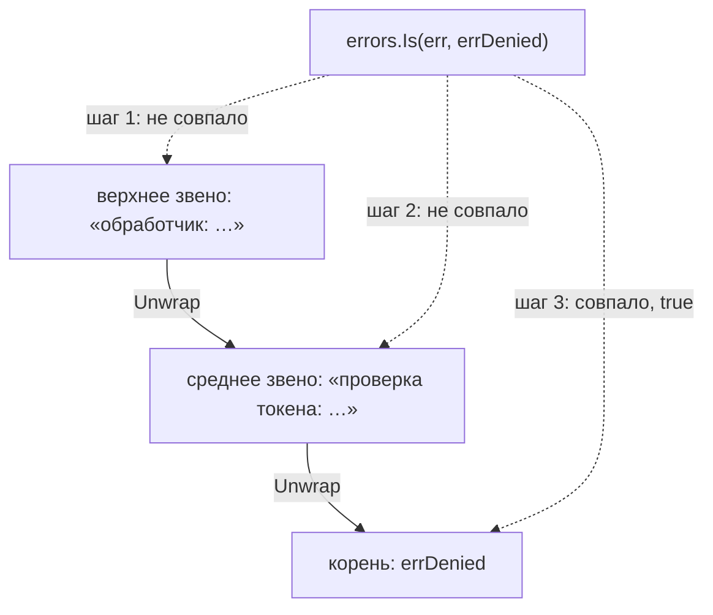

# Go: типовые ошибки обработки ошибок

Программа читает число воркеров из конфига. В конфиге опечатка, разбор
не удался — и никто об этом не узнал: ошибку приняли в пустую
переменную. Дальше по коду пошло нулевое значение, и программа
стартовала с нулём воркеров. Не читая дальше, ответьте: каких двух
последствий у этого запуска не оказалось? Во-первых, паники не было —
аварийной остановки всей программы. Во-вторых, записи в журнале нет,
потому что писать её было некому. Это главная цена модели Go: ошибка
здесь обычное значение, и язык не заставляет его прочитать. Ниже — три
дефекта, которые из этого растут, и формы записи, которые их закрывают.

## Ошибка — обычное значение

Во многих языках о сбое сообщает исключение: выполнение прерывается и
прыгает к ближайшему обработчику, минуя остаток функции. В Go исключений
нет, и функция сообщает о сбое так же, как сообщает результат, — через
возвращаемое значение. Объявление `func Atoi(s string) (int, error)`
читается так: функция возвращает два значения, число и ошибку, и ошибка
стоит последней. Когда всё прошло, ошибка равна `nil` — пустому
значению, которое означает «сбоя не было».

Бытовое соответствие здесь такое: исключение — пожарная тревога, она
звенит сама и для всех, а ошибка-значение — отметка «не зачтено» в
ведомости. Отметка не кричит: её надо прочитать, и непрочитанная ничем
не отличается от «зачтено». Аналогия ломается в одном месте. Пустая
клетка в ведомости хотя бы видна глазами, а непрочитанная ошибка в Go не
оставляет и клетки: раз значение приняли, компилятор считает, что его прочитали.

Принять значение можно двумя способами. Первый — прочитать его
проверкой `if err != nil`. Второй — явно отказаться от него:
подчёркивание `_` на месте переменной значит «значение принято и
выброшено, дальше не читается». Подчёркивание законно там, где значение
правда не нужно. На месте ошибки оно означает другое: сбой случился, а
программа пошла дальше с нулевым значением результата. Нулевое значение —
это то, что Go подставляет в переменную без явного присваивания: для
числа это ноль, и ноль воркеров из вступления взялся именно так.

## Как это работает

**Откуда это взялось.** Go выбрал явные возвраты вместо исключений:
ошибка стоит в объявлении функции и не пролетает мимо вызывающего кода молча.
Обратная сторона выбора — компилятор не требует её прочитать:
подчёркивание на месте значения компилируется и работает. Проверка
остаётся договором, а не требованием языка, поэтому три дефекта ниже
встречаются в чужом коде постоянно.

Первые два дефекта видны в одном прогоне. У программы четыре плана.
Первый — показать молчание подчёркивания. Второй — показать, что `==`
не видит обёртку. Третий — показать, что `errors.Is` идёт по цепочке.
Четвёртый — показать, чем глагол `%v` отличается от `%w`. Листинг
исполняемый, а вывод под ним — фактический запуск на go1.27.1.

```go
package main

import (
	"errors"
	"fmt"
	"strconv"
)

var errDenied = errors.New("доступ запрещён")

func main() {
	n, _ := strconv.Atoi("не число") // (1)
	fmt.Println("воркеров:", n)

	wrapped := fmt.Errorf("проверка токена: %w", errDenied) // (2)
	fmt.Println("== по обёртке:", wrapped == errDenied)
	fmt.Println("errors.Is по %w:", errors.Is(wrapped, errDenied))

	flat := fmt.Errorf("проверка токена: %v", errDenied) // (3)
	fmt.Println("errors.Is по %v:", errors.Is(flat, errDenied))
}
```

```text
$ go run bad.go
воркеров: 0
== по обёртке: false
errors.Is по %w: true
errors.Is по %v: false
```

### Подчёркивание на месте ошибки

Строка (1) — первая строка вывода: `Atoi` не смогла разобрать текст и
вернула ошибку, а подчёркивание её выбросило. Паники не случилось,
записи не появилось, результатом стал ноль. У этого молчания есть номер
в каталоге CWE (Common Weakness Enumeration, «перечисление типовых
слабостей»): CWE-252 — возвращённое значение оставлено без проверки.
Бытовой пример — курьер, который вернул квитанцию «не доставлено», а её
выбросили не читая: посылка не дошла, а в ведомости всё тихо.

Перенесите подчёркивание на другой вызов — проверку доступа. Что
теряется в таком запуске? Теряется сам факт отказа: ошибка чтения правил
принята в `_`, и запрос идёт дальше, как будто проверка прошла. Это
сценарий fail-open из темы `fail-open-vs-fail-closed`: при сбое контроля
система открывается, а не закрывается. Классический отказ через ошибку
проверки начинается ровно с такого подчёркивания, и виден он без запуска
программы.

### Сравнение мимо обёртки

Строка (2) показывает приём, который появился в Go 1.13: ошибку принято
оборачивать контекстом. Вызов `fmt.Errorf` с глаголом `%w` возвращает
новую ошибку, которая помнит прежнюю. Зачем это нужно, видно в тексте:
«проверка токена: доступ запрещён» говорит, где случился сбой, а корень
«доступ запрещён» остаётся внутри и отвечает, что именно случилось.
Получается цепочка: каждое звено умеет отдать предыдущее через метод
`Unwrap`.

Две следующие строки вывода показывают цену цепочки. Сравнение `==`
спрашивает «это та же самая ошибка?» и смотрит на верхнее звено,
поэтому на обёрнутой ошибке оно ложно. Функция `errors.Is` спрашивает
иначе: «есть ли такая ошибка в цепочке?» — и идёт по звеньям до корня.
А строка (3) показывает границу приёма: глагол `%v` цепочки не строит,
он подставляет только текст, и для `errors.Is` такая ошибка оказывается
тупиковой.

Цепочка на схеме длиннее листинга на одно звено, и это не расхождение.
Звено добавляет обработчик — функция, которая принимает запрос клиента
и формирует ответ. Он тоже вправе обернуть ошибку своим контекстом, и
тогда звеньев становится три. От этого приёма ломается только сравнение
`==`: `errors.Is` пройдёт и по четырём звеньям.



**Описание схемы.** Сверху вниз идёт цепочка обёрток: каждое звено
знает предыдущее через `Unwrap`. Пунктирные стрелки показывают, как
`errors.Is` спрашивает каждое звено, не оно ли искомое, и останавливается
на корне с ответом true. Сравнение `==` смотрело бы только на верхнее
звено и на той же цепочке дало бы false.

Код, написанный до этой модели, сравнивает ошибки через `==` или по
тексту и ломается молча, когда библиотека начинает оборачивать. Такой
код требует переписки, а не подгонки. Рядом с `errors.Is` работает
`errors.As`: он ищет в цепочке не конкретное значение, а ошибку нужного
типа. Весь набор — `%w`, `errors.Is` и `errors.As` — действует с Go
1.13, и в более старой версии языка его нет.

### Внутренняя ошибка в ответе клиенту

Третий дефект живёт на границе наружу. Памятка OWASP по обработке ошибок
делит сообщения на два потока: клиент получает общий ответ о сбое, а
детали пишутся в журнал на стороне сервера. Журнал — это поток записей
о событиях программы, который читают свои; клиент — чужой. Детали
внутренней ошибки, то есть трассировка, версии и текст запроса, для
атакующего — разведка: по ним он узнаёт устройство системы бесплатно.

В Go разделение решается одной строкой: что вернул обработчик — саму
`err` или нейтральное «internal error». Вернула она `err` наружу — в
ответе уехал путь на диске или текст SQL, и в ревью это читается в ветке
обработки ошибки, без всякого запуска.

## Как писать, чтобы ошибка не терялась

Исправление держится на четырёх планах: прочитать каждую ошибку,
сохранить корень при обёртке, принять решение по цепочке и отдать
клиенту общее при деталях в журнале. Оба листинга ниже исполняемые,
а выводы под ними — фактические запуски на той же версии go1.27.1.

Первый план закрывает дефект из вступления: ошибку принимают в
именованную переменную и сразу проверяют.

```go
package main

import (
	"fmt"
	"log"
	"strconv"
)

func main() {
	log.SetFlags(0)
	n, err := strconv.Atoi("не число")
	if err != nil {
		log.Printf("конфиг не прочитан: %v", err)
		return
	}
	fmt.Println("воркеров:", n)
}
```

```text
$ go run config.go
конфиг не прочитан: strconv.Atoi: parsing "не число": invalid syntax
```

Сбой разбора замечен и записан в журнал: молчания из вступления больше
нет. Ранний выход через `return` не даёт нулевому значению уйти дальше
по коду: программа без конфига останавливается, а не стартует с нулём
воркеров.

Остальные три плана собраны в обработчике. Обёртка с `%w` хранит корень,
проверка через `errors.Is` ищет его по цепочке, а наружу уходит только
статус.

```go
package main

import (
	"errors"
	"fmt"
	"log"
)
var errDenied = errors.New("доступ запрещён")
func check(token string) error {
	return fmt.Errorf("проверка токена: %w", errDenied) // (1)
}
func handle(token string) string {
	if err := check(token); err != nil { // (2)
		log.Printf("внутреннее: %v", err)
		if errors.Is(err, errDenied) { // (3)
			return "403: нет доступа"
		}
		return "500: внутренняя ошибка"
	}
	return "200: ок"
}
func main() {
	log.SetFlags(0)
	fmt.Println(handle("просрочен"))
}
```

```text
$ go run handler.go
внутреннее: проверка токена: доступ запрещён
403: нет доступа
```

Первая строка вывода — журнал сервера: в нём полный текст с корнем, и
читают его свои. Вторая — ответ клиенту: общий статус без единой
внутренней детали.

<details markdown="1">
<summary>Разбор выносок</summary>

1. Обёртка через `%w`: контекст добавлен, корень сохранён, и цепочка
   для `errors.Is` жива.
2. Ошибка принята в именованную переменную и проверена, а детали
   записаны в журнал на стороне сервера.
3. Решение принимает `errors.Is`, а не `==`: совпадение найдено внутри
   обёртки.

</details>

## Что искать в чужом коде

Все три дефекта ищутся глазами, без запуска. Первый признак —
подчёркивание на месте ошибки: оно видно в тексте, и поиск по `, _ :=`
приносит кандидатов. Второй признак — сравнение ошибок через `==` или по
строке: оно молча сломается, когда зависимость начнёт оборачивать.
Третий признак — `err` или её текст в ответе клиенту: внутренние детали
уходят наружу вместе со статусом.

Чтение чужого Go на этом не кончается. Тема `go-sql-templates`
разбирает, где в запросах прячется внедрение, а `go-race-detector` — как
находят гонки, которые глазами не видны вовсе. Ошибки же в Go читаются
прямо в объявлении функции, и потому их потеря — самая доступная находка
ревью: не нужен ни стенд, ни запуск.

**Зачем это в работе AppSec-инженера.** В Go-ревью ошибка видна в
объявлении функции, и потому её потеря видна тоже: подчёркивание вместо
имени — признак, который ищется текстом. Классический сценарий отказа,
где ошибка проверки доступа пропускает запрос дальше, начинается ровно с
такого подчёркивания. Умение отличить `==` от `errors.Is` превращает ревью
обёрток из догадки в проверку по цепочке. А граница «общий ответ
клиенту, детали в журнал» даёт готовый критерий для любого обработчика.

## Источники

1. Working with Errors in Go 1.13, блог Go; реестр `go-errors`. Разделы:
   Unwrap и цепочка ошибок, errors.Is и errors.As, глагол `%w`,
   обсуждение «оборачивать или нет» и граница API пакета.
   <https://go.dev/blog/go1.13-errors>
2. Error Handling Cheat Sheet, OWASP Cheat Sheet Series; реестр
   `owasp-cs-error-handling`. Разделы: чем выдача деталей ошибки помогает
   разведке, общий ответ клиенту при деталях в журнале, коды 4xx и 5xx.
   <https://cheatsheetseries.owasp.org/cheatsheets/Error_Handling_Cheat_Sheet.html>

Каркас этапа: у этапа 7 общих унаследованных источников нет; каждая тема
опирается на документацию своего языка и на материалы этапа 1 по
классам дефектов.

**Маркеры уверенности.** **Проверено лично** 2026-10-03 на go1.27.1
(linux/amd64). Ошибка, принятая в `_`, даёт молчание и нулевое значение.
Сравнение `==` по обёрнутой ошибке даёт false, `errors.Is` по цепочке `%w`
даёт true, а при обёртке через `%v` `errors.Is` даёт false. Все три
листинга темы — фактические прогоны `go run`. Разделение «общий ответ
клиенту, детали в журнал» — **по памятке OWASP**, открытой лично
2026-09-02. Модель ошибок как значений — по блогу Go, открытому в тот же
день.
