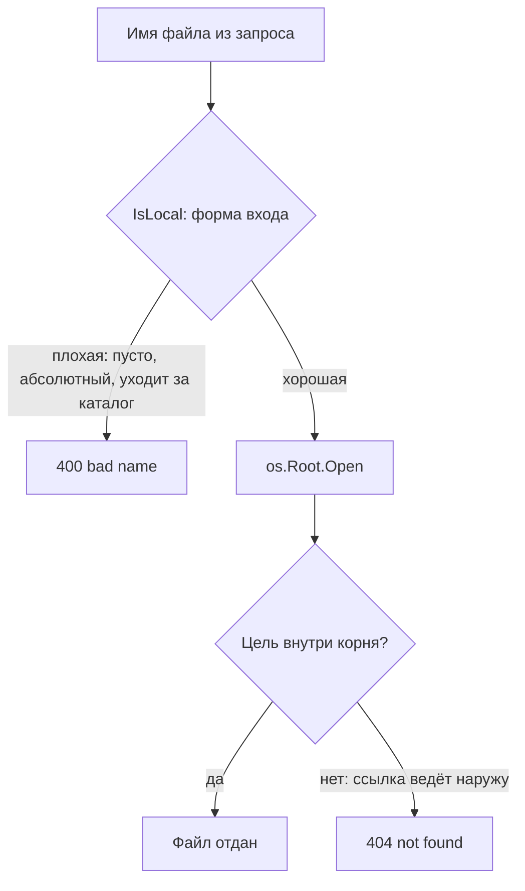

# Go: небезопасная работа с путями и файлами

Сервис отдаёт файлы из каталога /srv/files по имени из запроса: пришло
`report.txt` — отдали `/srv/files/report.txt`. Чтобы не склеивать строки
руками, программист берёт `filepath.Join`, функцию стандартной
библиотеки Go, которая соединяет куски пути, — и выглядит это как
забота о безопасности. Из темы `path-traversal` вы уже знаете, чем
кончается такой обработчик: ввод вида `../../../etc/hostname` уводит
путь за пределы каталога. Проверим, сколько из трёх популярных приёмов
удержат путь внутри; ответ прикиньте до чтения вывода.

```text
Join("/srv/files", "../../../etc/hostname") = /etc/hostname
HasPrefix("/srv/files-secret/x", "/srv/files") = true
root.ReadFile("../../outside.txt"): path escapes from parent
```

Первые две строки вывода — работа со строкой, и каталог она не
удерживает; третья — отказ из файловой системы. В миниатюре здесь всё
деление темы: аккуратная строка пути — не то же самое, что удержанный
каталог. Ниже разберём, почему первые два приёма обречены и из каких
двух половин собирается настоящая защита. А пока ответьте себе без
прогона: что скажет HasPrefix про соседний каталог /srv/files-backup?

## Как это работает

**Откуда это взялось.** Пакет path/filepath — часть стандартной
библиотеки Go, и историческая задача у него другая: переносимость. Он
собирает путь из кусков, сворачивает лишние элементы и учитывает
разделители разных систем, чтобы одна программа работала и на Linux, и
на Windows. Задача «удержать путь внутри каталога» в этот список не
входила. Функции ведут себя соответственно: Join соединяет сегменты и
вызывает Clean, а Clean сворачивает путь лексически и о файловой системе
не знает ничего.

Слово «лексически» здесь ключевое. Лексическая операция работает с путём
как со строкой: функция смотрит только на текст и на диск не ходит.
Бытовое сравнение — редактор, который приводит адрес в письме к
стандарту. Сократить «улица» до «ул.» он может, а существует ли такой
дом и чей он, не проверит. Clean так же сворачивает
`/srv/files/../../etc/hostname` в `/etc/hostname`: строка стала
аккуратной, а смысл чужим. Ломается сравнение в одном месте: редактор
волен оставить адрес как есть, а Clean всегда возвращает свёрнутый
результат.

### Три ловушки

Первая ловушка — сам Join: он не сажает путь в базу. Ввод `../../../`
выходит за неё, и итог `/etc/hostname` — свёрнутый, но чужой. Вторая —
сравнение префиксов: HasPrefix принимает `/srv/files-secret` за
внутренний путь `/srv/files`, потому что видит строки, а не каталоги.
Ответ на вопрос из введения тот же: `/srv/files-backup` тоже начинается
со строки `/srv/files`, поэтому проверка вернёт true и для него. Именно
за это HasPrefix объявлена устаревшей: границ путей она не видит.

Третья ловушка тоньше, и для неё нужно ещё одно понятие. Символическая
ссылка — файл-указатель, который ведёт на другой путь, как записка
«ключи не здесь, а в ящике стола». Функция EvalSymlinks разрешает
ссылки: подставляет вместо имени его настоящую цель. Казалось бы,
разрешил ссылку, сравнил итог с корнем — и порядок. Но ответ
EvalSymlinks — снимок на момент вызова, а между проверкой и открытием
файла ссылку можно подменить: проверялась одна цель, откроется другая.
Такое окно — знакомая вам по теме `race-conditions` гонка TOCTOU, гонка
между проверкой и использованием: строковыми функциями оно не
закрывается.

Все три приёма собраны в одну программу-прогон. Планы чтения такие:
найти, где путь собирается из строк; где строки сравниваются; где вход
отбирается по форме; кто открывает файл. Перед запуском программе нужен
реальный каталог — `mkdir srv/files`, — потому что последняя проверка
ходит на диск.

```go
// Исполняемый, go1.27. Запуск: go run probe.go
package main

import (
	"fmt"
	"os"
	"path/filepath"
)

func main() {
	fmt.Println(filepath.Join("/srv/files",
		"../../../etc/hostname"))
	fmt.Println(filepath.HasPrefix("/srv/files-secret/x",
		"/srv/files"))
	for _, s := range []string{"report.txt", "a/../b",
		"../secret", "/etc/hostname", ".."} {
		fmt.Printf("IsLocal(%q) = %v\n", s, filepath.IsLocal(s))
	}
	root, _ := os.OpenRoot("srv/files")
	defer root.Close()
	_, err := root.ReadFile("../../outside.txt")
	fmt.Println(err)
}
```

Вывод команды `go run probe.go` (go1.27.1, linux/amd64):

```text
/etc/hostname
true
IsLocal("report.txt") = true
IsLocal("a/../b") = true
IsLocal("../secret") = false
IsLocal("/etc/hostname") = false
IsLocal("..") = false
openat ../../outside.txt: path escapes from parent
```

Разбор по строкам. Первая повторяет ловушку из введения: база потеряна.
Вторая — префиксное сравнение приняло чужой каталог. Средний блок —
уже отбор входа функцией IsLocal, и он с нюансом: `a/../b` проходит,
потому что после свёртки остаётся внутри каталога. Подробности — в
следующем разделе. Последняя строка — отказ os.Root. Текст
`path escapes from parent` стоит запомнить: это штатная ошибка выхода
за корень, и по ней отказ ищется поиском в чужом коде.

## Отбор входа: IsLocal

Первая половина защиты появилась в Go 1.20. Функция IsLocal отвечает на
один вопрос — о форме входа: путь не абсолютный, не пустой и лексически
не выходит за каталог, где вычисляется. Поэтому `../secret` отсекается,
а `a/../b` проходит: после свёртки он остаётся внутри. Это та же
лексика: проверка смотрит на строку и на диск не ходит, но вопрос задаёт
правильный — «можно ли такое имя вообще пускать». Документация даёт
точное обещание: если IsLocal(p) вернула true, то Join(base, p) всегда
остаётся внутри base. Бытовое соответствие — рамка металлоискателя на
входе: опасный предмет через неё не пронести, что бы человек ни
собирался делать внутри.

Из прогона выше видно, как рамка работает: обычное имя `report.txt` и
`a/../b` проходят, а `../secret`, абсолютный путь и сам `..` отсекаются.
Граница сравнения совпадает с границей приёма: рамка не знает замыслов
посетителя, а IsLocal не видит, куда ведёт символическая ссылка. Ссылка
внутри каталога лексически безупречна — имя обычное, `..` в нём нет, —
а ведёт она наружу. Поэтому отбор входа закрывает ровно половину
проблемы, ту, что видна по строке. Вторая половина требует границы
другого рода.

## Граница, которую держит система: os.Root

Вторая половина пришла в Go 1.24. Тип os.Root — это открытый
каталог-корень: его создают один раз вызовом os.OpenRoot, и дальше все
операции — Open, ReadFile и остальные — выполняются строго внутри него.
Разница с filepath принципиальная: Root работает не со строкой, а с
файловой системой, и выход за корень возвращает ошибку. Символическая
ссылка наружу — тоже выход: Root разрешает ссылки, но отказывает той,
чья цель за пределами корня, а абсолютные ссылки запрещены вовсе. Если
рамка IsLocal стоит на входе, то Root — внутренний двор, из которого
двери наружу нет вовсе.

Граница и у этого сравнения есть. Двор привязан к месту, а Root держит
каталог за файловый дескриптор, поэтому переживает даже переименование
каталога: операции пойдут в тот же каталог по новому адресу. Конвейер
защищённого обработчика целиком выглядит так:



**Описание схемы.** Запрос идёт сверху вниз через две проверки разного
рода. Первая, IsLocal, смотрит только на строку и отсекает плохую форму
ещё до диска. Вторая живёт внутри os.Root и видит файловую систему:
ссылка, ведущая наружу, лексически чиста, но открытие возвращает ошибку.
Файл отдаётся, только когда пройдены обе проверки.

Посмотрите, как конвейер выглядит в коде. Планы чтения пары такие:
найти точку входа недоверенного имени; найти, где собирается путь;
проверить, кто открывает файл. Оба фрагмента — части одного обработчика:
base — строка базового каталога, root — *os.Root, открытый на этот
каталог один раз при старте.

Уязвимый вариант:

```go
// УЯЗВИМО — демонстрация, не для продакшена
func serveFileBad(w http.ResponseWriter, r *http.Request) {
	name := r.URL.Query().Get("name")
	// Join свернёт ../, но не вернёт путь внутрь base
	http.ServeFile(w, r, filepath.Join(base, name))
}
```

Исправленный вариант:

```go
// Исправленный вариант: отбор входа плюс граница
func serveFile(w http.ResponseWriter, r *http.Request) {
	name := r.URL.Query().Get("name")
	if !filepath.IsLocal(name) {
		http.Error(w, "bad name", http.StatusBadRequest)
		return
	}
	f, err := root.Open(name)
	if err != nil {
		http.Error(w, "not found", http.StatusNotFound)
		return
	}
	defer f.Close()
	io.Copy(w, f)
}
```

Пара отличается минимально. Строка 4 исправленного варианта — отбор
входа по форме: пустое, абсолютное или лексически уходящее за каталог
имя отклоняется до всякой работы с диском. Строка 8 — открытие через
os.Root: ссылка наружу заканчивается ошибкой, а не чужим файлом. Строки
5 и 10 дают разные отказы: «плохое имя» — запросу с дурной формой,
«не найдено» — когда имя законное, а файл не открылся.

Прогон подтверждает обе половины. Обработчик поднят в тесте на httptest
(тестовый HTTP-сервер из стандартной библиотеки). Снаружи каталога
лежит outside.txt, а внутри — ссылка link.txt, ведущая на него:

```text
name=report.txt                   -> 200 "hello from inside\n"
name=../../outside.txt            -> 400 "bad name\n"
name=/etc/hostname                -> 400 "bad name\n"
name=link.txt                     -> 404 "not found\n"
name=..%2f..%2foutside.txt        -> 400 "bad name\n"
```

Законное имя получает файл. Выходы через `..` и абсолютный путь отсекает
IsLocal ещё до диска — видно по ответу 400. Закодированная форма `..%2f`
после раскодирования становится тем же `..` и ловится той же проверкой;
сами кодированные формы обхода разобраны в теме `path-traversal`. Ссылка
link.txt формально локальна, поэтому отказ даёт уже Root: ошибка
открытия превращается в 404, а не в чужое содержимое.

### Границы и старые версии

Остались границы. IsLocal и всё семейство filepath — лексика, файловую
систему они не читают. Тип os.Root требует Go 1.24 и новее. Сам Root
тоже закрывает не всё: по документации он не запрещает переход границ
файловых систем, bind-монтирования и спецфайлы вроде /proc. Для отдачи
файлов по имени это не мешает, но полной изоляцией процесса Root не
становится. На более старых версиях остаётся связка «IsLocal плюс сверка
результата EvalSymlinks с корнем» — с известным окном между проверкой и
открытием. Поэтому переезд на Go 1.24 и замена связки на os.Root — не
косметика, а закрытие окна.

## Что искать на ревью

Практический вывод для чтения чужого кода на Go. Тревожные маркеры:
filepath.Join или Clean вокруг имени из запроса без последующей
границы. Дальше — strings.HasPrefix по путям, та же ловушка, что у
устаревшей filepath.HasPrefix, и самодельная сверка EvalSymlinks с
корнем, рабочая, но с окном. Опорные маркеры: отбор входа через IsLocal
и открытие через os.Root. Отдельно смотрят версию Go в go.mod: если
проект ниже 1.24, os.Root там нет, и вопрос «чем закрыто окно»
остаётся открытым.

Сестринская тема `python-path-handling` разбирает тот же класс в Python:
там у join свой сюрприз — абсолютный сегмент сбрасывает базу целиком.

**Зачем это в работе AppSec-инженера.** Отдача файлов по имени —
типовой обработчик, и Join в нём читается как «путь собран правильно».
Ревьюеру важно различать аккуратную строку и удержанный каталог: первое
даёт filepath, второе — отбор входа плюс os.Root. Тогда находка «обход
каталога» не спорится кодом, который «всё правильно склеивает», а
закрывается одним прогоном, как в этой теме.

## Источники

1. path/filepath package, справочник Go; реестр `go-filepath`. Разделы:
   Join и Clean (лексическая свёртка), IsLocal (свойства локального
   пути и обещание про Join), HasPrefix (deprecated, не видит границ
   путей), EvalSymlinks.
   <https://pkg.go.dev/path/filepath>
2. os package, справочник Go; реестр `go-os`. Разделы: тип Root и
   OpenRoot — операции только внутри корня, запрет выхода и ссылок
   наружу; OpenInRoot.
   <https://pkg.go.dev/os>

Каркас этапа: у этапа 7 общих унаследованных источников нет; каждая тема
опирается на документацию своего языка и на материалы этапа 1 по
классам дефектов.

**Скоропортящийся слой.** Возраст функций: IsLocal пришла в Go 1.20,
os.Root — в Go 1.24; в коде под старые версии их нет, и ревизия темы
перечитывает этот абзац первым. Поведение Join, Clean и HasPrefix
стабильно.

**Маркеры уверенности.** **Проверено лично** 2026-10-03 на go1.27.1
(linux/amd64), все прогоны статьи: Join со свёрткой `../../../` выходит
за базу до `/etc/hostname`; HasPrefix принимает `/srv/files-secret/x`
за внутренний путь; IsLocal отвечает true на обычном имени и на `a/../b`
(лексически остаётся внутри, Join сворачивает его внутрь базы) и false
на `../secret`, абсолютном пути, `..` и пустой строке; os.OpenRoot с
ReadFile читает свой файл и отвечает «path escapes from parent» на
`../../outside.txt` и на абсолютный путь; Open ссылки, ведущей наружу,
получает ту же ошибку, тогда как обычный os.ReadFile по той же ссылке
читает чужой файл; обработчик «IsLocal плюс root.Open» в httptest
отвечает 200 на своё имя, 400 на `../`, абсолютный путь и закодированную
форму `..%2f`, 404 — на ссылку наружу. Окно подмены ссылки между
EvalSymlinks и открытием — **по документации и по устройству**,
отдельным прогоном с гонкой не воспроизводилось. Текст справочника
(устаревание HasPrefix, обещание IsLocal, границы Root) сверен с
локальным `go doc` 2026-10-03; страницы pkg.go.dev открыты лично
2026-09-02.
