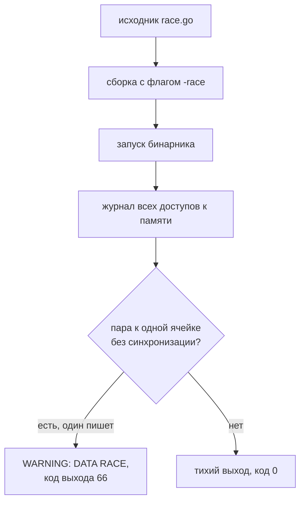

# Гонки в горутинах и race detector

Программа считает обработанные задачи: тысяча горутин увеличивает одну
переменную. Горутина — это поток исполнения в Go, только очень лёгкий:
запускается одним словом `go` перед вызовом. Тысяча таких — обычное дело,
потому что раскидывает их по процессорам сам язык, а не операционная
система. Ожиданием всей тысячи занимается `sync.WaitGroup` — счётчик:
каждая горутина вычитает из него единицу, а `Wait` в главной функции ждёт
нуля. Слово `defer` откладывает это вычитание до конца работы горутины.
Вот программа целиком, файл race.go:

```go
// УЯЗВИМО — демонстрация, не для продакшена
package main

import (
	"fmt"
	"sync"
)

func main() {
	counter := 0
	var wg sync.WaitGroup
	wg.Add(1000)
	for i := 0; i < 1000; i++ {
		go func() {
			defer wg.Done()
			counter++
		}()
	}
	wg.Wait()
	fmt.Println("counter =", counter)
}
```

Три прогона без всякой диагностики напечатали `counter = 921`,
`counter = 964` и один раз ровно 1000. Обновления теряются молча: горутина
читает переменную, прибавляет единицу и пишет обратно, и два таких оборота
пересекаются — одно приращение стирает другое. Повезло ли с итогом, решает
случай. Та же программа, собранная с детектором гонок:

```text
$ go run -race race.go
==================
WARNING: DATA RACE
Read at 0x00c000194028 by goroutine 12:
  main.main.func1()
      .../race.go:16 +0x7b

Previous write at 0x00c000194028 by goroutine 8:
  main.main.func1()
      .../race.go:16 +0x8d

Goroutine 12 (running) created at:
  main.main()
      .../race.go:14 +0x84

Goroutine 8 (finished) created at:
  main.main()
      .../race.go:14 +0x84
==================
# второй WARNING сокращён: та же ячейка, запись против записи,
# горутины 13 и 14, те же строки 16 и 14
counter = 667
Found 2 data race(s)
exit status 66
```

Детектор не дождался потери данных: он увидел саму пару доступов — одна
горутина читает ячейку, которую другая в это время пишет. Инструмент
называется race detector, он встроен в Go и включается одним флагом
`-race`. Сами гонки и их починка — тема `race-conditions`, сюда они не
переезжают. Чего в отчёте нет: ответа «гонок в программе нет» для путей,
которые в этом прогоне не исполнялись. Отчёт говорит о прогоне, а не о
программе. Допустим, прогон с детектором дал верный итог и ни одного
WARNING — что это доказывает о гонках в программе?

## Как это работает

**Откуда это взялось.** Гонки искали глазами по коду и по редким падениям
в проде: дефект проявляется раз в недели и по заказу не воспроизводится.
В 2013 году в Go 1.1 встроили детектор на базе библиотеки ThreadSanitizer,
которая до этого искала гонки в коде Chromium. Первыми же прогонами она
нашла десятки гонок в стандартной библиотеке самого Go. Идея: не
предсказывать гонку по коду, а наблюдать доступы к памяти и ловить пару
без синхронизации.

Устроен детектор так. При сборке с флагом `-race` компилятор оборачивает
каждое обращение к памяти учётным кодом. Такая обвязка называется
инструментированием: программа та же, но каждое чтение и каждая запись
теперь оставляют след в журнале детектора. За журналом следит библиотека
времени выполнения — код, который Go подключает к собранной программе и
который работает рядом с вашим. Для каждой ячейки памяти она проверяет,
упорядочены ли два доступа к ней синхронизацией.

Синхронизация здесь — это мьютекс, канал или атомик. Мьютекс — замок,
который в один момент держит одна горутина, остальные ждут. Канал — труба,
по которой одна горутина передаёт значение другой, и передача сама
выстраивает порядок «сначала отправка, потом приём». Атомик — операция над
числом, которую процессор выполняет как одно неделимое действие, без окна
для соседней горутины. Если два доступа к одной ячейке не связаны ничем из
этого и хотя бы один из них пишет — это и есть WARNING.



**Описание схемы.** Схема читается сверху вниз. Флаг `-race` меняет сборку:
каждый доступ к памяти получает учётный код. При запуске библиотека детектора
сверяет доступы попарно. Пара без синхронизации, где хотя бы один доступ
пишет, превращается в WARNING и код выхода 66; не нашлось такой пары —
программа завершается тихо.

Механизм самой гонки — почему два доступа к одной переменной дают
потерянные обновления, — разобран в `race-conditions` и здесь не
пересказывается. Важнее следствие устройства: детектор видит то, что
исполнилось. Ветка, не пройденная в прогоне, отчёта не даёт — не потому
что чистая, а потому что не читалась.

**Зачем это в работе AppSec-инженера.** Гонка — дефект, который нельзя
подтвердить чтением кода наверняка и нельзя воспроизвести по заказу.
Детектор превращает спор «тут гонка» в строку отчёта с адресом и двумя
стеками. Для ревьюера это способ и доказать находку, и проверить починку
тем же прогоном. Оба результата даёт один флаг.

## Что умеет и чего не умеет

**Что умеет.** Находить гонки на памяти в исполненном коде: на переменной,
на карте (встроенном в Go словаре «ключ-значение»), на поле структуры, на
счётчике примитивного типа. Класс дефекта — CWE-362 в каталоге слабостей
CWE (Common Weakness Enumeration), и он же стоит у гонок уровня запросов
из `race-conditions`. Отчёт несёт обе стороны пары и точки, где горутины
были созданы. Классическая форма — чтение общей переменной из запущенной
горутины, как у счётчика из введения. До Go 1.22 сюда же попадал захват
переменной цикла; с 1.22 у каждой итерации своя копия, и гонки там нет.

**Чего не умеет по устройству.** Не видит пути, не исполненные в прогоне:
охват определяется тестами и нагрузкой. Не видит логические гонки уровня
протокола: «проверил остаток — списал» из двух запросов — это гонка без
гонки на памяти, и она остаётся на теме `race-conditions`. Не работает без
cgo — механизма вызова C-кода из Go, на нём стоит библиотека детектора, —
и вне списка поддержанных платформ. И не бесплатен: документация оценивает
цену типового прогона в 2–20 раз по времени и в 5–10 раз по памяти.

## Как запустить

Детектору нужен не только Go, но и рабочий cgo, потому что библиотека
детектора написана на C++. Без компилятора C в системе сборка с `-race` не
начнётся; на Linux это gcc или clang на пути. Дальше флаг ставится на любую
форму запуска:

```bash
# Go 1.27, gcc на пути. Прогон тестов с детектором.
go test -race ./...

# Сборка бинарника с детектором для нагрузочного стенда.
go build -race -o app-race ./cmd/app
```

Тест с гонкой под детектором падает строкой «race detected during execution
of test» и статусом FAIL — так отвечает `go test -race` на счётчик из
введения. Собранный бинарник при находке выходит с кодом 66. Через `go run`
снаружи виден код 1 и строка «exit status 66»: обёртка переводит код
потомка в свой.

Поведение меняет переменная окружения GORACE. Значение `halt_on_error=1`
останавливает программу на первой гонке: счётчик из введения с этим
значением дал один WARNING вместо двух, а код выхода остался 66. Ещё два
ключа: `log_path` пишет отчёты в файлы, `exitcode` меняет код выхода.

## Как читать вывод

Отчёт из введения читается сверху вниз четырьмя смыслами. «Read at 0x… by
goroutine 12» со стеком вызовов — один доступ к ячейке. Стек — это цепочка
«кто кого вызвал», и его нижняя строка с именем файла ведёт в исходник.
«Previous write by goroutine 8» — второй доступ, конфликтный: та же ячейка,
и доступ этот пишет. Блоки «created at» под каждым стеком — место, где эти
горутины родились. Финал: «Found 2 data race(s)» и код выхода 66.

Порядок стеков не хронология, а две стороны пары: важно, что оба доступа —
к одной ячейке и хотя бы один пишет. Несколько WARNING подряд обычно
говорят об одной переменной: чинится место записи, а не каждая строка
отчёта.

С истинной находкой дальше идут не сюда, а в тему `race-conditions`: там
разобрана починка гонки — сведение проверки и записи к одной атомарной
операции. Для памяти процесса тому же принципу служат мьютекс из пакета
sync и атомики из пакета sync/atomic. После починки тот же прогон должен
выйти с кодом 0 и без WARNING: это и есть проверка фикса.

## Границы метода

**Граница первая: охват.** Детектор отвечает за исполненное. Пакет без
конкурентных тестов под детектором доказывает только то, что в этих тестах
гонок не случилось. Закрывается это нагрузочными и интеграционными
прогонами под `-race`. Второй приём из блога Go: один экземпляр сервиса
в пуле собран с детектором и работает под боевой нагрузкой. Цена прогона
ложится на один экземпляр из многих.

**Граница вторая: цена.** Замедление в разы делает детектор несовместимым с
постоянной работой в проде и с тесными лимитами времени в конвейере.
Практическая форма — отдельная джоба конвейера с `-race`, а не флаг на
всех прогонах.

## Частая ошибка

Встречается возражение: гонка у нас не воспроизводится, значит, её нет.
Возражение ставит знак равенства между гонкой и её видимым сбоем. Если бы
счётчик из введения напечатал ровно тысячу, возражение стало бы верным?

**Детектору воспроизведение сбоя не нужно.** Он ловит не потерю данных, а
саму несинхронизированную пару доступов — она есть в каждом прогоне такого
кода, даже когда итог случайно верный. И вторая половина опровержения из
блога Go: ложных срабатываний детектор не выдаёт; WARNING — это всегда
реальная пара.

Контрпример уже был в этой теме. Третий прогон счётчика без детектора
напечатал ровно 1000, но пара доступов от этого не изменилась: под `-race`
тот же код дал два WARNING. Отчёт не зависит от того, повезло ли с итогом.

## Чеклист для ревью

1. Проверьте, что у пакетов с горутинами есть прогон `go test -race` в
   конвейере, а не на машине автора.
2. Проверьте, что конкурентные тесты проходят общие данные, а не только
   последовательные сценарии (CWE-362).
3. Проверьте, что каждое WARNING дочитано до точек «created at», а не
   брошено на первой строке.
4. Проверьте, что починка проверена тем же прогоном с кодом выхода 0.
5. Проверьте, что цена прогона учтена: детектор стоит в отдельной джобе или
   на части нагрузки, и это записано в конвейере.
6. Проверьте, что на находки детектора есть ссылка в разборе дефекта —
   без отчёта спор о гонке остаётся спором.

## Попробуй сам

Напишите счётчик из введения: тысяча горутин увеличивает одну переменную,
ожидание через `sync.WaitGroup`. Прогоните трижды без флага и трижды с
флагом `-race`. Затем закройте переменную мьютексом и повторите прогон с
детектором.

Одна подсказка: без мьютекса итог почти наверняка меньше тысячи, но гонка
есть и при случайно верном итоге — смотрите на отчёт, а не на сумму.

**Критерий выполнения** наблюдаемый: отчёт WARNING: DATA RACE с двумя
стеками на код без мьютекса и код выхода 66 у собранного бинарника.
После починки — чистый прогон с кодом 0.

## Проверь себя

1. Счётчик из введения, переписанный с мьютексом:

    ```go
    package main

    import (
        "fmt"
        "sync"
    )

    func main() {
        var mu sync.Mutex
        counter := 0
        var wg sync.WaitGroup
        wg.Add(1000)
        for i := 0; i < 1000; i++ {
            go func() {
                defer wg.Done()
                mu.Lock()
                counter++
                mu.Unlock()
            }()
        }
        wg.Wait()
        fmt.Println("counter =", counter)
    }
    ```

    Предскажите, что будет в выводе `go run -race` и каким будет код
    выхода.

2. Другой прогон, другой отчёт:

    ```text
    WARNING: DATA RACE
    Write at 0x00c0000c2000 by goroutine 7:
      main.main.func1()
          .../cache.go:6 +0x46

    Previous read at 0x00c0000c2000 by goroutine 8:
      main.main.func2()
          .../cache.go:7 +0x33
    ```

    Прочитайте отчёт: что здесь за конфликт и где искать место починки?

3. Почему чистый прогон с -race не доказывает отсутствие гонок?

4. Какой код выхода у собранного с -race бинарника при находке и что
   вместо него показывает `go run` снаружи?

5. Возврат к теме `race-conditions`: чем гонка «проверил остаток —
   списал» отличается от гонки на переменной и кого из них видит
   детектор?

<details markdown="1">
<summary>Ответ 1</summary>

1. `counter = 1000`, ни одного WARNING, код выхода 0: оба доступа к
   переменной упорядочены мьютексом, и несинхронизированной пары нет.
   Прогон проверки: `go run -race fixed.go`. Отчёт появляется от пары
   доступов, а не от неверного итога, поэтому молчание детектора здесь —
   это отсутствие пары в прогоне.

</details>

<details markdown="1">
<summary>Ответ 2</summary>

2. Запись и чтение одной ячейки `0x00c0000c2000` из двух горутин: одна
   пишет в карту на строке 6, вторая читает на строке 7. Место починки —
   общие данные `cache`: доступы к ней закрываются мьютексом или
   sync.Map. Читать отчёт надо до блоков «created at»: они показывают,
   где родились обе горутины.

</details>

<details markdown="1">
<summary>Ответ 3</summary>

3. Детектор видит только исполненные пути: непройденная ветка не даёт
   отчёта не потому, что чистая, а потому что не читалась. Чистый прогон
   доказывает отсутствие гонок в этом прогоне, и охват закрывается
   нагрузочными тестами под -race.

</details>

<details markdown="1">
<summary>Ответ 4</summary>

4. Бинарник выходит с кодом 66; `go run` переводит это в свой код 1 и
   строку «exit status 66» в выводе.

</details>

<details markdown="1">
<summary>Ответ 5</summary>

5. «Проверил — списал» — гонка уровня логики: каждый доступ к памяти
   синхронизирован, но порядок двух запросов нарушен. Детектор такое не
   видит: он про память, а не про смысл.

</details>

## Источники

1. Data Race Detector, документация Go; реестр `go-race-detector`.
   Разделы: формы запуска с -race, формат отчёта, переменная GORACE,
   требование cgo и список платформ, цена прогона, типовые гонки.
   <https://go.dev/doc/articles/race_detector>
2. Introducing the Go Race Detector, блог Go; реестр
   `go-blog-race-detector`. Разделы: детектор на базе ThreadSanitizer,
   отсутствие ложных срабатываний, схема «один race-экземпляр в пуле»,
   разборы Timer.Reset и ioutil.Discard.
   <https://go.dev/blog/race-detector>

Каркас этапа: у этапа 7 общих унаследованных источников нет; каждая тема
опирается на документацию своего языка и на материалы этапа 1 по
классам дефектов.

**Скоропортящийся слой.** Список поддержанных платформ, требования к cgo
и цена прогона зависят от версии Go; при ревизии перечитывается страница
документации. Формат отчёта и код выхода 66 стабильны, но проверяются
тем же прогоном.

**Маркеры уверенности.** Счётчик тысячи горутин **проверен лично** повторно
2026-10-03 на go1.27.1 (linux/amd64, gcc 16.2.1): три прогона без флага
напечатали 921, 964 и 1000; `go run -race` выдал два WARNING: DATA RACE
со стеками и блоками «created at», «counter = 667», «Found 2 data race(s)»
и «exit status 66»; собранный с -race бинарник выходит с кодом 66; с
`GORACE=halt_on_error=1` отчёт сокращается до одного WARNING при том же
коде; `go test -race` на том же счётчике падает строкой «race detected
during execution of test» и статусом FAIL; версия с мьютексом печатает
1000 и выходит с кодом 0. Первичная проверка 2026-09-02 на go1.27.0
(gcc 16) дала те же итоги: прогоны без флага печатали 948 и 919.
Программа с захватом переменной цикла тысячей горутин **проверена лично**
2026-10-03 на go1.27.1: под `-race` ни одного WARNING, код выхода 0 — с
Go 1.22 у каждой итерации своя копия переменной, и гонки там нет. Оценки
цены (2–20 раз по времени, 5–10 раз по памяти), требование cgo, опции
GORACE и отсутствие ложных срабатываний — **по документации**, обе страницы
открыты лично 2026-09-02. Замедление в цифрах на этом стенде не измерялось.
