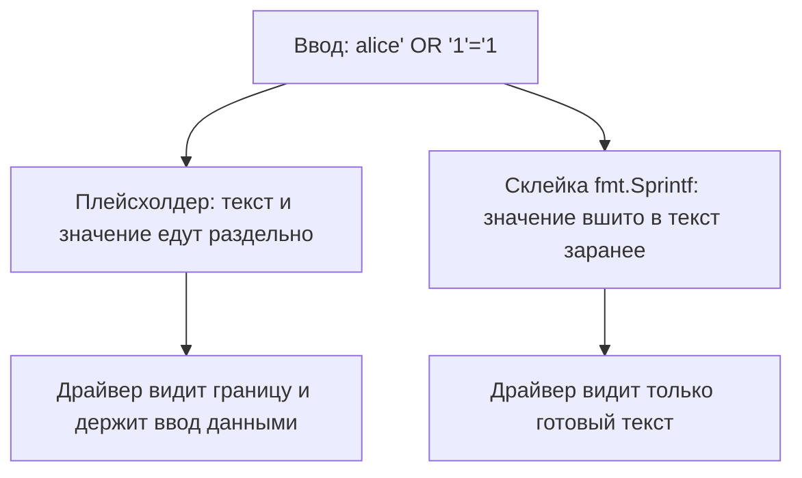

# Go: работа с SQL и шаблонами

Обработчик ищет пользователя по имени из запроса. Запрос к базе собран
двумя способами: значение едет отдельным аргументом при неизменном
тексте или строка заранее склеена через fmt.Sprintf. Драйвер — адаптер
между пакетом и конкретной базой — подменён заглушкой, печатающей текст
запроса и аргументы. На ввод `alice' OR '1'='1` первый способ отвечает
неизменным текстом и отдельным аргументом, второй — изменённым запросом.
Тот же вопрос стоит и на выводе: шаблон решает, чем окажется присланная
строка. Оба класса разобраны в `sqli-basics` и
`xss-contexts`; в каталоге это CWE-89 и CWE-79, категория `A05:2025`.
Разберём, где в Go проходит граница между кодом и данными и какой приём
её сносит.

## Как это работает

**Откуда это взялось.** Оба пакета отвечают на одну задачу: отделить код
от данных там, где они смешиваются в одном тексте. Наивное решение,
собрать текст конкатенацией, ломается о первую же кавычку во вводе; как
ломается и что при этом получает атакующий, показывает тема
`sqli-basics`. Ответы стандартной библиотеки разные по форме и
одинаковые по смыслу. У запроса текст и параметры едут в базу раздельно.
У шаблона текст разбирается заранее, а значения подставляются через
экранирование по месту вставки.

### Запрос: database/sql держит значения отдельно

Пакет database/sql — единый вход стандартной библиотеки Go к реляционным
базам. Сам пакет с базой не говорит: под каждую СУБД пишется драйвер,
небольшой адаптер, который переводит вызовы пакета на язык своей базы.
Бытовое соответствие — единое окно приёма в организации: бланк заявления
один, а за окном сидит сотрудник конкретного отдела. Ломается аналогия
на переводе: окно бумаги не переводит, а драйвер перекладывает каждый
вызов на язык своей базы.

Плейсхолдер — помеченное место в тексте запроса, куда при выполнении
попадёт значение. Здесь работает тот же образ бланка: текст запроса — часть,
напечатанная типографией, плейсхолдер — пустое поле, значение — то, что
вы вписали. Что бы ни было вписано в поле «ФИО», оно не станет новой
строкой бланка. Граница образа: вписанное от руки может вылезти за край
поля, а значение параметра доезжает до базы байт в байт и остаётся
данными.

Проверим разделение на прогоне. Вместо настоящего драйвера программа
регистрирует заглушку: она объявляет интерфейс драйвера, но вместо
разговора с базой печатает то, что до неё доехало.

```go
// Исполняемый прогон на go1.27: драйвер-заглушка
package main

import (
	"database/sql"
	"database/sql/driver"
	"fmt"
)

type stub struct{}

func (stub) Open(string) (driver.Conn, error)    { return stub{}, nil }
func (stub) Prepare(string) (driver.Stmt, error) { return nil, nil }
func (stub) Close() error                        { return nil }
func (stub) Begin() (driver.Tx, error)           { return nil, nil }

// Query печатает то, что доехало до драйвера: текст запроса и аргументы
func (stub) Query(query string, args []driver.Value) (driver.Rows, error) {
	fmt.Printf("Query: %q, args=%q\n", query, args)
	return nil, fmt.Errorf("заглушка: дальше не едем")
}
```

Точка входа зовёт один и тот же запрос двумя способами, и вызовы
различаются только сборкой текста:

```go
// Тот же прогон: точка входа
func main() {
	sql.Register("stub", stub{})
	db, _ := sql.Open("stub", "")
	name := "alice' OR '1'='1"

	fmt.Println("== плейсхолдер:")
	db.Query("SELECT id FROM users WHERE name = ?", name)

	// УЯЗВИМО — демонстрация, не для продакшена
	fmt.Println("== склейка fmt.Sprintf:")
	db.Query(fmt.Sprintf("SELECT id FROM users WHERE name = '%s'", name))
}
```

```text
== плейсхолдер:
Query: "SELECT id FROM users WHERE name = ?", args=["alice' OR '1'='1"]
== склейка fmt.Sprintf:
Query: "SELECT id FROM users WHERE name = 'alice' OR '1'='1'", args=[]
```

Первый вызов доехал до драйвера с неизменным текстом: значение лежит в
аргументах, и кавычки в нём остаются байтами данных. Во втором вызове
аргументов нет вовсе: fmt.Sprintf отработал до вызова Query, и ввод стал
частью текста команды. На границе драйвера защищать уже нечего: текст
запроса остаётся кодом только до тех пор, пока его не собрали из ввода.



**Описание схемы.** Один и тот же ввод идёт двумя дорогами. Верхняя,
через плейсхолдер: текст и значение едут раздельно, и драйвер видит
границу. Нижняя, через склейку: значение вшито в текст заранее, и
драйверу достаётся только готовый текст.

Два уточнения по документации. Форма плейсхолдера зависит от драйвера:
`?`, `$1` или `:name`, поэтому переносимый код пишут под конкретную
базу. И плейсхолдер передаёт только значения: имена таблиц и столбцов
остаются частью текста, их сверяют со списком разрешённых. Эта граница
подробно разобрана в теме `parameterized-queries`.

### Вывод: html/template экранирует по контексту

В Go два пакета шаблонов с одним движком. Движок разбирает текст шаблона
заранее и подставляет значения в помеченные места вида `{{.}}`. Разница
между пакетами одна, но решающая: text/template выводит значение как
есть, а html/template знает, куда попадает подстановка, и экранирует её
по контексту. Сами контексты — тело документа, атрибут, адрес, скрипт —
и их правила разобраны в теме `xss-contexts`; здесь важно, что пакет
применяет их сам.

Прогон подаёт вредоносную строку и опасный адрес в пять приёмов:

```go
// Исполняемый прогон на go1.27
package main

import (
	"html/template"
	"os"
	texttemplate "text/template"
)

func main() {
	s := "<script>alert('xss')</script>"

	texttemplate.Must(texttemplate.New("t").Parse("{{.}}\n")).
		Execute(os.Stdout, s) // (1)
	template.Must(template.New("t").Parse("{{.}}\n")).
		Execute(os.Stdout, s) // (2)
	template.Must(template.New("t").Parse("<a href=\"{{.}}\">x</a>\n")).
		Execute(os.Stdout, "javascript:alert(1)") // (3)
	// УЯЗВИМО — демонстрация, не для продакшена
	template.Must(template.New("t").Parse("{{.}}\n")).
		Execute(os.Stdout, template.HTML(s)) // (4)
	template.Must(template.New("t").Parse("<p>"+s+"</p>\n")).
		Execute(os.Stdout, nil) // (5)
}
```

```text
<script>alert('xss')</script>
&lt;script&gt;alert(&#39;xss&#39;)&lt;/script&gt;
<a href="#ZgotmplZ">x</a>
<script>alert('xss')</script>
<p><script>alert('xss')</script></p>
```

Строки вывода идут в порядке вызовов. Первая, из text/template:
разметка выведена как есть. Вторая, из html/template: угловые скобки и
кавычки заменены сущностями, и строка стала текстом. Третья, фильтр
адресов: значение со схемой `javascript:` в адресе ссылки заменено
маркером `#ZgotmplZ`, нарочито нелепым словом, чтобы такие пропуски
искались в выводе поиском. Четвёртая, тип template.HTML: пакету сказано
«это доверенное содержимое», и экранирование отключено. Пятая, склейка
текста шаблона до разбора: для пакета ввод стал частью самого шаблона,
а не данными.

Обход устроен явно. Типы-маркеры template.HTML и template.JS говорят
«это доверенное содержимое» и выводят значение как есть. Документация
пакета требует, чтобы такое содержимое приходило из доверенного
источника, поэтому в ревью тип-маркер рядом с чужими данными — находка
по определению пакета.

Граница у обоих пакетов общая: защита держится на разделении «шаблон —
данные». Скажите, не возвращаясь к прогону: спасёт ли экранирование
шаблон, который сам собран склейкой из ввода? Пятая строка вывода уже
ответила — нет: всё, что попало в текст до разбора, защитой не
накрывается.

## Что смотреть в ревью

Обе границы видны в Go-коде без запуска, по импортам и форме вызова.
Признака три, и у каждого ниже — почему это находка, как чинить и как
проверить исправление.

1. **Склейка запроса.** fmt.Sprintf или конкатенация в аргументе Query
   или Exec. Это находка, потому что ввод вшит в текст до вызова и
   драйверу защищать нечего — показал первый прогон. Чинится переносом
   значения в аргумент: текст получает плейсхолдер. Если в запрос
   подставлялось имя таблицы или столбца, параметр его не заменит: имя
   сверяют со списком разрешённых и подставляют только совпадение.
2. **Пакет text/template на HTML-выводе.** Признак виден по строке
   импорта. Движок тот же, экранирования нет, и любая строка извне
   выйдет разметкой. Чинится сменой импорта на html/template: сигнатуры
   вызовов совпадают, и правка обычно сводится к одной строке. Проверка
   исправления — повторный прогон: экранированное значение видно по
   сущностям вида `&lt;` в выводе.
3. **Типы-маркеры у чужих данных.** template.HTML, template.JS и
   template.URL рядом со значением, пришедшим из запроса или из базы.
   Такой тип отключает экранирование своего значения, и документация
   разрешает его только содержимому из доверенного источника. Проверка
   на стенде — поиск маркера `#ZgotmplZ` в готовом HTML: находка покажет,
   до каких мест доходят опасные адреса.

Убедиться, что защита работает, можно целиком на тех же прогонах. Два
листинга про драйвер сохраняются одним файлом main.go, листинг с
шаблонами — отдельным файлом; оба запускаются командой
`go run main.go`. Исправленный запрос даёт неизменный текст и значение
в аргументах, склейка — пустой список аргументов. Шаблоны
проверяются вторым прогоном: после смены импорта в выводе появляются
сущности, а маркер `#ZgotmplZ` стоит на месте опасных адресов. Если в
выводе осталась строка `<script>` как есть, правка не доехала до
шаблона.

**Зачем это в работе AppSec-инженера.** В Go-ревью обе границы читаются
статически: fmt.Sprintf рядом с Query, text/template на HTML-выводе,
template.HTML у чужих данных — три текстовых признака, не требующих
запуска. А когда нужен факт выполнения, заглушка драйвера собирается за
минуту на любой машине с Go и показывает границу вживую.

## Источники

1. database/sql package, справочник Go; реестр `go-database-sql`.
   Разделы: Query и Exec с аргументами-плейсхолдерами, sql.Named,
   пул соединений и контексты.
   <https://pkg.go.dev/database/sql>
2. html/template package, справочник Go; реестр `go-html-template`.
   Разделы: контекстное автоэкранирование, таблица контекстов, маркер
   ZgotmplZ, типы HTML, JS, URL и их риск.
   <https://pkg.go.dev/html/template>

Каркас этапа: у этапа 7 общих унаследованных источников нет; каждая тема
опирается на документацию своего языка и на материалы этапа 1 по
классам дефектов.

**Маркеры уверенности.** **Проверено лично** 2026-10-03 на go1.27.1
(linux/amd64), повтор прогона от 2026-09-02 на go1.27.0: заглушка
драйвера показала плейсхолдер с отдельным аргументом против склейки
fmt.Sprintf без аргументов; text/template выводит разметку как есть;
html/template экранирует её, заменяет адрес со схемой `javascript:` на
`#ZgotmplZ`; тип template.HTML и склейка текста шаблона до разбора
выводят разметку без экранирования. Разница форм плейсхолдера по
драйверам и требование доверенного источника у типов-маркеров — **по
документации**, обе страницы открыты лично 2026-09-02.
