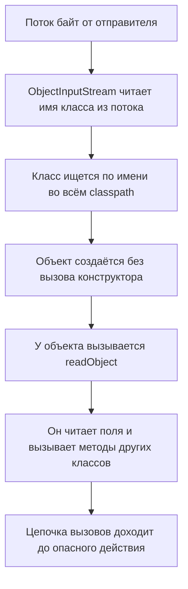

# Java: небезопасная десериализация и цепочки гаджетов

Прогон, с которого начнётся тема, в конце вы повторите своими руками.
Учебная программа FilterDemo объявляет класс с одним полем и с методом
readObject — таким методом класс участвует в собственном восстановлении
из потока. Программа сворачивает объект в массив байт и разбирает его
обратно дважды: как есть и с фильтром классов на входе. Вывод
(OpenJDK 17):

```text
поток: 60 байт, начало: ac ed 00 05
readObject исполнился для: demo
фильтр отклонил: filter status: REJECTED
```

Три строки — три наблюдения, на которых держится тема. Первая: поток
начинается с байтов `AC ED 00 05`, это подпись Java-сериализации, и по
ней такой вход опознаётся в трафике. Вторая: readObject отработал при
разборе, ещё до того, как объект вернулся вызывающему коду. Третья:
фильтр отклонил класс до чтения полей — печати из readObject при нём
нет.

Соберём из наблюдений предмет. Поток Java-сериализации несёт не только
данные, но и имена классов, а разбор вызывает методы этих классов. Если
поток прислал чужой отправитель, классы и поведение при разборе выбирает
он. Это CWE-502, категория `A08:2025` издания OWASP; общая механика
класса дефектов разобрана в теме `insecure-deserialization`. Ответ
двойной: разбор допускает только классы из списка разрешённых, а
надёжнее — сменить формат на данные без поведения.

## Что несёт поток Java-сериализации

Что такое сериализация вообще, разобрано в теме `insecure-deserialization`.
Если коротко: объект из памяти сворачивается в поток байт, чтобы пережить
перезапуск или доехать до другого процесса, а десериализация разворачивает
его обратно. В Java за это отвечает пара классов стандартной библиотеки:
ObjectOutputStream записывает объект в поток, а ObjectInputStream читает
поток и восстанавливает объект.

Классу нужно разрешение на участие: он объявляет интерфейс Serializable.
Интерфейс в Java — это договор о наборе методов, но Serializable пуст:
методов в нём нет, это пометка. Бытовое соответствие — наклейка «можно
в багаж»: она ничего не добавляет чемодану, но решает, пустят ли его на
ленту. Ломается сравнение на том, кто клеит. Наклейку выбирает владелец
чемодана, а Serializable объявляет автор класса раз и навсегда:
отправитель потока пометку не ставит, а ею пользуется.

Чем поток Java отличается от данных, видно по сравнению с JSON. В JSON
лежат только значения полей, и прочитать их можно одним словарём. Поток
Java несёт рецепт восстановления: подпись формата, имена классов,
описания их полей и сами значения. Именно поэтому разбор не ограничивается
чтением: чтобы восстановить объект, платформа находит названный класс и
вызывает его код. Класс из прогона выше выглядит так (синтаксис листинга
читается по теме `java-reading-syntax`):

```java
// Фрагмент исполняемого прогона: класс из FilterDemo
class Demo implements Serializable {
    String name = "demo";

    private void readObject(ObjectInputStream in)
            throws IOException, ClassNotFoundException {
        in.defaultReadObject();
        System.out.println("readObject исполнился для: " + name);
    }
}
```

Метод readObject здесь — не выдумка автора класса, а договорённость
формата: при разборе платформа ищет метод с точным именем и сигнатурой и
вызывает его. Модификатор private не помеха, потому что вызов идёт мимо
обычных правил доступа. Вызов defaultReadObject читает поля из потока по
описанию класса; строка с печатью добавлена, чтобы момент вызова был
виден глазами, — это она стоит второй строкой прогона.

Записывающая сторона того же прогона умещается в четыре вызова:

```java
// Фрагмент исполняемого прогона: запись объекта в массив байт
ByteArrayOutputStream buf = new ByteArrayOutputStream();
ObjectOutputStream out = new ObjectOutputStream(buf);
out.writeObject(new Demo());
byte[] data = buf.toByteArray();
```

ByteArrayOutputStream — массив байт в роли потока: writeObject пишет
объект в него, а toByteArray отдаёт накопленные байты. Этот фрагмент
прогнан вместе с остальными: он даёт ровно тот массив из 60 байт,
который показан во введении. Дальше массив разбирается дважды, как там.

Подпись формата — первые байты `AC ED 00 05`, их видно в первой строке
прогона. Поток часто передают текстом в Base64, кодировке, которой байты
переписывают печатными символами; в Base64 начало потока выглядит как
`rO0`. Третий маркер — тип содержимого
`application/x-java-serialized-object`, с которым такой поток приходит
по HTTP. Все три маркера ищутся текстовым поиском в прокси и журналах.

## Как это работает

**Откуда это взялось.** Сериализация в Java задумана для своих: объект
уходит в файл или по сети тому же приложению. Для такой задачи потоку
мало данных — он несёт рецепт восстановления, имена классов и их полей.
Как и в pickle из темы `python-pickle-eval`, наивное прочтение «это
данные» ломается о рецепт: восстановление вызывает код класса. Пока
поток пишет и читает одно приложение, это работает. Когда поток принимает
чужой отправитель, рецепт пишет он.

Три детали делают класс дефектов тяжелее, чем звучит название
«небезопасный разбор». Первая:
конструктор при десериализации не вызывается. Конструктор — код, который
проверяет и заполняет поля при обычном создании объекта; десериализация
идёт мимо него. JVM, виртуальная машина, исполняющая Java-программы,
собирает объект особым путём. Она выделяет память, заполняет поля из
потока и лишь затем вызывает методы сериализации: readObject и его
родню, readResolve и readExternal. Инварианты, которые ставил
конструктор, в этом пути не действуют.

Вторая деталь — classpath, список мест, откуда JVM загружает классы.
Туда входят каталоги с вашими классами и jar-архивы всех зависимостей
(jar — упакованная библиотека классов). Класс для разбора ищется по
имени во всём этом списке. Бытовое соответствие — справочная служба
офиса, где документ ищут по всем полкам, а не только по вашему столу.
Каждая подключённая библиотека — ещё одна полка, и чужой класс с неё
доступен наравне с вашим. Ломается сравнение на видимости: полки офиса
видно глазами, а classpath собранного сервиса никто не перечисляет.
Поэтому набор доступных классов шире, чем думает автор кода.

Третья деталь — гаджеты. Гаджет — класс из чужой библиотеки, чей
readObject делает с данными потока шаг, полезный атакующему. Такой шаг —
чтение файла, открытие соединения, вызов команды. Цепочка гаджетов —
путь вызовов от точки разбора до опасного действия через несколько
таких классов. Атакующему не нужно писать свой класс: он собирает
цепочку из того, что уже лежит в зависимостях.

Бытовое соответствие для цепочки — взломщик, который не приносит
инструмент с собой, а собирает его из находок в вашей кладовой. Молоток,
верёвка и стремянка безобидны по отдельности, а в последовательности —
способ проникнуть. Ломается сравнение на масштабе: кладовую можно
оглядеть, а набор гаджетов в зависимостях виден только перечислением
classpath.

В каком порядке всё это исполняется, видно на схеме:



**Описание схемы.** Разбор идёт сверху вниз, и решения в нём принимает
поток. Имя класса читается из потока, класс подыскивается во всём
classpath, объект собирается в обход конструктора, и затем вызывается
его readObject. Дальше работает код классов из потока: поля читаются,
методы вызываются, и цепочка может дойти до опасного действия. Фильтр из
раздела о защите встаёт между вторым и третьим шагом: имя уже прочитано,
а класс ещё не загружен.

Схема показывает главное следствие темы: к моменту, когда readObject()
вернул объект, весь чужой код уже отработал. Поэтому проверка результата
после разбора опаздывает всегда — к этой мысли мы вернёмся в разделе о
коде и в «Проверь себя».

## Как опознать такой вход

Маркеров два набора, и оба ищутся текстовым поиском. В трафике это три
признака из раздела о потоке: байты `AC ED 00 05` в начале, префикс
`rO0` в Base64 и тип содержимого `application/x-java-serialized-object`.
Ходят такие потоки там, где сервисам надо обменяться объектами: очереди
сообщений и кэши между сервисами, старые HTTP-эндпоинты и RMI. RMI —
старый механизм Java «удалённый вызов методов»: одна JVM вызывает метод
на другой, а аргументы едут по сети этим самым форматом.

В коде маркеры тоже текстовые. Главный — вызов readObject у
ObjectInputStream. Второй — собственные readObject, readResolve и
readExternal в классах модели: все три метода входят в договор
сериализации, и все три вызываются при разборе. Найденный метод —
повод проследить, кто пишет поток, который этот класс будет читать.

## Как это выглядит в коде

Главный признак — разбор потока, чей источник не доказан. Фрагмент ниже
читайте тремя планами: найти, откуда приходят байты; найти вызов
разбора; ответить, кто выбирает классы в потоке. До выноски назовите про
себя строку, где исполняется код из потока:

```java
// УЯЗВИМО — демонстрация, не для продакшена
byte[] body = request.getInputStream().readAllBytes();
ObjectInputStream ois =
    new ObjectInputStream(new ByteArrayInputStream(body));
Object o = ois.readObject();        // (1)
```

1. Разбор чужого потока: имена классов и вызовы методов выбирает
   отправитель. Тело запроса читается как массив байт,
   ByteArrayInputStream делает из массива поток, и ObjectInputStream
   разбирает его по правилам формата. Проверка типа результата после
   разбора опоздала: исполнение уже случилось внутри readObject.

Этот пример показывает: разбор уместился в пять строк, а решения в нём
принял отправитель — какие классы назвать и какие методы вызвать.
Ответьте по памяти: изменит ли что-то проверка длины `body`, поставленная
перед разбором? Нет: длина ограничивает объём потока, но не имена классов
внутри него, а выбирает поведение именно имя класса.

Второй признак — поля, которые не должны уезжать в поток. Какое из двух
здесь лишнее?

```java
// УЯЗВИМО — демонстрация, не для продакшена
public class Account implements Serializable {
    private String login;
    private String passwordHash;   // (1)
}
```

1. Поле уедет в поток и прочитается обратно из чужого потока. Памятка
   OWASP предписывает таким полям модификатор transient: помеченное поле
   исключается из сериализации, в поток не попадает и при разборе
   остаётся пустым.

Ложное срабатывание: сериализация внутри одной системы с общим доверенным
хранилищем. Риск живёт в источнике потока, а не в самом вызове, поэтому
вопрос ревьюера один: кто мог записать эти байты.

**Зачем это в работе AppSec-инженера.** Java-сервисы принимают такие
потоки в очередях сообщений, кэшах, RMI и старых HTTP-эндпоинтах.
Ревьюеру нужны три навыка: опознать вход по маркерам, найти readObject
в дереве и проверить, есть ли фильтр.

## Как защититься

Правило одно: разбор допускает только ожидаемые классы — или формат
меняется на данные без поведения.

Первый ответ даёт платформа. С Java 9 в ней есть ObjectInputFilter —
фильтр, который решает до разбора, каким классам позволено
восстановиться. Бытовое соответствие — список гостей на входе: охрана
сверяет имя до того, как человек вошёл в зал, а не после того, как он
поговорил с гостями. Ломается сравнение на том, чего у охраны нет.
Фильтр меряет ещё и размеры: глубину графа, число ссылок, длину потока.
Этим он закрывает и атаки на память, где список гостей бессилен.

```java
// Исправлено: фильтр до разбора
ObjectInputFilter filter = ObjectInputFilter.Config.createFilter(
    "com.example.dto.*;java.base/*;!*");
ois.setObjectInputFilter(filter);
```

Строка-паттерн читается как список правил через точку с запятой:
разрешить классы своего пакета, разрешить классы платформы, запретить
остальное. Разрешение платформе нужно нарочно, и у него есть тонкость,
видная только в прогоне. Обёртка — это класс-контейнер для значения
примитивного типа, то есть не объекта: Integer хранит число int. Класс
с полем-обёрткой без `java.base/*` отклоняется со статусом REJECTED, а с
ним разбирается:
служебные классы платформы участвуют в разборе полей. Строка же идёт по
особому пути протокола и фильтра не касается: класс с одним строковым
полем прошёл и без разрешения платформы. Оба прогона записаны в
«Маркерах уверенности».

Фильтр ставится точечно, вызовом setObjectInputFilter на потоке, и
ставится один раз. Повторная установка бросает IllegalStateException —
исключение «вызов в неподходящем состоянии»; текст ошибки: «filter can
not be set more than once». Глобально, для всей JVM сразу, фильтр
задаётся свойством `-Djdk.serialFilter` при старте.

Как выглядит отказ, показывает третья строка прогона из введения:
InvalidClassException с «filter status: REJECTED». Печати из readObject
при нём нет — класс отклонён до чтения полей. Это же и проверка защиты:
тем же прогоном с чужим классом фильтр обязан ответить отказом, а со
своим — пропустить.

До Java 9 тот же приём делался руками: наследник ObjectInputStream
переопределял resolveClass, метод, который по имени из потока находит
класс, и пропускал только ожидаемые имена. Фильтр платформы делает то же
без наследования, поэтому старый приём в коде читайте как ручную версию
фильтра.

**Когда канон не подходит.** Фильтр держит границу по классам, но не
знает семантики: разрешённый класс с опасным полем остаётся опасным.
Архитектурный ответ из памятки — смена формата: JSON вместо сериализации
объектов убирает рецепт из потока вовсе. Историческая починка для чужого
кода, которого патч ждать нельзя, — агент JVM: код, подключаемый к
виртуальной машине извне и ограничивающий ObjectInputStream глобально,
без правки исходников.

## Частая ошибка

Решите до разбора: в приложении нет ни одного класса, запускающего
процессы, — страшна ли ему чужая десериализация? Встречается мнение, что
опасен только readObject с явным вызовом exec, а «наш код таких классов
не содержит».

**Гаджеты — это чужие классы из зависимостей, а не ваш код.** Цепочка
рассуждения, которая ведёт к ошибке, такова: опасный код — это код с
exec; такого кода у меня нет; значит, разбор безопасен. Ломается она на
первом же звене из раздела о механике: поток называет класс по имени, и
разбор ищет его во всём classpath. Библиотека в зависимостях — уже часть
набора.

Контрпример: приложению достаточно одной зависимости с классом, чей
readObject вызывает методы из полей потока, — и цепочка собирается без
единой строки кода самого приложения. Поэтому ревью зависимостей и ревью
десериализации — одна задача, а не две: список библиотек — это список
доступных гаджетов.

## Чеклист для ревью

Шесть проверок: первые три — про разбор, остальные — про поля, вход и
зависимости.

1. Проверьте, что ObjectInputStream не читает потоки из запросов, очередей
   и кэшей без доказанного источника (CWE-502).
2. Проверьте, что на каждом таком разборе стоит фильтр классов со списком
   разрешённых, а не запрещённых.
3. Проверьте, что у фильтра заданы пределы глубины, числа ссылок и размера
   потока.
4. Проверьте, что поля с секретами в сериализуемых классах помечены
   transient.
5. Проверьте, что вход опознаваем: маркеры `AC ED 00 05`, `rO0` и тип
   содержимого ищутся в прокси и журналах.
6. Проверьте, что состав зависимостей известен, а библиотеки с известными
   гаджетами отслеживаются (`A08:2025`).

## Попробуй сам

Соберите прогон из введения сами. Напишите класс с полем и методом
readObject, который печатает значение. Сериализуйте объект в массив
байт, посмотрите на первые байты потока и разберите его обратно дважды:
без фильтра и с фильтром, отклоняющим ваш класс.

Одна подсказка: фильтр ставится на поток через setObjectInputFilter, и
ставится один раз — вторая установка на том же потоке бросает
IllegalStateException.

**Критерий выполнения** наблюдаемый: вывод из трёх строк по образцу
введения. Подпись потока `ac ed 00 05`, печать из readObject при разборе
без фильтра и InvalidClassException при разборе с фильтром. Число байт у
вас будет своим: оно зависит от имён класса и полей.

## Проверь себя

1. Разбор чужого потока защитили фильтром «запретить всё»:

   ```java
   ois.setObjectInputFilter(ObjectInputFilter.Config.createFilter("!*"));
   Object o = ois.readObject();
   ```

   Что произойдёт при разборе любого потока?

2. Эндпоинт читает тело запроса через `ois.readObject()`. Выберите
   починку.

   A. После readObject проверять результат через instanceof — оператор
      «объект принадлежит классу?» — и бросать исключение на чужом
      классе.

   B. Поставить фильтр со списком разрешённых классов до разбора, а по
      возможности сменить формат на JSON.

   C. Вычистить из своего кода классы с опасным readObject.

3. Почему набор гаджетов определяется зависимостями, а не кодом
   приложения?

4. В прокси встретилось тело запроса:

   ```text
   rO0ABXNyAC5jb20uZXhhbXBsZS5SZXBvcnT...
   ```

   Что это за вход и по какому признаку вы это поняли?

5. Возврат к теме `insecure-deserialization`: что общего у потока pickle
   и потока ObjectInputStream, и в чём разница точек исполнения?

<details markdown="1">
<summary>Ответ 1</summary>

1. Отказ до разбора: `InvalidClassException` с «filter status:
   REJECTED» — первый же класс из потока не проходит фильтр, и поля не
   читаются. Прогон — программа из блока «Попробуй сам» с фильтром `!*`
   целиком: `javac FilterDemo.java && java FilterDemo` печатает «фильтр
   отклонил: filter status: REJECTED».

</details>

<details markdown="1">
<summary>Ответ 2: разбор вариантов</summary>

2. Верно: B.

   A. Поздно: исполнение происходит при разборе, внутри readObject, и к
      моменту проверки типа методы классов уже отработали. Проверка
      результата смотрит на то, что осталось после вызова.

   B. Верно. Фильтр отклоняет класс до чтения полей, а смена формата
      убирает рецепт восстановления из потока вовсе — архитектурный ответ
      памятки OWASP.

   C. Гаджеты — это чужие классы из зависимостей, а не ваш код: поток
      называет класс по имени, и разбор ищет его во всём classpath. Это
      заблуждение из раздела «Частая ошибка».

</details>

<details markdown="1">
<summary>Ответ 3</summary>

3. Поток называет класс по имени, и разбор ищет его во всём classpath:
   каждая зависимость пополняет набор классов, из которых собирается
   цепочка. Атакующему не нужно писать класс — он собирает путь из того,
   что уже лежит в зависимостях приложения.

</details>

<details markdown="1">
<summary>Ответ 4</summary>

4. Поток Java-сериализации: `rO0` — это Base64-форма байтов `AC ED 00
   05`, подписи формата. По ней вход опознаётся в трафике; второй маркер
   того же входа — тип содержимого `application/x-java-serialized-object`.

</details>

<details markdown="1">
<summary>Ответ 5</summary>

5. Общее: поток несёт рецепт восстановления объекта, а не только данные.
   Разница: pickle исполняет инструкции потока напрямую, а Java вызывает
   методы классов, найденных по именам из потока.

</details>

## Источники

1. Serialization Filtering, документация Java SE (Oracle); реестр
   `java-serialization-filtering`. Разделы: фильтры по паттернам,
   списки разрешённых и запрещённых, фабрики фильтров, журналирование.
   <https://docs.oracle.com/en/java/javase/21/core/serialization-filtering1.html>
2. Deserialization Cheat Sheet, OWASP Cheat Sheet Series; реестр
   `owasp-cs-deserialization`. Разделы: Java (resolveClass, transient,
   маркеры потока `AC ED 00 05` и `rO0`), агенты JVM, смена формата на
   JSON.
   <https://cheatsheetseries.owasp.org/cheatsheets/Deserialization_Cheat_Sheet.html>
3. ObjectInputFilter, справочник API Java SE 21; реестр
   `java-objectinputfilter-api`. Разделы: статусы фильтра, метрики
   графа, паттерн `example.*;java.base/*;!*`, свойство jdk.serialFilter,
   фабрика фильтров.
   <https://docs.oracle.com/en/java/javase/21/docs/api/java.base/java/io/ObjectInputFilter.html>

Каркас этапа: у этапа 7 общих унаследованных источников нет; каждая тема
опирается на документацию своего языка и на материалы этапа 1 по
классам дефектов.

**Скоропортящийся слой.** Поведение фильтра и синтаксис паттернов
привязаны к версии Java: тема сверена по справочнику Java SE 21 и
прогнана на OpenJDK 17. При ревизии первым перечитывается справочник
ObjectInputFilter.

**Маркеры уверенности.** **Проверено лично** 2026-10-03 на OpenJDK
17.0.20.1 (повтор прогона от 2026-09-02 на той же версии): поток
начинается с `ac ed 00 05`; readObject исполняется при разборе до
возврата объекта; setObjectInputFilter с отклоняющим предикатом даёт
InvalidClassException «filter status: REJECTED» до чтения полей;
повторная установка фильтра бросает IllegalStateException «filter can
not be set more than once». Теми же прогонами уточнено: класс с одним
строковым полем проходит фильтр «свой класс; !*» и без `java.base/*`
(строки идут особым путём протокола), а класс с полем-обёрткой Integer
без `java.base/*` отклоняется. Статусы фильтра, паттерн классов, пределы
метрик и свойство jdk.serialFilter — **по справочнику API**, открытому
лично 2026-09-02; страница Serialization Filtering отдаётся JS-оболочкой,
и по ней сверено оглавление. Маркеры потока и совет про transient — по
памятке OWASP, открытой в тот же день. Публичные наборы гаджетов
(ysoserial и подобные) здесь не прогонялись: тема об их существовании
говорит по источникам, не по стенду.
