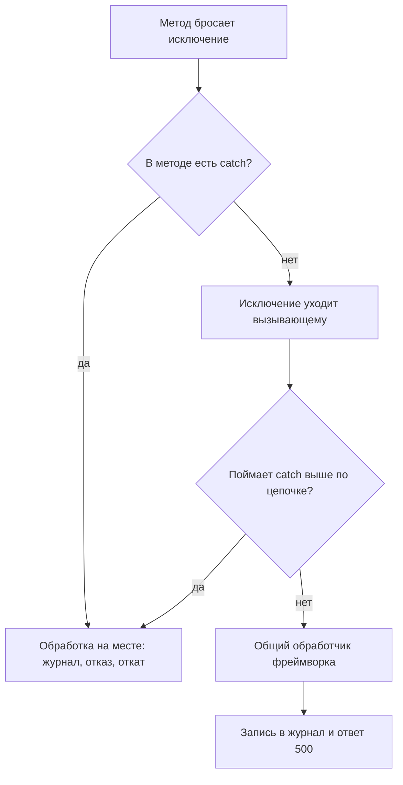

# Синтаксис Java на уровне чтения

Ревьюеру присылают фрагмент на триста строк: diff в системе ревью или
выдержку из отчёта сканера, и код на Java. Собрать проект нельзя, среды
разработки под рукой нет, и единственный инструмент — чтение. Из этапов
0–4 вы знаете, какие дефекты искать, а темы этого этапа про Python и Go
уже показали, что чужой код читается и без запуска. Java в маршруте
встречается впервые, и словарь у неё свой. Словарь этот маленький: он
целиком разбирается ниже на одной программе из восьми строк. Это справка
для чтения чужого Java-кода на ревью: писать на языке не потребуется,
но читать придётся много.

Перед вами программа на Java целиком и прогон её компиляции и запуска
на OpenJDK 17:

```java
// Исполняемый, OpenJDK 17. Запуск: javac Hello.java && java Hello
public class Hello {
    private static int count = 0;

    public static void main(String[] args) {
        count++;
        System.out.println("привет из Java, вызов " + count);
    }
}
```

```text
$ javac Hello.java && java Hello
привет из Java, вызов 1
```

Восемь строк кода, а в них уже весь словарь ревьюера: класс, поле,
метод, модификаторы, точка входа. Не заглядывая в разбор, ответьте
себе: какая из этих строк в многопоточном сервере потребует второго
взгляда? Ответ ждёт в разделе про `static`, а разбор начинается
с первой строки.

## Класс, поле и метод

Первая строка `public class Hello` объявляет класс. Класс — описание,
по которому программа делает объекты: из чего объект состоит и что он
умеет. Бытовое соответствие — формочка для печенья: формочка одна, а
печенья по ней выпекают сколько угодно. Класс здесь формочка, объект
(экземпляр класса) — печенье. Ломается сравнение в одном месте: готовое
печенье уже не меняется, а объект всю жизнь может менять своё состояние.
Слово `public` перед именем — модификатор доступа, и читается он прямо:
`public` доступен всем, `private` — только своему классу. Фигурные
скобки — тело класса: всё между ними принадлежит классу.

Вторая строка `private static int count = 0` объявляет поле. Поле —
переменная, которая хранит состояние: она живёт дольше одного вызова
метода. Тип `int` перед именем значит «целое число»: в Java тип пишется
явно перед каждым объявлением. Поэтому чужой код многословен, зато
читается без догадок. К слову `static` вернёмся в его собственном
разделе: именно оно отвечает на вопрос из введения.

Дальше идёт метод. Строка `public static void main(String[] args)` —
сигнатура метода: модификаторы, тип результата, имя, параметры. Метод —
функция, записанная внутри класса: действие, которое класс умеет делать.
Слово `void` значит «результата нет». Параметр `String[] args` — массив
строк из командной строки. Имя `main` — точка входа: с этого метода
программа начинается. В теле метода две строки: `count++` прибавляет
единицу к полю, а `System.out.println` печатает строку на экран.

Осталось объяснить, почему программу запускают двумя командами. Команда
`javac` — компилятор: она переводит исходный текст в байт-код, компактную
запись программы в файле `Hello.class`. Команда `java` запускает JVM,
виртуальную машину Java, которая читает байт-код и исполняет его.

Зачем нужен посредник: исходник и байт-код одни на всех, а виртуальная
машина своя на каждой системе, поэтому программа переносима. Бытовое
соответствие такое: байт-код — ноты, JVM — пианист. Ноты одни, а сыграть
их может пианист в любом городе. Ломается сравнение в том, что JVM ещё
и переводит байт-код в машинный код на лету. Для чтения чужого кода это
неважно.

## Как это работает

**Откуда это взялось.** Java проектировалась для больших команд, где
чужой код читают чаще, чем пишут свой: читаемость куплена ценой
многословия. Отсюда явные типы и модификаторы доступа в каждом
объявлении. То, что в других языках остаётся уговором, здесь стало
частью синтаксиса, и нарушение не компилируется.

Объявление класса идёт в фиксированном порядке: модификаторы, имя,
`extends` с единственным родителем, `implements` со списком интерфейсов,
тело в фигурных скобках. Слово `extends` объявляет наследование: новый
класс получает поля и методы родителя и меняет их часть. Родитель один:
множественного наследования классов в Java нет. Слово `implements`
объявляет интерфейсы. Интерфейс — список обязательств без реализации,
как требования в вакансии: «кандидат умеет водить» не говорит, как он
водит, но обязывает уметь. Ломается сравнение в одном: за кандидатом
требования сами не проверяются, а `implements` проверяет компилятор.
Не реализовал обещанное — программа не соберётся.

Зачем это ревьюеру: по строке `class Handler extends BaseHandler` видно,
что половина поведения живёт в родителе, и его файл читается следующим.
Внутри класса переменные трёх видов, и их различие — вопрос ревью. Поля
живут в объекте и переживают вызов метода. Локальные переменные живут
в методе и умирают с выходом из него. Параметры приходят во входе
метода. Где живут данные, определяет, кто их видит: поле читается всеми
методами класса, локальная переменная — никем снаружи.

Ещё две записи из чужого кода. Приём «поле `private`, доступ через
метод» — инкапсуляция: класс сам следит за своим состоянием, потому что
метод может проверить, отказать или записать в журнал. Это не украшение,
а единственное место, где запись контролируется. И угловые скобки вроде
`List<String>` читаются «список строк»: в скобках параметр типа,
ограничение на то, что кладут в коллекцию.

## static: одно на всех

Модификатор `static` у поля или метода значит «принадлежит классу,
а не экземпляру». Объектов класса может быть создана тысяча, а поле
со `static` на всех одно. В терминах формочки: печенья разные, а надпись
на самой формочке одна. Ломается сравнение в том, что надпись на
формочке не поменять, а static-поле меняется из любого метода.

Теперь ответ на вопрос из введения: второй взгляд требует строка
`private static int count`. В веб-приложении запросы приходят
одновременно, а счётчик у всех один. Запись `count++` — три действия:
прочитать, прибавить, записать. Два запроса могут прочитать одно
значение и записать одинаковый итог, и приращение потеряется. Такое
соревнование за общие данные называется гонкой; её устройство и ловля
разобраны в теме `go-race-detector`. Отсюда правило чтения: изменяемое
static-поле — общее состояние всех запросов сразу, и в многопоточном
сервере это первое место для гонок.

## Управление потоком и два оператора, которые читают не так

Ветвления и циклы знакомы по C-подобным языкам, поэтому перечисляются
за минуту. Ветвление — `if` и `else`, циклы — `while` и `for`. У цикла
есть форма «по коллекции»: `for (String name : names)` читается «для
каждого name из names», как `for name in names` в Python. Выход из
метода — `return`, в циклах работают `break` и `continue`, разбор
вариантов — `switch`. Дальше только два места, где глаз ревьюера читает
не то, что выполняет машина.

Первое место — сравнение объектов. Оператор `==` у объектов сравнивает
ссылки, а не содержимое: ссылка — адрес объекта в памяти, и два объекта
с одинаковым текстом живут по разным адресам. Содержимое строк сравнивает
метод `equals`. Прогон ниже показывает оба сравнения и ещё одну
неожиданность. У программы два плана: показать, что `==` смотрит на
адреса, и показать, почему ошибочное `==` проходит тесты.

```java
// Исполняемый, OpenJDK 17. Запуск: javac Compare.java && java Compare
public class Compare {
    public static void main(String[] args) {
        String a = new String("token");
        String b = new String("token");  // (1)
        String c = "token";
        String d = "token";              // (2)
        System.out.println(a == b);      // (3)
        System.out.println(c == d);      // (4)
        System.out.println(a.equals(b)); // (5)
    }
}
```

```text
$ javac Compare.java && java Compare
false
true
true
```

1. `new String("token")` во второй раз — новый объект по новому адресу:
   у `a` и `b` одинаковый текст, но разные адреса.
2. Литерал `"token"` во второй раз — не новый объект: одинаковые
   строковые литералы Java хранит одним объектом, и такое хранение
   называется интернированием.
3. `a == b` даёт false: адреса разные, хотя тексты одинаковые, — сама
   ловушка.
4. `c == d` даёт true: оба имени указывают на один объект, поэтому
   ошибочное сравнение на литералах срабатывает и доезжает до продакшена.
5. `a.equals(b)` даёт true: метод сравнивает текст, и это правильное
   сравнение строк.

Теперь видно, почему дефект прячется. Проверка вида `if (role == "admin")`
годами срабатывает на литералах: одинаковые литералы интернируются
в пределах всей программы. Ломается она на строке, пришедшей из запроса:
та строка — другой объект. Поэтому в ревью `==` на строках читается как
находка по форме, даже когда тесты зелёные.

Второе место — ленивые `&&` и `||`: правая часть не вычисляется без
нужды. В записи `if (user != null && user.isAdmin())` вторая половина
не зовётся, когда ссылка `user` пуста, то есть равна `null`, «объекта
нет». Порядок здесь часть защиты: переставьте проверки, и обращение
к методу пустой ссылки закончится исключением. Обратная сторона: если
в правой части спрятано действие, которое должно случиться всегда,
ленивость его пропустит. Читая условие, смотрите, что стоит справа.

## Исключения: сбой, который идёт наверх

Исключение — способ сообщить о сбое: выполнение метода прерывается, и
управление идёт вверх по цепочке вызовов к ближайшему обработчику. В Go
ошибка — обычное значение, которое можно молча не прочитать: такой дефект
разбирала тема `go-error-handling`. В Java молча не выйдет: исключение
либо поймано, либо поднимается выше.

Бросает исключение команда `throw`. Часть исключений — проверяемые:
компилятор следит, чтобы о них сказали заранее. Метод, который может их
бросить, объявляет это словом `throws` в сигнатуре. Запись
`throws IOException` читается так: метод может не справиться с
вводом-выводом, например не открыть файл или не записать в сеть.
Не объявил — не компилируется: вызывающий видит возможные сбои заранее,
в самой сигнатуре.

Обработка пишется парой `try` и `catch`: в `try` кладут попытку, в
`catch` — реакцию на сбой. Пустой блок `catch` — проглоченный сбой:
ошибка случилась, а программа пошла дальше, как ни в чём не бывало, и
узнать о ней будет не из чего. Это находка по форме: пустой `catch`
виден глазами, а стоит за ним то же молчание, что в Go даёт подчёркивание
на месте ошибки.

Исключение, вылетевшее выше всех `catch`, уходит вызывающему, и так до
самого верха. В веб-приложении верхним оказывается общий обработчик
фреймворка: он пишет журнал и отвечает клиенту кодом 500. Путь исключения
целиком:



**Описание схемы.** Схема читается сверху вниз. Исключение ищет ближайший
`catch`: сначала в своём методе, потом у вызывающего и дальше по цепочке
вызовов. Если обработчика не нашлось нигде, сбой доезжает до общего
обработчика фреймворка и превращается в запись журнала и ответ 500.
Ревьюера интересует каждая ветка «нет»: по ним видно, кто вообще узнает
о сбое.

## Аннотации: записка тому, кто читает

Аннотация — запись вида `@Имя` перед объявлением: `@Override` над
методом, `@RequestMapping("/pay")` над обработчиком. Для самого языка
это метаданные: записка на полях, которая ничего не делает, пока кто-то
её не прочитал. Бытовое соответствие — стикер на документе: стикер не
меняет документ, меняет его тот, кто стикер прочитал и среагировал.
Стикер здесь аннотация, читающий — компилятор или фреймворк. Ломается
сравнение в одном: стикер и его читателя видно сразу, а читатель
аннотации в коде не записан, и его приходится знать.

Отсюда два разных чтения. `@Override` читает компилятор: это просьба
проверить, что метод правда переопределяет родительский, и при опечатке
в имени компилятор скажет об ошибке. Семантику программы эта аннотация
не меняет. `@RequestMapping` читает фреймворк Spring: по такой записи
он регистрирует метод обработчиком адреса, и аннотация становится
конфигурацией. Вопрос ревизии один: кто читает эту аннотацию. Если
читатель — фреймворк вроде Spring или Jakarta, её значения читаются
как конфиг: адрес, роль, ограничение. Как Spring разбирает такие записи
и чем это грозит, показывает тема `spring-security-config`.

## Что искать на ревью

Соберём словарь в практические маркеры. Тревожные формы, которые видно
глазами без запуска:

- Поле с `public`: состояние открыто всем, запись никто не проверяет,
  и инвариант класса не удержать. Доступ положен через метод.
- Изменяемое static-поле, а особенно static-коллекция вида
  `static List<...>`: общее состояние всех запросов. В многопоточном
  сервере это место гонок и утечек данных между пользователями.
- Пустой `catch` или `catch` с одним комментарием: проглоченный сбой.
  Ошибка случилась, а система пошла дальше.
- `==` на строках там, где сравнивают значение: сравниваются адреса,
  и в проверке роли или токена это находка, а не вкусовщина.
- Аннотация, читатель которой неясен: если её читает фреймворк, значения
  аннотации — конфигурация, и их проверяют так же строго, как файл
  конфига.

Опорные формы — то, что читается как забота. Поля `private` с доступом
через методы; `throws`, объявленный честно, а не проброшенный наверх
пачкой; `catch`, который пишет журнал и принимает решение; `equals` на
строках. Читая чужой класс, держите в голове три вопроса. Где живут эти
данные: в объекте, в методе или в классе целиком. Кто вправе их менять.
И кто узнает о сбое.

**Зачем это в работе AppSec-инженера.** Код на Java встречается в ревью
без среды разработки: diff в системе ревью, фрагмент в отчёте сканера.
Чтение по структуре покрывает большую часть находок: публичное поле,
статический изменяемый список и проглоченный сбой видны глазами, без
запуска и без сборки. Следующие темы маршрута, `java-deserialization-gadgets`
и `spring-security-config`, читаются именно этим словарём.

## Источники

1. Learn Java, dev.java; реестр `java-tutorial-language`. Разделы:
   карта учебника (Language Basics, Classes and Objects, Exceptions).
   <https://dev.java/learn/>
2. Control Flow Statements, dev.java; реестр `devjava-controlling-flow`.
   Разделы: if-then-else, while и do-while, обе формы for, break,
   continue, return, yield.
   <https://dev.java/learn/language-basics/controlling-flow/>
3. Summary of Operators, dev.java; реестр `devjava-summary-of-operators`.
   Разделы: таблицы операторов — присваивание, арифметика, сравнение,
   условные и побитовые, `instanceof`.
   <https://dev.java/learn/language-basics/all-operators/>
4. Creating Classes, dev.java; реестр `devjava-creating-classes`.
   Разделы: состав объявления класса, виды переменных, модификаторы
   доступа, соглашения об именах.
   <https://dev.java/learn/classes-objects/creating-classes/>

Каркас этапа: у этапа 7 общих унаследованных источников нет; каждая тема
опирается на документацию своего языка и на материалы этапа 1 по
классам дефектов.

**Маркеры уверенности.** **Проверено лично** 2026-10-03: обе программы
статьи, Hello и Compare, компилируются и исполняются на OpenJDK 17.0.20.1
(javac + java), вывод приведён из фактических запусков. Состав объявлений,
виды переменных, таблицы операторов и семантика управления потоком —
**по учебнику dev.java**, все четыре страницы открыты лично 2026-09-02.
Чтение аннотаций фреймворками — по устройству Spring, детали которого
разбирает тема `spring-security-config`.
