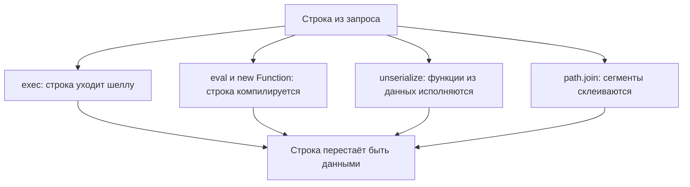

# Node.js: child_process, path, десериализация

Сервис на Node.js проверяет доступность хоста: имя приходит из запроса,
и программа вызывает ping. Прогоним один и тот же ввод через две функции
одного модуля. Ввод такой: `127.0.0.1; echo PWNED; id -u`. Точка с
запятой здесь не опечатка, а проверка: для шелла это знак «команда
кончилась, началась следующая», и такие приёмы вы уже разбирали в теме
`os-command-injection`. Прикиньте до чтения вывода, чем ответят две
формы вызова.

```text
exec, хвост вывода: PWNED | 1000
execFile, код ошибки: 2 | stderr: ping: 127.0.0.1; echo PWNED; id -u: ...
```

Первая форма выполнила все три команды подряд: exec передал строку
шеллу, и тот прочитал точку с запятой как приказ. Вторая отдала весь
ввод программе ping одним аргументом, и ping честно ответил, что хоста
с таким именем нет. Обе функции живут в одном модуле,
`node:child_process`, и разница между ними — ровно один шелл. Классы
дефектов, которые здесь встретятся, — внедрение команд (CWE-78),
небезопасная десериализация (CWE-502) и обход каталога (CWE-22) —
разобраны в темах `os-command-injection`, `insecure-deserialization` и
`path-traversal`.

## Как это работает

**Откуда это взялось.** Node вырос из серверного шелл-скриптинга:
вызвать команду одной строкой — самый короткий путь, и exec его
сохранил. Документация модуля формулирует различие прямо: exec запускает
шелл и исполняет команду внутри него, а execFile запускает файл
напрямую, без шелла по умолчанию. У spawn шелл — опция, по умолчанию
выключенная, а синхронный execSync зовёт шелл так же, как exec. Наивная
склейка строки ломается о грамматику шелла: `;`, `&&` и `|` —
операторы, а не данные.

### Первая дверь: программа через шелл

Модуль child_process — часть стандартной библиотеки Node, и его работа —
запускать внешние программы: ping, convert, git. Строка
`require("node:child_process")` подключает этот модуль, а префикс
`node:` сообщает, что модуль встроенный, а не пакет из реестра npm.
Вызов наружу — будни Node-сервиса: так работают конвертеры картинок,
архиваторы и системные утилиты.

Разница между exec и execFile — в посреднике. exec отдаёт строку шеллу,
как вы отдаёте записку ассистенту: «пингани хост; кстати, покажи id».
Ассистент читает записку целиком и выполняет оба поручения. execFile
работает как анкета с отдельными полями: программа — в одном поле,
каждый аргумент — в своём. Второе поручение в поле аргумента не
напишешь: текст так и останется текстом. Соответствие такое: шелл —
ассистент, строка — записка, список аргументов — поля анкеты. Ломается
сравнение в одном месте: у живого ассистента есть здравый смысл, а у
шелла нет, он выполняет всё, что распарсил.

Прогон из введения показывает обе стороны. Шелл разобрал ввод как три
команды и выполнил все, поэтому в выводе видны «PWNED» и «1000». А
execFile передал строку целиком как имя хоста, и ping ответил ошибкой
«Name or service not known»: такого имени не существует. Заметьте, что
защиту здесь дал не фильтр и не экранирование, а отсутствие
толкователя: разбора нет, потому что разбирать некому.

### Вторая дверь: строка как код

Вторая дверь — исполнение строки внутри самого процесса. Вызов eval
берёт строку и исполняет её как код JavaScript прямо в работающем
сервере, со всеми его правами: файлы, сеть, переменные окружения.
Конструктор new Function делает то же, но оформляет строку телом новой
функции. Ту же идею вы видели в Python в теме `python-pickle-eval`; в
JavaScript она встроена в сам язык и поэтому встречается чаще. Бытовое
сравнение: вы продиктовали коллеге не данные для отчёта, а само
поручение, и он выполнил его, не спрашивая, откуда оно взялось.

Проверено прогоном: `eval("10 + 5")` возвращает 15, а конструкция
`new Function("a", "return a * 2")` даёт рабочую функцию. Если строка
собрана из запроса, сервер исполняет то, что прислал клиент. Поэтому
находка «данные запроса доезжают до eval» — это готовое исполнение
кода, а не риск «когда-нибудь потом».

### Третья дверь: данные, которые исполняются

Третья дверь — сериализация с функциями. Сама идея сериализации и её
цена разобраны в теме `insecure-deserialization`; здесь важна
конкретная форма. Пакет node-serialize умеет хранить в строке не только
значения, но и функции: пометка `_$$ND_FUNC$$_` означает «дальше идёт
код». Его unserialize исполняет такие функции сразу при разборе, ещё до
того, как вы посмотрели на результат. Проверено прогоном на версии
0.0.4: строка с такой пометкой при разборе выполнила команду и создала
файл.

Подпись значения этот риск не снимает. Подпись доказывает целостность:
строку писал свой компонент, и её не подменили в пути. Но разбор
исполнит функции и из честно подписанной строки, потому что «кто
записал» и «что произойдёт при чтении» — разные вопросы. Контраст из
стандартной библиотеки: v8.deserialize — разбор родного формата движка
V8, то есть мотора JavaScript внутри Node. Этот формат умеет значения,
а не поведение. Функции через него не передаются: попытка сериализовать
функцию падает с ошибкой «could not be cloned», а битый поток
отвергается при чтении.

### Четвёртая дверь: путь без границы

Четвёртая дверь — пути. Функция path.join склеивает сегменты пути и
нормализует результат, то есть сворачивает `..` и лишние разделители.
Но нормализация — это гигиена строки, а не граница каталога. Прогон
показывает: join(`/srv/files`, `../../etc/hostname`) даёт
`/etc/hostname`. База съехала на два уровня вверх, и никакой границы по
дороге не было. Деление «аккуратная строка против удержанного каталога»
вы уже видели в теме `go-filepath`. У Node своя версия той же ловушки,
и чинится она так же — сверкой итогового пути с корнем.

Все четыре двери собираются в одну карту:



**Описание схемы.** Схема читается сверху вниз. Один и тот же ввод из
запроса расходится по четырём вызовам, и каждый доводит строку до
точки, где она перестаёт быть данными. Шелл читает её как команды,
компилятор — как код, разборщик — как поведение, склейка пути — как
адрес вне каталога.

## Как это выглядит в коде

Четыре сигнатуры ниже находятся поиском по имени функции. Планы чтения
листинга такие: найти точку входа недоверенных данных; отметить, где
строка встречает исполнителя — шелл, компилятор или разборщик. Третий
план — проверить, есть ли у пути сверка с корнем.

```javascript
// УЯЗВИМО — демонстрация, не для продакшена
const { exec } = require("node:child_process");
const serialize = require("node-serialize");

exec(`convert ${src} ${dst}`);              // (1)
const fn = new Function("x", req.body);     // (2)
const obj = serialize.unserialize(cookie);  // (3)
const full = path.join(root, name);         // (4)
```

1. Шаблонная строка в обратных кавычках подставляет `src` и `dst` в
   текст команды: шелл получит ввод как часть грамматики, а не как
   данные.
2. Тело новой функции приходит из тела запроса: код исполнится с
   правами серверного процесса.
3. Cookie разбирается пакетом, который исполняет функции из данных:
   исполнение случится внутри самого разбора.
4. Путь склеивается без сверки с корнем: `..` в имени уведёт его за
   пределы каталога.

У четырёх сигнатур один общий вид: строка из ввода доезжает до места,
где перестаёт быть данными. Ответьте, не трогая листинг: останется ли
дефект, если четвёртую строку переписать через `path.resolve` без
сверки с корнем? Останется. Вызов resolve сворачивает `..` так же
честно, как join: границу даёт не свёртка, а сверка с корнем после
неё.

Обёртки, которые не спасают, — две. Первая — экранирование строки для
шелла руками: оно ломается о вторую форму записи, кавычку внутри
значения или вложенную подстановку. Вторая — проверка входа по чёрному
списку символов: список перечисляет вчерашнюю грамматику шелла, а
`$()`, обратные кавычки и перевод строки остаются за его пределами.
Ложное срабатывание: вызов exec с константной строкой без ввода — не
находка, потому что риск живёт в склейке, а не в имени функции.

## Как защититься

Правило одно: команда и данные разделены, строка не становится кодом.
Разберём исправленный вариант по планам: найти, где программа отделена
от аргументов; где разбор ограничен данными; где проверяется граница
пути.

```javascript
// Исправлено; фрагмент обработчика
const { execFile } = require("node:child_process");
const path = require("node:path");

execFile("convert", [src, dst], onDone);

const data = JSON.parse(body);  // только данные, без функций

const full = path.resolve(root, name);
if (!full.startsWith(root + path.sep)) throw new Error("вне корня");
```

Первая замена — execFile вместо exec. Программа и аргументы передаются
раздельно: имя программы первым параметром, аргументы списком в
квадратных скобках. Каждый элемент списка доезжает до программы ровно
одним аргументом, как в прогоне из введения: точка с запятой остаётся
текстом, потому что разбирать её некому. Третий параметр — обработчик
завершения: Node позовёт его, когда программа закончит работу, и
передаст ошибку и вывод. Такой обработчик часто пишут прямо на месте
стрелочной функцией `(e, out) => console.log(out)`: это короткая
запись «функция, которой достанутся ошибка и вывод».

Вторая замена — JSON.parse вместо unserialize. JSON — формат только с
данными: в нём нет понятия «функция», и разборщику нечего исполнять.
Худшее, что сделает чужая строка, — ошибка разбора.

Третья замена — граница пути. Проверка идёт после resolve:
нормализация сворачивает `..`, и сверка смотрит уже на итоговый
абсолютный путь. До resolve сравнивать нечего: префикс сырой строки
ничего не говорит о том, куда она укажет. Сепаратор на конце корня
обязателен, и это видно прогоном. Строка `/srv/files-secret/x`
начинается с `/srv/files`, поэтому сверка без сепаратора принимает
соседний каталог за свой. Сверка с `/srv/files/` его отсекает.

Починка проверяется тем же прогоном, что открывал тему. Ввод с `;`
через новую форму обязан вернуть ошибку ping, а не цепочку команд, а
имя `../../etc/hostname` обязано упереться в отказ «вне корня». Если
оба прогона ведут себя именно так, граница стоит.

Документация Node.js добавляет слой в глубину: модель разрешений
процесса, флаг `--permission`, ограничивает запуск дочерних процессов и
доступ к файлам даже для доверенного кода. Она не чинит уязвимый вызов,
но сужает последствия: процесс, которому не нужны дочерние программы,
лишается возможности запускать их вовсе.

**Когда канон не подходит.** Настоящий конвейер команд собирается из
цепочки spawn со связанными потоками, а не через шелл-строку. А если
формат сериализации с функциями уже уехал в данные между системами,
миграция на JSON — отдельная задача согласования. Временная мера —
строгая проверка входа и изоляция процесса.

## Частая ошибка

Ответьте до разбора: пакет из официального реестра с многолетней
историей скачиваний — можно ли отдать ему чужую строку? Встречается
мнение, что пакет из реестра npm с историей скачиваний можно вызывать
на чужих данных как безопасный по умолчанию.

**Реестр отвечает за доставку пакета, а не за безопасность его
интерфейса.** Устройство реестра вы уже разбирали в теме
`npm-dependencies`: npm хранит и раздаёт пакеты, но не проверяет, что
каждая функция каждого пакета безопасна на чужих данных. Механизм из
раздела о механике решает всё: если пакет по построению исполняет
функции из данных, никакая популярность этого не отменяет.
Документация Node.js прямо относит вредоносные и скомпрометированные
зависимости к рискам уровня приложения, а не к доверенным по умолчанию.

Контрпример — прогон из раздела о механике: node-serialize версии
0.0.4 из официального реестра исполнил команду при разборе cookie.
Признак был в формате данных, а не в репутации пакета.

## Чеклист для ревью

На ревью тема сводится к шести проверкам, и каждая подтверждается
чтением одной строки или одним прогоном:

1. Проверьте, что вызовы процессов идут через execFile или spawn со
   списком аргументов, а не через exec со строкой (CWE-78).
2. Проверьте, что eval и new Function не получают строки с данными
   запроса, конфигурации или хранилища.
3. Проверьте, что разбор внешних данных идёт через JSON.parse, а не
   через пакеты, исполняющие функции из данных (CWE-502).
4. Проверьте, что путь из ввода проходит resolve и сверку с корнем с
   сепаратором на конце.
5. Проверьте, что у процесса, которому не нужны дочерние процессы, это
   ограничено моделью разрешений Node.js.
6. Проверьте, что cookie и подписанные значения не разбираются как код
   даже при доверии к подписи — подпись защищает от подмены, а не
   формат от исполнения.

**Зачем это в работе AppSec-инженера.** Node-сервис полон вызовов
наружу: конвертеры, архиваторы, git. Признаки этой темы ищутся поиском
по именам функций, и находка подтверждается одним прогоном на вводе с
точкой с запятой — дешевле любого спора.

## Попробуй сам

Возьмите фрагмент из раздела о коде с exec и перепишите его на execFile.
Прогоните обе версии на вводе с `;` и на вводе с флагом, начинающимся с
дефиса. Затем соберите проверку пути из раздела о защите и прогоните её
на имени с `..` и на имени соседнего каталога.

Одна подсказка: разницу между формами видно по stderr целевой
программы — без шелла она получает весь ввод одним аргументом и
жалуется сама.

**Критерий выполнения** наблюдаемый: exec исполнил цепочку команд, а
execFile передал ввод одним аргументом; проверка пути пропустила файл
внутри корня и отклонила `..` и `/srv/files-secret/x`.

## Проверь себя

1. Тот же ввод, что во введении, но форма без шелла:

    ```javascript
    const { execFile } = require("node:child_process");
    execFile("echo", ["a; id"], (e, out) => console.log(out));
    ```

    Предскажите, что напечатает этот скрипт.

2. Находка ревью: вызов `exec` со строкой команды, склеенной из `src` и
   `dst`, — оба значения из запроса. Выберите починку:

   A. Экранировать `src` и `dst` руками: обернуть каждое в кавычки
   внутри строки команды.

   B. Перейти на `execFile("convert", [src, dst], onDone)`.

   C. Отклонять ввод с символами из чёрного списка: `;`, `&`, `|`.

3. Почему сверку пути с корнем делают после resolve, а не до?

4. Обход каталога без всякого слияния:

    ```javascript
    const path = require("node:path");
    console.log(path.resolve("/srv/files", "../../etc/hostname"));
    ```

    Что вернёт этот вызов?

5. Возврат к теме `insecure-deserialization`: чем формат с функциями в
   данных принципиально отличается от формата только с данными?

<details markdown="1">
<summary>Ответ 1</summary>

1. Строку `a; id` — точка с запятой доезжает до echo одним аргументом.
   execFile исполняет программу напрямую, и разбирать метасимволы
   некому. Прогон: `node -e 'const { execFile } =
   require("node:child_process"); execFile("echo", ["a; id"], (e, out) =>
   console.log(out))'`.

</details>

<details markdown="1">
<summary>Ответ 2: разбор вариантов</summary>

2. Верно: B.

   A. Ручное экранирование ломается о вторую форме записи: кавычка
      внутри значения, вложенные подстановки. Такая обёртка уже
      разобрана в разделе о коде.

   B. Верно. Программа и аргументы разделены, шелла в пути нет, и ввод
      остаётся одним аргументом — как в прогоне из введения.

   C. Чёрный список перечисляет вчерашнюю грамматику шелла: подстановки
      `$()`, обратные кавычки, перевод строки остаются за его пределами.

</details>

<details markdown="1">
<summary>Ответ 3</summary>

3. До resolve в имени живут `..` и относительные формы, и сравнивать с
   корнем нечего: префикс сырой строки ничего не говорит о том, куда она
   укажет. Границу имеет смысл проверять у итогового абсолютного пути,
   когда нормализация уже свернула подъёмы.

</details>

<details markdown="1">
<summary>Ответ 4</summary>

4. `/etc/hostname` — resolve сворачивает `..` честно, и база съехала на
   два уровня вверх. Прогон: `node -e 'const path = require("node:path");
   console.log(path.resolve("/srv/files", "../../etc/hostname"))'`.
   Поэтому после resolve нужна сверка с разрешённым корнем, причём с
   сепаратором на конце — иначе `/srv/files-secret` пройдёт за
   `/srv/files`.

</details>

<details markdown="1">
<summary>Ответ 5</summary>

5. Формат с данными при разборе строит значения; формат с функциями при
   разборе исполняет код. У первого ошибка — чтение, у второго —
   исполнение.

</details>

## Источники

1. Child process, документация Node.js; реестр `node-child-process`.
   Разделы: exec запускает шелл, execFile исполняет файл напрямую,
   spawn и опция shell, advanced serialization для IPC.
   <https://nodejs.org/api/child_process.html>
2. Path, документация Node.js; реестр `node-path`. Разделы: join
   (склейка и нормализация), resolve (построение абсолютного пути),
   isAbsolute (не защита от обхода), POSIX и Windows.
   <https://nodejs.org/api/path.html>
3. Security Best Practices, документация Node.js; реестр
   `node-security-best-practices`. Разделы: Malicious Third-Party
   Modules (любой пакет имеет доступ к сети и файловой системе),
   модель разрешений `--permission`.
   <https://nodejs.org/learn/getting-started/security-best-practices>

Каркас этапа: у этапа 7 общих унаследованных источников нет; каждая тема
опирается на документацию своего языка и на материалы этапа 1 по
классам дефектов.

**Маркеры уверенности.** **Проверено лично** 2026-10-03 на Node.js
26.10.0: ввод `127.0.0.1; echo PWNED; id -u` исполняется цепочкой через
exec (вывод заканчивается «PWNED» и «1000») и доезжает одним аргументом
через execFile (код ошибки 2, ping отвечает «Name or service not
known»); path.join и path.resolve со входом `../../etc/hostname` дают
`/etc/hostname`; startsWith по корню без сепаратора пропускает соседний
каталог `/srv/files-secret/x`, а с сепаратором — отсекает;
`execFile("echo", ["a; id"])` печатает «a; id» одной строкой; eval и
new Function исполняют строку как код; v8.deserialize кругово
восстанавливает объект, v8.serialize отказывает функции («could not be
cloned»), а битый поток отвергается при чтении. Прогон node-serialize
0.0.4 (функция из строки исполняется при unserialize, создан файл)
сделан **ранее, 2026-09-02**, на Node.js 26.8.1 и не повторялся: пакет
не обновлялся с 2017 года и взят как учебный пример формата с
функциями, а не как совет к применению. Формулировки про шелл у exec и
устройство модели разрешений — **по документации**, все три страницы
открыты лично 2026-09-02.
