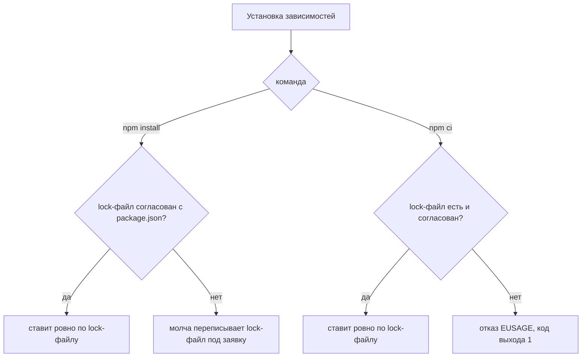

# Небезопасные зависимости npm

Учебный проект на Node.js с одной прямой зависимостью: библиотека
lodash записана в package.json, манифесте npm-проекта, точным номером
4.17.15, без всякого диапазона. Одна строка, и поводов для тревоги
вроде бы нет. Прикиньте ответ до чтения вывода реального прогона:
сколько бюллетеней безопасности найдёт аудит у такого проекта?

```text
$ npm audit
lodash  <=4.17.23
Severity: high
Prototype Pollution in lodash — GHSA-p6mc-m468-83gw
Command Injection in lodash — GHSA-35jh-r3h4-6jhm
...
fix available via `npm audit fix --force`
Will install lodash@4.18.1, which is outside the stated dependency range
$ echo $?
1
```

Одна строка манифеста развернулась в шесть бюллетеней — карточек
известных уязвимостей (advisory) с номерами GHSA из базы GitHub
Advisory Database. Заметьте и то, чего аудит не сделал: ничего не
исправил без отдельной команды fix — сигнал есть, а решение за
человеком или конвейером.

Угрозы цепочки поставок разобраны в теме `supply-chain-threats`, а
невидимый слой транзитивных зависимостей — в `transitive-dependencies`.
Эта тема — о том, что из дисциплины зависимостей даёт сама экосистема
npm и что остаётся на человеке. Ответ держится на трёх механизмах:
lock-файле, команде установки для конвейера и аудите.

## Как это работает

**Откуда это взялось.** В package.json версии обычно записаны
диапазонами. Запись `^4.17.15` читается как «любая версия, совместимая
с 4.17.15»: от 4.17.15 включительно до следующего мажорного номера, не
включая его. Диапазон экономит автору работу, потому что свежие
исправления приезжают сами. Но он превращает зависимость в заявку, а не
в факт: две установки в разные дни ставят разное, ведь в реестре за день
появляются новые версии.

Тема `transitive-dependencies` показала, чем
это кончается: версии плывут, пока их не закрепили. Ответ экосистемы
npm — файл package-lock.json, запись того, что реально собралось. Это
тот самый lock-файл из темы `transitive-dependencies`, только в
npm-форме, и дальше он так и называется.

Наивная привычка «не коммитить служебные файлы» здесь ломает
воспроизводимость. Без lock-файла сборка коллеги и сборка конвейера
расходятся молча: каждая ставит то, что нашлось в диапазоне в день
запуска. Поэтому lock-файл коммитят в репозиторий, и документация npm
говорит это прямо.

### Что записано в lock-файле

Формат читается глазами. Прогон от 2026-10-03 на npm 12.0.2: для
проекта из вступления npm сгенерировал такой package-lock.json
(фрагмент):

```json
{
  "name": "probe",
  "version": "1.0.0",
  "lockfileVersion": 3,
  "packages": {
    "node_modules/lodash": {
      "version": "4.17.15",
      "resolved": "https://registry.npmjs.org/lodash/-/lodash-4.17.15.tgz",
      "integrity": "sha512-8xOcRHvCjnocdS5cpwXQ…"
    }
  }
}
```

Разбор по полям. Ключ записи, `node_modules/lodash`, — путь, куда
пакет установлен: npm складывает пакеты проекта в каталог
`node_modules`. Поле version — точная версия, которая встала, и
никаких диапазонов здесь нет. Поле resolved — адрес архива в реестре
npm. Поле integrity — хеш этого архива по алгоритму SHA-512. При каждой
установке npm сверяет скачанное с записью, и подмена архива в кеше или
на зеркале всплывёт сразу.

Это тот самый пиннинг по хешу из темы
`transitive-dependencies`, только здесь его ведёт сам менеджер. Поле
lockfileVersion — версия формата записи, и у npm 12 она равна 3. Такая
запись есть у каждого пакета дерева, включая транзитивные. Поэтому
lock-файл — точная карта состава, и аудит ниже работает по ней, а не по
заявке из package.json.

### Две команды установки

Установка бывает двух команд, и путать их дорого. Первая, npm install, —
команда разработчика: она умеет подгонять lock-файл под package.json и
делает это молча. Прогон: package.json просит диапазон `^4.17.20`,
а lock-файл помнит 4.17.15. Команда отработала за долю секунды и между
делом переписала lock-файл на версию 4.18.1:

```text
$ npm install --package-lock-only

up to date in 96ms
$ diff -u "lock-файл до" "lock-файл после"
@@
-        "lodash": "4.17.15"
+        "lodash": "^4.17.20"
@@
-      "version": "4.17.15",
-      "resolved": "https://registry.npmjs.org/lodash/-/lodash-4.17.15.tgz",
+      "version": "4.18.1",
+      "resolved": "https://registry.npmjs.org/lodash/-/lodash-4.18.1.tgz",
...
```

Прогон сделан в режиме правки одного lock-файла (`--package-lock-only`),
потому что смотрим на запись, а не на распаковку пакетов. Первая пара
строк diff — ожидаемая правка под новую заявку. Вторая — главное: npm
подобрал свежую версию из диапазона и переписал version и resolved,
не спросив и не предупредив. Если правку не закоммитить, ваша машина
и репозиторий разошлись.

Вторая команда, npm ci, — форма для конвейера. Она ставит ровно то, что
записано в lock-файле, и при любом расхождении с package.json падает
вместо тихой подгонки. Тот же проект, но файлы разошлись в другую
сторону: package.json просит 4.17.15, а lock-файл помнит 4.17.20:

```text
$ npm ci
npm error code EUSAGE
npm error `npm ci` can only install packages when your package.json
npm error and package-lock.json are in sync. Please update your lock
npm error file with `npm install` before continuing.
npm error
npm error Invalid: lock file's lodash@4.17.20 does not satisfy
npm error lodash@4.17.15
$ echo $?
1
```

Код выхода 1, и текст называет виновника: версия из lock-файла не
удовлетворяет заявке. А чем кончится npm ci в конвейере, куда lock-файл
не коммитили? Тем же: прогон без package-lock.json даёт EUSAGE и код 1,
потому что команда в принципе работает только с существующим
lock-файлом.
Падение здесь — не неудобство, а свойство: сборка либо воспроизводима,
либо не состоялась.



**Описание схемы.** Обе команды ставят зависимости, но по-разному
относятся к расхождению двух файлов. При согласованных package.json
и lock-файле обе ставят ровно зафиксированное дерево. При расхождении
npm install молча переписывает lock-файл под заявку, а npm ci отказывает
с EUSAGE и кодом выхода 1. Отсутствие lock-файла для npm ci — тоже отказ.
Каждая ветка схемы подтверждена прогонами этой темы.

### Что считает аудит

Команда npm audit не разбирает код сама. Она отправляет в реестр npm
имена и версии всего дерева из lock-файла и получает бюллетени, чьи
диапазоны уязвимых версий совпали с вашими. Поэтому отчёт из вступления
знает про одну зависимость шесть карточек: у конкретной версии lodash
накопились известные дефекты, от загрязнения прототипа до внедрения
команд.

Совпадение считается по диапазонам, поэтому в отчёт попадают и
мета-уязвимости. Мета-уязвимость — карточка пакета, который уязвим через
собственные зависимости: его код чист, но он тащит дырявый пакет.
Бытовой образ — исправная курьерская служба с подрядчиком, который
теряет посылки: служба здесь ваш пакет, подрядчик — его зависимость,
а посылка — ваши данные. Граница у образа одна: подрядчика видно
в накладной, а зависимость третьего уровня по package.json не видно,
её показывает только развёрнутое дерево lock-файла.

Коды выхода проверены прогоном. При находках уровня high аудит
завершается кодом 1, и это готовый сигнал для конвейера. С флагом
`--audit-level=critical` тот же прогон возвращает 0, потому что порог
меняет только сигнал, не отчёт: карточки печатаются те же. Чинит
отдельная команда npm audit fix, которая поднимает версии внутри
заявленных диапазонов. Когда исправление живёт за диапазоном, как у
точно записанной 4.17.15, нужен флаг `--force` — отсюда предупреждение
во вступлении о выходе за заявленное.

Слепой `audit fix --force` в
конвейере — сделка: бюллетени закрыты, но версии уехали за рамки,
которые автор считал совместимыми. Итог может оказаться хуже исходного:
конвейер зелёный, а приложение сломалось на несовместимости, от которой
ограждал диапазон.

В каталогах дефектов эта тема — CWE-1357, опора на компонент без
достаточных оснований для доверия, и CWE-1104, использование стороннего
компонента, который никто не сопровождает. Сам каталог CWE (Common
Weakness Enumeration) называет классы слабостей, а не конкретные
уязвимости продуктов.

## Чего аудит не видит

Границы аудита — про свежесть, и их две. Первая: аудит знает только
опубликованные бюллетени. Пакет, скомпрометированный вчера, выглядит
для него честным, пока карточку не завели. Вторая: аудит меряет версии,
а не намерения. Вредоносный код в свежей версии он не отличит от
исправления, потому что смотрит не в код, а в базу карточек. Как такая
компрометация выглядит изнутри, разбирает тема `supply-chain-threats`.

Документация Node.js советует против этого зазора два флага. Первый,
`--ignore-scripts`, запрещает установочные скрипты — команды, которые
пакет вправе выполнить в момент установки, ещё до первого запуска
вашего кода. Бытовое сравнение — товар, который при покупке сам
включается и звонит продавцу: вы ещё не решили, нужна ли вещь, а она
уже действует. Второй, `--min-release-age`, появился в npm 11.10
и задаёт минимальный возраст версии в днях: свежеопубликованные версии
не попадают в разрешение вовсе. У массовой компрометации есть шанс быть
замеченной за эти дни, и вы ставите уже отфильтрованное.

Фильтр возраста проверен прогоном. С порогом в сто миллионов дней не
проходит ни одна версия, и установка падает с ENOVERSIONS: «No versions
available for lodash». То есть фильтр стоит на разрешении версий, а не
на отчёте после установки. У связки с аудитом есть нюанс из
документации npm. Если фильтр отрезает свежее исправление, npm audit
fix оставит уязвимую версию, предупредит и завершится с ненулевым
кодом. Исключения для отдельных пакетов задаются ключом
`min-release-age-exclude`.

## Три вопроса ревью

Ревью зависимостей npm-проекта — это три вопроса, и все три отвечаются
чтением файлов и одним прогоном.

Первый вопрос: lock-файл в репозитории? Откройте корень проекта и файл
.gitignore. Если package-lock.json не коммитят, сборка каждого
разработчика и конвейера плывёт сама по себе, и это находка ещё до
всякого аудита.

Второй вопрос: чем ставятся зависимости в конвейере? В шаге сборки
должна стоять npm ci, а не npm install. Разница не вкусовая: install
при расхождении молча перепишет lock-файл, а ci упадёт и заставит
привести файлы в согласие. Падение конвейера на EUSAGE — не поломка,
а срабатывание сигнализации.

Третий вопрос: что на выходе аудита? Прогоните npm audit и посмотрите
две вещи: есть ли находки не ниже выбранного порога и какой
`--audit-level` задан в конвейере. Порог critical при списке находок
high вернёт код 0, и конвейер пройдёт зелёным: сигнал настроен так,
а не проблем нет.

Дополнительно загляните в файл .npmrc, конфигурацию npm уровня проекта.
Именно там живут `ignore-scripts` и `min-release-age`: настройка рядом
с кодом действует на каждого, кто клонирует репозиторий, а не только на
конвейер.

**Зачем это в работе AppSec-инженера.** Сбои цепочки поставок —
категория A03:2025 издания OWASP 2025 года, а проверяются они в
npm-проекте дёшево: три файла и одна команда. Ревьюер, который различает
заявку в package.json и факт в lock-файле, формулирует находки предметно:
«сборка невоспроизводима», «конвейер молча меняет состав», «порог аудита
глушит сигнал».

## Источники

1. npm-audit, документация npm CLI v11; реестр `npm-audit`. Разделы:
   Synopsis и Description, Exit Code, `audit-level`, `audit fix` и его
   `--force`, Bulk Advisory Endpoint.
   <https://docs.npmjs.com/cli/v11/commands/npm-audit/>
2. package-lock.json, документация npm CLI v11; реестр
   `npm-package-lock`. Разделы: назначение lock-файла и коммит в
   репозиторий, поля version/resolved/integrity, lockfileVersion,
   npm-shrinkwrap.json.
   <https://docs.npmjs.com/cli/v11/configuring-npm/package-lock-json>
3. Security Best Practices, документация Node.js; реестр
   `node-security-best-practices`. Разделы: Malicious Third-Party
   Modules и Supply chain attacks (lock-файл, npm ci, ignore-scripts,
   min-release-age).
   <https://nodejs.org/learn/getting-started/security-best-practices>

Каркас этапа: у этапа 7 общих унаследованных источников нет; каждая тема
опирается на документацию своего языка и на материалы этапа 1 по
классам дефектов.

**Скоропортящийся слой.** Флаги и умолчания npm меняются между мажорными
версиями: `--min-release-age` появился в v11.10, формат lock-файла
менялся на v7 и v9. Бюллетени по конкретным версиям устаревают сразу. При ревизии
перечитываются страницы CLI, а не механика.

**Маркеры уверенности.** **Проверено лично** 2026-10-03 на npm 12.0.2 и
Node.js 26.10.0, без сети, против локального кеша реестра: генерация
lock-файла даёт lockfileVersion 3 и поля version, resolved, integrity
(sha512) у каждого пакета; npm install при расхождении package.json
(`^4.17.20`) и lock-файла (4.17.15) переписывает lock-файл на 4.18.1
молча, а при согласованных файлах оставляет версию из lock-файла; npm ci
при расхождении падает с EUSAGE и кодом 1, при отсутствии lock-файла —
тем же EUSAGE и кодом 1, при согласованных файлах ставит дерево и
возвращает 0;
с `--min-release-age=100000000` установка падает с ENOVERSIONS, потому
что фильтр возраста не пропускает ни одной версии. Отчёт аудита из
вступления — шесть бюллетеней уровня high по lodash 4.17.15, код выхода
1, с `--audit-level=critical` код 0, фикс за диапазоном через `--force`
до 4.18.1 — **проверен лично** 2026-09-02 на npm 12.0.2 и Node.js 26.8.1
с доступом к реестру: аудит сверяется с базой бюллетеней и без сети не
воспроизводится. Расчёт мета-уязвимостей и устройство endpoint'ов
реестра — **по документации** npm (страница CLI открыта лично
2026-09-02). Совет про `--ignore-scripts` — по документации Node.js.
Поведение `--min-release-age` при блокировке исправления и ключ
`min-release-age-exclude` — по описанию флага в коде npm 12.0.2,
открытому 2026-10-03; в прогонах не воспроизводились.
