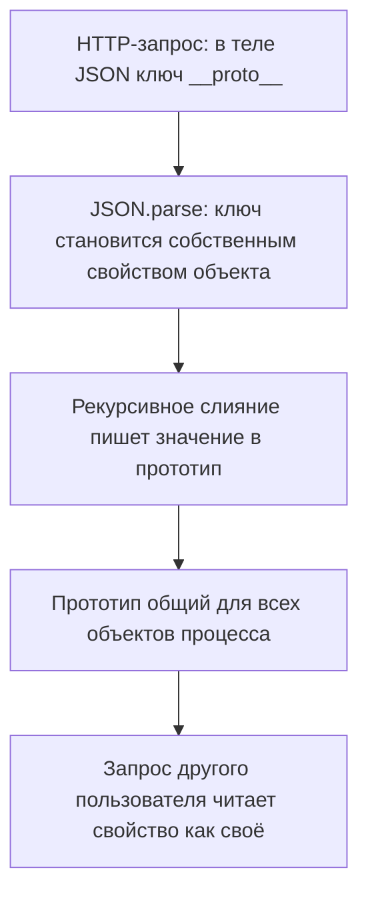

# Prototype pollution в серверном коде

На ревью попался обработчик на Node.js: он принимает настройки в JSON и
рекурсивно сливает их с конфигурацией сервиса. Node.js — это среда, которая
исполняет JavaScript вне браузера: язык тот же, а программа живёт на сервере
и обслуживает запросы всех пользователей подряд. Сам класс уязвимости вы
уже разбирали в теме `prototype-pollution` на клиентской стороне. Проверим,
что делает тот же приём внутри серверного процесса: прогоним слияние
обработчика на теле `{"__proto__": {"x": 42}}` — файл pp2.js собирается в
задаче в конце темы:

```text
hasOwn(config): false | у любого объекта: 42
```

Своего свойства `x` у config не появилось: проверка Object.hasOwn, которая
отвечает на вопрос «записано ли свойство в сам объект, а не унаследовано»,
вернула false. Зато `x` появился у любого объекта процесса: слияние ушло по
ключу `__proto__` в прототип и записало туда. Ошибки при этом не случилось:
JSON разобрался, слияние отработало, ответ ушёл клиенту. Скажите до разбора:
чем находка в серверном процессе опаснее той же находки в браузере?

## Чем сервер отличается от браузера

В теме `prototype-pollution` загрязнение жило внутри одной страницы. Вкладка
браузера — отдельный мир со своим прототипом: закрыл страницу, и загрязнения
нет, а пострадал один посетитель, открывший отравленную страницу. Серверный
процесс устроен иначе. Один процесс Node.js принимает запросы всех
пользователей подряд и живёт между ними без перезапуска, с одним общим
прототипом на всех.

Бытовой пример — журнал посетителей в приёмной. У каждого гостя свой бланк
заявления, как в аналогии из темы `prototype-pollution`, а журнал один на
всех: строчка, дописанная в него, видна каждому следующему. Загрязнённый
прототип сервера — такая строчка в общем журнале. Аналогия ломается в одном
месте: журнал читает человек и заметит лишнее, а прототип читает код, и код
не видит, откуда приехало значение.

Отсюда три следствия. Загрязнение переживает запрос, в котором приехало. Оно
действует на чужие запросы: свойство читает код, обслуживающий другого
пользователя. И живёт оно до перезапуска процесса, а не до конца запроса.
Поэтому серверная находка дороже клиентской: Академия PortSwigger перечисляет
для серверной стороны исходы от подмены конфигурации до отказа в обслуживании
и исполнения кода.

## Как это работает

**Откуда это взялось.** В JavaScript у объектов нет фиксированной схемы:
набор ключей не объявляется заранее. Поэтому слияние настроек с умолчаниями
пишется руками: обойти ключи источника и присвоить их приёмнику. Такая
функция есть в любой библиотеке утилит, и на сервере она встречается на
каждом входе, где клиент присылает объект настроек. Наивная реализация не
различает обычный ключ и служебный `__proto__`: присваивание
`target["__proto__"] = ...` движок читает как обращение к прототипу. Рекурсия
делает шаг дальше: увидев объект под ключом `__proto__`, слияние пишет
вложенные ключи уже в сам прототип.

В теме `prototype-pollution` эксплойт разложен на три части: источник, гаджет
и сток. Источник даёт чужой ввод, гаджет — место, читающее свойство
«с потолка», а сток — место, где свойство влияет на выполнение. На сервере
триада та же, но наполнение другое. Источник — тело запроса и любой чужой
JSON, попадающий в слияние: атакующий здесь контролирует имена ключей, а не
только значения. Важная деталь, проверенная прогоном: разбор JSON честно
сохраняет `__proto__` как обычный ключ данных.

```javascript
const body = JSON.parse('{"__proto__": {"x": 42}}');
console.log(Object.hasOwn(body, "__proto__"));
```

```text
true
```

Ключ собственный, поэтому любой обход ключей его увидит. У объектного
литерала в коде такого свойства нет: язык перехватывает `__proto__` ещё при
разборе литерала, и эта развилка разобрана в теме `prototype-pollution`.
Атака строится ровно на зазоре: то, что язык понимает особым образом,
разборщик строки создаёт как обычные данные.

Сток и гаджет на сервере живут в конфигурации. Академия PortSwigger называет
три семейства серверных гаджетов. Первое — конфигурация шаблонов: библиотека,
собирающая HTML по шаблону, читает опции из объекта настроек, и часть опций
ведёт к исполнению кода. Второе — почтовые отправления: сервис шлёт отчёт по
адресу из настроек, и подмена адреса уводит данные. Третье — запуск дочерних
процессов: программа стартует внешнюю команду с опциями из того же объекта.
Во всех трёх гаджет — обычное чтение настройки, которой «нет» у объекта:
значение приезжает по прототипу.

Классический гаджет — конфигурация с умолчаниями. Откуда в таком коде
возьмётся чужой адрес — скажите до разбора:

```javascript
// УЯЗВИМО — демонстрация, не для продакшена
const url = config.transport_url || defaults.transport_url;
sendReport(url); // если transport_url пришёл по прототипу — чужой адрес
```

Свойства у config нет, поэтому чтение `config.transport_url` уходит за
значением в прототип. А раз найденное там непустое, оператор `||` берёт его
и до умолчания не доходит: отчёт уходит на чужой адрес. В клиентской ветке
темы `prototype-pollution` такой же гаджет вёл
к подмене адреса скрипта. На сервере тот же приём ведёт к конфигурации почты,
шаблонов и дочерних процессов. Цепочка целиком выглядит так:



**Описание схемы.** Схема читается сверху вниз и показывает путь одного ключа
через процесс. Запрос проходит разбор JSON, где `__proto__` становится
обычным свойством объекта. Слияние записывает значение в прототип, общий для
процесса. Последний узел — то, чего в браузере нет: читателем загрязнённого
свойства становится запрос другого пользователя.

## Как это выглядит в коде

Ревьюер ищет две сигнатуры рядом: чужой объект и слияние. Читая функцию,
держите три плана: где в неё входит чужой объект, как перебираются ключи
источника, что происходит со служебным ключом на записи. Каждый план
закрывается своей строкой — отметьте их до чтения выносок.

```javascript
// УЯЗВИМО — демонстрация, не для продакшена
function merge(target, source) {
  for (const key in source) {                    // (1)
    if (source[key] && typeof source[key] === "object") {
      target[key] = merge(target[key] || {}, source[key]);
    } else {
      target[key] = source[key];                 // (2)
    }
  }
  return target;
}

const cfg = merge(defaults, JSON.parse(req.body)); // (3)
```

1. Обход ключей: цикл `for..in` берёт все ключи источника без отбора, и в
   этот список попадают `__proto__`, `constructor` и `prototype`.
2. Запись: присваивание не проверяет ключ, и на ключе `__proto__` оно пишет
   в прототип приёмника, а не в сам объект.
3. Вход: слиянию напрямую отдано тело запроса — источник и слияние
   встретились в одной строке. Здесь `req.body` — тело HTTP-запроса строкой,
   как его отдал клиент.

Весь дефект здесь — нарушение правила, которым откроется раздел «Как
защититься»: чужие ключи попадают в слияние без отбора. Не возвращаясь к
листингу: спасла бы замена перебора `for..in` на `Object.keys`? Держите ответ
до раздела о защите — он не тот, что кажется.

Вторая форма слияния — встроенный Object.assign: он копирует ключи источника
в приёмник без рекурсии. Общего прототипа процесса он не трогает, но спасения
от него нет. Проверено прогоном: при копировании из разобранного JSON ключ
`__proto__` верхнего уровня срабатывает как смена прототипа самого приёмника,
и `target.polluted` дальше читается как чужое значение.

Обёртки, которые не спасают: проверка `typeof body === "object"` смотрит на
тип, а не на ключи, и объект с `__proto__` внутри её проходит. Регулярное
выражение по сырой строке тела ломается о вложенность и кодировку. Ключ
можно записать юникод-эскейпами: в `{"\u005f\u005fproto__": ...}` (эскейп
`\u005f` — подчёркивание) текстового `__proto__` нет, а JSON.parse
восстановит его в собственный ключ — проверено прогоном. Бывает и
ложное срабатывание: слияние двух доверенных объектов из конфигурации деплоя
— источника нет, дефекта нет.

**Зачем это в работе AppSec-инженера.** Признак читается по одной строке:
рекурсивное слияние или Object.assign рядом с разбором тела запроса.
Серверная находка дороже клиентской тем, что процесс один на всех
пользователей: загрязнение живёт до перезапуска и действует на чужие запросы.
Поэтому ревьюеру достаточно найти строку входа — цепочку дальше достраивает
сама среда.

## Как защититься

Правило одно: чужие ключи не попадают в слияние, а объект без прототипа
нечем загрязнить. В исправлении три решения — смотрите, как задан стоп-список
ключей, где он срабатывает в цикле и чем заменён перебор `for..in`.

```javascript
// Исправлено
const BLOCKED = new Set(["__proto__", "constructor", "prototype"]);

function merge(target, source) {
  for (const key of Object.keys(source)) {
    if (BLOCKED.has(key)) continue;
    const value = source[key];
    if (value && typeof value === "object") {
      target[key] = merge(target[key] || {}, value);
    } else {
      target[key] = value;
    }
  }
  return target;
}
```

Стоп-список — это набор запрещённых имён: ключ из списка отбрасывается через
`continue` до присваивания, и записи в прототип не происходит. Перебор через
Object.keys берёт только собственные ключи объекта. Это и есть ответ на
вопрос из раздела о коде: сам по себе такой перебор не спасает. У объекта из
JSON.parse ключ `__proto__` — именно собственный. Прогон подтверждает:
`Object.keys` на разобранном теле возвращает `[ '__proto__' ]`. Поэтому
стоп-список обязателен: перебор меняет список ключей, а опасный ключ в нём
остаётся.

Памятка OWASP добавляет запасные уровни, и все три проверены прогоном.
Первый — объект без прототипа: `Object.create(null)` создаёт объект, у
которого прототипа нет вовсе, и `__proto__` в нём записывается как обычный
ключ данных. Второй — коллекция Map вместо объекта-словаря: ключи в Map не
свойства объекта, и наследование в поиске ключа не участвует. Обе меры
разобраны в теме `prototype-pollution`, а стандарт ASVS пунктом v5.0-15.3.6
предписывает как раз Map и Set вместо объектов-словарей.

Третий уровень серверный: флаг запуска Node.js `--disable-proto=delete`
убирает свойство `__proto__` у Object.prototype. Браузерной вкладке такой
флаг не задашь, а серверный процесс один и стартует один раз — поэтому мера
именно серверная. Тот же pp2.js, запущенный командой
`node --disable-proto=delete pp2.js`, печатает:

```text
hasOwn(config): false | у любого объекта: undefined
```

Загрязнения нет. Но флаг — защита в глубину, а не замена фильтрации: путь
`constructor.prototype` он не закрывает. Цепочка устроена так: свойство
`constructor` ведёт к функции-конструктору, у неё есть свойство `prototype`,
и это тот же общий образец. Прогон подтверждает: после слияния тела
`{"constructor": {"prototype": {"y": 7}}}` под флагом чтение `({}).y`
возвращает 7.

Отдельный приём — чтение, а не слияние: свойство конфигурации берут через
Object.hasOwn, и значение, подъехавшее по прототипу, такая проверка не видит.
Почему статическая форма, а не метод `hasOwnProperty` из темы
`prototype-pollution`? Метод живёт в прототипе, а у объекта без прототипа его
нет. Прогон подтверждает: `typeof` такого метода даёт undefined. Статический
Object.hasOwn вызывается у самого Object, а не у проверяемого объекта,
поэтому работает всегда.

**Когда канон не подходит.** Если глубокое слияние нужно по делу, вход
сначала пропускают через JSON Schema — описание допустимой формы документа,
какие ключи разрешены и какого они типа. Это как анкета с закрытым списком
граф: валидация до слияния гарантирует, что merge получит только разрешённые
ключи. Тяжёлая мера из памятки, Object.freeze(Object.prototype), замораживает
общий образец на весь процесс и ломает библиотеки, которые дописывают
прототипы, поэтому применяется редко.

## Частая ошибка

Сначала ответьте себе: закрыл ли актуальный движок Node.js запись через
`__proto__` из разобранного JSON? Встречается мнение, что загрязнение через
`__proto__` давно закрыто самим движком.

**Движок закрыл литерал, а не разбор и не слияние.** Механизм из раздела «Как
это работает»: объектный литерал `{__proto__: {...}}` в коде — это смена
прототипа, а JSON.parse того же текста создаёт честный собственный ключ.
Проверено прогоном: Object.hasOwn у объекта из JSON.parse возвращает true.
Дефект живёт в слиянии, а не в движке.

Контрпример — прогон из введения: Node.js версии 26, актуальный движок,
рекурсивное слияние на три строки, и свойство появилось у всех объектов
процесса.

## Чеклист для ревью

Шесть проверок читаются по коду, запускать ничего не нужно.

1. Проверьте, что рекурсивные merge и Object.assign не получают объекты из
   запроса без фильтрации ключей (CWE-1321).
2. Проверьте, что ключи `__proto__`, `constructor`, `prototype` отбрасываются
   при слиянии или при валидации входа.
3. Проверьте, что словари с чужими ключами — Map или Object.create(null)
   (ASVS v5.0-15.3.6).
4. Проверьте, что свойства конфигурации читаются через Object.hasOwn там,
   где значение влияет на выполнение.
5. Проверьте, что приём JSON-тела сопровождается схемой, а не только
   проверкой типа.
6. Проверьте, что процесс запускается с `--disable-proto=delete` как мерой
   в глубину, где это совместимо с зависимостями.

## Попробуй сам

Напишите слияние из раздела «Как это выглядит в коде», сохраните его в файл
pp2.js и прогоните на теле `{"__proto__": {"x": 42}}`. Убедитесь, что `({}).x`
равен 42. Затем примените любую защиту из раздела «Как защититься» и
повторите прогон.

Одна подсказка: смотреть стоит не на целевой объект, а на свежесозданный
пустой — загрязнение видно именно по нему.

**Критерий выполнения** наблюдаемый: два вывода одного скрипта. До защиты:
`({}).x` даёт 42, а Object.hasOwn у цели — false. После защиты: `({}).x`
даёт undefined.

## Проверь себя

1. Словарь настроек собран без прототипа:

   ```javascript
   const o = Object.create(null);
   o["__proto__"] = { x: 1 };
   console.log(Object.keys(o), ({}).x);
   ```

   Предскажите, что напечатает этот скрипт.

2. Найденное слияние перебирает ключи источника через `for..in` и пишет их
   в приёмник без проверки. Выберите починку.

   A. Перебирать ключи через `Object.keys(source)` вместо `for..in`.

   B. Задать стоп-список `__proto__`, `constructor`, `prototype` и
      отбрасывать такие ключи до записи.

   C. Перед слиянием проверять тип входа: `typeof body === "object"`.

3. Почему флаг `--disable-proto=delete` — мера в глубину, а не замена
   фильтрации ключей?

4. Вход разобран из тела запроса:

   ```javascript
   const body = JSON.parse('{"__proto__": {"isAdmin": true}}');
   Object.hasOwn(body, "__proto__");
   ```

   Что вернёт hasOwn и что это значит для варианта A из второго вопроса?

5. Возврат к теме `prototype-pollution`: чем отличаются источники
   загрязнения в браузере и на сервере?

<details markdown="1">
<summary>Ответ 1</summary>

1. `[ '__proto__' ]` и `undefined`. У объекта без прототипа ключ `__proto__`
   теряет смысл доступа к прототипу и записывается как обычные данные, а
   свежие объекты процесса свойства `x` не получили. Прогон: `node -e 'const
   o = Object.create(null); o["__proto__"] = {x: 1};
   console.log(Object.keys(o), ({}).x)'`.

</details>

<details markdown="1">
<summary>Ответ 2: разбор вариантов</summary>

2. Верно: B.

   A. `Object.keys` берёт только собственные ключи — но у объекта из
      JSON.parse ключ `__proto__` именно собственный, и в перебор он
      попадёт. Это вопрос-пауза из раздела «Как это выглядит в коде»:
      перебор меняет список ключей, а запись в прототип остаётся.

   B. Верно. Служебный ключ отброшен до присваивания, и записи в прототип
      не происходит. Это исправление из раздела «Как защититься».

   C. Проверка типа смотрит на вход целиком, а не на ключи: объект с
      `__proto__` внутри её проходит. Это обёртка из раздела о коде,
      которая не спасает.

</details>

<details markdown="1">
<summary>Ответ 3</summary>

3. Флаг убирает свойство `__proto__` у Object.prototype, и доступ через
   этот ключ пропадает. Но путь `constructor.prototype` он не закрывает:
   через конструктор до прототипа по-прежнему можно дойти. Поэтому
   фильтрация ключей при слиянии нужна всё равно, а флаг стоит поверх.

</details>

<details markdown="1">
<summary>Ответ 4</summary>

4. `true`: JSON.parse строит объект по правилам формата, и `__proto__`
   становится собственным ключом данных. Прогон: `node -e 'const body =
   JSON.parse("{\"__proto__\": {\"isAdmin\": true}}");
   console.log(Object.hasOwn(body, "__proto__"))'`. Для варианта A это
   значит, что `Object.keys` ключ увидит и передаст в запись — замена
   перебора дефект не закрывает.

</details>

<details markdown="1">
<summary>Ответ 5</summary>

5. В браузере источник — строка запроса и web-сообщения страницы; на
   сервере — тело запроса и любой чужой JSON, попадающий в слияние.

</details>

## Источники

1. What is prototype pollution?, PortSwigger Web Security Academy;
   реестр `ps-prototype-pollution`. Разделы: источники (URL, JSON,
   web-сообщения), разница JSON.parse и литерала, гаджеты и серверные
   последствия.
   <https://portswigger.net/web-security/prototype-pollution>
2. Prototype Pollution Prevention Cheat Sheet, OWASP Cheat Sheet Series;
   реестр `owasp-cs-prototype-pollution`. Разделы: Map и Set вместо
   объектов, Object.create(null), freeze и seal, флаг
   `--disable-proto=delete`.
   <https://cheatsheetseries.owasp.org/cheatsheets/Prototype_Pollution_Prevention_Cheat_Sheet.html>

Каркас этапа: у этапа 7 общих унаследованных источников нет; каждая тема
опирается на документацию своего языка и на материалы этапа 1 по
классам дефектов.

**Скоропортящийся слой.** Поведение флага `--disable-proto=delete` и набора
серверных гаджетов привязано к версии среды и библиотек: при ревизии темы
прогоны повторяются на актуальном Node.js. Устройство прототипа и разница
JSON.parse с литералом стабильны.

**Маркеры уверенности.** **Проверено лично** 2026-09-02 на Node.js 26.8.1,
все прогоны повторены 2026-10-03 на Node.js v26.10.0 с тем же выводом:
рекурсивное слияние тела `{"__proto__": {"x": 42}}` загрязняет прототип
(`({}).x` равен 42, Object.hasOwn у цели — false); JSON.parse сохраняет
ключ `__proto__` как собственный, а объектный литерал — нет; Object.keys
у разобранного объекта включает `__proto__`, а эскейп-запись
`{"\u005f\u005fproto__": ...}` JSON.parse восстанавливает в тот же
собственный ключ; исправленное слияние со
стоп-списком загрязнения не даёт; Object.create(null) принимает `__proto__`
как данные, и метода hasOwnProperty у такого объекта нет; флаг
`--disable-proto=delete` гасит загрязнение тем же прогоном, а цепочку
`constructor.prototype` не закрывает. Прогоном 2026-10-03 уточнено поведение
Object.assign: ключ `__proto__` из разобранного JSON заменяет прототип
самого приёмника (`target.polluted` читается), а общий прототип процесса не
трогает. Состав серверных гаджетов и разбор источников — **по PortSwigger**,
защиты — **по памятке OWASP**, обе страницы открыты лично 2026-09-02.
