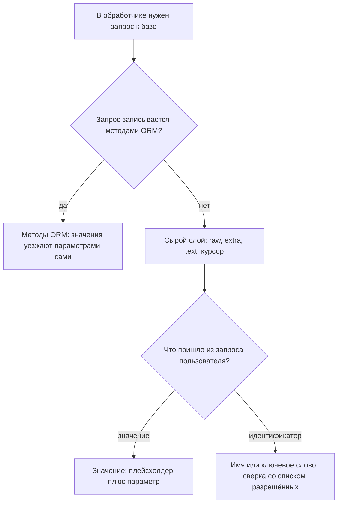

# Инъекции в ORM и raw SQL

Вы читаете на ревью приложение на Python, которое ходит в базу через
SQLAlchemy — библиотеку, которая превращает строки таблицы в объекты кода
и сама собирает SQL-запросы. В настройках приложения включён журнал
запросов (у SQLAlchemy его включает аргумент `echo=True`): каждый ушедший
в базу запрос печатается вместе с параметрами. Один и тот же обработчик
ищет пользователя по имени из HTTP-запроса двумя способами. Первый
собирает запрос f-строкой — синтаксисом Python, который подставляет
значение переменной прямо в текст строки. Второй передаёт значение
параметром. Вот что показывает журнал, когда в имени пришла строка
`alice' OR '1'='1`:

```text
== запрос собран f-строкой:
SELECT id FROM users WHERE name = 'alice' OR '1'='1'
[...] ()
строк: [(1,), (2,)]
== запрос с параметром :name:
SELECT id FROM users WHERE name = ?
[...] ("alice' OR '1'='1",)
строк: []
```

Первый запрос вернул обе строки таблицы: ввод стал частью текста команды,
и база выполнила чужое условие. Второй вернул пустой список: текст уехал
с плейсхолдером, а опасная строка — отдельным аргументом, и база искала
её как имя, которого нет. Никакой фильтрации ввода во втором случае не
потребовалось: границу провёл сам протокол обмена с базой, и его механику
разбирает тема `parameterized-queries`. Ответьте себе сразу: если бы
таблица users была пустой и оба запроса вернули ноль строк, осталось бы
видно по журналу, в каком из обработчиков дефект?

Это языковая грань внедрения SQL. Сам класс атаки разобран в теме
`sqli-basics`. Здесь вопрос другой: где кончается защита, которую даёт
библиотека доступа к базе, и что смотреть ревьюеру в коде на Python.

## Как это работает

ORM (object-relational mapping, объектно-реляционное отображение) — слой
между кодом и базой. Программа вызывает методы вроде
`filter(name=name)`, а библиотека сама собирает SQL и отправляет значения
отдельно от текста. Бытовое сравнение — типографский бланк заявления.
Текст бланка напечатан заранее. Он не меняется от того, что заявитель
вписал в клетку, — так и текст запроса не меняется от значения параметра.
Аналогия ломается в одном месте: у бланка нет режима «напишите весь
документ сами», а у ORM он есть. Этот режим — сырой слой, и вся тема про
него.

**Откуда это взялось.** ORM появилась, чтобы запрос собирался из кода,
а не из строк: пока фильтр — вызов метода, значение параметром уезжает
автоматически. Но часть запросов в модель не укладывается — отчёты,
миграции, сложные условия, — и у каждой библиотеки есть сырой выход, куда
отдают текст целиком. Наивное решение в таком месте — подставить ввод в
текст строковой операцией — возвращает дефект, от которого ORM уходила:
граница между командой и данными стирается.

У Django, веб-фреймворка со встроенной ORM, документация насчитывает три
сырых выхода. Первый — метод raw() у менеджера модели: менеджер — объект
вида `User.objects`, через который идут запросы к таблице, и raw()
принимает готовый текст запроса. Второй — конструкция RawSQL, сырой
фрагмент внутри обычного выражения ORM. Третий — курсор из
`django.db.connection` для полностью своего SQL. Есть и четвёртое место —
метод extra(): он подмешивает сырой фрагмент в обычный queryset, цепочку
вызовов вида `filter().order_by()`.

Слово «курсор» здесь из DB-API — общего стандарта доступа к базам в
Python. Драйверы вроде sqlite3 и psycopg дают одинаковый набор вызовов,
и курсор — тот объект, через который запрос выполняют и читают строки
результата. Документация Django требует от всех сырых мест двух вещей
сразу. Первая: параметры передают только отдельным аргументом params с
плейсхолдерами %s. Вторая: запрос никогда не собирают строковым
форматированием. Плейсхолдер — отметка в тексте запроса, на место
которой драйвер ставит значение из отдельного списка; как это устроено
в протоколе, показывает тема `parameterized-queries`.

Отдельно документация запрещает кавычки вокруг %s: форма
`WHERE name = %s` — единственная допустимая, а `WHERE name = '%s'` —
ошибка. Почему это ошибка, видно из прогона на sqlite3: драйвер не
считает плейсхолдер внутри строкового литерала, привязка не находит
места, и база отвечает исключением ProgrammingError. Текст ошибки точный:
«Incorrect number of bindings supplied. The current statement uses 0,
and there are 1 supplied.» — «передана одна привязка, а мест под неё
ноль». То есть кавычки — не двойная защита, а сломанный запрос.

У SQLAlchemy сырой слой — конструкция text(): она принимает текст
запроса, а параметры — в именованной форме `:name`, словарём при
выполнении. В журнале из введения видно, что происходит дальше:
именованный параметр превратился в вопросительный знак. Значение при
этом уехало отдельно, в круглых скобках — это кортеж, неизменяемый
список в Python; так журнал печатает привязки. Это перевод форматов:
драйвер sqlite говорит в формате qmark, где место значения отмечено
знаком вопроса, а DB-API допускает несколько разных форм записи
параметров. Библиотека скрывает разницу между ними, но главного не
скрывает: строка внутри text() обязана быть написана автором кода, а не
собрана из ввода.

Здесь же и ответ на вопрос из введения: склейку видно даже при пустой
таблице. Журнал печатает текст запроса отдельно от параметров, поэтому
вшитое в текст значение читается независимо от того, сколько строк
вернулось. Ревью по журналу не зависит от данных в стендовой базе.

Остаётся класс мест, куда параметр подставить нельзя в принципе: имена
таблиц и столбцов, направление сортировки, ключевые слова. Причина — в
порядке обмена из `parameterized-queries`. База разбирает текст запроса
до того, как получает значения. Поэтому значение может занять готовое
место, но не может изменить структуру команды. Имя столбца — часть
структуры, и для него места в протоколе нет. Поэтому присланную из
запроса сортировку не «параметризуют», а сверяют с разрешённым списком
имён и подставляют в текст имя из списка, а не из ввода.

Вся тема собирается в одну карту выбора:



**Описание схемы.** Схема читается сверху вниз. Если запрос записывается
методами ORM, параметры едут сами, и сырой слой не нужен. Если не
записывается, текст уходит в сырой слой. Там каждый присланный
пользователем кусок делится на два сорта. Значение едет через плейсхолдер
отдельным параметром. Имя или ключевое слово сверяется со списком
разрешённых, и в текст попадает вариант из списка.

## Как это выглядит в коде

Ревьюер ищет строковые операции рядом с сырым слоем. Читайте фрагмент
четырьмя планами. Первый — найти точку входа недоверенных данных. Второй —
найти строковую операцию на тексте запроса. Третий — назвать сырой слой
в каждой строке. Четвёртый — отличить место, куда параметр подставить
нельзя в принципе. До выносок назовите про себя, в каком месте каждой
строки ввод становится текстом запроса.

```python
# УЯЗВИМО — демонстрация, не для продакшена
User.objects.raw(
    "SELECT * FROM users WHERE name = '%s'" % name)      # (1)
User.objects.extra(where=[f"name = '{name}'"])           # (2)
session.execute(text(f"SELECT * FROM users WHERE name = '{name}'"))
                                                       # (3)
cursor.execute("SELECT * FROM users ORDER BY " + sort)   # (4)
```

1. Строка (1) — оператор `%` вместо аргумента params: старый синтаксис
   форматирования строк подставил ввод в текст до того, как запрос увидел
   драйвер.
2. Строка (2) — f-строка в extra(): тот же дефект внутри обычной цепочки
   queryset.
3. Строка (3) — f-строка в text(): частый вид дефекта в проектах на
   SQLAlchemy.
4. Строка (4) — конкатенация с именем столбца сортировки: сюда параметр
   подставить нельзя, и склейка — единственный способ ошибиться.

Обёртки, которые не спасают. Первая — «очистка» ввода от кавычки: она
держится на одной форме записи и ломается о вторую, например о
комментарий `--` или обратную косую. Вторая — кавычки вокруг
плейсхолдера: они не защищают значение, а ломают привязку, как показал
прогон выше. Есть и ложное срабатывание: константный текст запроса без
ввода законен, поэтому смотрите, участвует ли в строке внешнее значение.

**Зачем это в работе AppSec-инженера.** Спор «у нас ORM, инъекций нет»
заканчивается первым же сырым запросом в дереве. Отчёты, сложные фильтры
и миграции почти всегда выходят за пределы модели. Класс при этом остаётся тем же: внедрение SQL — это CWE-89
в каталоге Common Weakness Enumeration и категория A05:2025 издания
OWASP. Ревьюеру нужен короткий список мест, где библиотека молчит, и
рабочий приём проверки: журнал запросов показывает склейку лучше любого
чтения кода.

## Как защититься

Правило одно: значения едут параметрами, идентификаторы — из списка. Вот
те же места после починки:

```python
# Исправлено
User.objects.raw("SELECT * FROM users WHERE name = %s", [name])
session.execute(
    text("SELECT * FROM users WHERE name = :name"), {"name": name})

ALLOWED_SORT = {"name": "name", "created": "created_at"}
column = ALLOWED_SORT.get(sort, "name")
cursor.execute(f"SELECT * FROM users ORDER BY {column}")
```

Разберём, что делает каждая часть. Параметр в raw() и в text() — второй
аргумент вызова, и плейсхолдер в тексте стоит без кавычек. Сортировка
чинится иначе: вход служит ключом словаря ALLOWED_SORT, а в текст
попадает значение из словаря. Поэтому f-строка в последней строке
законна: в неё подставляется не ввод, а строка из разрешённого списка.
При чужом ключе метод get вернёт колонку по умолчанию. Так формулирует и
стандарт: требование ASVS v5.0-1.2.4 велит строить динамические запросы
параметризацией, а то, что параметризовать нельзя, — белым списком.

**Когда канон не подходит.** Пакетные вставки и запросы с переменным
числом условий собираются библиотечными средствами. В Django это
Q-объекты: объекты-условия, которые складываются операторами & и | в
фильтр почти любой формы. В SQLAlchemy это объектные выражения вроде
select().where() вместо text(). Если запрос можно записать средствами
ORM, сырой слой не нужен вовсе. Проверка класса по тесту
WSTG-v42-INPV-05 идёт при этом по обработчикам, где сырой слой остался.

## Частая ошибка

Встречается обоснование: «плейсхолдер взят в кавычки, значит, значение
не вырвется из строки». Что драйвер сделает с таким плейсхолдером —
решите до чтения дальше. Цепочка обоснования стоит на скрытом шаге: будто
драйвер найдёт плейсхолдер и внутри кавычек.

**Кавычки вокруг плейсхолдера не защищают, а ломают привязку.** Драйвер
ищет плейсхолдер в разметке запроса, а кавычки значат для разборщика
«здесь строковый литерал, разметки нет». Место для привязки не находится,
и прогон из раздела о механике показал итог: ProgrammingError со словами
«uses 0, and there are 1 supplied». Ошибка в исходном рассуждении —
подмена уровня: автор думает текстом («значение взаперти»), а драйвер
работает структурой («мест для значений ноль»).

Контрпример для обратной стороны: бывает, что такой запрос случайно
срабатывает — конкретный драйвер подставил значение внутрь кавычек. Тогда
защита держится на реализации одного драйвера: следующая версия или
другая база читают ту же строку иначе, и граница исчезает молча. Законна
только форма без кавычек, где привязка находит место всегда.

## Чеклист для ревью

Шесть проверок читаются по коду и по журналу запросов на стенде. Каждая
закрывает одно место из разделов выше.

1. Проверьте, что raw-запросы передают значения через params или словарь
   параметров, а не строковым форматированием (CWE-89).
2. Проверьте, что плейсхолдеры в тексте запроса стоят без кавычек.
3. Проверьте, что имена таблиц, столбцов и направления сортировки приходят
   из разрешённого списка, а не из ввода (ASVS v5.0-1.2.4).
4. Проверьте, что extra() и RawSQL либо отсутствуют, либо не содержат ввода
   вне параметров.
5. Проверьте, что журнал запросов на стенде подтверждает: значения едут
   отдельно от текста (видно по `?` и кортежу аргументов).
6. Проверьте, что обработчики с сырым SQL покрыты проверкой на ввод с
   кавычкой и комментарием (WSTG-v42-INPV-05).

## Попробуй сам

Покажите на живом журнале, чем склейка отличается от параметра. Поднимите
SQLite в памяти с таблицей из двух строк и выполните оба запроса из
введения: один через f-строку, другой через параметр. Прогоните оба с
вводом `alice' OR '1'='1` и запишите в каждом случае текст запроса,
параметры и число строк.

Одна подсказка: журнал в SQLAlchemy включается аргументом `echo=True` у
функции create_engine, которая создаёт подключение к базе. Он печатает
текст запроса и кортеж параметров. С голым sqlite3 ту же картину даст
собственная печать текста и параметров рядом с вызовом.

**Критерий выполнения** наблюдаемый: в журнале первого запроса ввод стоит
внутри текста, и ответ содержит обе строки. В журнале второго текст
оканчивается плейсхолдером, ввод едет отдельным аргументом, ответ пуст.

## Проверь себя

1. Обработчик на голом DB-API, без всякой ORM:

    ```python
    import sqlite3
    cur.execute("SELECT id FROM users WHERE name = '%s'" % name)
    ```

    В таблице две строки, в `name` пришло `alice' OR '1'='1`. Что вернёт
    запрос?

2. Находка ревью: `session.execute(text(f"... WHERE name = '{name}'"))`.
   Выберите починку.

   A. Взять плейсхолдер в кавычки: `text("... WHERE name = ':name'")`.

   B. Передать значение отдельно: `text("... WHERE name = :name")` и
      словарь параметров.

   C. Оставить склейку, удвоив кавычки во вводе.

3. Почему имя столбца или направление сортировки нельзя передать в запрос
   параметром?

4. В журнале соседнего обработчика видно:

    ```text
    INFO sqlalchemy.engine.Engine SELECT * FROM users WHERE name = ?
    INFO sqlalchemy.engine.Engine [generated in 0.0002s] ("x' OR '1'='1",)
    ```

    Есть ли инъекция у этого обработчика?

5. Возврат к теме `parameterized-queries`: чем связанный параметр
   отличается от экранирования в момент отправки запроса?

<details markdown="1">
<summary>Ответ 1</summary>

1. Обе строки: ввод стал частью текста запроса, и условие превратилось в
   «имя равно alice или '1'='1'». Прогон на sqlite3 в памяти:

    ```python
    import sqlite3
    c = sqlite3.connect(":memory:")
    c.execute("CREATE TABLE users (id, name)")
    c.executemany("INSERT INTO users VALUES (?, ?)",
                  [(1, "alice"), (2, "bob")])
    n = "alice' OR '1'='1"
    rows = c.execute("SELECT id FROM users WHERE name = '%s'" % n)
    print(rows.fetchall())
    ```

    печатает `[(1,), (2,)]`; та же таблица с параметром вместо склейки
    даёт пустой список, потому что база ищет имя «alice' OR '1'='1»,
    которого нет.

</details>

<details markdown="1">
<summary>Ответ 2: разбор вариантов</summary>

2. Верно: B.

   A. Драйвер не считает плейсхолдер внутри строкового литерала:
      привязка не находит места, и база отвечает ProgrammingError о
      неверном числе привязок. Это заблуждение из раздела «Частая
      ошибка».

   B. Верно. Текст запроса написан автором, значение едет отдельным
      аргументом, и база читает его только как значение.

   C. Удвоение кавычек держится на одной форме записи и одной грамматике:
      другой диалект или второй слой разбора открывают дефект снова.
      Границу проводит протокол обмена с базой, а не символы в тексте.

</details>

<details markdown="1">
<summary>Ответ 3</summary>

3. Плейсхолдер — место для значения, а не для идентификатора: база
   привязывает данные к уже разобранному тексту запроса, и поменять его
   структуру значение не может. Поэтому имя из ввода сверяют с
   разрешённым списком и подставляют в текст имя из списка, а не из
   запроса.

</details>

<details markdown="1">
<summary>Ответ 4</summary>

4. Нет. Текст запроса оканчивается плейсхолдером `?`, а опасная строка
   уехала отдельным кортежем аргументов — база будет искать её как имя,
   которого нет. Журнал читается именно так: сначала текст, потом
   привязки.

</details>

<details markdown="1">
<summary>Ответ 5</summary>

5. Экранирование правит текст перед отправкой и зависит от правил
   грамматики конкретной базы. Связанный параметр вообще не попадает в
   текст: границу проводит протокол, а не символы.

</details>

## Источники

1. Performing raw SQL queries, документация Django (stable); реестр
   `django-raw-sql`. Разделы: три способа сырого SQL (RawSQL, Manager.raw,
   свой курсор), аргумент params, запрет строкового форматирования и
   кавычек вокруг %s, executing custom SQL через connection.cursor().
   <https://docs.djangoproject.com/en/stable/topics/db/sql/>
2. Working with Transactions and the DBAPI, SQLAlchemy 2.0; реестр
   `sqlalchemy-textual-sql`. Разделы: конструкция text(), Sending
   Parameters (формат `:name` и перевод в формат драйвера).
   <https://docs.sqlalchemy.org/en/20/tutorial/dbapi_transactions.html>

Каркас этапа: у этапа 7 общих унаследованных источников нет; каждая тема
опирается на документацию своего языка и на материалы этапа 1 по
классам дефектов.

**Маркеры уверенности.** **Проверено лично** 2026-09-02: SQLAlchemy
2.0.52 с sqlite — журнал echo показывает склейку в тексте при f-строке и
`?` плюс кортеж аргументов при `:name`; Django 6.1 с sqlite — raw() со
склейкой возвращает обе строки, raw() с params возвращает пусто,
плейсхолдер в кавычках даёт ProgrammingError «Incorrect number of
bindings supplied». Прогон sqlite3 повторён 2026-10-03 на Python 3.14.7:
склейка вернула `[(1,), (2,)]`, параметр — пустой список, плейсхолдер в
кавычках — ProgrammingError с текстом «Incorrect number of bindings
supplied. The current statement uses 0, and there are 1 supplied.»
Обе страницы документации открыты лично 2026-09-02. Форма плейсхолдера и
поведение привязки зависят от драйвера базы; здесь проверен sqlite, и в
тексте это не экстраполировано на другие базы. Точное число форм записи
параметров DB-API из текста убрано при правке 2026-10-03: PEP 249 без
сети не открывался, а непроверенное число в тексте не оставляем;
`sqlite3.paramstyle` в том же прогоне равен `qmark`.
