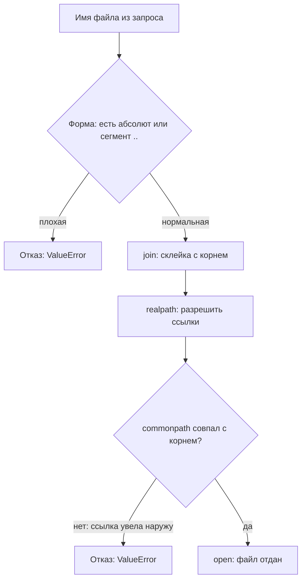

# Работа с путями в Python: join, normpath и обход каталога

Сервис отдаёт отчёт по имени файла: пришло `report.txt` — надо отдать
`/var/app/files/report.txt`. Программист не склеивает строки руками,
а берёт `os.path.join` — функцию из `os.path`, модуля стандартной
библиотеки Python, который собирает и разбирает пути. (Стандартная
библиотека — набор модулей, идущих вместе с Python: ставить ничего не
нужно.) Выглядит такой вызов как забота о безопасности: раз есть
специальная функция, она и соберёт путь правильно. Из темы
`path-traversal` вы уже знаете, чем кончается обработчик, где имя
приходит от клиента. Проверим сам клей двумя вводами — ответ прикиньте
до чтения вывода.

```text
>>> os.path.join("/var/app/files", "../../secret")
'/var/app/files/../../secret'
>>> os.path.join("/var/app/files", "/etc/hostname")
'/etc/hostname'
```

Первый ответ сохранил `..` как есть: путь уходит из базового каталога
вверх. Второй сделал хуже — абсолютный сегмент молча сбросил базу
целиком, и в итоге `/var/app/files` не упоминается вовсе. Никакой
«склейки внутрь базы» у join нет и не задумано. Сам класс дефекта —
обход каталога, CWE-22 — разобран в теме `path-traversal`. Здесь вопрос
другой: какая проверка держит границу, если сами функции о ней не знают?

## Как это работает

**Откуда это взялось.** Задача, ради которой писали os.path, — не
изоляция, а переносимость: собрать корректную строку пути, одинаково
работающую на разных системах. Запрос «удержать путь внутри каталога»
в эту задачу не входил, и функции ведут себя соответственно. Абсолютный
сегмент в join по задумке означает «начни заново», и функция честно это
делает. Документация фиксирует: при абсолютном сегменте все предыдущие
части отбрасываются. Прогон `os.path.join('/home/foo', '/home/bar')`
даёт `/home/bar` — базовая часть исчезла без предупреждения.

Слово «лексически» — ключевое для всей темы. Лексическая операция
работает с путём как со строкой: функция читает только текст и на диск
не ходит. Бытовое соответствие — маршрут, записанный на бумаге:
«пройдите вперёд и вернитесь назад» сокращается до «стойте на месте»,
и местность для этого не нужна. Маршрут здесь — строка пути, шаг —
сегмент между разделителями, сокращение на бумаге — работа функции.
Ломается сравнение в одном месте: если «шаг вперёд» — дверь в другое
здание, то «шаг назад» вернёт не туда. Такая дверь в файловой системе
есть, и называется она символической ссылкой.

Символическая ссылка — файл-указатель, который ведёт на другой путь:
табличка «архив переехал в соседнее здание» вместо самого архива.
По строке ссылку не отличить от обычного каталога — поэтому лексическая
свёртка про неё не знает и знать не может.

### Три ловушки

Первая ловушка уже видна во введении: join не сажает путь в базу.
Ввод `../../secret` уходит вверх по каталогам, абсолютный
`/etc/hostname` сбрасывает базу — и оба итога join отдаёт как нормальную
строку. Функция сделала ровно то, о чём её просили, потому что просили
строку.

Вторая ловушка — normpath: она сворачивает путь лексически, то есть
убирает `..` и лишние разделители прямо в строке. Документация
предупреждает: такая свёртка может изменить смысл пути, если на нём
есть символические ссылки. Почему — видно на бумажном маршруте выше:
шаг «назад» после двери в другое здание возвращает не туда, а свёртка
этого не видит.

Третья ловушка — commonprefix. Название обещает «общий путь», а функция
сравнивает строки посимвольно и про каталоги не знает. Документация
предупреждает: результат может оказаться некорректным путём, потому что
работа идёт символ за символом. Правильная пара называется commonpath:
она сравнивает пути по сегментам, и граница каталога для неё — не
совпадение букв, а совпадение имён между разделителями.

Все приёмы собраны в один прогон. Планы чтения: найти свёртку `..`;
найти посимвольное сравнение; найти сравнение по сегментам; найти
склейку через pathlib.

```python
# Исполняемый, Python 3.14. Запуск: python3 probe.py
import os
from pathlib import Path

print(repr(os.path.normpath("/var/app/files/../../secret")))
print(repr(os.path.commonprefix(["/var/app/files",
                                 "/var/app/files-secret"])))
print(repr(os.path.commonpath(["/var/app/files",
                               "/var/app/files-secret"])))
print(repr(Path("/var/app/files") / "/etc/hostname"))
```

Вывод команды `python3 probe.py` (Python 3.14.7, Linux):

```text
'/var/secret'
'/var/app/files'
'/var/app'
PosixPath('/etc/hostname')
```

Разбор по строкам. Первая: normpath свернул
`/var/app/files/../../secret` в `/var/secret` — строка аккуратная, а уже
за пределами базы. Вторая: commonprefix нашла «общий путь»
`/var/app/files` у `/var/app/files` и `/var/app/files-secret`, хотя
общего каталога у них нет — совпали символы, а не имена каталогов.
Третья: commonpath на той же паре честно отвечает `/var/app`. Четвёртая
строка — про pathlib, и к нему отдельное слово.

Модуль pathlib — объектный интерфейс тех же путей из той же стандартной
библиотеки: вместо строк — объекты `Path`, а косая черта `/` между ними
означает склейку. Пульт другой, телевизор тот же: с абсолютной правой
частью оператор `/` сбрасывает базу точно так же, как join, — это и
есть четвёртая строка вывода. Проверка входа в программе на pathlib
собирается из тех же двух половин, что ниже.

## Проверка, которая держит границу

Раз функции границы не знают, её собирают из двух половин. Первая —
отбор входа по форме: имя не должно быть абсолютным путём и не должно
содержать сегмент `..`. Вторая — сверка места: итоговый путь приводят
через realpath и проверяют, что общий каталог этого пути с корнем —
сам корень. Разрешение ссылок здесь делает realpath: функция проходит
по пути и подставляет настоящие цели вместо имён-указателей.

Зачем нужны обе половины. Одной формы мало: ссылка внутри базового
каталога лексически безупречна, а вести может наружу, и это видно
только после realpath. Одного realpath тоже мало: сам по себе он ничего
не отклоняет, и `/etc/hostname` переживёт его как есть. Отклоняет
сравнение commonpath с корнем, а отбор по форме отсекает мусорный ввод
до обращения к диску и даёт ранний понятный отказ.

Планы чтения пары ниже: найти точку входа недоверенного имени; найти,
где собирается путь; найти, кто открывает файл.

Уязвимый вариант:

```python
# УЯЗВИМО — демонстрация, не для продакшена
import os

def read_report_bad(name):
    # join склеит строку, но внутри каталога путь не удержит
    path = os.path.join("/var/app/files", name)
    with open(path) as f:
        return f.read()
```

Исправленный вариант:

```python
# Исправленный вариант: отбор входа плюс сверка с корнем
import os

ROOT = "/var/app/files"

def read_report(name):
    if os.path.isabs(name) or ".." in name.split("/"):
        raise ValueError(name)
    full = os.path.realpath(os.path.join(ROOT, name))
    if os.path.commonpath([ROOT, full]) != ROOT:
        raise ValueError(name)
    with open(full) as f:
        return f.read()
```

Пара различается минимально. Строка 7 исправленного варианта — отбор
входа: isabs возвращает True на абсолютный путь, то есть путь от корня
файловой системы, а разбиение `name.split("/")` ловит сегмент `..`. Такое имя отклоняется до всякой
работы с диском. Строка 9 превращает строку в настоящий путь через
realpath. Строка 10 сверяет общий каталог с корнем: не совпал — путь
ушёл, и его отклоняют тем же ValueError. Открывает файл только строка
12, после обеих проверок.



**Описание схемы.** Запрос идёт сверху вниз через две проверки разного
рода. Первая смотрит только на строку и отсекает плохую форму до диска.
Вторая живёт после realpath и видит настоящее место пути: ссылка,
ведущая наружу, лексически чиста, но общий каталог с корнем у неё
другой. Файл открывается, только когда пройдены обе проверки.

Теперь прогон на живом стенде. Рядом с каталогом files лежит
secret.txt, а внутри files — отчёт report.txt с текстом «hello from
inside» и ссылка link.txt на `../secret.txt`.
Логика та же, что в исправленном варианте, только отказы печатаются
строками, чтобы уместились в вывод:

```python
# Исполняемый, Python 3.14. Стенд: mkdir -p /tmp/pd/files;
# внутри report.txt и ссылка link.txt на ../secret.txt, рядом secret.txt
import os

root = "/tmp/pd/files"

def open_name(name):
    if os.path.isabs(name) or ".." in name.split("/"):
        return "REJECT form"
    full = os.path.realpath(os.path.join(root, name))
    if os.path.commonpath([root, full]) != root:
        return "REJECT outside"
    return "OK -> " + open(full).read().strip()

for n in ["report.txt", "../../secret.txt", "/etc/hostname",
          "link.txt", "sub/../report.txt"]:
    print(f"{n!r:24} {open_name(n)}")

# что было бы без realpath: лексическая сверка
name = "link.txt"
lex = os.path.normpath(os.path.join(root, name))
print("без realpath:", repr(lex),
      "commonpath =", os.path.commonpath([root, lex]))
```

Вывод прогона (Python 3.14.7, Linux):

```text
'report.txt'             OK -> hello from inside
'../../secret.txt'       REJECT form
'/etc/hostname'          REJECT form
'link.txt'               REJECT outside
'sub/../report.txt'      REJECT form
без realpath: '/tmp/pd/files/link.txt' commonpath = /tmp/pd/files
```

Разбор по строкам. Свой отчёт отдан. Вводы `../../secret.txt` и
`/etc/hostname` отклонены по форме — до диска дело не дошло. Ссылка
link.txt форму проходит, но realpath разрешил её в `/tmp/pd/secret.txt`,
и commonpath ответил «за корнем». Последняя строка показывает цену
лексики: без realpath сверка приняла бы ссылку за внутренний файл —
именно так проверка и обманывается.

Отдельная честность про пятую строку: `sub/../report.txt` после свёртки
остался бы внутри, но отклонён. Это осознанная строгость: легальному
имени сегмент `..` не нужен, а правило «никаких `..`» читается на ревью
за секунду.

Две оговорки про сам код. Первая: корень тоже разрешают один раз при
старте, `ROOT = os.path.realpath(...)`. Если корень — ссылка, realpath
полного пути уходит в настоящее место, а commonpath сравнивает его
с буквой ссылки и даёт ложный отказ; прогон это подтверждает.

Вторая оговорка — Windows. Там свои правила разбора: путь `c:report.txt` не
абсолютный, он отсчитывается от текущего каталога своего диска, а не от
корня. Здесь помогает ntpath — реализация os.path для Windows,
доступная и на Linux. Прогон на ней подтверждает: isabs отвечает на
такой путь False, а `ntpath.join('c:', 'foo')` склеивает в `'c:foo'` —
путь относительно текущего каталога диска.

Есть и вторая разница: Windows-разбор принимает оба разделителя.
Второй прогон: `ntpath.normpath('../secret')` сворачивается в
`'..\\secret'` — настоящий сегмент выхода из каталога. Поэтому
кросс-платформенный отбор формы режет вход по обоим разделителям:
`".." in name.replace("\\", "/").split("/")`. Исправленный вариант
считает POSIX-случай, где разделитель один, а проверка с одним `os.sep`
на Windows пропустила бы слеш-форму `../secret` целиком.

Осталось окно, которого строковые функции не закрывают вовсе: между
проверкой и открытием атакующий с доступом к каталогу может подменить
ссылку — проверялась одна цель, откроется другая. Это гонка TOCTOU,
«время проверки против времени использования», она разобрана в теме
`race-conditions`. Полностью такое окно снимает только граница, которую
держит сама операционная система; как она устроена в Go через os.Root,
показывает сестринская тема `go-filepath`. Процедура ретеста такой
находки — кодированные формы `..`, включая двойное кодирование, и
абсолютные пути — разобрана в методике WSTG, тест WSTG-v42-ATHZ-01.

## Что искать на ревью

Тревожные маркеры в чужом Python-коде:

- `os.path.join(base, name)` с именем из запроса без дальнейшей сверки
  с корнем;
- `normpath` в роли «очистки» входа — свёртка лексическая и про ссылки
  не знает;
- сравнение через `commonprefix` или `str.startswith` — посимвольное,
  границ каталогов оно не видит;
- склейка оператором `/` у pathlib — тот же join в другой обёртке.

Опорные маркеры:

- отказ по форме до диска: `isabs` плюс проверка сегментов на `..`;
- `realpath` итога и `commonpath` против корня, причём корень разрешён
  один раз при старте.

**Зачем это в работе AppSec-инженера.** Отдача файлов по имени из
запроса — типовой обработчик, и join в нём выглядит как забота о путях.
Ревьюеру важно знать, что join про строки, иначе находка «обход
каталога» будет спориться кодом, который «всё правильно склеивает».
Тогда спор закрывается одним прогоном из этой темы.

## Источники

1. os.path — Common pathname manipulations, документация Python 3.14;
   реестр `python-os-path`. Разделы: join (абсолютный сегмент отбрасывает
   предыдущие), normpath (лексическая свёртка и символические ссылки),
   commonprefix (посимвольно, результат может быть некорректным путём),
   commonpath, realpath.
   <https://docs.python.org/3/library/os.path.html>
2. Testing Directory Traversal File Include, WSTG v4.2; реестр
   `wstg-v42-athz-01-directory-traversal`. Разделы: векторы ввода,
   кодированные формы `..` (включая двойное кодирование), особенности
   разбора путей в Windows.
   <https://owasp.org/www-project-web-security-testing-guide/v42/4-Web_Application_Security_Testing/05-Authorization_Testing/01-Testing_Directory_Traversal_File_Include>

Каркас этапа: у этапа 7 общих унаследованных источников нет; каждая тема
опирается на документацию своего языка и на материалы этапа 1 по
классам дефектов.

**Маркеры уверенности.** **Проверено лично** 2026-10-03 на Python 3.14.7
(Linux), все прогоны статьи: join с `..` возвращает строку с `..`, join
с абсолютным сегментом возвращает его одного, normpath сворачивает
`/var/app/files/../../secret` в `/var/secret`, commonprefix на
`/var/app/files` и `/var/app/files-secret` возвращает `/var/app/files`,
commonpath на той же паре — `/var/app`, оператор `/` у pathlib с
абсолютной правой частью сбрасывает базу. Стенд с каталогом, файлом и
ссылкой наружу: проверка отдала свой файл, отклонила ввод с `..` и
абсолютный путь по форме, а ссылку — по commonpath после realpath; без
realpath лексическая сверка ту же ссылку пропустила. Корень-ссылка без
realpath корня даёт ложный отказ, после разрешения корня сравнение
работает. Windows-разбор (`isabs('c:report.txt')` → False,
`ntpath.join('c:', 'foo')` → `'c:foo'`, `ntpath.normpath('../secret')`
→ `'..\\secret'`; отбор сегментов через `replace("\\", "/")` ловит обе
формы `..`, а проверка с одним разделителем слеш-форму пропускает) —
**проверено на ntpath**, реализации os.path для Windows, на
Linux-хосте; настоящего Windows-стенда нет.
