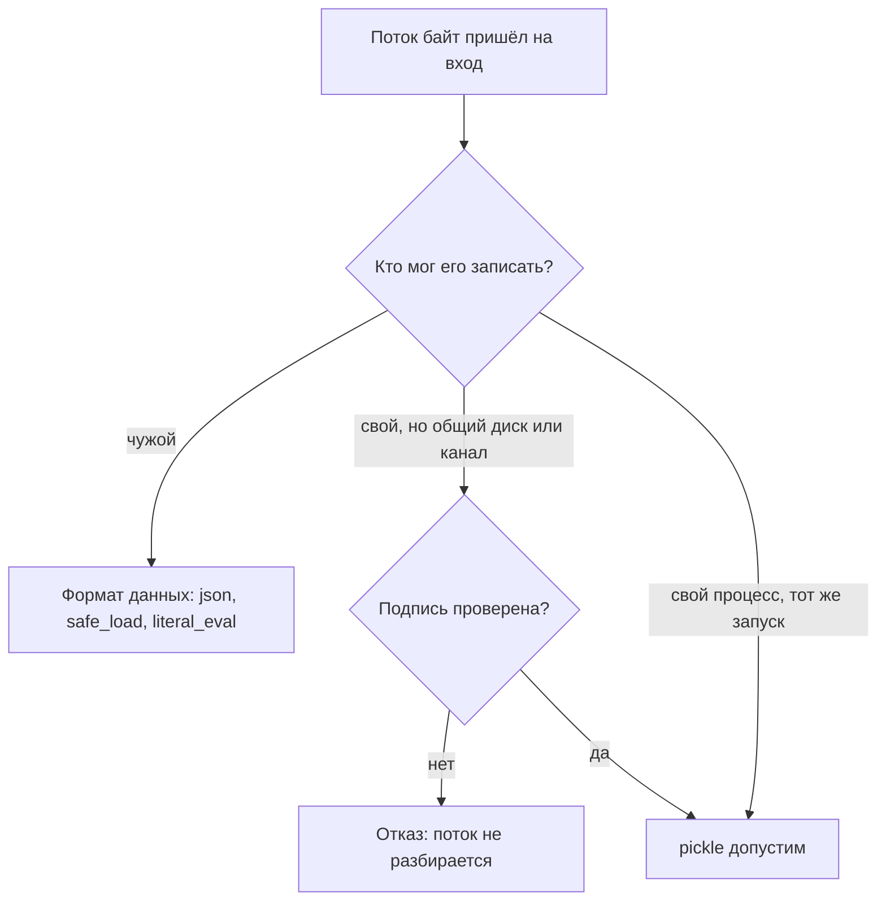

# pickle, eval, exec, небезопасный YAML

Воркер очереди — фоновый процесс, который разбирает задания из очереди:
приложение кладёт туда задачу вроде «отправить письмо», а воркер берёт её
и выполняет. Нашему воркеру приходят снимки состояния — файлы, записанные
где-то через pickle.dump. Модуль pickle — стандартный способ Python
свернуть живой объект в поток байт и восстановить его обратно: dumps
пишет, load читает. Буква s на конце имени — идиома библиотеки: вариант
с s работает со строкой байт в памяти, вариант без неё — с файлом.

Почему чтение чужого потока опасно само по себе, разбирает тема
`insecure-deserialization`, и повторять этот разбор здесь мы не будем.
Здесь мы смотрим, как механизм устроен именно в Python. Прежде чем
загружать пришедший снимок, прогоним его через pickletools —
дизассемблер формата, программу, которая печатает инструкции потока, не
выполняя их. Это как прочитать ноты, не играя: каждую видно, а звука нет.

```text
$ python3 -m pickletools snapshot.pkl
    0: \x80 PROTO      5
   11: \x8c SHORT_BINUNICODE 'posix'
   19: \x8c SHORT_BINUNICODE 'system'
   28: \x93 STACK_GLOBAL
   30: \x8c SHORT_BINUNICODE 'echo PWNED-from-pickle; id -u'
   62: \x85 TUPLE1
   64: R    REDUCE
   66: .    STOP
```

Вывод сокращён: служебные строки FRAME и MEMOIZE опущены, к вызову они
не относятся. В потоке 67 байт, и это программа: имена `posix` и
`system` превращаются в функцию, строка с командой — в её аргумент,
дальше функция вызывается. Загрузи воркер этот файл обычным pickle.load —
команда выполнилась бы на его машине ещё до возврата из функции.
Никакого взлома формата здесь не произошло: pickle исполнил ровно то,
что в нём записано.

Так ведут себя все функции, которые читают данные как код или как
объекты с конструкторами: pickle.loads, yaml.load с полным загрузчиком,
eval и exec. Разбор этих 67 байт — вся тема в миниатюре: данные,
попавшие в загрузчик объектов, становятся программой, и дальше вопрос
только в том, чужая она или своя. Проверка на перенос: снимок записан
самим воркером, но лежит на диске, общем с другими сервисами, —
загружать его можно? Ответ соберём к концу темы, в разделе «Как
защититься».

## Как это работает

**Откуда это взялось.** pickle задуман как способ сохранить объект
между запусками своей же программы: поток читает тот, кто писал. Для
этого формату хватило бы дерева значений, но авторы дали ему
универсальность — восстановить объект любого класса, не зная этот класс
заранее. Поэтому поток хранит не только данные, но и рецепт
восстановления объекта: какую функцию вызвать и с какими аргументами.
Наивное решение «читать поток как данные» ломается ровно здесь, потому
что рецепт и есть точка исполнения. То же случилось с YAML: формат
данных оброс тегами, конструирующими объекты языка, и полный загрузчик
честно их конструирует.

### Поток pickle — программа для стековой машины

Поток pickle — не дерево значений, а последовательность инструкций для
маленькой стековой машины. Стековая машина — вычислитель, у которого
вместо именованных переменных одна стопка значений: каждая операция
снимает верхние элементы и кладёт результат назад. Так работает
карманный калькулятор с обратной польской записью. Чтобы сложить 2 и 3,
вы кладёте 2, кладёте 3, а «плюс» снимает оба числа и кладёт 5. Каждая
инструкция потока — это опкод, байтовый код операции, плюс её данные.
Полный список опкодов ревьюеру не нужен, хватает трёх.

STACK_GLOBAL снимает со стопки два имени — модуля и функции — и кладёт
назад саму функцию, импортировав модуль. TUPLE собирает аргументы в
кортеж — неизменяемый список значений в круглых скобках; в листинге
введения стоит вариант TUPLE1, ровно для одного аргумента. REDUCE
вызывает функцию с этими аргументами. Поток из введения читается теперь
целиком: импортировать posix.system и вызвать её со строкой команды.
По коду класса ниже решите: в какой момент выполнится команда — когда
программа записывает поток или когда его читают?

```python
# Так выглядит класс, чья запись порождает тот поток; УЯЗВИМО,
# демонстрация на своей машине
import os
import pickle


class Evil:
    def __reduce__(self):
        return (os.system, ("echo PWNED-from-pickle; id -u",))


data = pickle.dumps(Evil())
```

Метод `__reduce__` — это и есть рецепт: на вопрос «как восстановить
такой объект» он отвечает парой «функция и её аргументы». Запись
вызывает `__reduce__` и кладёт рецепт в байты, а саму функцию при этом
не вызывает. Ответ на вопрос перед листингом: команда выполняется при
чтении, когда REDUCE зовёт функцию из рецепта.

Документация модуля начинается с предупреждения, которое стоит знать
почти дословно: pickle небезопасен, чужие данные разбирать им нельзя.
Если поток могли подменить, его советуют подписывать: модуль `hmac`
реализует HMAC (Hash-based Message Authentication Code), код подлинности
на общем секретном ключе. Отправитель считает код от потока, получатель
считает заново и сравнивает, а без ключа подделать его нельзя. Чем такой
код отличается от подписи на паре ключей, разбирает тема
`hmac-vs-signature`.

Бытовой аналог подписи — сургучная печать на конверте: оттиск есть
только у своего отправителя, и вскрытие видно сразу. Граница аналогии в
том, что печать проверяют глазами, и подделать её трудно, а подпись
проверяется вычислением, и подделать её нельзя вовсе. Там же, в
документации, названа и форма осмотра без исполнения: pickletools читает
опкоды, не вызывая их.

### YAML: теги и загрузчики

YAML — текстовый формат данных: ключи, значения, списки. PyYAML — самая
распространённая библиотека для работы с ним в Python, но в стандартную
поставку языка она не входит и ставится отдельно. Проход к объектам есть
и у неё.

Документ может пометить значение тегом — ярлыком вида `!!python/object`,
который говорит: «построй здесь объект такого-то класса». Тег похож на
складской ярлык «собрать шкаф по инструкции»: грузчик с таким ярлыком
честно соберёт шкаф, каким бы он ни был. Граница сравнения: ярлык несёт
только инструкцию сборки, а тег — ещё и данные, из которых объект
строится. Загрузчик — компонент, который превращает документ в объекты,
и именно он решает, исполнять ярлык или нет.

Полный загрузчик исполняет любые ярлыки: строит любой класс по тегу
`!!python/object` и вызывает любую функцию по тегу
`!!python/object/apply`. До версии 5.1 вызов yaml.load молча работал с
полным загрузчиком, с 5.1 отвечал предупреждением YAMLLoadWarning, а
поведение не менял. С PyYAML 6.0 вызов без загрузчика падает с
TypeError — проверено на версии 6.0.3. Но заперт замок по умолчанию, а
не дверь: вызовы yaml.unsafe_load и yaml.load с Loader=yaml.Loader
возвращают прежнее поведение. В чужом коде вы встретите именно их — как
«починку» после обновления библиотеки.

### eval и exec

Функции eval и exec устроены проще. Они компилируют строку как код и
исполняют её в текущем пространстве имён — словаре переменных и функций,
видимых в точке вызова. Разница между ними в форме входа: eval считает
значение выражения, а exec выполняет операторы. Границы между «вычислить
выражение» и «сделать что угодно» у этого механизма нет. В строке
доступны встроенные функции и импорт через `__import__`. Доступен и
объектный граф интерпретатора — карта ссылок между объектами, по которой
от любого значения можно дойти до любого класса.

## Как это выглядит в коде

Ревьюер ищет четыре сигнатуры, и все видны по одной строке. До чтения
выносок разберите каждую из четырёх строк сами: откуда в неё приходят
данные и что в ней становится кодом.

```python
# УЯЗВИМО — демонстрация, не для продакшена
import pickle
import yaml

snapshot = pickle.loads(request.body)          # (1)
cache = pickle.load(open(user_path, "rb"))     # (2)
config = yaml.load(text, Loader=yaml.Loader)   # (3)
verdict = eval(f"price > {threshold}")         # (4)
```

1. Поток из запроса разбирается как программа: любой, кто пишет в этот
   вход, исполняет код на сервере.
2. Тот же дефект через файл: вопрос не «откуда байты», а «мог ли их
   подменить чужой». Кэш на общем диске и запись в общей базе — такой же
   чужой поток.
3. Явный полный загрузчик. Вариант `yaml.unsafe_load(text)` — то же
   самое честным именем.
4. Строка собрана f-строкой — записью, где в фигурные скобки
   подставляются значения переменных. Значение `threshold` приходит из
   запроса и становится кодом.

Обёртка, которая выглядит защитой, — собственный Unpickler с
ограниченным find_class: он разрешает только имена из списка. Это уже не
чтение данных, а политика доверия, и цена ошибки в списке — исполнение.
Такой класс в ревью читается как «команда приняла риск осознанно», а не
как «дефекта нет».

Вторая обёртка — пустые `__builtins__` у eval — не работает вовсе.
`__builtins__` — словарь встроенных функций, которые видны коду внутри
eval, и замысел в том, чтобы оставить его пустым и не дать строке ничего
вызвать. Прогон показывает, что замысел не срабатывает: выражение
`().__class__.__base__.__subclasses__()` исполняется и в пустом
окружении. Граф объектов языка никуда не делся: у пустого кортежа есть
класс, у класса — предок, у предка — подклассы.

Ложное срабатывание: `pickle.dumps` без чтения чужих потоков — запись не
опасна. Законен и `yaml.safe_load`: на теге `!!python/object/apply` он
отвечает ConstructorError, а не молчаливым исполнением.

**Зачем это в работе AppSec-инженера.** Эти вызовы живут не в
учебниках, а в эксплуатации. Вызов pickle встречается в кэшах, очередях
задач и сохранённых моделях машинного обучения. Вызов yaml.load живёт в
чтении конфигурации, eval — в настраиваемых правилах. Ревьюеру достаточно
одного поиска по дереву, чтобы получить список мест. Работа дальше —
отличить доверенный поток от чужого и предложить замену, которая не
сломает проект. Найти вызовы — только начало.

## Как защититься

Правило одно: чужой вход читается форматом данных, а не форматом
объектов.

```python
# Исправлено
import ast
import json

import yaml

payload = json.loads(request.body)
config = yaml.safe_load(text)
threshold = ast.literal_eval(user_literal)  # только литералы Python
```

Формат json хранит числа, строки, списки и словари — и ничего больше,
поэтому исполнять в нём нечего. Загрузчик safe_load конструирует только
стандартные теги YAML: на ярлык «собрать шкаф» он отвечает отказом,
потому что умеет только «книги» и «посуду». Функция ast.literal_eval
принимает литералы Python — значения, записанные прямо в тексте: числа,
строки, кортежи, списки, словари. Любому выражению она отказывает: на
вызове функции она бросает ValueError — проверено на Python 3.14.

Вопрос из введения — «снимок записан самим воркером, но лежит на общем
диске» — собирается в одну схему выбора:



**Описание схемы.** Схема читается сверху вниз. Первый вопрос — про
автора потока, а не про его содержимое. Чужой поток читается только
форматом данных, где исполнять нечего. Свой поток на общем диске
считается чужим, пока подпись не проверена: общий диск значит, что
записать туда мог другой сервис. Поэтому снимок из введения без подписи
не загружается: автор свой, а место общее.

Если pickle неизбежен — потоки между своими компонентами с общей кодовой
базой — поток подписывается ключом через `hmac`, как и советует
документация. Вход без верной подписи не разбирается вовсе. Это снимает
вопрос «могли ли поток подменить», а не вопрос «безопасен ли формат».
Формат небезопасен по построению, и ASVS v5.0-1.5.2 требует ровно этого:
не применять десериализацию объектов к недоверенному входу.

**Когда канон не подходит.** Сохранённые модели машинного обучения —
это почти всегда pickle внутри, и переписать формат не выйдет. Там ответ
тот же, что у подписи: модель принимают только из доверенного источника
по защищённому каналу, а из пользовательского ввода — никогда.

## Частая ошибка

Иногда встречается мнение, что eval станет безопасным, если передать ему
пустой словарь встроенных функций. Сработает ли это на чужой строке?
Рассуждение у мнения такое: раз встроенных функций нет, вызывать из
строки нечего.

**Пространство имён — не граница.** Цепочка обрывается на скрытом шаге
«другого пути к вызовам нет». Объекты языка доступны через сами объекты:
у любого значения есть класс, у класса — предки, у предков — подклассы.
Среди подклассов находятся те, что читают файлы и запускают процессы.
Прогон из раздела «Как это выглядит в коде» показывает это на одном
выражении: список подклассов object возвращается и с пустыми
`__builtins__`.

Контрпример — каждая вторая публикация об обходе «песочниц» на eval:
ограничение ломается не взломом проверки, а хождением по ссылкам между
объектами, которые проверка вообще не рассматривает.

## Чеклист для ревью

На ревью пройдите по списку.

1. Проверьте, что вход запроса, файла или кэша не попадает в pickle.load
   или pickle.loads — ни напрямую, ни через промежуточное хранилище
   (CWE-502).
2. Проверьте, что чтение YAML идёт через yaml.safe_load, а не через load
   с явным загрузчиком и не через unsafe_load (ASVS v5.0-1.5.2).
3. Проверьте, что eval и exec не получают строки, собранные из внешних
   данных, включая f-строки с параметрами запроса.
4. Проверьте, что потоки pickle, которые системе принимать необходимо,
   подписаны ключом и подпись проверяется до разбора.
5. Проверьте, что у собственного Unpickler с ограничением имён есть тест
   на чужой поток, а не только на свой.
6. Проверьте, что на битом или чужом входе читатель получает отказ
   (JSONDecodeError, ConstructorError), а не молчаливое исполнение.

## Попробуй сам

Найдите в своём питоновом репозитории все вызовы из темы: поиском по
`pickle.load`, `yaml.load`, `unsafe_load`, `eval(`, `exec(`. Для каждого
места выпишите, откуда приходят данные. Если в репозитории есть файл
формата pickle — прогоните его через `python3 -m pickletools`, не
загружая.

Одна подсказка: `pickle.dumps` без чтения чужих потоков — не находка;
смотрите на направление потока, а не на имя модуля.

**Критерий выполнения** наблюдаемый: таблица «место — источник данных —
вердикт» и дизассемблерный вывод по найденному файлу, в котором вы
показали, есть ли REDUCE на системные функции.

## Проверь себя

1. Воркеру пришёл новый файл состояния, и дизассемблер читает его так
   (служебные строки FRAME и MEMOIZE опущены):

    ```text
    $ python3 -m pickletools data.pkl
        0: \x80 PROTO      5
       11: }    EMPTY_DICT
       13: \x8c SHORT_BINUNICODE 'a'
       17: ]    EMPTY_LIST
       19: (    MARK
       20: K        BININT1    1
       22: K        BININT1    2
       24: e        APPENDS    (MARK at 19)
       25: s    SETITEM
       26: .    STOP
    ```

    Исполнит ли загрузка этого файла чужой код?

2. Обработчик считает цену вызовом
   `verdict = eval(f"price > {threshold}")`, где `threshold` приходит из
   запроса. Выберите починку.

   A. Передать eval пустые `__builtins__` — вызывать из строки станет
      нечего.

   B. Убрать eval: сравнение разбирается своим парсером, а литералы идут
      через ast.literal_eval.

   C. Вырезать из `threshold` опасные слова вроде `import` и `system`.

3. Почему обновление PyYAML до шестой версии не закрывает дефект в чужом
   коде, где остался вызов `yaml.load(text)`?

4. Что ответит `ast.literal_eval` на строку с вызовом?

    ```python
    import ast
    ast.literal_eval("f(1)")
    ```

5. Возврат к теме `insecure-deserialization`: почему подпись потока
   меняет ответ на вопрос «можно ли разбирать», но не делает формат
   безопасным?

<details markdown="1">
<summary>Ответ 1</summary>

1. Нет. В потоке нет ни STACK_GLOBAL, ни REDUCE — одни конструкторы
   данных (EMPTY_DICT, EMPTY_LIST, SETITEM) и STOP. Исполнение в pickle
   начинается с разрешения пары имён в функцию, а здесь разрешать нечего.
   Прогон: `python3 -c "import pickle, pickletools;
   pickletools.dis(pickle.dumps({'a': [1, 2]}))"` — в выводе те же
   инструкции и ни одной вызывающей.

</details>

<details markdown="1">
<summary>Ответ 2: разбор вариантов</summary>

2. Верно: B.

   A. Не закрывает вопрос. Путь к вызовам лежит через сами объекты:
      `().__class__.__base__.__subclasses__()` исполняется и с пустыми
      `__builtins__` — это показано прогоном в разделе «Как это выглядит
      в коде». За вариантом стоит заблуждение из раздела «Частая ошибка»
      этой же темы.

   B. Верно. literal_eval принимает только литералы и отказывает любому
      выражению, а вход с оператором разбирает парсер, который знает свою
      грамматику и не исполняет ничего.

   C. Чёрный список слов ломается о вторую форму записи: имя собирается
      конкатенацией строк или достаётся из объекта. Это приём из разряда
      «убрать опасные символы» — тот же ход разобран в темах
      `sqli-basics` и `xss-reflected`.

</details>

<details markdown="1">
<summary>Ответ 3</summary>

3. Обновление заперло замок по умолчанию, а не дверь: вызов без
   загрузчика теперь падает с TypeError, но `yaml.load(text,
   Loader=yaml.Loader)` и `yaml.unsafe_load(text)` возвращают прежнее
   поведение. В чужом коде после обновления встречается именно такая
   «починка» — ревьюер ищет её по имени загрузчика.

</details>

<details markdown="1">
<summary>Ответ 4</summary>

4. Отказ: ValueError «malformed node or string». Прогон: `python3 -c
   "import ast; ast.literal_eval('f(1)')"` на Python 3.14. Вызов функции
   литералом не считается, и отказ приходит от любого выражения — граница
   у формы входа, а не у его места в данных.

</details>

<details markdown="1">
<summary>Ответ 5</summary>

5. Подпись отвечает на вопрос «кто записал поток»: верная подпись значит,
   что поток писал свой компонент, и подмена на общем диске обнаружится.
   Сам формат остаётся исполняемым по построению — доверие перенесено с
   формата на ключ, и потеря ключа возвращает вопрос в полный рост.

</details>

## Источники

1. pickle — Python object serialization, документация Python 3.14;
   реестр `python-pickle`. Разделы: предупреждение о небезопасности и
   совет про hmac, Comparison with json, Restricting Globals, устройство
   REDUCE, примечание про pickletools как безопасный осмотр.
   <https://docs.python.org/3/library/pickle.html>
2. PyYAML Documentation; реестр `pyyaml-docs`. Разделы: предупреждение
   о yaml.load на чужих данных, safe_load и SafeLoader, теги
   `!!python/object` и `!!python/object/apply`.
   <https://pyyaml.org/wiki/PyYAMLDocumentation>

Каркас этапа: у этапа 7 общих унаследованных источников нет; каждая тема
опирается на документацию своего языка и на материалы этапа 1 по
классам дефектов.

**Скоропортящийся слой.** Умолчания библиотек: поведение yaml.load без
загрузчика уже менялось дважды (предупреждение в PyYAML 5.1, обязательный
аргумент в 6.0) и может меняться снова;
протокол pickle по умолчанию меняется между версиями Python. Механика
REDUCE и тегов стабильна, при ревизии перечитываются умолчания.

**Маркеры уверенности.** **Проверено лично** 2026-10-03 на Python 3.14.7
и PyYAML 6.0.3: поток с `__reduce__` исполняет os.system при load и
читается pickletools без исполнения; pickletools на потоке `{'a': [1,
2]}` показывает одни конструкторы данных и ни одной вызывающей
инструкции; yaml.load без загрузчика падает с TypeError; yaml.load с
Loader=yaml.Loader и yaml.unsafe_load исполняют `!!python/object/apply`;
safe_load на том же документе бросает ConstructorError; выражение через
`__subclasses__` работает и с пустыми `__builtins__` (классов в ответе
сотни; сколько именно — зависит от того, что уже импортировано);
ast.literal_eval принимает словарь и отказывает вызову с ValueError. Формулировки предупреждений — **по документации**, обе
страницы открыты лично 2026-09-02. Обходы ограниченного Unpickler здесь
не воспроизводились — в тексте это помечено как политика доверия, а не
как проверенная защита.
