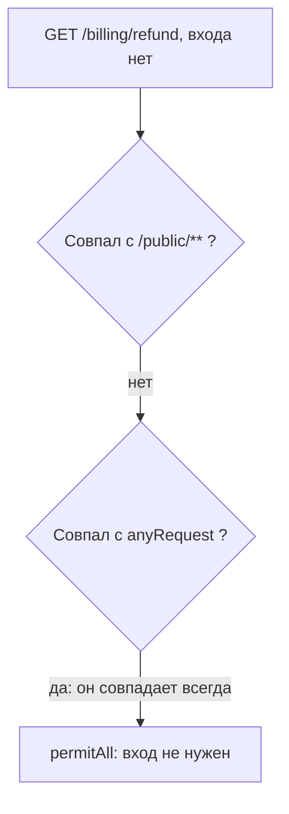
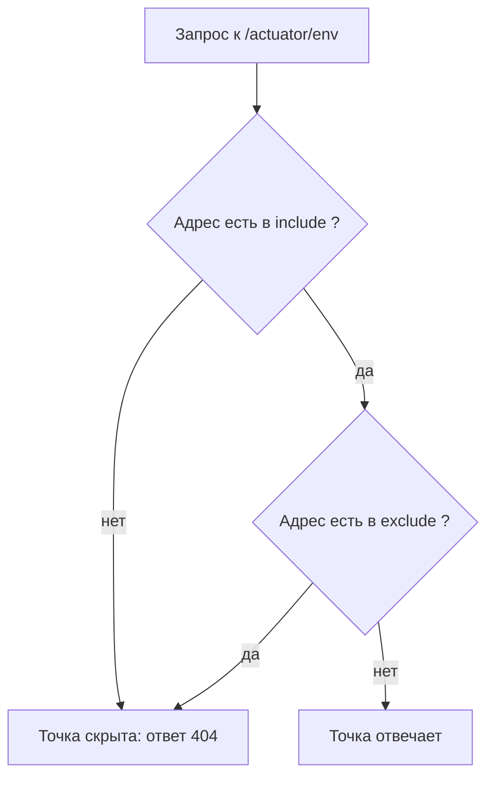

# Spring: конфигурация безопасности и actuator

На ревью попал сервис на Java, и его настройки безопасности уместились
в такой фрагмент:

```java
// УЯЗВИМО — демонстрация, не для продакшена
// Фрагмент конфигурации, упрощено для примера
http.authorizeHttpRequests((authorize) -> authorize
    .requestMatchers("/public/**").permitAll()
    .anyRequest().permitAll()        // (1)
);
```

Код компилируется, тесты проходят, а дыра сидит в порядке строк: правила
читаются сверху вниз, и побеждает первое совпадение. Строка с номером 1
означает «всё остальное — всем»: всякий адрес, не попавший в список
выше, открыт без входа. Запись со стрелкой — лямбда, короткая форма
функции-аргумента, а вызовы методов подряд через точку — цепочка; обе
идиомы разберём ниже. Неделю спустя в сервис добавили обработчик
адреса `/billing/refund`, а конфигурацию не трогали. Прежде чем читать
дальше, ответьте себе: кто теперь может вызвать этот адрес?

## Что здесь вообще настраивается

Spring — фреймворк, на котором собирают серверные приложения на Java.
Разницу между фреймворком и библиотекой видно по тому, кто кого
вызывает. Функции библиотеки зовёт ваш код, как вы берёте инструмент
с полки и кладёте обратно. Фреймворк поступает наоборот: вы пишете
классы по его правилам, а он сам решает, когда их вызвать. Соответствие
здесь такое: инструмент — библиотека, мастерская со своим распорядком —
фреймворк. Граница у сравнения одна: инструмент выбирают под задачу,
а мастерскую — под весь проект.

Spring Boot — тот же фреймворк, собранный с умолчаниями и встроенным
веб-сервером, поэтому приложение стартует одной командой. Внутри него
запросы HTTP (Hypertext Transfer Protocol, протокол из темы
`http-basics`) разбирают обработчики: методы, которые фреймворк вызывает
по адресу из запроса. Регистрацией обработчика управляет аннотация,
и такое чтение аннотаций вы уже видели в теме `java-reading-syntax`.
В разговоре обработчик адреса называют ручкой, и дальше мы будем
говорить так же.

Spring Security — модуль безопасности того же фреймворка, и встаёт он
между запросом и обработчиком. Устроен модуль как цепочка фильтров:
каждый фильтр смотрит запрос и решает, пустить его дальше или
отклонить. Бытовое соответствие — проходная: посетитель идёт мимо
постов охраны по одному, и каждый пост вправе его развернуть. Настройка
из вступления задаёт правила такой проходной: кого пускать без
пропуска, а кого только с пропуском. Пропуск здесь — вход в приложение,
а отметка в нём, на какой этаж пускать, — авторизация: право вызвать
конкретный адрес.

Правила проходной пишут Java-кодом: метод конфигурации получает объект
`HttpSecurity` и наполняет его парами «образец адреса — решение».
Фрагмент из вступления — кусок такого метода, и две языковые идиомы
в нём тема `java-reading-syntax` не разбирает. Первая — лямбда: запись
`(authorize) -> ...` читается «возьми объект authorize и сделай с ним
то, что правее стрелки». Это короткая форма функции, переданной
аргументом. Вторая — цепочка вызовов: в записи
`.requestMatchers(...).permitAll()` каждый метод возвращает объект,
у которого вызывают следующий.

## Как это работает

**Откуда это взялось.** Ранний Spring Security настраивали XML-файлами.
Правила для пересекающихся адресов требовали порядка, и порядок стал
частью смысла: частное правило ставили выше общего. Позже конфигурацию
перенесли в Java-код, а само правило сохранили: совпадения ищутся
сверху вниз, и первое сработавшее решает судьбу запроса.

Каждое правило цепочки состоит из двух половин: образца адреса и
решения. Образец `/public/**` — это Ant-паттерн, шаблон со звёздочками:
одна звёздочка закрывает символы внутри одного сегмента пути, две —
любые адреса под префиксом на любую глубину. Так, образец выше
совпадает и с `/public/logo.png`, и с `/public/docs/price.pdf`.
Решений три: `permitAll` пускает всех без входа, `authenticated`
требует входа, `denyAll` не пускает никого.

Особое место занимает `anyRequest`: образец, который совпадает с любым
запросом. Работает он как стоп-слово: всё написанное ниже мёртво,
потому что запрос до нижних строк не доходит никогда. Отсюда два
чтения одной и той же цепочки. Первое: `permitAll` у любого правила
открывает его адреса без входа. Второе: `anyRequest` в середине файла
делает бессмысленным всё, что ниже.

Теперь к вопросу из вступления. Новая ручка `/billing/refund` в
конфигурации не названа: первое правило с ней не совпадает,
а `anyRequest` совпадает всегда. Ответ: вызвать её может любой, кто
достучится до сервиса, и вход не потребуется.



**Описание схемы.** Запрос к новой ручке проходит цепочку сверху вниз.
Первое правило не совпадает, потому что адрес начинается с /billing,
а не с /public. Образец anyRequest совпадает с любым запросом, и его
решение permitAll передаёт запрос обработчику без входа. Других строк
в конфигурации нет, и остановиться больше не на чём.

## Три дыры, которые видно глазами

Первая дыра — та, что во вступлении: `anyRequest` с решением
`permitAll` в конце файла. Формально конфигурация полна, по сути она
открывает всё, что не перечислено выше. Код компилируется, и тесты
проходят, потому что ни компилятор, ни тесты не знают замысла. Они
проверяют синтаксис и записанные сценарии, а намерение «закрыто всё,
кроме перечисленного» в коде нигде не высказано.

Вторая дыра — порядок: широкий образец выше строгого правила. Если
строка с `/**` и `permitAll` стоит выше правила для `/admin/**`
с `authenticated`, строгое правило не сработает никогда. Запрос
к адресу админки совпадёт с широким образцом раньше. Такая пара
рождается из правок: новое правило дописали в конец файла, а его
место по смыслу — выше широкого.

Третья дыра — молчание. Ручку добавили, а правило для неё не написали,
и судьбу адреса решает последняя строка цепочки. Разрешающая строка откроет
адрес, запрещающая закроет, возможно против замысла. В каталоге
слабостей CWE (Common Weakness Enumeration) этот дефект записан как
CWE-862, «отсутствующая авторизация»: код нигде не спрашивает, можно
ли вызывающему сюда. Номер нужен отчёту: по нему находка однозначно
ссылается на класс дефекта, а сам каталог разобран в теме `cve-cvss`.

## Как писать закрытую конфигурацию

Документация Spring Security прямо советует дисциплину запрета по
умолчанию. Идея в том, чтобы перевернуть конфигурацию: не «всё открыто,
кроме запрещённого», а «всё закрыто, кроме разрешённого». Для этого
последней строкой ставят `anyRequest` с решением `authenticated` или
`denyAll`, а открытые адреса перечисляют списком выше. Тогда молчание
работает в безопасную сторону: новая ручка без правила оказывается
закрытой, а не открытой. Документация называет такой порядок здоровой
практикой, потому что правила превращаются в список разрешённого.

Пара ниже исправляет фрагмент из вступления. Планы чтения: найти
стоп-слово `anyRequest` и его решение; найти, названы ли ручки
`/billing/**` явно; сравнить, что изменится для адреса, о котором
конфигурация молчит.

Уязвимый вариант:

```java
// УЯЗВИМО — демонстрация, не для продакшена
http.authorizeHttpRequests((authorize) -> authorize
    .requestMatchers("/public/**").permitAll()
    .anyRequest().permitAll()        // (1)
);
```

1. Строка открывает всё, что не совпало с образцами выше: `anyRequest`
   совпадает с любым запросом, а `permitAll` пускает без входа.

Исправленный вариант:

```java
// Исправленный вариант: запрет по умолчанию
http.authorizeHttpRequests((authorize) -> authorize
    .requestMatchers("/public/**").permitAll()
    .requestMatchers("/billing/**").authenticated()  // (1)
    .anyRequest().authenticated()                    // (2)
);
```

1. Ручки биллинга названы явно и требуют входа: новая `/billing/refund`
   попадает под это правило.
2. Запрет по умолчанию: всё неназванное требует входа, и молчание
   конфигурации больше не открывает адреса.

Чтобы фрагмент обрёл своё место в проекте, посмотрите на метод
конфигурации целиком:

```java
// Исправленный вариант; упрощено для примера
@Bean
public SecurityFilterChain rules(HttpSecurity http) throws Exception {
    http.authorizeHttpRequests((authorize) -> authorize
        .requestMatchers("/public/**").permitAll()
        .anyRequest().authenticated()
    );
    return http.build();
}
```

Аннотация `@Bean` говорит фреймворку положить результат метода в общий
реестр: объекты из него, бины, Spring создаёт и связывает сам. Тип
`SecurityFilterChain` — это и есть собранная цепочка фильтров, и вызов
`build()` её достраивает. Для ревью важно следствие: если в проекте
несколько таких методов, у каждого своя цепочка со своим порядком,
и читают их по одной. Строка для `/billing/**` здесь опущена нарочно:
при запрете по умолчанию явное правило не обязательно, последняя строка
уже требует входа для всего остального. В паре выше она показана как
способ назвать адрес явно.

## Actuator: служебная дверь

Actuator — модуль Spring Boot для эксплуатации в значении
«сопровождение», а не «атака»: он добавляет приложению служебные
адреса, через которые видно его состояние. Бытовое
соответствие — сервисный лючок и приборная панель автомобиля: диагност
читает, что с машиной, не разбирая её. Адреса живут под общим префиксом
`/actuator`: `health` показывает, живо ли приложение, `env` отдаёт
свойства конфигурации, `beans` — список бинов, из которых приложение
собрано. Ломается сравнение на доступе: лючок открывает тот, у кого
ключи, а служебный адрес — любой, кто достучится по сети.

Actuator устроен противоположно цепочке из вступления: закрыто всё,
кроме явно открытого. Через HTTP без настройки виден только
`/actuator/health`, да и тот без деталей: свойство `show-details`
по умолчанию равно `never`, и ответ содержит лишь голый статус.
Значение `when-authorized` показывает детали только вошедшим, `always` —
всем. Свежее приложение на Spring Boot наружу почти ничего не сообщает,
и это сделано сознательно.

Открывают служебные адреса парой свойств `include` и `exclude`:
первое называет, что показать, второе — что спрятать обратно,
и `exclude` сильнее `include`. Полные имена длинные:
`management.endpoints.web.exposure.include` и парное ему с `exclude`
на конце. Запись `include: "*"` открывает все адреса разом, включая
`env` и `beans` с настройками приложения. В YAML звёздочку берут
в кавычки: голая `*` — служебный символ формата, и без кавычек файл
не разберётся.

Настройка, которая открывает всё:

```yaml
# УЯЗВИМО — демонстрация, не для продакшена
management:
  endpoints:
    web:
      exposure:
        include: "*"
```

Точечная настройка вместо неё:

```yaml
# Исправленный вариант: открыты только health и info
management:
  endpoints:
    web:
      exposure:
        include: health, info
```



**Описание схемы.** Служебный адрес открывается в два шага, и порядок
шагов важен. Сначала include решает, виден ли адрес по HTTP вообще:
без записи в include точки для сети не существует, и запрос получает
404. Потом exclude отбирает назад: адрес, попавший в оба списка,
остаётся скрытым. Поэтому exclude сильнее include, и безопасная
запись — короткий include без звёздочки.

Документация советует два независимых слоя защиты. Первый — точечное
открытие: в `include` идут только те адреса, которые реально читает
мониторинг, обычно `health` и `info`. Второй — сам actuator прикрывают
либо правилом Spring Security на адреса `/actuator/**`, либо сетевой
границей. Для этого служебные адреса выносят на отдельный порт
свойством `management.server.port`, и этот порт наружу не выставляют.
Слои не заменяют друг друга: первый уменьшает список видимого, второй
решает, кто вообще до него достучится.

## Что искать на ревью

Практический вывод для чтения чужого Spring-приложения. Цепочку
`authorizeHttpRequests` читают сверху вниз, отмечая три вещи:

- где стоит `anyRequest` и какое у него решение;
- нет ли широкого образца выше строгого правила;
- названы ли явно служебные и денежные адреса вроде `/actuator/**`
  и `/billing/**`.

Отдельным файлом смотрят свойства actuator: что лежит в `include`,
нет ли там звёздочки, чему равно `show-details`. Тревожные маркеры:
`anyRequest().permitAll()`, звёздочка в `include`, значение `always`
у свойства `show-details`. Опорные маркеры: запрет по умолчанию
последней строкой и короткий `include`.

Границы темы. Конфигурация адресов — только один из уровней защиты.
Второй уровень ставит аннотацию `@PreAuthorize` прямо на
метод-обработчик: фреймворк читает её как правило перед вызовом метода.
Образца адреса у такого правила нет — его роль играет сам метод, —
а условие входа записано в значении аннотации. Здесь этот уровень
не разбирается. Реактивный вариант стека собирает цепочку похожим
кодом с другими именами классов, и его эта тема тоже не касается.

**Зачем это в работе AppSec-инженера.** Ревью Spring-приложения
начинается с двух мест: цепочки `authorizeHttpRequests` и свойств
actuator. Оба читаются глазами за минуту, и оба отвечают на один
вопрос: что открыто без входа. Находка здесь не требует стенда: порядок
строк и список `include` видны прямо в diff на код-ревью.

## Источники

1. Spring Security Reference; реестр `spring-security-docs`. Разделы:
   Authorize HTTP Requests — порядок правил, `anyRequest`, `denyAll` как
   список разрешённого, совпадения по Ant-паттернам и по методу.
   <https://docs.spring.io/spring-security/reference/index.html>
2. Actuator Endpoints, документация Spring Boot; реестр
   `spring-boot-actuator`. Разделы: Exposing Endpoints (по умолчанию
   только health, include/exclude, приоритет exclude), show-details
   со значением по умолчанию never.
   <https://docs.spring.io/spring-boot/reference/actuator/endpoints.html>

Каркас этапа: у этапа 7 общих унаследованных источников нет; каждая тема
опирается на документацию своего языка и на материалы этапа 1 по
классам дефектов.

**Скоропортящийся слой.** Имена свойств и умолчания actuator меняются
между мажорными версиями Spring Boot; при ревизии перечитывается страница
документации. Правило «первое совпадение решает» стабильно.

**Маркеры уверенности.** Тема написана **по документации**: справочник
Spring Security (раздел Authorize HTTP Requests) и страница Actuator
Endpoints открыты лично 2026-09-02; умолчание «только health по HTTP»,
`show-details: never` и приоритет exclude сверены по тексту страниц.
Лично **не воспроизводилось**: на стенде нет сборки Spring Boot (JDK 17
есть, зависимости фреймворка не ставились), пример конфигурации — запись
по образцу документации, не прогон. Схемы mermaid отрендерены локально
mmdc 11.16.0 при переписывании 2026-10-03.
