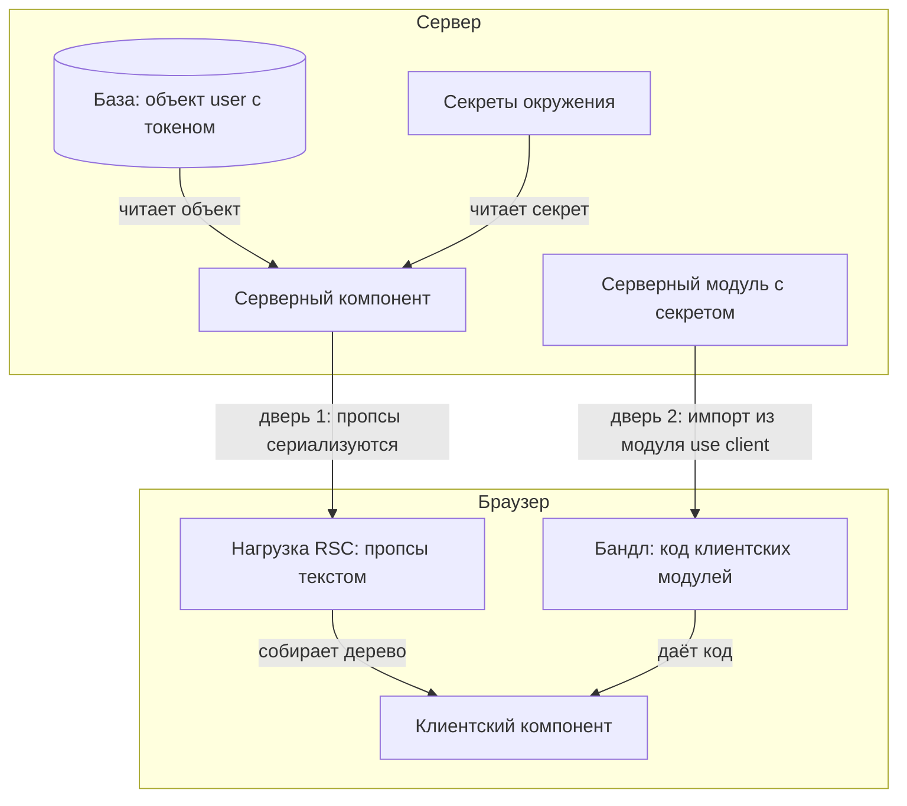

# SSR-специфика: утечки на клиент

На сайте, собранном на Next.js, есть страница профиля. Next.js — это
фреймворк: он собирает страницы из компонентов React, и часть этих
компонентов исполняется на сервере. Серверный компонент профиля читает
пользователя из базы и передаёт объект целиком компоненту-карточке, а
карточка показывает из всего объекта одно имя. Прогоним отрисовку
страницы и заглянем в служебные данные, которые браузер получает вместе
с ней:

```text
0:["$","$3",null,{"user":{"id":1,"name":"alice",
"ssn":"123-45-6789","token":"sk-live-42"}},"$1","$2",1]
```

Карточка показывает имя, а в данных страницы лежит объект целиком: с
номером социального страхования и токеном доступа. Заметим, чего здесь
нет: в самой разметке страницы токена нет, и всё же утечка есть. Она
идёт по каналу, который появился вместе с серверными компонентами React.
Общий класс дефекта — раскрытие внутренних сведений, CWE-200 — разобран
в теме `information-disclosure`. Здесь его специфика: где в Next.js
проходит граница между сервером и браузером, что через неё переходит и
как её держать.

## Из чего собрана страница на Next.js

React — библиотека JavaScript, в которой интерфейс собирают из
компонентов. Компонент — это функция, которая получает параметры и
возвращает разметку, описание того, что показать на экране. Разметка
пишется прямо внутри кода на JavaScript, такой синтаксис называется JSX,
а параметры компонента — пропсами. Бытовое соответствие — бланк письма:
заготовка одна, а имя и дата в неё каждый раз подставляются свои. Так и
компонент: карточка одна, а данные у каждого пользователя другие. Запись
`<Card user={user} />` читается как «отрисуй карточку и передай ей
пропс user со значением переменной user».

**Откуда это взялось.** Долгое время способов отрисовать дерево
компонентов было два. При браузерной отрисовке сервер отдаёт почти
пустую страницу и файл со скриптами, а дерево строит браузер. При
серверной дерево прогоняет на сервере функция renderToString и отдаёт
готовую разметку строкой. Пропсы в эту строку не попадают, попадает
только отрисованный результат — это проверено прогоном. Серверная
отрисовка вернулась за двумя вещами: данными близко к базе и меньшим
объёмом скриптов в браузере. Цена выгоды — новая граница: часть дерева
исполняется на сервере, часть в браузере, и между ними нужен формат
обмена.

В Next.js с маршрутизатором App Router каждый компонент по умолчанию
серверный: он читает базу и секреты окружения. Маршрутизатор — часть
фреймворка, которая решает, какая страница отвечает на какой адрес.
Браузерное исполнение нужно всему интерактивному: формам, кнопкам,
полям ввода. Чтобы компонент исполнялся в браузере, в первую строку
файла ставят директиву `use client` — объявление для сборщика «этот
модуль клиентский». Наивное прочтение «серверный код не доезжает до
браузера» верно про код и неверно про данные: результат серверной части
едет клиенту по построению.

## Как это работает

Граница между сервером и браузером одна, а дверей через неё две. Через
первую уезжают данные: пропсы, которые серверный компонент отдал
клиентскому. Через вторую уезжает код: всё, что импортирует модуль с
директивой `use client`. Обе двери собраны на схеме, и дальше каждая
разбирается по очереди.



**Описание схемы.** Схема читается сверху вниз: сверху сервер, снизу
браузер. База и секреты окружения кормят серверный компонент. Дальше
две подписанные двери: пропсы уезжают текстом в нагрузке RSC, а
серверный модуль, импортированный из клиентского файла, уезжает кодом
в бандл. Клиентский компонент получает и то и другое.

### Дверь первая: пропсы сериализуются

Между сервером и браузером объект передать нельзя: по сети идёт текст.
Объект превращают в текст при отправке и собирают обратно при приёме —
это превращение называется сериализацией. Бытовое соответствие — опись
вложения в посылке: вещь «как есть» не отправить, её описывают в
накладной, а на месте по описи получают обратно. Сравнение ломается в
одном месте: опись пишет человек и может что-то пропустить, а
сериализатор записывает всё, что ему отдали, поле за полем.

Документация Next.js фиксирует состав этой нагрузки — её называют RSC
payload: отрисованный результат, ссылки на файлы клиентских компонентов
и все пропсы, переданные от серверного компонента клиентскому. Пропсы
обязаны быть сериализуемыми, то есть это данные, и браузер читает их
целиком. Зачем нагрузка нужна: браузерный React держит своё дерево
компонентов и по нагрузке согласует его с серверным. Из неё он узнаёт,
что уже отрисовано и какие клиентские части куда вставить. Прогон из начала
темы показывает это дословно: объект user с токеном лежит в нагрузке
открытым текстом.

### Дверь вторая: клиентский бандл

Вторая дверь — бандл. Код для браузера собирают в один или несколько
файлов: сборщик сшивает модули проекта в бандл, как из папки с
документами собирают один пакет на подпись. Директива `use client`
объявляет границу модуля: файл и весь его граф импортов входят в
клиентский бандл. Импорт — это подключение одного модуля из другого,
а граф импортов — цепочка таких подключений. Если клиентский модуль
импортирует серверную утилиту с секретом внутри, утилита уезжает в
бандл.

Переменные окружения при этом делятся по префиксу. Переменная окружения
— настройка, которую приложение читает не из кода, а из окружения, где
его запустили: адрес базы, ключ API. В бандл Next.js включает только
переменные с префиксом NEXT_PUBLIC_, а остальные заменяет пустой
строкой. Поэтому секрет в клиентском модуле «не работает»: обращение к
нему даёт пустоту. Но это защита бандла, а не пропсов, и от импорта
серверного модуля она тоже не защищает. Для такого импорта есть пакет
server-only, npm-пакет из экосистемы темы `npm-dependencies`: сборка
падает, если помеченный модуль попал в клиентский граф.

### Пометка taint

Третий механизм — явная пометка. React в экспериментальном канале
(react@experimental) даёт функцию `taintObjectReference`. Объект,
помеченный в коде доступа к данным, нельзя передать клиентскому
компоненту: при попытке отрисовка падает с ошибкой, и в её тексте стоит
пояснение автора пометки. Taint переводится как «пятно»: объект как бы
запачкан, и границу ему не перейти. Прогон на экспериментальной сборке
React подтверждает обе половины: без пометки токен оказывается в
нагрузке, с пометкой — ошибка вместо объекта, и токена в нагрузке нет.

Граница приёма в документации названа честно: копия помеченного объекта
пометку не несёт. Если слой данных отдал объект, а уровнем выше его
разобрали и собрали заново, новый объект чист. Поэтому пометка — слой
против ошибки при рефакторинге, а не граница безопасности.

## Как это выглядит в коде

Первый признак — объект из базы уходит клиентскому компоненту целиком.
Планы чтения листинга: найти, где данные читаются из базы; где объект
пересекает границу; что получает карточка. Не читая выноски, найдите
строку, где токен пересекает границу:

```jsx
// УЯЗВИМО — демонстрация, не для продакшена
// Серверный компонент (без директивы в начале файла)
export default async function Profile({ userId }) {
  const user = await getUser(userId);     // в объекте и токен
  return <Card user={user} />;            // (1)
}
```

1. Пропс сериализуется в нагрузку целиком: клиент получает все поля,
   включая те, что карточка не показывает.

Слова async и await значат, что функция умеет ждать: база отвечает не
мгновенно, и компонент дождётся ответа, прежде чем вернуть разметку.
Пять строк, а граница в них пересечена целиком: всё, что ушло пропсом,
клиент получает данными, и неважно, что из этого показывает разметка.
Ответьте, не перечитывая листинг: где окажется токен, если передать его
одним строковым пропсом `token={user.token}`?

Второй признак — граница, поставленная слишком рано. Какой из двух
импортов утащит секрет в бандл — решите до выносок:

```jsx
// УЯЗВИМО — демонстрация, не для продакшена
"use client";

import { reportEvent } from "./analytics";  // (1)
import { formatSecret } from "./server-utils"; // (2)
```

1. Всё дерево импортов этого файла — в клиентском бандле.
2. Серверная утилита с секретом внутри уедет в бандл, если её не
   защитить пакетом server-only.

Ложное срабатывание: серверный компонент, который читает секрет и
отдаёт наружу только разметку, законен — секрет остался на сервере.
Смотрите на то, что пересекает границу, а не на то, что существует на
сервере.

## Как защититься

Правило одно: через границу проходит минимум — отобранные поля, а не
объект. Сериализация пишет в нагрузку ровно то, что отдали пропсом,
поэтому сузить передачу — значит сузить и нагрузку:

```jsx
// Исправлено
export default async function Profile({ userId }) {
  const user = await getUser(userId);
  return <Card name={user.name} avatar={user.avatar} />;
}
```

Поверх минимума добавляются слои. Код доступа к данным помечает объекты
через taintObjectReference, и поздний рефакторинг упадёт с ошибкой
вместо утечки. Серверные модули помечаются пакетом server-only, и
импорт их из клиентского графа ломает сборку. Префикс NEXT_PUBLIC_
читается как явное согласие: значение публично.

**Когда канон не подходит.** Пометка taint живёт в экспериментальном
канале React и в проде не применяется как опора: это сигнал на будущее
и защита от ошибки, а не гарантия. Если компоненту нужен объект
целиком, как редактору профиля, ответ не в передаче всего, а в
разделении. Форма получает редактируемые поля, а идентификатор и токен
остаются на сервере.

**Зачем это в работе AppSec-инженера.** Утечка такого вида не видна ни
в разметке страницы, ни в бандле: она лежит в служебном ответе, который
забирает тот же запрос. Ревьюеру достаточно двух проверок: что уходит
пропсами через границу и что импортируется в модули с директивой
`use client`.

## Частая ошибка

Сначала решите сами: секрет лежит в переменной окружения без префикса
NEXT_PUBLIC_ — может ли он уехать к клиенту? Встречается мнение, что не
может: префикса нет, в бандл переменная не попадёт, и секретам в
серверном коде ничего не грозит.

**Префикс защищает бандл, а не данные, переданные через границу.**
Пропсы клиентскому компоненту пишутся в нагрузку независимо от того,
откуда взялось значение: из окружения, из базы или из файла.
Рассуждение «нет префикса — нет утечки» смотрит на вторую дверь и не
замечает первую.

Контрпример — прогон из начала темы: токен не был ни в какой переменной
бандла. Он приехал пропсом из базы и оказался в нагрузке страницы, а
нагрузку читает любой, кто читает ответ.

## Чеклист для ревью

1. Проверьте, что клиентским компонентам передаются отобранные поля, а
   не объекты хранилища целиком (CWE-200).
2. Проверьте, что каждая директива `use client` стоит на самом глубоком
   возможном компоненте, а не на корне страницы.
3. Проверьте, что модули с секретами и доступом к базе помечены пакетом
   server-only или не импортируются из клиентского графа.
4. Проверьте, что переменные с префиксом NEXT_PUBLIC_ содержат только
   публичные значения.
5. Проверьте, что нагрузка страницы (ответ RSC) просмотрена на секреты
   инструментами браузера, а не только разметка.
6. Проверьте, что объекты из слоя данных, которым нельзя на клиент,
   помечены taint там, где канал React это позволяет.

## Попробуй сам

Возьмите своё приложение на Next.js App Router или учебный стенд.
Найдите все переходы пропсов через границу `use client` и выпишите поля
каждого объекта. Затем откройте страницу в браузере и просмотрите
ответы предзагрузки на предмет полей, которых нет в разметке.

Одна подсказка: нагрузка серверных компонентов видна в инструментах
разработчика как отдельный ответ навигации — ищите строки с полями
объектов.

**Критерий выполнения** наблюдаемый: таблица «компонент — поля пропса —
нужны ли все». Плюс один случай, где в нагрузке есть поле, которого нет
в разметке, — найденный или доказанно отсутствующий.

## Проверь себя

1. Пропсы карточки перед сериализацией:

   ```javascript
   const props = { user: { name: "alice", token: "sk-live-42" } };
   const payload = JSON.stringify(props);
   console.log(payload.includes("sk-live-42"));
   ```

   Предскажите, что напечатает этот скрипт.

2. Профиль передаёт клиентской карточке объект пользователя целиком, и
   токен уезжает в нагрузке. Выберите починку.

   A. Держать токен в переменной окружения без префикса NEXT_PUBLIC_ и
      передавать пропсом, как раньше.

   B. Передавать отобранные поля, а объекту из слоя данных поставить
      пометку taint.

   C. Пометить модуль с доступом к базе пакетом server-only.

3. Почему в HTML-ответе страницы токена нет, а утечка всё равно есть?

4. Передачу сузили до одного поля:

   ```jsx
   <Card token={user.token} />
   ```

   Карточка по-прежнему показывает только имя. Где окажется токен?

5. Возврат к теме `information-disclosure`: почему утечку через
   нагрузку RSC не видно при просмотре разметки страницы?

<details markdown="1">
<summary>Ответ 1</summary>

1. `true`. Сериализация пишет в нагрузку всё, что отдали пропсом, и не
   знает, какие поля показывает разметка. Прогон: `node -e 'const props =
   { user: { name: "alice", token: "sk-live-42" } };
   console.log(JSON.stringify(props).includes("sk-live-42"))'`. На этом и
   стоит утечка из начала темы: нагрузка RSC — та же сериализация
   пропсов.

</details>

<details markdown="1">
<summary>Ответ 2: разбор вариантов</summary>

2. Верный вариант — B.

   A. Префикс делит переменные на попадающие в бандл и нет; пропсы
      сериализуются в нагрузку независимо от того, откуда взялось
      значение. Это заблуждение из «Частой ошибки» этой темы: защита
      бандла не защищает данные, переданные через границу.

   B. Верно. Через границу проходит минимум полей, а помеченный объект
      при передаче клиентскому компоненту роняет отрисовку с ошибкой —
      поздний рефакторинг упадёт вместо утечки.

   C. Пакет server-only ломает сборку при импорте модуля из клиентского
      графа — это защита второй двери, бандла. Пропсы из серверного
      компонента клиентскому он не фильтрует.

</details>

<details markdown="1">
<summary>Ответ 3</summary>

3. Классический рендер в строку пропсы не сериализует — в HTML попадает
   только отрисованный результат. Утечка идёт по второму каналу:
   сериализованная нагрузка для согласования деревьев лежит в служебном
   ответе, который забирает тот же запрос, и её нужно смотреть отдельно.

</details>

<details markdown="1">
<summary>Ответ 4</summary>

4. В нагрузке RSC: сериализуются все пропсы, что бы ни показывала
   разметка. Сужение до одного поля работает, только когда само поле не
   секретное; токен полем пропса остаётся токеном в нагрузке.

</details>

<details markdown="1">
<summary>Ответ 5</summary>

5. Разметка показывает отрисованный результат, а нагрузка — отдельный
   служебный ответ для согласования деревьев; его нужно смотреть
   отдельно.

</details>

## Источники

1. Server and Client Components, документация Next.js; реестр
   `nextjs-server-client-components`. Разделы: как работают серверные и
   клиентские компоненты, состав RSC payload (пропсы сериализуются),
   `use client` и граф импортов, префикс NEXT_PUBLIC_, пакет server-only.
   <https://nextjs.org/docs/app/getting-started/server-and-client-components>
2. experimental_taintObjectReference, документация React; реестр
   `react-taint-api`. Разделы: назначение пометки, пример с объектом
   пользователя, оговорки о копиях и о статусе экспериментального API.
   <https://react.dev/reference/react/experimental_taintObjectReference>

Каркас этапа: у этапа 7 общих унаследованных источников нет; каждая тема
опирается на документацию своего языка и на материалы этапа 1 по
классам дефектов.

**Скоропортящийся слой.** API пометки taint экспериментален и живёт вне
стабильной ветки React; имена функций и поведение префикса NEXT_PUBLIC_
менялись раньше и проверяются при ревизии. Само правило «граница — это
сериализация» стареет медленнее.

**Маркеры уверенности.** **Проверено лично** 2026-09-02 на Node.js 26.8.1
и react-server-dom-webpack 0.0.0-experimental-21c89c9f-20260901 (сборка без
бандлера, руками собранная ссылка на клиентский модуль): объект user с
токеном целиком попадает в нагрузку RSC; после taintObjectReference
нагрузка несёт ошибку с текстом пометки, а токена в ней нет; классический
renderToString (react-dom 19.2.8) пропсы в HTML не сериализует. Состав
нагрузки, правило префикса и пакет server-only — **по документации**
Next.js; границы пометки — по документации React. Обе страницы открыты
лично 2026-09-02. Полная сборка Next.js-приложения не выполнялась:
показан механизм на уровне формата, а не фреймворка. Прогон ответа 1
повторён 2026-10-03 на Node.js 26.10.0, вывод совпал.
