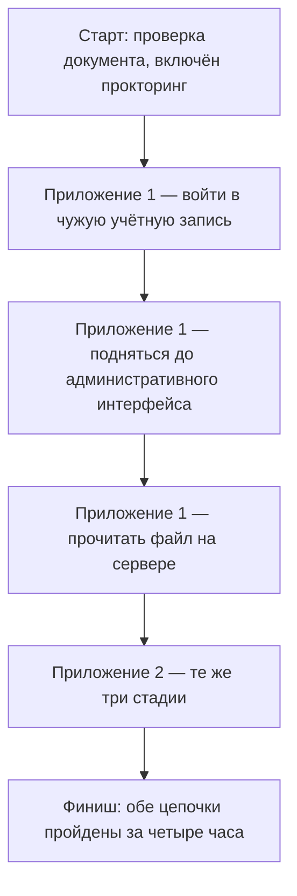

# BSCP: сертификация PortSwigger

Вот экзаменационное задание целиком: войти в чужую учётную запись
веб-приложения, из неё подняться до административного интерфейса, а из
него прочитать файл на сервере. Таких приложений на экзамене два, и на
оба вместе дают четыре часа. Всё это время за кандидатом следит
автоматический прокторинг — программное наблюдение за сдачей, а перед
стартом у него проверяют документ.

Так устроен экзамен BSCP (Burp Suite Certified Practitioner) —
сертификация от PortSwigger, создателей Burp Suite, с которым вы
работали в теме `tls-and-proxy`. Теста с вариантами ответа здесь нет:
вместо опросника кандидат работает на живом стенде, где уязвимости
встроены намеренно. Задание — одновременно и краткое содержание
сертификата: что формат проверяет, то он и подтверждает. А что такой
формат не способен подтвердить в принципе — вопрос этой темы, и знать
ответ стоит до того, как за экзамен заплачено.

## Зачем вообще нужен такой экзамен

**Откуда это взялось.** Умение взламывать веб-приложения долго нечем
было подтвердить. Резюме говорит словами, собеседование — вопросами, и
ни то ни другое не показывает рук. PortSwigger собрала экзамен из того
же материала, что её учебные лабораторные. Кандидат не отвечает на
вопросы, а проходит приложение целиком — от чужой учётной записи до
файла на сервере.

Сертификат в этой области — документ об умении, проверенном экзаменом.
Слова резюме такой проверки не проходили. Зачем она нужна, видно на
бытовом примере водительских прав. Права подтверждают ровно то, что
проверил экзамен: человек способен вести машину. По ним не узнать,
сколько лет он за рулём, ездил ли в дальние рейсы и умеет ли чинить
мотор. Соответствие с BSCP прямое: экзамен на стенде — это практический
экзамен по вождению, только теории в BSCP нет вовсе.

Граница аналогии одна. Водить без прав запрещено законом, а работать
в AppSec без сертификата можно: BSCP служит сигналом рынку, допуска
к профессии он не даёт. Работодатель по нему отличает резюме с
проверенным умением от резюме со словами. Заказчик пишет сертификат
в требования к тестированию. Соискатель получает точку, к которой
сводится подготовка.

## Что умеет и чего не умеет

### Что подтверждает сертификат

Сертификат подтверждает умение обнаружить и эксплуатировать
классические классы веб-уязвимостей руками, в Burp Suite и за
ограниченное время. Три стадии задания вам уже знакомы по этапу 1
маршрута. Войти в чужую учётную запись — это дефекты аутентификации
и доступа вроде тех, что разобраны в темах `password-reset-flaws` и
`idor`. Подняться до административного интерфейса — вертикальное
повышение привилегий из темы `privilege-escalation-vertical`.
Прочитать файл на сервере — класс `path-traversal`.

Какие именно дефекты встроены в конкретный стенд, заранее не объявляют
нарочно: найти их — часть работы кандидата. Поэтому заучить один приём
не выйдет: формат проверяет цепочку целиком — от поиска точки входа
до доказательства того, что цель достигнута. Иначе экзамен проверял
бы память на чужие разборы вместо навыка.

Честность результата охраняет прокторинг — наблюдение за сдачей
экзамена. Зачем он нужен, видно из угрозы: без наблюдения задание за
кандидата мог бы выполнить кто-то другой, и сертификат перестал бы
подтверждать что-либо. Бытовой пример — экзаменатор в классе, который
следит, чтобы никто не списывал. Автоматический прокторинг — такой же
наблюдатель, только программный: личность подтверждается документом,
а за ходом сдачи следит система. Поэтому сертификат говорит и о
честности: умение на экзамене показывал сам владелец.

**Описание схемы.** Экзамен читается сверху вниз. Сначала проверка
личности, затем две одинаковые цепочки из трёх стадий. Стадии связаны:
из чужой учётной записи открывается путь к административному
интерфейсу, а из него — к файлу на сервере. Время общее на оба
приложения: задержка на первом съедает шансы второго.

### Как устроен путь кандидата

Готовятся к экзамену на Web Security Academy — бесплатной учебной
платформе PortSwigger. Она состоит из тем и интерактивных
лабораторных, где уязвимость воспроизводят руками. Экзамен построен
по формату этих лабораторных, поэтому занятия не расходятся со сдачей
по устройству. Подготовка идёт по шагам на сайте сертификации, и
пробный экзамен лежит там же: это репетиция настоящего, которая
показывает формат до оплаты.

Отдельный пункт — допуск. У Burp Suite есть бесплатная редакция
Community и платная Professional по подписке. Сдавать экзамен можно
только с действующей подпиской Professional. Требование касается
допуска к экзамену: без подписки до задания не допустят, как бы
хорошо кандидат ни умел. Для обычной работы выбор редакции остаётся
за вами.

Сданный экзамен подтверждается не картинкой, а ссылкой с уникальным
номером. Проверка устроена как трек-номер посылки: работодатель
вводит номер на сайте PortSwigger и видит, настоящий ли сертификат и
действует ли он ещё. Картинку можно нарисовать, а запись в чужом
реестре — нет. На самом сертификате напечатаны даты начала и конца
действия, и срок этот — пять лет.

### Чего сертификат не подтверждает

Это сертификат об атаке; защиту он не закрывает. И формат иначе
устроить нельзя: ревью кода, построение процесса безопасной разработки
и защита инфраструктуры измеряются месяцами работы — одной
четырёхчасовой сессии для этого мало. Поэтому из сертификата не
следует, что владелец умеет чинить то, что ломает, — он подтверждает
другой конец работы.

Не говорит сертификат и про опыт: четыре часа на учебном стенде не
заменяют проектов. Стенд честный, но учебный: уязвимости там встроены
намеренно, и кандидат знает, что они есть. В реальном приложении
первый вопрос звучит иначе — есть ли дефект вообще, и ответ «нет»
тоже результат работы. Экзамен такой ответ не проверяет.

И он не бесплатен. К цене экзамена прибавляется подписка Burp Suite
Professional, без которой сдавать нельзя. Точные цены страница
подставляет при покупке, поэтому здесь они не фиксируются: число,
переписанное в тему, устарело бы раньше ближайшей ревизии.

### Как читать чужой сертификат

Если сертификат предъявляет кандидат или подрядчик, читается он в три
шага. Первый — проверить номер по ссылке на сайте PortSwigger:
картинке из резюме доверять нельзя. Второй — посмотреть даты: за
пределами пятилетнего срока документ ничего не подтверждает. Третий —
держать в голове рамку: сертификат закрывает практическую атаку на
веб-приложение, а ревью кода, защита и реальный опыт проверяются
отдельно.

То, чего сертификат не закрывает, проверяется тем же наймом. Ревью
кода проверяют ревью: кандидат получает фрагмент с дефектом и вопрос,
что в нём не так. Опыт проверяют рассказом о прошлых проектах: какие
системы тестировал, что нашёл, как донёс результат до заказчика.
Защиту проверяют вопросом о починке: как исправить найденное и как
не дать дефекту вернуться.

Если получать сертификат собираетесь вы, та же рамка читается с
другой стороны. BSCP подтвердит навык атаки руками, но не заменит ни
портфолио, ни умения чинить найденное. Поэтому порядок разумный
такой: сначала лабораторные Web Security Academy, потом пробный
экзамен, и только потом решение о покупке. Пробный экзамен показывает
формат до оплаты, а это честнее любого описания, включая эту тему.

Оговорка о доступности. Тема написана по открытой странице
сертификации: лицензия не покупалась, экзамен не сдавался, интерфейс
сдачи автор не видел. По жанру это справка о документе: участником
экзамена автор не был. Всё, чего страница не публикует, здесь
помечено как несверенное.

**Зачем это в работе AppSec-инженера.** Сертификат — входной билет
соискателя и строка в требованиях заказчика на тестирование. Знать,
что за ним стоит и чего за ним нет, нужно до того, как за него
заплачено — своими деньгами или бюджетом найма. Соседняя тема
`bug-bounty` показывает, куда этот навык идёт дальше: там взлом по
правилам превращается в отчёты, за которые платят.

## Источники

1. PortSwigger, «Burp Suite Certified Practitioner»; реестр
   `portswigger-bscp`. Разделы: назначение сертификации, пять лет
   действия, требование подписки Professional; страница «How it works» —
   четыре часа, два приложения, три стадии, прокторинг.
   <https://portswigger.net/web-security/certification>
2. PortSwigger, «Web Security Academy — Free Online Training»; реестр
   `ps-web-security-academy`. Разделы: бесплатные темы и интерактивные
   лабораторные как учебная база экзамена.
   <https://portswigger.net/web-security>

Каркас этапа: у этапа 8 общих унаследованных источников нет; каждая тема
опирается на свои первоисточники.

**Скоропортящийся слой.** Условия сертификации — формат, цена, срок
действия — меняются без предупреждения, и перед решением страницу
открывают заново; интервал ревизии у темы поэтому вдвое короче
обычного. Устройство экзамена — практика на стенде вместо опросника —
держится с запуска программы.

**Маркеры уверенности.** Формат экзамена (четыре часа, два приложения,
стадии «учётная запись → административный интерфейс → файл на
сервере»), прокторинг с проверкой документа, требование подписки Burp
Suite Professional и пятилетний срок — **по документации**: страница
сертификации и страница «How it works» открыты лично 2026-09-02. Цены
на странице подставляются скриптом при покупке и в разметку не
попадают — **не сверены** и в тему не перенесены. Экзамен **не
сдавался**, лицензия **не покупалась**.
