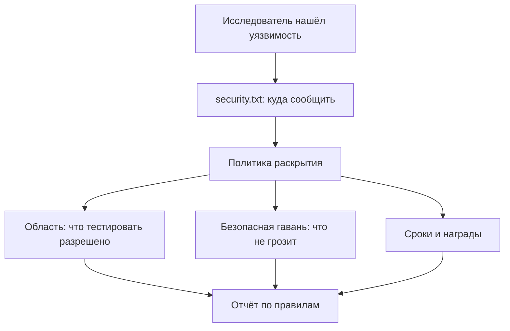
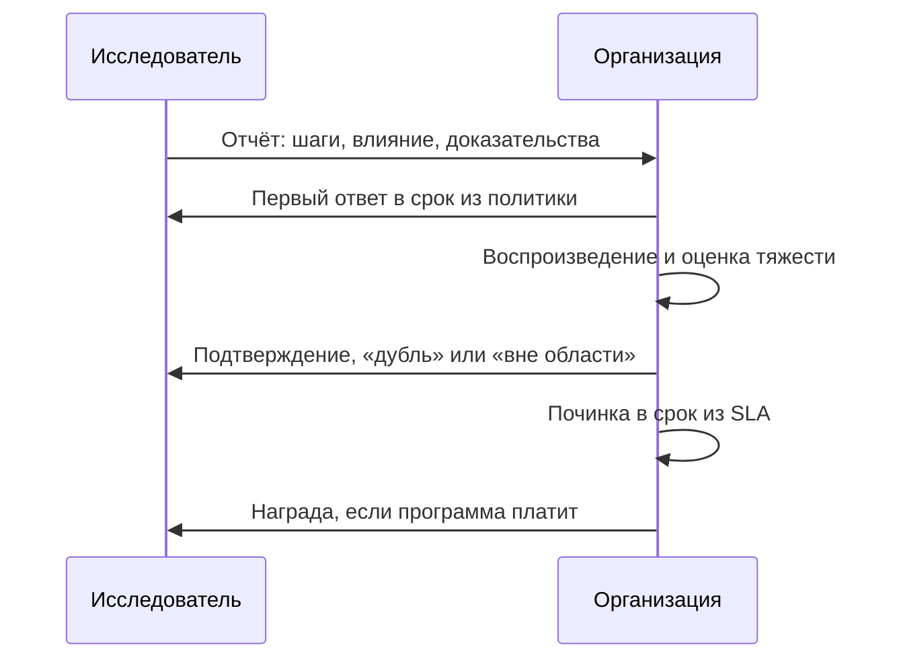

# Bug bounty как практика

Исследователь нашёл в чужом продукте уязвимость и ищет, кому о ней
сказать. На сайте нет ни адреса, ни правил, поэтому отчёт уходит в общий
ящик поддержки, где его читают как жалобу. Другой сайт отвечает на тот же
вопрос файлом по известному адресу:

```text
$ curl -s https://example.com/.well-known/security.txt
Contact: mailto:security@example.com
Expires: 2027-01-01T00:00:00z
Policy: https://example.com/security-policy.html
```

Файл называется security.txt, и его формат задан открытой спецификацией:
номер и устройство ждут в разделе про сам файл. Он отвечает ровно на один
вопрос — куда сообщить о
находке, — и не даёт разрешения на тестирование: разрешение живёт в
политике, на которую файл ссылается. Программа bug bounty — то, что стоит
за таким каналом: договор, по которому организация платит внешним
исследователям за отчёты. Краевой случай: политика и файл опубликованы, а
наград нет — это ещё bug bounty? Ответ ждёт в самопроверке.

## Что такое bug bounty

Bug bounty — программа, в которой организация платит внешним
исследователям за отчёты об уязвимостях. Название переводится прямо:
bug — дефект, bounty — вознаграждение. Бытовой образ — объявление
«нашедшему собаку — награда»: в нём написано, кого ищут, куда звонить и
сколько платят. Соответствие прямое: собака — уязвимость, телефон в
объявлении — контакт из security.txt, сумма — награда программы. Ломается
аналогия на границах поиска. Искать собаку можно где угодно, а тестировать
чужие системы — только в оговорённых рамках, иначе поиск становится
нарушением.

За наградой стоит договор из четырёх элементов. Это область — что
тестировать разрешено, безопасная гавань — что исследователю не грозит,
сроки — когда организация отвечает и чинит, и награда — сколько и за что
платят. Каждый элемент разберём ниже. Деньги при этом не обязательны. Канал приёма
собирается и без них: политика раскрытия плюс файл security.txt. Политика
раскрытия — опубликованное обещание организации: как прислать отчёт, что
будет дальше и в какие сроки. Договор с оплатой и канал приёма — разные
вещи, и второе бывает без первого.

**Зачем это в работе AppSec-инженера.** Тема двусторонняя. Со стороны
организации: как только у продукта появляется внешний контур, отчёты
начинают приходить в любом случае — вопрос, есть ли у них адрес и
процесс. Со стороны исследователя: правила программы — граница между
законным тестированием и нарушением, и читается она до первого запроса,
а не после. Входящий отчёт проходит ту же оценку тяжести, что и находка
сканера, — тема `severity-assessment`.

## Как это работает

**Откуда это взялось.** Исследователь, нашедший уязвимость, долго
упирался в отсутствие двери: общий адрес поддержки, молчание, угрозы
иска. Отсюда две крайности — молчать или публиковать всё сразу, — и
средняя модель: сообщить приватно, публиковать после починки или после
срока. Программы bug bounty оформили эту середину договором с оплатой.

### Три модели раскрытия

Раскрытие — то, что происходит с деталями уязвимости после находки: кому
и когда они становятся известны. Моделей три:

- **приватная** — детали остаются у организации, которая сама решает,
  публиковать ли их; большинство программ требуют именно её;
- **полная** — детали публикуются сразу, обычно как ответ на молчание
  организации; модель считается крайней и спорной;
- **согласованная** — приватный отчёт, а публикация после починки или по
  истечении срока; известный ориентир срока — 90 дней у Project Zero,
  команды исследователей безопасности в Google.

Развилка между моделями одна: в какой момент детали становятся публичными
и кто этот момент выбирает. При приватной модели выбирает организация,
при полной — исследователь в день находки, при согласованной момент
известен обеим сторонам заранее. Поэтому модель программы читается из её
политики, а не из факта оплаты.

Бытовой пример — вы заметили, что дверь подъезда соседнего дома не
запирается. Промолчать — оставить жильцов в опасности. Написать в чат
района сразу — предупредить и жильцов, и вора. Согласованная модель —
сообщить управляющей компании с условием: если к сроку дверь не починили,
вы расскажете публично. Ломается аналогия на длине срока. Дверь чинится
днями, уязвимость — неделями, поэтому срок в договоре фиксируют, иначе
«починим» растягивается бесконечно.

### Четыре элемента договора

**Область** — какие системы и какие классы дефектов входят в программу.
Бытовое соответствие — правила тира: стрелять можно только по мишеням
своей дорожки. Тестировать можно то, что названо в области. Всё остальное
остаётся вне разрешения, даже если уязвимость там лежит на виду.

**Безопасная гавань** — обещание не преследовать исследователя, который
держится правил. Зачем она нужна, видно из угрозы. Активное тестирование
внешне похоже на атаку, поэтому без обещания исследователь рискует
получить иск за то, за что рассчитывал на благодарность. Бытовой пример — объявление
в магазине: «нашедший и вернувший кошелёк не обвиняется в краже». Без
такого объявления нашедший скорее пройдёт мимо.

**Сроки** — когда организация отвечает и что успевает к дате: первый
ответ, подтверждение находки, выплата, починка. Без сроков обещание
починить непроверяемо: «чиним» может длиться годами. **Награда** —
сколько и за что платят. Размер привязан к тяжести находки, а тяжесть
считается по обычной шкале из темы `severity-assessment`.

### Файл security.txt

Технический минимум канала — файл security.txt: текстовый файл по адресу
`/.well-known/security.txt` от корня домена. Его формат задан
спецификацией RFC 9116 — открытым документом инженерного совета
интернета; такие документы вы уже читали на этапе 0 в теме
`tls-and-proxy`. Обязательных поля два: Contact — куда сообщить, и
Expires — до какой даты записям можно верить. Expires работает как срок
годности на молоке: после даты данные считаются протухшими, и отчёт по
старому контакту рискует уйти в никуда. Поле Policy ведёт на политику,
а ключ для шифрования переписки кладётся в поле Encryption.

Спецификация оговаривает отдельным разделом: наличие файла не даёт и не
отнимает разрешения на тестирование. Файл — справочная, а разрешение
живёт в политике. Если политики нет, файл говорит только, куда написать,
и больше ничего. Схема показывает, как устроен переход от находки к
отчёту.



**Описание схемы.** Схема читается сверху вниз. Находка приводит
исследователя к файлу security.txt, а тот — к политике. Область,
безопасная гавань и сроки живут в политике, и все трое сходятся в отчёте,
собранном по правилам. Сам файл разрешения не содержит — он только
показывает дорогу.

## Что умеет и чего не умеет

**Что умеет программа.** Дать внешним находкам адрес и цену: отчёт,
который иначе ушёл бы в публикацию или в продажу, приходит в трекер
задач организации. Расширить охват: внешние исследователи смотрят на
систему глазами, которых в штате нет. Сделать поведение организации
предсказуемым: политика со сроками читается исследователем до первого
запроса.

**Чего не умеет.** Заменить внутренний процесс: программа поверх
сломанного триажа кончается очередью неотвеченных отчётов и ссорами.
Отличать разрешённое тестирование от атаки в трафике она тоже не умеет —
эту границу проводит политика, а не сенсоры. И дешёвой она не бывает.
Шпаргалка OWASP по раскрытию уязвимостей прямо предупреждает о потоке
шумных отчётов и о цене разбора: программу открывают на зрелый процесс,
а не вместо него.

## Как запустить

Канал вводится в пять шагов, и первые три денег не требуют:

1. Назначить владельца входящих отчётов и сроки ответа.
2. Опубликовать политику: область, правила, безопасная гавань.
3. Положить security.txt с полями Contact и Expires; ключ для шифрования
   переписки — в поле Encryption.
4. Обучить первую линию: отчёт может прийти в общий адрес, и терять его
   нельзя.
5. Только при живом потоке отчётов — решать про платформу и награды.

Порядок не случаен. Пока потока нет, платформа и награды покупают очередь
из шума: сначала канал учится принимать и разбирать, и только потом за
приток платят. Платформа программ — площадка-посредник между организацией
и исследователями: ведёт каталог программ, принимает отчёты и разбирает
споры. Бытовое соответствие — биржа фриланса: заказчики публикуют правила
и цены, исполнители присылают работу, а споры разбирает арбитраж
площадки.

Сторона исследователя зеркальна: прочитать политику до первого запроса,
держаться области, собрать отчёт так, чтобы находку могли воспроизвести.
И не требовать оплаты вне программы: требование денег за раскрытие
деталей — вымогательство, а не bug bounty. Разница в моменте договора.
Программа обещает платить заранее и по правилам, а вымогатель ставит
условие под угрозой публикации. Программа платит по договору, а не под
угрозой.

## Как читать вывод

«Вывод» этой темы — входящий отчёт. Минимум, который в нём обязан быть:
как воспроизвести находку, каково влияние, какие доказательства
приложены. Шаги воспроизведения стоят первым потому, что без них находку
нельзя подтвердить, а неподтверждённому нечего оценивать. Отчёт без шагов
воспроизведения — не находка, а заявление; отвечают на него запросом
деталей, а не оценкой тяжести.

Дальше отчёт проходит обычный конвейер: оценка тяжести по теме
`severity-assessment`, срок устранения по `sla-and-backlog`, отсев шума
по правилам `triage-false-positives`. Отличие одно: на другом конце
человек, и ему отвечают в оговорённые политикой сроки, даже когда ответ
— «дубль» или «вне области». Молчание здесь дороже отказа: исследователь
без ответа публикует детали сам.



**Описание схемы.** Обмен читается сверху вниз во времени. Исследователь
присылает отчёт, организация отвечает в срок из политики и разбирает
находку внутри себя. Итог сообщается исследователю в любом случае, даже
если это «дубль». Награда — последний шаг, и она есть только в программе
с оплатой.

## Границы метода

**Граница первая: программа не лечит зрелость.** Практика рекомендует
открывать её организации, у которой уже есть процесс приёма отчётов и
конвейер починок; иначе поток внешних находок лишь покажет отсутствие
обоих. Поэтому в разделе «Как запустить» платформа и награды стоят
последним, пятым шагом.

**Граница вторая: юрисдикция.** Правила программы — не закон: границы
разрешённого тестирования и ограничения на реверс-инжиниринг зависят от
страны. Одно и то же действие в одной стране читается исследованием, в
другой — нарушением. Эту границу проводит юрист, а не эта тема.

**Граница третья: цена шума.** Отчёты автоматических сканеров и письма
«нашёл у вас уязвимость, платите» — постоянная часть потока. Отсев таких
обращений — та же дисциплина триажа из темы `triage-false-positives`.
Требование оплаты до раскрытия деталей отправляется на медиацию
платформы, если она есть: посредник разбирает спор по правилам программы,
а не по давлению сторон.

## Частая ошибка

Какое поле файла из введения разрешает активное тестирование? Ловушка в
том, что файл путают с разрешением: раз security.txt опубликован, сайт
можно тестировать. Ответ спецификации однозначен — никакое.

**Файл — справочная, а не разрешение.** Спецификация говорит об этом
отдельным разделом: security.txt отвечает на вопрос «куда сообщить», и
только. Разрешение на тестирование даёт политика программы с областью и
правилами. Без неё активная проверка остаётся несанкционированной
независимо от наличия файла. Поэтому первый шаг исследователя — не сам
файл, а политика по ссылке из него.

Контрпример с другой стороны: отсутствие файла тоже ничего не запрещает
и не разрешает. Оно означает лишь, что канала по известному адресу нет,
и контакт придётся искать иначе: на странице компании или через общий
адрес поддержки из введения.

## Чеклист для ревью

1. Проверьте, что у организации опубликован канал приёма отчётов: политика
   раскрытия и контакт, а лучше и security.txt с полями Contact и
   Expires.
2. Проверьте, что политика называет область тестирования, правила и
   безопасную гавань.
3. Проверьте, что заданы сроки первого ответа, подтверждения и починки, и
   они наблюдаемы в отчётах.
4. Проверьте, что входящий отчёт проходит ту же оценку тяжести, что и
   внутренняя находка.
5. Проверьте, что первая линия поддержки знает, куда передать отчёт об
   уязвимости.
6. Проверьте, что исследователь, державшийся политики, получает ответ, а
   не молчание и не иск.

## Попробуй сам

Найдите три опубликованные политики раскрытия — у крупных продуктов или
на платформе программ, — и разложите каждую на четыре элемента договора:
область, безопасная гавань, сроки, награда. Для одной из организаций
найдите security.txt и сверьте его поля со спецификацией. Работа идёт в
браузере, стенд не нужен.

Подсказка одна: адрес файла одинаков у всех — `/.well-known/security.txt`
от корня домена.

**Критерий выполнения** наблюдаемый: по каждой из трёх политик записаны
все четыре элемента. По одному файлу security.txt записано, какие поля
из спецификации в нём есть и каких нет.

## Проверь себя

1. Исследователь запросил файл у сайта и получил ответ:

   ```text
   $ curl -s https://shop.example/.well-known/security.txt
   Contact: mailto:security@shop.example
   Policy: https://shop.example/security-policy.html
   ```

   Какого обязательного поля здесь нет и что теряет исследователь без
   него?

2. Предскажите, не выполняя запроса: какие два поля обязаны оказаться в
   ответе на команду

   ```text
   curl -s https://www.google.com/.well-known/security.txt
   ```

   чтобы файл прошёл проверку по спецификации, — а потом выполните и
   сверьте.

3. Почему опубликованный security.txt не разрешает активное
   тестирование сайта?
4. В введении спрошено: политика и security.txt опубликованы, наград
   нет. Это ещё bug bounty?
5. Назовите три модели раскрытия уязвимости и развилку между ними.
6. Возврат к теме `severity-assessment`: входящий отчёт исследователя и
   находка сканера идут по одному конвейеру. Чем разбор отчёта всё же
   отличается?

<details markdown="1">
<summary>Ответ 1</summary>

1. Поля `Expires`: спецификация требует его всегда и ровно один раз
   (RFC 9116, § 2.5.5), наравне с `Contact`. Без него исследователь не
   отличит живой канал от заброшенного: после даты в `Expires` данные
   файла считаются протухшими, и пользоваться ими не следует (§ 5.3).
   Отчёт по старому контакту рискует уйти в никуда.

</details>

<details markdown="1">
<summary>Ответ 2</summary>

2. Contact и Expires — оба обязательны. Прогон:

   ```text
   $ curl -s https://www.google.com/.well-known/security.txt
   Contact: https://g.co/vulnz
   Contact: mailto:security@google.com
   Encryption: https://services.google.com/corporate/publickey.txt
   Acknowledgments: https://bughunters.google.com/
   Policy: https://g.co/vrp
   Hiring: https://g.co/SecurityPrivacyEngJobs
   Expires: 2030-04-01T00:00:00z
   ```

   Оба поля на месте. Contact встречается дважды, и это законно:
   несколько контактов перечисляют в порядке предпочтения (§ 2.5.3).
   Expires, наоборот, обязан быть ровно один.

</details>

<details markdown="1">
<summary>Ответ 3</summary>

3. Потому что файл — справочная: он отвечает ровно на один вопрос, куда
   сообщить о находке. Разрешение на тестирование — отдельное решение
   организации, и живёт оно в политике с областью и правилами. Раздел
   5.5 RFC 9116 прямо говорит: ни наличие, ни отсутствие файла ничего о
   разрешении не сообщает.

</details>

<details markdown="1">
<summary>Ответ 4</summary>

4. Нет. Bug bounty — договор с оплатой отчётов: область, безопасная
   гавань, сроки, награда. Канал без наград — политика раскрытия плюс
   security.txt, и это полноценный минимум: первые три шага из раздела
   «Как запустить» денег не требуют. Программу с оплатой открывают,
   когда канал уже жив и поток отчётов есть.

</details>

<details markdown="1">
<summary>Ответ 5</summary>

5. Приватная — детали остаются у организации, которая сама решает,
   публиковать ли их. Полная — детали публикуются сразу, обычно в ответ
   на молчание. Согласованная — приватный отчёт, публикация после
   починки или по истечении срока, ориентир — 90 дней Project Zero.
   Развилка — момент, когда детали становятся публичными, и то, кто этот
   момент выбирает.

</details>

<details markdown="1">
<summary>Ответ 6</summary>

6. Техническая часть та же: подтверждение находки и оценка тяжести.
   Отличия — в собеседнике и сроках: на другом конце человек, и ему
   отвечают в оговорённые политикой сроки, даже когда ответ — «дубль»
   или «вне области». Отчёт без шагов воспроизведения оценке не
   подлежит: это заявление, и на него отвечают запросом деталей.

</details>

## Источники

1. OWASP Cheat Sheet Series, «Vulnerability Disclosure Cheat Sheet»;
   реестр `owasp-cs-vulnerability-disclosure`. Разделы: три модели
   раскрытия, состав программы bug bounty, приём и разбор отчётов,
   безопасная гавань, публикация результатов.
   <https://cheatsheetseries.owasp.org/cheatsheets/Vulnerability_Disclosure_Cheat_Sheet.html>
2. IETF, «RFC 9116 — A File Format to Aid in Security Vulnerability
   Disclosure»; реестр `rfc9116-security-txt`. Разделы: поля файла и их
   обязательность (§ 2.5), расположение и область действия (§ 3),
   отсутствие подразумеваемого разрешения (§ 5.5).
   <https://www.rfc-editor.org/rfc/rfc9116.html>

Каркас этапа: у этапа 8 общих унаследованных источников нет; каждая тема
опирается на свои первоисточники.

**Скоропортящийся слой.** Платформы программ и размеры наград меняются
постоянно и потому в теме не названы. Модели раскрытия и формат
security.txt стабильны: спецификация принята в 2022 году и с тех пор не
переиздавалась.

**Маркеры уверенности.** Три модели, четыре элемента договора,
предупреждение о цене шума, рекомендация не требовать оплаты вне
программы и образец общения с исследователем — **по документации**
(шпаргалка OWASP, открыта лично 2026-09-02). Обязательность полей
Contact и Expires, расположение файла и оговорка о разрешении — **по
спецификации** (RFC 9116 открыт лично 2026-09-02). Работа платформ
bug bounty изнутри **не проверялась**: ни программа не заводилась, ни
отчёт не отправлялся.
