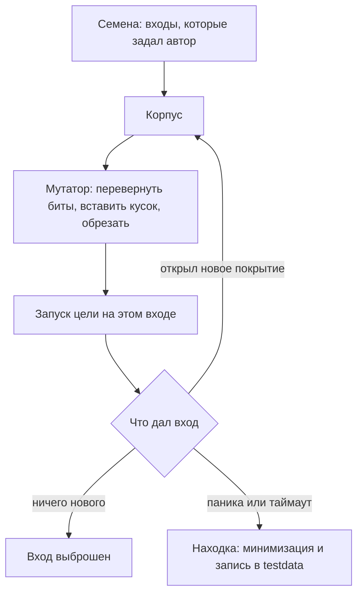

# Фаззинг в web2: go test, Atheris, Hypothesis, AFL++

Функция на Go считает в строке последовательности вида `%XX` — ту самую
разметку, которую разбирает тема `url-and-encoding`. У функции есть три
входа, заданные руками как образцы, и все три она проходит. Затем её
запустили под фаззером — программой, которая придумывает входы сама.
Вот что он напечатал:

```text
$ go test -fuzz=FuzzCountEncoded -fuzztime=30s .
fuzz: elapsed: 0s, gathering baseline coverage: 5/5 completed,
    now fuzzing with 16 workers
fuzz: minimizing 33-byte failing input file
panic: runtime error: index out of range [1] with length 1
    Failing input written to testdata/fuzz/FuzzCountEncoded/14d3f119d0…
FAIL  fuzzlab  0.077s
```

Прогон занял долю секунды. Фаззер нашёл вход, на котором функция падает,
и сам укоротил находку, отрезая всё, без чего падение сохраняется. Файл
лежит в `testdata` — каталоге, который Go оставляет под образцы входов для
тестов, — и содержит `string("%")`: один байт вместо тридцати трёх
найденных. Упала функция там, куда руками написанные тесты не смотрели:
на знаке процента в самом конце строки, где следующего байта нет.

Эта проверка называется фаззингом: программе подают сгенерированные входы
и смотрят, где она сломается. Какие входы пробовать дальше, фаззер решает
не вслепую. Он смотрит, какие строки кода выполнил вход (это называют
покрытием), и развивает те, что зашли в новые места. К чему приводит
найденное падение и как оно чинится, разбирает тема
`unhandled-exceptions-dos`; здесь — сам метод поиска. Теперь поменяйте
условие: функция не падает, а молча неверно считает половину входов.
Что фаззер запишет в `testdata` за час прогона?

## Что такое фаззинг

Представьте испытательную лабораторию: деталь закрепляют на вибростенде
и трясут, пока она не треснёт. Никто не рассчитывает заранее, где пойдёт
трещина, — её находит сам стенд. Фаззинг делает то же с программой.
Вместо детали — функция, вместо тряски — сгенерированные входы, а вместо
трещины — сбой, который видно со стороны: паника, зависание, нехватка
памяти.

Аналогия ломается в одном месте, и это самое важное место метода. Стенд
трясёт вслепую, а фаззер видит, какие строки кода выполнил вход, и
целится: вход, попавший в новое место, становится основой следующих проб.
Поэтому фаззер не блуждает по пространству строк, а ползёт по коду.

Формально фаззинг (fuzzing) — это автоматическая проверка программы
сгенерированными входами, а программа, которая её ведёт, — фаззер. Он
изменяет входы из накопленного набора, следит за покрытием и оставляет
те, что открывают новые ветки кода. Находкой считается наблюдаемый сбой,
а не неверный ответ. Класс дефектов, который так всплывает на
необработанном входе, в каталоге Common Weakness Enumeration числится под
номером CWE-20.

Чем это отличается от обычных тестов в вашем конвейере? Тест проверяет
входы, о которых автор догадался. Фаззер перебирает сочетания, которые в
голову не приходят: пустые строки, граничные длины, обрезанные маркеры
вроде одинокого `%` в конце строки. Тесты и фаззинг не соревнуются:
тесты держат смысл программы, фаззер ищет её падение.

## Как это работает

**Откуда это взялось.** Входы к тестам всегда писали руками, и
проверялись те случаи, о которых автор догадался. Случайные входы
находили падения, но блуждали вслепую: миллионная проба ничем не умнее
первой. Поворот сделал фаззер AFL: он запоминает входы, зашедшие в ещё
не пройденные места кода, и строит новые пробы из них. Фаззер ползёт по
коду, а не по случайности. Для Go первым такой перенос сделал проект
go-fuzz; когда в Go 1.18 фаззинг вошёл в стандартный набор инструментов,
разработка go-fuzz остановилась [^1].

Покрытие кода — ключевое слово этой схемы, и его стоит разобрать на
бытовом примере. Представьте план этажа, где уборщик отмечает комнаты, в
которых уже был: покрытие — такая же отметка на коде. На конкретном входе
выполнились одни строки и ветки и не выполнились другие; эта запись и
есть покрытие входа. Аналогия ломается в исполнителе: отметки ставит не
человек, а сам инструмент прогона. Два входа с одинаковым покрытием для
фаззера — один и тот же путь, и второй не нужен.

В механике фаззера три части. Первая — корпус (corpus), набор входов. Он
начинается с семян (seed), образцов, которые задаёт автор: как закваска,
с которой начинается брожение, они задают старт, а дальше корпус
пополняется сам. Ломается аналогия в том, что закваска растёт сама по
себе, а вход попадает в корпус только через отбор по покрытию.

Вторая часть — мутатор, механизм случайных правок: перевернуть несколько
битов, вставить кусок другого входа, обрезать хвост. Бытовой образ —
корректор, который специально вносит опечатки и смотрит, сломается ли
текст. Третья часть — обратная связь по покрытию, и она главная: вход
остаётся в корпусе, только если открыл место, недоступное уже имеющимся
входам. Именно она превращает случайный перебор в поиск с направлением.



**Описание схемы.** Схема читается сверху вниз. Семена складываются в
корпус, мутатор делает из них новые входы, цель запускается на каждом.
Дальше развилка: вход с новым покрытием возвращается в корпус, скучный
вход выбрасывается, а вход со сбоем становится находкой и записывается в
`testdata`.

Что считается сбоем, решает наблюдаемость: паника, таймаут (у цели в Go
одна секунда на вызов) или явный провал теста через `t.Error`. Падающий
вход фаззер минимизирует: откусывает куски, пока сбой сохраняется.
Бытовой образ — поиск испорченного ингредиента: из рецепта убирают всё,
без чего блюдо всё ещё портится, и остаётся виновник. Ломается аналогия
в одном: повару нужно съедобное блюдо, а фаззеру — сохранённый сбой.
Поэтому найденные 33 байта из введения сжались до одного [^1]. Отлаживать
такой вход заметно проще, чем исходную находку.

Семена из введения — строки с разметкой `%XX`; её норма разобрана в теме
`url-and-encoding`. Хорошие семена — образцы реального входа, а не
случайные строки: три образца из введения взяты из той самой нормы,
которую функция разбирает. Фаззер по существу перебирает нарушения нормы,
и чем точнее семена, тем быстрее он выходит на края. Механизм такой:
мутатор делает малые правки вроде перевёрнутого бита или обрезанного
хвоста, поэтому от строки у края нормы до нарушения остаётся одна-две
правки.

## Что умеет и чего не умеет

Что умеет. Находить сбои на входах, которые не перебрать руками:
граничные длины, пустые строки, обрезанные маркеры, сочетания веток.
Дёшев там, где встроен: в Go это обычный тестовый файл, и ставить ничего
не нужно. Найденное не теряется: вход уходит в корпус и в `testdata`.

Чего не умеет. Судить о правильности ответа, и здесь нужно новое понятие
— оракул. Оракул — это способ отличить верный ответ от неверного.
Бытовой пример — задачник с ответами на обороте: без ответов видно, что
решение оборвалось, но не видно, что оно неверно. У фаззера ответов на
обороте нет: он видит сбой, а не неверный результат. Парсер, который
молча неверно кодирует половину входов, прогон без проверки свойства
пройдёт чисто. Это и разделяет фаззинг с property-based тестированием —
проверкой свойств, где библиотека сама генерирует входы и проверяет
закон, заданный автором. Разбор разницы — в блоке «Границы метода».

Не умеет фаззер и структурные входы без подготовки: мутировать JSON
побайтно долго, потому что почти каждая правка ломает синтаксис раньше,
чем вход доходит до логики. Тут нужны структурные мутаторы, которые
правят документ по полям, а не по байтам, или хороший корпус. И ещё одна
честная граница: фаззинг не доказывает отсутствие дефектов — час прогона
без падений говорит только про этот час.

**Зачем это в работе AppSec-инженера.** Парсеры и обработчики ввода —
первое, что получает чужие данные, и их падение это отказ в обслуживании
или хуже. Фаззер доходит до сочетаний, которые ревьюер не перебирает
глазами, а найденный вход остаётся в репозитории как доказательство и
как тест на регресс после починки.

## Как запустить

Фаззинг в Go живёт в обычном файле `*_test.go` и начинается как тест,
поэтому он сразу попадает в привычный прогон `go test`. Центральная
фигура здесь — фазз-цель (fuzz target): функция-мишень, которая получает
сгенерированный вход и вызывает проверяемый код. При чтении найдите в ней
три части: объявление цели, семена и вызов проверяемой функции:

```go
package fuzzlab

import "testing"

func FuzzCountEncoded(f *testing.F) {
  f.Add("%41")
  f.Add("plain")
  f.Add("a%20b")
  f.Fuzz(func(t *testing.T, s string) {
    CountEncoded(s)
  })
}
```

Три строки `f.Add` — это семена, корпус начнётся с них. Вызов `f.Fuzz`
принимает функцию, которая получает вход `s` и передаёт его проверяемой
`CountEncoded`. Пока проверяемая функция не упала и не вызвала `t.Error`,
цель молчит, а молчание для фаззера значит «всё в порядке».

Запуск из каталога пакета — одной командой:

```bash
# Go 1.27: фаззинг с окном в 30 секунд.
go test -fuzz=FuzzCountEncoded -fuzztime=30s .
```

Без ключа `-fuzztime` фаззинг идёт бесконечно, до находки или остановки
руками. Без флага `-fuzz` тот же файл работает обычным тестом по семенам:
этим пользуется конвейер, где бесконечному прогону не место. Сохранённые
находки при этом прогоняются при каждом запуске, потому что лежат в
`testdata`.

К самой цели два требования, и оба из наблюдаемости. Она должна быть
быстрой: фаззер прогоняет её тысячи раз, и медленная цель съедает окно
прогона. И она не должна держать состояние между вызовами: глобальные
переменные связывают входы, и находка перестаёт воспроизводиться одним
сохранённым значением.

## Как читать вывод

Строки из введения читаются по порядку, как журнал прогона. `gathering
baseline coverage` — прогон семян и корпуса: фаззер меряет, что уже
покрыто. `minimizing 33-byte failing input file` — вход найден и
укорачивается. `panic: index out of range` — сама находка: функция
прочитала байт за границей строки, и рантайм Go её остановил. `Failing
input written to testdata/…` — вход сохранён, и следующий `go test`
поднимет его без всякого фаззинга.

Про `testdata` стоит сказать отдельно. Это обычный каталог рядом с
тестами, и `go test` при каждом прогоне проигрывает входы оттуда как
обычные тесты. Поэтому находка сама становится регрессионным тестом —
проверкой, которая не даст той же поломке вернуться после правок.

В ходящем прогоне смотрят ещё на счётчик `new interesting` — темп, с
которым корпус находит новые ветки. Он обычно затухает: корпус покрыл
доступное, и дальнейший прогон дешевле перевести на другую цель. Спад
темпа — штатный конец прогона, а не его поломка: выжатый корпус глубже
не станет.

С найденным падением дальше идут в тему `unhandled-exceptions-dos`: там
разобрано, как необработанный сбой на границе превращается в отказ в
обслуживании и как он чинится. После починки прогон `go test` обязан
пройти по тому же входу. Это одновременно ретест, то есть повторная
проверка, что поломка ушла, и регресс — страховка от её возврата.

## Границы метода

Граница первая — оракул. Фаззеру нужен наблюдаемый сбой: паника видна,
неверный ответ нет. Закрыть это можно свойством — законом, который обязан
соблюдать любой ответ. Бытовой образ — «сдача равна дано минус цена»:
проверяется правило, а не каждый чек. Пример свойства для нашего случая —
«раскодирование обратно кодированию»: пара функций обязана вернуть
исходное, что бы ни подали на вход.

Так работает property-based тестирование, и его библиотека — Hypothesis:
автор задаёт свойство, а библиотека генерирует входы и минимизирует
контрпример, наименьший вход, на котором свойство нарушается [^3].
Аналогия со сдачей ломается в исполнителе: сдачу считает кассир, а
свойство проверяет сама библиотека на каждом сгенерированном входе. Это
родственная техника, а не тот же метод, что фаззинг: критерий сбоя пишет
человек, поэтому она ловит и молчащие неверные ответы.

Граница вторая — язык и код. Встроенный фаззинг есть у Go. Для Python
тот же принцип даёт Atheris: он работает поверх libFuzzer, библиотеки
фаззинга из мира C и C++ [^2]. Умеет он и нативные расширения — модули
на языке, который компилируется в машинные инструкции процессора, как у
C и C++. От AFL и пришли идеи, которые затем встроили в Go и Python.

Для нативного кода рабочей лошадкой остаётся AFL++ [^4]. Он действует
через инструментирование при компиляции: компилятор сам расставляет в
программе датчики покрытия. Датчики здесь как датчики движения в
коридорах: фаззер видит, где побывал каждый вход. Ломается аналогия в
том, что монтажником выступает сам компилятор, и ставит он их при каждой
сборке.

Граница третья — время. Фаззинг — это бюджет: чем дольше прогон, тем
глубже входы. В конвейере ему дают короткое окно, как в команде из
введения, а длинные прогоны выносят в отдельные джобы или во внешние
системы вроде OSS-Fuzz. Это сервис, где открытые проекты фаззятся
непрерывно на чужих машинах, а находки приходят авторам готовыми
отчётами.

## Частая ошибка

Вот рассуждение, которое встречается часто; решите, верно ли оно, прежде
чем читать дальше. Тесты зелёные, покрытие высокое — значит, фаззинг
ничего не добавит. Ошибка здесь в роли покрытия: **фаззер меряет
покрытие, чтобы искать, а не чтобы отчитаться.** Тест покрывает ветку
одним входом; фаззер идёт по той же ветке тысячами вариантов и находит
сочетание, на котором ветка ломается. Счётчик из введения — тому пример:
три семени проходили, покрытие по ним было полным, а падающий вход
нашёлся за долю секунды. Стопроцентное покрытие говорит, что каждая
ветка выполнялась, но не говорит, на каких входах.

Встречная крайность звучит так: фаззинг что-то нашёл, значит, под каждый
вход нужна своя проверка. Найденное чинится как один дефект границы, а не
как тысяча условий под мутации. Починка из темы `unhandled-exceptions-dos`
закрывает весь класс входов разом, а проверка одна — обычный `go test`
по сохранённому входу.

## Чеклист для ревью

На ревью пройдите по списку; каждый пункт проверяется прогоном или кодом
цели.

1. Проверьте, что у парсеров и обработчиков внешнего ввода есть фазз-цели,
   а не только примеры из тестов (CWE-20).
2. Проверьте, что фаззинг запускается с ограничением по времени, и это окно
   записано в конвейере.
3. Проверьте, что падающие входы сохранены в репозитории и после починки
   проходят обычным прогоном тестов.
4. Проверьте, что у фазз-цели есть наблюдаемый сбой: паника, таймаут или
   явная проверка свойства.
5. Проверьте, что цель быстрая и не держит глобальное состояние между
   вызовами.
6. Проверьте, что найденные сбои заведены как дефекты и закрыты правкой,
   а не отключением цели.

## Попробуй сам

Возьмите свой разборщик внешних данных — параметров запроса, поля
заголовка, загружаемого файла — и напишите к нему фазз-цель с двумя-тремя
семенами. Прогоните с окном в одну минуту.

Одна подсказка: начните с функции, которая принимает строку или байты и
не должна падать ни на каком входе.

**Критерий выполнения** наблюдаемый: прогон завершён, и вы можете
назвать, чем он кончился — находкой с сохранённым входом или окном без
падений. Если вход найден, он лежит в `testdata` и воспроизводится
обычным `go test`.

## Проверь себя

1. Такую фазз-цель ревьюер нашёл в репозитории:

   ```go
   var calls int

   func FuzzDecode(f *testing.F) {
     f.Add("%41")
     f.Fuzz(func(t *testing.T, s string) {
       calls++
       Decode(s, calls)
     })
   }
   ```

   Прогон нашёл падение, и вход записан в `testdata`. Почему обычный
   `go test` по этому входу может падение не повторить?

2. Функцию из введения поменяли на молчащую: она не падает, но половину
   входов кодирует неверно:

   ```go
   func CountEncoded(s string) int {
     n := 0
     for i := 0; i < len(s); i++ {
       if s[i] == '%' && i+2 < len(s) {
         n++
       }
     }
     return n
   }
   ```

   Что будет в `testdata` после часового окна фаззинга?

3. Почему вход, не открывший нового покрытия, не остаётся в корпусе?
   Что сломается, если оставлять каждый вход?
4. Минимизация есть и у фаззера, и у Hypothesis. Что минимизируется в
   каждом случае и кто задаёт критерий сбоя?
5. Возврат к теме `url-and-encoding`: норма `%XX` — знак процента и ровно
   две шестнадцатеричные цифры. Какие нарушения этой нормы фаззер
   перебирает фактически и почему осмысленные семена ускоряют выход на
   них?
6. Возврат к теме `unhandled-exceptions-dos`: фаззер принёс панику на
   границе входа. Во что она превращается в работающей службе и как
   чинится?

<details markdown="1">
<summary>Ответ 1</summary>

1. Цель держит состояние между вызовами: глобальный счётчик `calls`
   делает результат зависимым от числа предыдущих вызовов, а не только от
   входа. Фаззер нашёл сочетание «вход плюс состояние», а сохраняет один
   вход: обычный прогон подаёт его при пустом счётчике, и сбоя нет. Это
   то самое требование из блока «Как запустить»: цель обязана быть без
   состояния, иначе находка не воспроизводится одним сохранённым значением.

</details>

<details markdown="1">
<summary>Ответ 2</summary>

2. Ничего: каталог `testdata` не появится вовсе. Фаззер пишет туда
   только входы с наблюдаемым сбоем — паникой, таймаутом или явным
   `t.Error`, — а молча неверный ответ сбоем не считается, и окно
   заканчивается чистым `PASS`. Проверяется прогоном на этой функции:

   ```text
   $ go test -fuzz=FuzzCountEncoded -fuzztime=15s .
   fuzz: elapsed: 15s, execs: 14850362 (0/sec), new interesting: 13 (total: 16)
   PASS
   ok  fuzzcheck  15.103s
   ```

   Чтобы фаззер увидел такой дефект, в цель добавляют проверку свойства
   с `t.Error` — граница оракула из блока «Границы метода».

</details>

<details markdown="1">
<summary>Ответ 3</summary>

3. Отбор по покрытию — это обратная связь, которая ведёт мутатор по
   коду: корпус хранит входы, каждый из которых открыл новое место, и
   мутации идут от них. Если оставлять каждый вход, корпус раздувается,
   и окно прогона съедают варианты, ничего не добавляющие: фаззер
   скатывается к случайному перебору вслепую, из которого его вывел AFL.

</details>

<details markdown="1">
<summary>Ответ 4</summary>

4. У фаззера критерий встроенный — наблюдаемый сбой, и минимизируется
   падающий вход: от него отрезают куски, пока сбой сохраняется, поэтому
   33 байта из введения сжались до одного. В Hypothesis критерий пишет
   человек в виде свойства, скажем «раскодирование обратно кодированию»,
   а библиотека минимизирует контрпример — наименьший вход, на котором
   свойство нарушается. Поэтому property-based ловит и молчащие неверные
   ответы, а фаззинг без проверки свойства — только сбои.

</details>

<details markdown="1">
<summary>Ответ 5</summary>

5. Норма разбирается побайтно, и нарушения лежат в одном-двух байтах от
   правильных строк. Это маркер `%` в конце строки без двух цифр, нецифра
   после процента, двойное кодирование, когда `%25` после одного
   раскодирования снова даёт `%`. Семена ставят фаззера сразу у края
   нормы: мутатору хватает малых правок, а не случайного поиска по всему
   пространству строк.

</details>

<details markdown="1">
<summary>Ответ 6</summary>

6. В отказ в обслуживании: запрос, на котором код падает без обработки,
   роняет обработчик, а повтор таких запросов держит службу лежачей.
   Чинится это одной правкой границы — проверкой длины перед обращением
   по индексу, — и она закрывает весь класс входов сразу, а не один
   найденный байт. После починки обычный `go test` обязан пройти по
   сохранённому входу: это ретест и регресс одновременно.

</details>

## Источники

1. The Go Authors, «Go Fuzzing»; реестр `go-fuzzing`. Разделы:
   требования к фазз-тестам, запуск с `-fuzz` и `-fuzztime`, формат
   вывода, минимизация и формат файлов корпуса, Suggestions (быстрая
   цель без глобального состояния), глоссарий.
   <https://go.dev/doc/security/fuzz/>
2. Google, «Atheris — a coverage-guided Python fuzzing engine»; реестр
   `atheris`. Разделы README: устройство движка поверх libFuzzer,
   фаззинг нативных расширений.
   <https://github.com/google/atheris>
3. Hypothesis project, «Hypothesis documentation»; реестр
   `hypothesis-docs`. Разделы: property-based testing как постановка
   задачи, генерация входов и минимизация контрпримера.
   <https://hypothesis.readthedocs.io/en/latest/>
4. AFLplusplus project, «The AFL++ fuzzing framework»; реестр
   `aflplusplus`. Разделы: инструментирование при компиляции, мутации,
   режимы работы.
   <https://aflplus.plus/>

Каркас этапа: у этапа 8 общих унаследованных источников нет; каждая тема
опирается на свои первоисточники.

**Скоропортящийся слой.** Флаги и формат вывода `go test`, список
платформ с покрытием, версии Atheris, Hypothesis и AFL++ — это стареет
первым и при ревизии перечитывается по документации. Механика — корпус,
покрытие как обратная связь, минимизация — стареет медленнее флагов.

**Маркеры уверенности.** Прогон из введения — **проверено лично**
2026-09-02 на go1.27.0 (linux/amd64): заведомо падающий счётчик
последовательностей `%XX`, фаззер нашёл вход за долю секунды,
минимизировал 33-байтовую находку до `string("%")` и записал её в
`testdata`; после починки `go test` проходит по тому же входу.
Прогон повторён 2026-10-03 на go1.27.1: найдено то же падение
`index out of range [1] with length 1`, минимизированное до того же
`string("%")` (файл `14d3f119d0301140` в `testdata`); обычный `go test`
по сохранённому входу падает до починки и проходит после. Молчащий
вариант функции из ответа 2 завершил 15-секундное окно чистым `PASS`,
каталог `testdata` не появился; счётчики `execs` и `new interesting`
зависят от машины и кеша корпуса. Таймаут цели в одну секунду,
бесконечный прогон без `-fuzztime`, счётчик `new interesting` и формат
корпуса — **по документации** (страница Go Fuzzing, открыта лично
2026-09-02). Atheris, Hypothesis и AFL++ в этой работе **не запускались**:
их описание — по документации из реестра, открытой 2026-08-20.

[^1]: The Go Authors, «Go Fuzzing», реестр `go-fuzzing`.
[^2]: Google, «Atheris», реестр `atheris`.
[^3]: Hypothesis project, «Hypothesis documentation», реестр
      `hypothesis-docs`.
[^4]: AFLplusplus project, «The AFL++ fuzzing framework», реестр
      `aflplusplus`.
