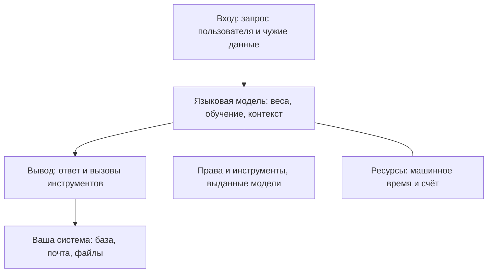

# Безопасность LLM-приложений: OWASP Top 10 for LLM

Пользователь просит почтового помощника пересказать последнее письмо, а в
теле письма спрятана команда, и модель выполняет её от его имени. Так
работала инъекция промпта из темы `llm-prompt-injection`.

Теперь представьте, что команда выпускает такого помощника в работу и
закрыла инъекцию, насколько её вообще закрывают. На ревью остаётся
вопрос: что ещё может пойти не так у приложения с языковой моделью?
Собирать список опасностей с нуля не хочется, потому что что-нибудь
забудешь обязательно. Его уже собрали — это перечень OWASP Top 10 for LLM
Applications, и инъекция промпта в нём лишь первая позиция из десяти.
Разберём, что вошло в издание 2025 года и почему номер риска пишут всегда
с годом.

## Что такое OWASP и зачем ему перечень рисков

OWASP — открытый проект о безопасности приложений; его сканер ZAP вы
запускали в теме `zap-scanning`. Проект выпускает документы, которыми
индустрия пользуется как общими, и один из них — перечень Top 10, список
из десяти классов рисков с номерами. Класс — не одна конкретная дыра, а
семейство дефектов с общей природой: «инъекция промпта» собирает все
случаи, где чужой текст на входе модели становится командой. Номер класса
служит коротким именем: «LLM06» в отчёте называет целое семейство одной
строкой.

Зачем нужен общий список, видно по бытовому аналогу — классам пожара на
огнетушителе. Инспектор говорит «здесь нужен класс А», и охранник
понимает без лекции о горении твёрдых веществ. Так и номер из перечня
заменяет лекцию о классе риска. Аналогия ломается в одном месте: класс
пожара назначен навсегда, а перечень переиздают. Каждое переиздание —
новая редакция, или издание, и номера между изданиями переставляются.

Отсюда главное правило темы: номер риска печатают всегда с годом издания.
LLM02 в издании 2023 и в издании 2025 — разные риски. Номер без года
после перестановки изданий указывает неизвестно на что, потому что
читающий не знает, какую редакцию имел в виду автор.

## Как это работает

**Откуда это взялось.** Когда модели встроили в обычные приложения,
веб-перечень Top 10 стал покрывать их лишь частично. Вход модели —
текст, и границы между указанием и данными в нём нет, а веб-перечень о
таком входе ничего не знал. Тогда отдельный проект OWASP собрал перечень
под профиль приложений с моделями. Первое издание вышло в 2023 году, а
издание 2025-го пересобрало его список.

Действующее на день ревизии издание — 2025 год. Десять его рисков с
опознавательными признаками:

```text
LLM01  инъекция промпта (тема llm-prompt-injection)
LLM02  раскрытие чувствительных данных в ответах
LLM03  цепочка поставок: чужие модели, веса, данные
LLM04  отравление обучающих данных и модели
LLM05  вывод модели, попавший в систему без проверки
LLM06  избыточные полномочия: инструменты, права, автономия
LLM07  утечка системного промпта
LLM08  слабости векторов и вложений при поиске по ним
LLM09  дезинформация: правдоподобный, но неверный ответ
LLM10  неограниченное потребление ресурсов
```

Три слова в списке новые, поэтому коротко. Веса — файл с числами,
который и есть натренированная модель. Контекст — весь текст, который
модель видит в текущем диалоге: системный промпт, просьбу пользователя и
прочитанные данные. Векторы и вложения — про поиск документов по смыслу,
их разбор ждёт у риска LLM08. Дальше номера даны без года: везде речь
про издание 2025.

У каждого риска есть своё место в приложении, и список читается легче,
если сначала увидеть эти места на схеме.



**Описание схемы.** Запрос входит в модель, ответ уходит в вашу систему,
а права, выданные модели, и ресурсы, которые она тратит, стоят отдельно
от этой цепочки. На входе живёт LLM01. С устройством самой модели связаны
LLM03, LLM04, LLM07 и LLM08. Сюда же отнесён и LLM02: данные утекают в
ответ, а источник утечки — то, что модель увидела в контексте. За вывод
отвечают LLM05 и LLM09. Ещё два риска про текст не говорят вовсе:
LLM06 — про права, LLM10 — про расход.

## Десять рисков издания 2025

Пройдём по списку. Первый риск уже знаком: LLM01:2025 — инъекция промпта,
её механика разобрана и проверена на стенде в теме `llm-prompt-injection`,
и здесь мы её не переписываем. Остальные девять стоит узнавать в лицо,
поэтому у каждого ниже есть опознавательный признак и пример.

**LLM02 — раскрытие чувствительных данных в ответах.** Модель болтлива по
устройству: она пересказывает то, что видела. Если в контекст диалога
попали чужие данные, например содержимое чужого заказа, модель может
процитировать их постороннему. Бытовой пример — архиварий, которому
приносят папки всех отделов: спросите его о чужом отделе, и он ответит,
потому что читал. Признак: в ответе модели появляется то, что этот
пользователь видеть не должен.

**LLM03 — цепочка поставок: чужие модели, веса, данные.** С программными
пакетами это вы проходили в теме `supply-chain-threats`: чужой артефакт в
сборке выполняется у вас. У приложений с моделями список артефактов шире:
сама модель, её веса и обучающие данные. Скачанная с чужой площадки
модель — такой же непроверенный артефакт, как пакет, только глазами его
не проверить: веса не читаются как код.

**LLM04 — отравление обучающих данных и модели.** Модель учится на
текстах, и если в обучение подмешать злонамеренные примеры, она приобретёт
закладку, например начнёт по кодовому слову отвечать так, как нужно
атакующему. Бытовой пример — учебник с вписанной ошибкой: все, кто по нему
учился, ошибаются одинаково. Ваш признак здесь косвенный: вы не знаете,
кто готовил данные, на которых училась модель.

**LLM05 — вывод модели, попавший в систему без проверки.** Ответ модели —
сгенерированный текст, а для вашей системы сгенерированный текст —
недоверенный ввод. Если он без проверки попадает в запрос к базе, в
шаблон страницы или в команду оболочки, получаются знакомые инъекции
этапа 1. Только источником опасного текста здесь стала модель. Признак:
код, передающий ответ модели дальше, не отличает его от собственного.

**LLM06 — избыточные полномочия: инструменты, права, автономия.** Этот
риск вообще не про текст. Модели выдают инструменты, например доступ к
почте или к базе, и каждый инструмент умножает цену её ошибки. Бытовой
пример — стажёр с ключами от всех комнат: ошибаются все, но урон от
ошибки зависит от того, какие двери открыты. Признак: модель может
сделать то, что человеку в её роли не выдали бы.

**LLM07 — утечка системного промпта.** Системный промпт — служебная
инструкция модели, вы знаете её из темы `llm-prompt-injection`. Модель
может выдать её в ответе, а туда часто пишут внутренние правила, а иногда
и секреты. Инструкция — не хранилище: всё написанное в ней стоит считать
публичным. Признак: в системном промпте лежит то, чего нельзя показывать
пользователю.

**LLM08 — слабости векторов и вложений при поиске по ним.** Чтобы модель
отвечала по документам компании, приложение сначала ищет подходящие
фрагменты и подкладывает их в контекст. Ищут не
по словам, а по смыслу: каждый фрагмент превращают в вектор, то есть в
набор чисел, где близким по смыслу текстам отвечают близкие наборы. Этот
набор и называют вложением (embedding).

Бытовой пример — полка «похожие книги» в библиотеке: попадание на неё
решает не буквальный запрос, а близость. Отсюда слабость: кто смог
добавить свой документ в базу, тот решает, что модель прочтёт и
процитирует. Признак: база документов пополняется без контроля, а её
содержимое уходит в контекст модели.

**LLM09 — дезинформация: правдоподобный, но неверный ответ.** Модель не
отличает «знаю» от «правдоподобно звучит»: она предсказывает продолжение
текста, и уверенный тон ничего не говорит о верности. Такой ответ
называют галлюцинацией. Вред приходит и без атаки — достаточно, что
человек или программа приняли ответ как факт: оплатили несуществующий
счёт, сошлись на выдуманную статью закона. Признак: ответ модели
используется как факт без сверки.

**LLM10 — неограниченное потребление ресурсов.** Каждый запрос к модели
стоит машинного времени, и длинный вход стоит дороже короткого. У текста
нет естественного предела длины, какой есть у номера в поле формы.
Поэтому без явных ограничений атакующий гоняет длинные запросы, а счёт
растёт у вас. Такой же риск есть и у API (тема `owasp-api-top10`):
дорогой запрос без лимита, и мера там одна — ограничение частоты
запросов. У модели она тоже работает, но запрос ещё и тарифицируется:
длина входа умножает цену, а не только нагрузку. Признак: на длину входа
и число запросов не стоит никакого предела.

## Два риска, которые читаются не так

Список пройден, но два места в нём ловят читателя. Первое — LLM05: по
названию кажется, что речь о чём-то новом и модельном. На деле это та же
схема, что у инъекций этапа 1: недоверенный текст дошёл до исполнителя.
Поменялся только источник текста — раньше им была форма на сайте, теперь
модель. Второе — LLM06: он выглядит проходным пунктом про права, а на
деле это единственный риск перечня, в котором текст модели не участвует
вовсе. Оба примера показывают устройство списка: перечень называет класс
риска, а где искать его в вашей системе, не говорит.

Частый вопрос на этом месте: LLM05 и LLM09 оба про вывод модели, чем они
различаются? Отвечаем по месту вреда. LLM05 — про то, куда уходит вывод:
в систему без проверки, и тогда текст модели срабатывает как инъекция.
LLM09 — про то, верен ли вывод по существу: текст может быть технически
безобиден и всё равно навредить, потому что ему поверили. Первый ловится
контролем на границе системы, второй — сверкой с фактами.

## Чем перечень LLM отличается от веб-перечня

Перечень LLM пересекается с основным Top 10, но не совпадает с ним.
Цепочка поставок знакома вам по этапу 2, и у веб-издания ей посвящена
своя категория; неограниченное потребление есть и в перечне API из темы
`owasp-api-top10`. Зато инъекции промпта и утечки системного промпта нет
ни в одном из них. Причина — в устройстве: у веб-приложения без модели
нет ни промпта, ни системного промпта, и этим рискам там жить негде. О
веб-издании и его редакциях рассказывает тема `owasp-top10`.

Практический вывод для чтения отчётов: смотрите, о каком перечне речь и
какого он издания. Строка «LLM02» без года читается двумя способами, и
часть читателей поймёт её не так, как автор.

## Как пройтись по своей системе

Роль перечня — карта для первого знакомства с местностью; списком
приёмочных проверок он не служит. У каждого риска в документе издания
есть раздел с примерами атак и мерами, и читать его стоит, когда риск
встал в работе. Первый же обход своего приложения можно сделать сразу —
десятью вопросами, по одному на риск:

1. Где во вход модели попадают чужие данные — письма, документы,
   страницы из сети? (LLM01)
2. Что чужого модель может увидеть в контексте и процитировать в
   ответе? (LLM02)
3. Откуда взялись модель, веса и обучающие данные, и кто их проверял?
   (LLM03)
4. Кто контролировал данные, на которых училась модель? (LLM04)
5. Куда уходит ответ модели — не попадает ли он в запрос к базе, шаблон
   или команду без проверки? (LLM05)
6. Какие инструменты и права выданы модели, и нужны ли ей все? (LLM06)
7. Что написано в системном промпте — нет ли там секретов? (LLM07)
8. Если есть поиск по документам — кто может добавить туда свой текст?
   (LLM08)
9. Где ответ модели принимается как факт без сверки? (LLM09)
10. Что ограничивает длину входа и число запросов? (LLM10)

Вопрос без ответа — это точка для разбора: откройте раздел риска в
документе издания и прочтите примеры атак и меры там. Так перечень
работает как указатель: сначала номер-подсказка, потом документ.

**Зачем это в работе AppSec-инженера.** Отчёты и разговоры о системах с
моделями называют риски этими номерами. Кто знает перечень, слышит за
«LLM06» конкретный класс — избыточные полномочия агента, — а не пустой
номер. А десять вопросов выше превращают список в обход собственной
системы.

## Источники

1. OWASP Gen AI Security Project, «OWASP Top 10 for LLM Applications»;
   реестр `owasp-llm-top10`. Разделы: список рисков действующего
   издания.
   <https://genai.owasp.org/llm-top-10/>
2. OWASP Gen AI Security Project, «OWASP Top 10 for LLM Applications
   2025» (документ); реестр `owasp-llm-top10-2025-document`. Разделы:
   все десять рисков с описанием, примерами атак и мерами по каждому.
   <https://genai.owasp.org/download/43299/>

Каркас этапа: у этапа 8 общих унаследованных источников нет; каждая тема
опирается на свои первоисточники.

**Скоропортящийся слой.** Номера и состав рисков меняются от издания к
изданию; издание 2025 действует на день ревизии, и следующее пересоберёт
список, как уже случилось между 2023 и 2025 годами. Признаки классов —
«данные становятся инструкцией», «вывод без проверки», «права модели» —
стареют медленнее номеров.

**Маркеры уверенности.** Состав списка и признаки рисков — **по
документации**: витрина перечня открыта лично 2026-09-02, полный документ
издания 2025 скачан и прочитан 2026-08-22. Механика LLM01 здесь не
проверялась: она разобрана и проверена на стенде в теме
`llm-prompt-injection`. Остальные девять рисков на стенде **не
воспроизводились** — уровень темы справочный.
