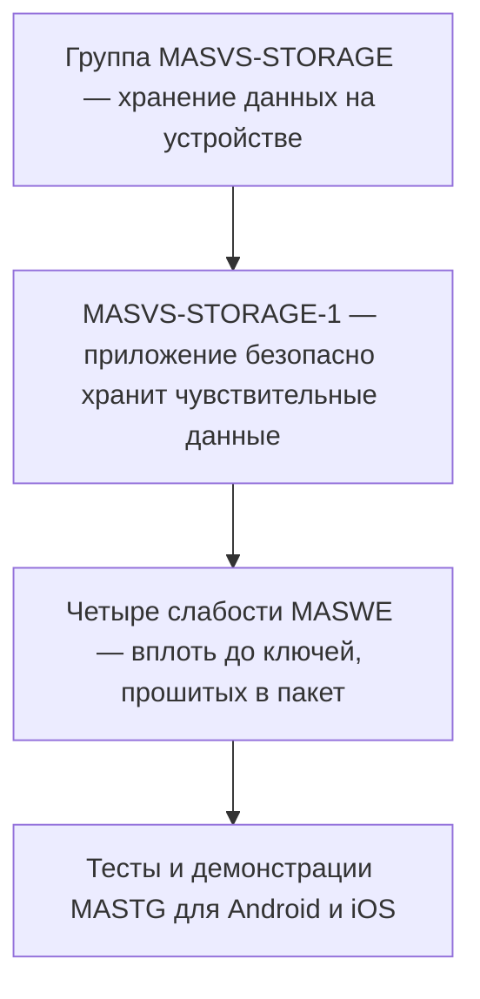

# Мобильный AppSec: стандарт OWASP MASVS

Ревьюер, пришедший из веба, привык к другой картине: угроза приходит
по сети, а хранилище стоит на сервере. Первый мобильный аудит ломает
оба допущения: устройство находится в руках у атакующего. Хранилище читают прямо с него, трафик
перехватывают на нём же, а сборку распаковывают и разбирают. Веб-чек-лист
здесь молчит о половине предмета — он писался для другой модели.

Под мобильную модель проект OWASP собрал отдельный стандарт: MASVS
(Mobile Application Security Verification Standard), «стандарт проверки
безопасности мобильных приложений». Это мобильный аналог стандарта
ASVS (Application Security Verification Standard), разобранного в теме
`owasp-asvs`. Из чего он состоит и чего от него ждать не стоит?

## Почему мобильному приложению нужен свой стандарт

**Откуда это взялось.** Мобильные приложения проверяли веб-чек-листами,
и половина предмета выпадала: устройство не сервер, хранилище на клиенте,
сборку атакующий распакует. OWASP собрал под мобильную модель угроз
отдельный стандарт; переработка 2023 года дала нынешние восемь групп
контролей и отказ от прежних уровней.

Разница моделей стоит на трёх опорах, и каждая — следствие одного:
устройство принадлежит не вам. Первая опора — хранилище живёт на
клиенте. Веб-приложение держит данные на сервере, а браузеру отдаёт
их отображение; мобильное приложение пишет токены и настройки
в файлы на самом устройстве. Если телефон принадлежит атакующему, эти
файлы читаются как документы с флешки: подключил, скопировал, разобрал.

Вторая опора — трафик перехватывается на самом устройстве. Атакующий
ставит на свой телефон перехватывающий прокси и читает каждый запрос
приложения. Приём вам знаком из темы `tls-and-proxy`, поменялись только
роли: там прокси был вашим рабочим инструментом, здесь он — инструмент
того, кто разбирает ваше приложение.

Третья опора — сборка публична. Приложение из магазина — это пакет,
архив с кодом и ресурсами, который скачивается на устройство целиком.
Разбор такого пакета на части называется обратной разработкой: программу
восстанавливают в читаемый вид и ищут в ней секреты и слабые места.
Бытовое соответствие: серверный код — кухня ресторана, куда гостя не
пускают, а мобильное приложение — блюдо навынос, которое дома разбирают
по ингредиентам. Ломается аналогия на точности: из блюда рецепт не
восстановить дословно, а из пакета восстанавливается многое. Пакет
Android-приложения разбирается почти до исходного кода, пакет iOS —
до дизассемблерного листинга (текста команд процессора) и псевдокода.

## Из чего собран стандарт

MASVS — перечень требований к приложению. Требование —
это проверяемое «должно быть»: например, «приложение безопасно хранит
чувствительные данные». Устройство такого перечня разобрано в теме
`owasp-asvs`: каталог делится на группы по предмету, группа — на
требования с номерами. У мобильного стандарта групп восемь, и каждая
отвечает за свою сторону приложения [^1]:

```text
MASVS-STORAGE     хранение чувствительных данных на устройстве
MASVS-CRYPTO      криптография в приложении
MASVS-AUTH        аутентификация и авторизация
MASVS-NETWORK     защита обмена с сервером
MASVS-PLATFORM    взаимодействие с платформой и другими приложениями
MASVS-CODE        качество кода и актуальность сборки
MASVS-RESILIENCE  устойчивость к обратной разработке и подмене
MASVS-PRIVACY     защита данных пользователя
```

Список читается от устройства наружу. Сначала то, что лежит на самом
телефоне: хранение и криптография. Затем вход в приложение и обмен с
сервером, потом отношения с платформой и качество сборки. Замыкают
список две мобильные специфики: устойчивость к разбору самого
приложения и защита данных пользователя.

Запись требования читается по частям. Номер называет группу и
порядковый номер: MASVS-NETWORK-2 — второе требование о сетевом обмене.
Само требование сформулировано коротко, в одну фразу. Краткость здесь
умышленна: проверяемым требование делают слабости каталога MASWE
(Mobile Application Security Weakness Enumeration), «перечисления
слабостей мобильных приложений».
Слабость — конкретный дефект, из-за которого требование срывается. Так,
к требованию MASVS-STORAGE-1 относятся четыре слабости: от
незашифрованного хранения до ключей, прошитых прямо в пакет приложения.

Как обнаружить слабость в живом приложении, говорит парное руководство
MASTG (Mobile Application Security Testing Guide), «руководство по
тестированию безопасности мобильных приложений». К слабости в нём
приложены тесты и демонстрации для Android и iOS [^2]. Пара здесь не
случайна: требование без теста осталось бы пожеланием, а тест без
требования — приёмом без назначения. Поэтому документы ходят вместе,
и ссылка на один почти всегда ведёт в другой.

Бытовое соответствие для этой тройки — техосмотр машины. Требование —
пункт регламента «тормоза исправны», слабость — конкретная
неисправность вроде стёртых колодок, тест — процедура стенда, которая
неисправность показывает. Ломается аналогия на числе процедур: у
колодок стенд один, а у слабости платформ две, и тесты под каждую
свои.



**Описание схемы.** Цепочка читается сверху вниз: группа раскладывается
в требования, требование — в слабости каталога MASWE, а к слабости
в руководстве MASTG приложены тесты. Показан один срез: от группы про
хранение до проверки на устройстве. У остальных семи групп устройство
цепочки то же.

## Уровней больше нет

Глубину проверки задаёт профиль тестирования. До версии 2.0.0 эту роль
играли уровни L1, L2 и R (Resilience — устойчивость к обратной
разработке) внутри самого стандарта. С версии 2.0.0 их убрали: профили
переехали в руководство MASTG, где им и место, рядом с тестами. Смысл
перестановки в разделении ролей двух документов. Стандарт отвечает на
вопрос «что должно быть выполнено», руководство — «как и как глубоко
проверять». Уровень внутри перечня требований смешивал эти ответы
в одном документе.

Буквы L1 и L2 в рабочих документах ещё встречаются, и у этого есть
опора. Официальный чек-лист проекта OWASP MAS пока связывает старые
уровни с тестами MASTG v1 [^1]. Этот чек-лист и есть таблица
соответствия: фраза «приложение на уровне L2» в старом отчёте читается
только через него. При ревизии это место перечитывается первым: связь
уровней и тестов — самая подвижная часть конструкции.

## Что умеет и чего не умеет

### Как им пользуются на проекте

Порядок применения повторяет цепочку из прошлого раздела. Задача
сначала относится к группе: токен в файле на устройстве — к STORAGE,
обмен с сервером — к NETWORK. Из группы берутся требования, под каждым
требованием перечислены слабости MASWE, а к слабости в руководстве
MASTG находятся тесты. Какие из тестов входят в конкретную проверку,
задаёт профиль тестирования. Сама проверка по списку называется
прогоном. Пример есть в теме `owasp-asvs`: там разбирается прогон
по уровню L1. Уровень этот принадлежит ASVS: у него уровни действуют
до сих пор, в отличие от убранных уровней самого MASVS.

Перенесите эту цепочку на соседнюю группу: от требования
MASVS-NETWORK-2 до теста на устройстве — какие звенья вы пройдёте?

### Чего стандарт не делает

Первое ограничение: стандарт не проверяет ничего сам. MASVS — перечень
«что должно быть», а не сканер и не методика; как тестировать, говорит
руководство MASTG. Поэтому за записью «приложение соответствует
требованию» всегда стоит чей-то прогон, и вопрос «кто проверял и чем»
уместен всегда.

Второе ограничение — серверная сторона. У мобильного приложения есть
удалённые интерфейсы: API, к которому оно ходит по сети. Проект прямо
оговаривает, что они проверяются по другим стандартам, и называет среди
них ASVS [^1]. Мобильный аудит поэтому двоится: устройство и сборка
идут по MASVS, серверная часть — по стандарту из темы `owasp-asvs`.

Третье ограничение — сертификация. OWASP не заверяет соответствие
продуктов, поэтому плашка «соответствует MASVS» на сайте продукта —
слова самого производителя, и независимой проверки за ними нет [^1].
Сама по себе она ничего не подтверждает. Бытовое соответствие: надпись
«качество проверено» на упаковке напечатана тем, кто товар и продаёт,
и значение имеет проверка того, кто от продавца не зависит. Ломается
аналогия на проверяемости: состав с упаковки покупатель не перепроверит,
а требования MASVS открыты — соответствие плашке проверяется по самому
стандарту.

И последнее различие — со списком рисков. OWASP Top 10 из темы
`owasp-top10` отвечает на вопрос «что болит чаще всего»: это перечень
распространённых рисков для разговора о безопасности. MASVS отвечает
на другой вопрос — «что обязано быть устроено так»: это стандарт
требований, по которому принимают приложение. Риск объясняет, зачем
требование стоит в списке; требование превращает риск в проверяемый
пункт.

**Зачем это в работе AppSec-инженера.** Мобильное приложение рано или
поздно встаёт рядом с веб-контуром, и вопрос «что с ним проверять» уже
имеет отраслевой ответ. Знать, что стандарт существует и как читается
его требование, нужно раньше, чем понадобится само тестирование.

## Источники

1. OWASP, «MASVS — Mobile Application Security Verification Standard»;
   реестр `owasp-masvs`. Разделы: восемь групп контролей, переход от
   уровней L1/L2/R к профилям тестирования, позиция OWASP о сертификации
   и о проверке серверных интерфейсов по ASVS.
   <https://mas.owasp.org/MASVS/>
2. OWASP, «MASTG — Mobile Application Security Testing Guide»; реестр
   `owasp-mastg`. Разделы: назначение руководства, тесты и демонстрации
   к слабостям MASWE.
   <https://mas.owasp.org/MASTG/>

Каркас этапа: у этапа 8 общих унаследованных источников нет; каждая тема
опирается на свои первоисточники.

**Скоропортящийся слой.** Состав групп, номера требований и устройство
профилей тестирования меняются от версии к версии: уровни L1/L2/R уже
убраны, и дальнейшие перестановки будут. Мобильная модель угроз —
устройство в руках атакующего — держится дольше номеров.

**Маркеры уверенности.** Восемь групп контролей, замена уровней
профилями тестирования, состав слабостей требования MASVS-STORAGE-1,
позиция о сертификации и оговорка про серверные интерфейсы — **по
документации**: страницы MASVS, требования MASVS-STORAGE-1 и раздел о
сертификации открыты лично 2026-09-02. Руководство MASTG открыто лично
2026-09-02 на титульной странице и предисловии; его тесты **не
выполнялись** — устройств под Android и iOS в этой работе не было.

[^1]: OWASP, «MASVS», реестр `owasp-masvs`.
[^2]: OWASP, «MASTG», реестр `owasp-mastg`.
