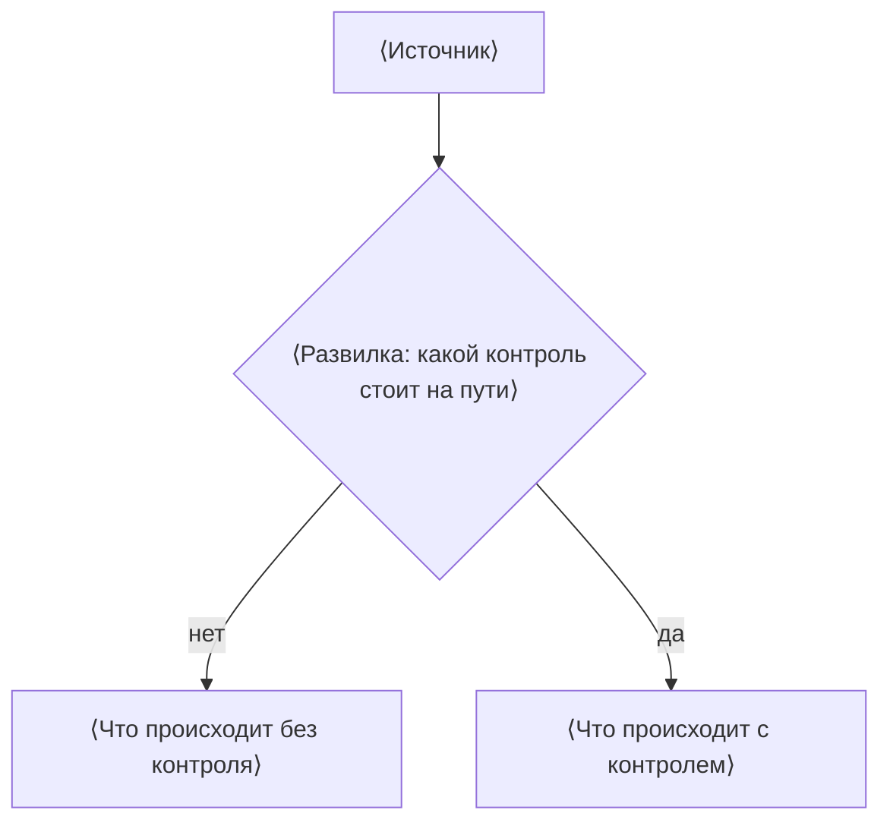

> ⟨Автору⟩ **Как пользоваться шаблоном.** Скопируйте файл в `content/<каталог
> этапа>/<id>.md`, где `<id>` — идентификатор темы, он же имя файла. Дальше
> замените каждое `⟨…⟩` и удалите все врезки «>» — они адресованы автору, а не
> читателю. Этот абзац удаляется первым: пока он стоит перед заголовком,
> markdownlint валит тему правилом MD041, а `⟨` в тексте ловит `S-PLACEHOLDER`.
> Про поля frontmatter — `SCHEMA.md` § 3, про блоки — часть 4 `PLAYBOOK.md`.
> Уровень L1 — «уметь применить»: полный скелет из четырнадцати блоков, лаба и
> самопроверка обязательны.

# Название темы: уточнение

Уровень **L1** · время 90 мин (теория 40 / лаба 35 / самопроверка 15,
оценка)

Что прочитать сначала: `http-basics`.

> ⟨Автору⟩ **Введение.** Три функции в жёстком порядке (решение оператора
> 2026-08-30, свод 4.3): пример или поломка раньше определения, предмет
> простыми словами на месте, финал — анонс разбора словами, без номеров
> блоков. Форма свободная: фиксированных жирных меток «Зачем это в работе…»,
> «Что это такое», «Пример: …» больше нет, функции слиты в прозу. Конкретный
> артефакт — в первых ~250 словах. Крючок от опыта читателя обязателен только
> на L1. Реестровые штампы («MITRE держит номер…», «называют в вакансиях»,
> «OWASP относит к категории…») единственным входом не годятся: не чаще одного
> на подраздел и никогда дословным шаблоном. Введение добавляется ПЕРЕД
> механикой и ничего в ней не сокращает. Свод: 5.1 (сначала разобранный
> пример), 6.6 «Пример предшествует определению», 5.5 против проклятия знания.

⟨Пример или поломка первым — до определения: конкретный артефакт, к которому
разбор обязан вернуться. Крючок от опыта читателя на L1 обязателен и вплетается
в этот же ход: что читатель уже делал руками и чего в этом не замечал. Без
жаргона темы.⟩

**Запрос**

```http
⟨start-line, поля, пустая строка, тело — только то, что разбирается ниже⟩
```

**Ответ**

```http
⟨код ответа, поля, тело⟩
```

⟨Разбор артефакта в двух-трёх предложениях: где здесь дефект и чего здесь НЕ
произошло. Отрицания важны — они снимают ложные догадки новичка.⟩

⟨Предмет простыми словами, на месте: два-три предложения, понятные тому, кто
термины этой темы видит впервые. Термин темы вводится здесь, после примера.⟩

⟨Необязательный второй абзац: та мысль о предмете, из которой растёт весь
дальнейший разбор. Всё ещё простыми словами.⟩

⟨Финал — анонс разбора словами: что тема разберёт дальше и к чему вернётся
пример. Без номеров блоков: номер на странице считается при сборке из порядка
блоков, и в исходнике он другой.⟩

⟨Необязательный абзац о границах темы: что разбирается в соседних темах и
здесь не дублируется. Если сказать нечего — абзаца нет.⟩

> ⟨Автору⟩ Шапка набрана для человека и сверяется с frontmatter правилами
> `C-HEAD-*`: уровень и время должны совпасть с полями, слагаемые времени —
> дать общее время. Строка «Что прочитать сначала» повторяет `prerequisites`
> и не печатается вовсе, когда предпосылок нет. Даты ревизии, версии
> документов и маппинг на страницу не выносятся: они живут во frontmatter и в
> `audit.yaml`. На L1 стоят все четырнадцать блоков.

## 0. Коротко

> ⟨Автору⟩ Три-пять строк: что это, чем опасно, чем чинится. Без истории вопроса и без
> мотивации — только механизм в сжатом виде. Читатель, который дальше не пойдёт,
> должен унести отсюда верную картину, а не интригу.
> Абзац «Зачем это в работе AppSec-инженера» (ровно один на тему — DoD 6,
> `C-BODY-WHY`) остаётся здесь, в блоке 0: перенос маркера во введение — дело
> волн фазы 2, а не новых тем. Сам блок больше не входит в тему: он её
> сворачивает. Начинать его стоит с оговорки вроде «то же в терминах,
> которыми это обсуждают» — читатель уже прочёл введение, и повтор без такой
> оговорки выглядит забывчивостью.

⟨Три-пять строк.⟩

**Зачем это в работе AppSec-инженера.** ⟨Один абзац о том, где это встречается
в работе инженера. Ровно один на тему — DoD 6, `C-BODY-WHY`; до волны миграции
маркера он стоит здесь, в блоке 0, а не во введении (свод 4.3).⟩

## 1. Цели

> ⟨Автору⟩ Столько пунктов, сколько в поле `teaches`, и о том же самом: `C-BODY-GOALS`
> сверяет число и смысл, не букву. Формулировка для читателя может быть длиннее
> той, что стоит во frontmatter. Глаголы активные и проверяемые: «назвать»,
> «найти», «отличить», «проверить», а не «понимать» и не «знать».

После этого раздела вы сможете:

1. Объяснить ⟨механизм⟩ и назвать ⟨что именно он ограничивает⟩.
2. Найти в коде ⟨признак дефекта⟩ и отличить его от ⟨похожего законного кода⟩.
3. Проверить ⟨что именно⟩ ⟨чем именно⟩.

## 2. Предвопросы

> ⟨Автору⟩ Два-три вопроса, на которые читатель отвечает до чтения, даже не зная ответа.
> Вопрос стоит того, чтобы его задать, если после разбора читатель увидит,
> насколько его догадка расходилась с механизмом. Ответов здесь нет: они
> появляются в блоках 3 и 4.

Ответьте до чтения, даже если не уверены.

1. ⟨Вопрос о том, что читатель считает очевидным.⟩
2. ⟨Вопрос, где верная догадка требует знания механизма.⟩
3. ⟨Вопрос о цене: сколько это стоит и кто платит.⟩

## 3. Механика

> ⟨Автору⟩ Модель: граница доверия, источник, sink. Единый набор подцелей всего разбора —
> источник → путь → sink → отсутствующий контроль → условие эксплуатации → фикс
> → проверка фикса. Схема ставится тогда, когда объясняет то, чего не объясняет
> абзац; к каждой схеме идёт абзац «Описание схемы» — он несёт то же содержание
> текстом (7.4 п. 32).

**Откуда это взялось.** ⟨Что было до этого механизма, что на нём сломалось, что
придумали в ответ (6.6). Проблема, а не хронология: не «в таком-то году приняли
документ», а «наивное решение ломается вот так». Вместо абзаца годится врезка
«Глубже», если без этого куска страница остаётся понятной (7.6 п. 43).⟩

⟨Объяснение механизма: что происходит, в каком порядке, кто кому доверяет.⟩



**Описание схемы.** ⟨Тот же путь словами: вход, развилки и исходы. Абзац нужен
и читателю без картинки, и поиску.⟩

## 4. Эксплуатация

> ⟨Автору⟩ Payload на конкретном стенде, пошагово: что отправляется, что возвращается,
> по какому признаку видно, что сработало. Стенд называется по имени и версии.
> Часть 10: приёмы показываются на своём стенде, без указания на живые чужие
> системы.

⟨Шаги воспроизведения на своём стенде.⟩

```text
⟨запрос или команда⟩
```

⟨Что в ответе показывает, что приём сработал.⟩

## 5. Как выглядит в коде

> ⟨Автору⟩ Ключевой блок уровня L1. Что ревьюер ищет глазами: сигнатуры, имена sink'ов,
> обёртки, которые **не** спасают, и ложные срабатывания. Один класс дефекта
> показывается минимум на двух стеках, с явным указанием, что здесь инвариант, а
> что декорация. Листинг — до 25 строк, строка — до 76 символов (`S-CODE-*`),
> язык в ограждении обязателен.

⟨Что искать в коде и по каким признакам.⟩

```python
# ⟨уязвимый фрагмент: только то, что относится к делу⟩
```

```javascript
// ⟨тот же класс дефекта на втором стеке⟩
```

⟨Обёртки, которые выглядят защитой и ею не являются. Ложные срабатывания: код,
похожий на дефект и дефектом не являющийся.⟩

## 6. Как чинится

> ⟨Автору⟩ Парный листинг «до и после», **границы применимости** паттерна и то, что
> делать, когда канон неприменим, — с ценой такого решения. Совет, который
> нельзя обосновать первоисточником, не пишется (DoD 14).

⟨Что меняется и почему это закрывает механизм из блока 3.⟩

```python
# ⟨исправленный фрагмент⟩
```

**Границы применимости.** ⟨Где паттерн не работает, что делать вместо него и
чем за это платят.⟩

## 7. Как проверить фикс

> ⟨Автору⟩ Ключевой блок уровня L1. Ретест — что было красным и стало зелёным. Регресс —
> тест, который остаётся в репозитории и ловит откат фикса. Негативные кейсы —
> то, что обязано продолжать работать.

⟨Ретест: наблюдаемый признак того, что дефекта больше нет.⟩

```text
⟨команда и её вывод⟩
```

⟨Регресс: тест, который переживёт эту правку. Негативные кейсы: что не должно
сломаться.⟩

## 8. Как ловится автоматикой

> ⟨Автору⟩ Ключевой блок уровня L1. Правило, ловящее блок 5 и **не** ловящее блок 6, с
> честной оценкой: что оно пропустит и какой шум даст. Если автоматики для
> этого класса не существует, здесь стоит прямое «не работает, и вот почему» —
> это само по себе ценное знание.

⟨Правило и то, на чём оно срабатывает.⟩

```yaml
# ⟨правило Semgrep или конфигурация линтера⟩
```

⟨Что правило пропустит и какой шум даст на живом коде.⟩

## 9. Ловушка

> ⟨Автору⟩ Заблуждение разбирается в четыре шага: миф приглушённо → опровержение
> акцентно → механизм → контрпример. Миф не набирается акцентом: акцент — на
> опровержении, иначе запоминается миф.

⟨Распространённое мнение, изложенное без акцента.⟩

**⟨Опровержение одной фразой.⟩** ⟨Механизм, из которого видно, почему мнение
неверно.⟩

⟨Контрпример: конкретный случай, где мнение приводит к дефекту.⟩

## 10. Чеклист ревью

> ⟨Автору⟩ Пять-восемь пунктов, каждый в залоге «Verify that…» (`C-BODY-CHECKLIST`).
> Пункт проверяем глазами по коду или по ответу сервера и называет источник
> требования, если он есть. Пункт, который нельзя проверить, — не пункт
> чеклиста, а пожелание.

1. Verify that ⟨наблюдаемое требование⟩ (⟨ASVS или другой источник⟩).
2. Verify that ⟨наблюдаемое требование⟩.
3. Verify that ⟨наблюдаемое требование⟩.
4. Verify that ⟨наблюдаемое требование⟩.
5. Verify that ⟨наблюдаемое требование⟩.

## 11. Лаба

> ⟨Автору⟩ Цель одной проверяемой фразой. Ровно одна подсказка — не три. Отдельная задача
> «почини», у которой критерий наблюдаемый. Решение открыто без условий.
> Сама лаба заводится записью в `labs.yaml` с полем `topic`, равным `id` темы, и
> её идентификатор ставится в поле `labs` frontmatter — иначе `C-REF-LAB`
> скажет, что лаба числится не за этой темой.

**Цель одной фразой:** ⟨наблюдаемый критерий: какая команда должна выйти с
каким кодом или какой вывод напечатать⟩.

⟨Формат, требования к окружению, где лежат файлы. Секции «Запуск», «Сброс» и
«Удаление» — в `README.md` каталога лабы.⟩

Подсказка даётся одна: ⟨одна подсказка⟩.

**Отдельная задача «почини».** ⟨Что должно продолжать работать после правки и
по какому признаку это видно.⟩

Решение — ⟨файл⟩ в том же каталоге, открыто без условий.

## 12. Проверь себя

> ⟨Автору⟩ Четыре-шесть вопросов на воспроизведение и один-два на возврат к прошлым
> темам (`C-BODY-SELFCHECK`). Возврат опускается только у темы без предпосылок.
> Ответы стоят под `<details>`, и их столько же, сколько вопросов: спойлер
> скрывает ответ от глаз, но не отменяет его.

1. ⟨Вопрос на воспроизведение механизма.⟩
2. ⟨Вопрос на различение похожих случаев.⟩
3. ⟨Вопрос на числа: сколько, во сколько раз, при каких условиях.⟩
4. ⟨Вопрос на применение: что сделает ревьюер, увидев это в коде.⟩
5. Возврат к теме `http-basics`: ⟨вопрос, ответ на который требует прошлой
   темы⟩.

<details markdown="1">
<summary>Ответы</summary>

1. ⟨Ответ.⟩
2. ⟨Ответ.⟩
3. ⟨Ответ.⟩
4. ⟨Ответ.⟩
5. ⟨Ответ.⟩

</details>

## 13. Источники

> ⟨Автору⟩ Нумерованные сноски на первоисточники: название документа, идентификатор
> реестровой записи в обратных кавычках, прочитанные разделы, адрес в угловых
> скобках. Внешний адрес законен только в этом блоке (`S-EXT-IN-BODY`), и
> состав сносок обязан совпасть с полем `sources` (`C-BODY-SOURCES`). Сам адрес
> и версия документа живут в `sources.yaml`, который правится вручную.

1. OWASP Authentication Cheat Sheet; реестр `owasp-cs-authentication`. Разделы:
   ⟨какие разделы читались⟩.
   <https://cheatsheetseries.owasp.org/cheatsheets/Authentication_Cheat_Sheet.html>
2. PortSwigger Web Security Academy, «Authentication vulnerabilities»; реестр
   `ps-authentication`. Разделы: ⟨какие разделы читались⟩.
   <https://portswigger.net/web-security/authentication>

⟨Каркас этапа: ⟨идентификаторы источников, унаследованных всем этапом⟩.
Наследуются всеми темами и отдельной строкой не повторяются.⟩

**Маркеры уверенности.** ⟨Что проверено лично и на чём: команда, версия,
дата. Что взято по документации: какой документ и когда открыт. Что не
проверялось и почему. Ровно один абзац на тему — DoD 12, правило
`C-BODY-TRUST`.⟩
